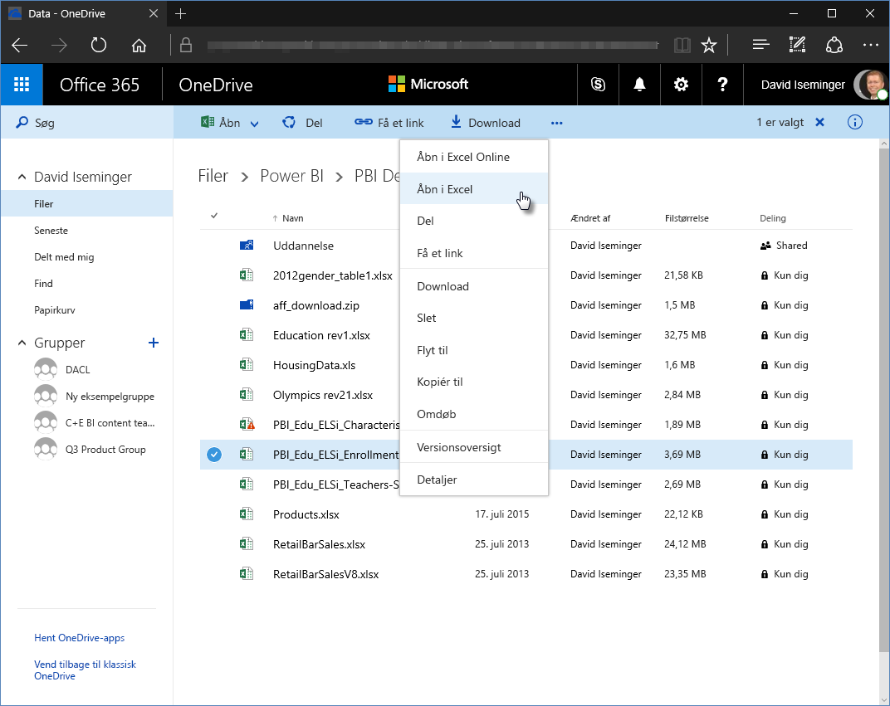
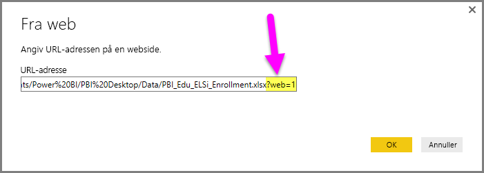
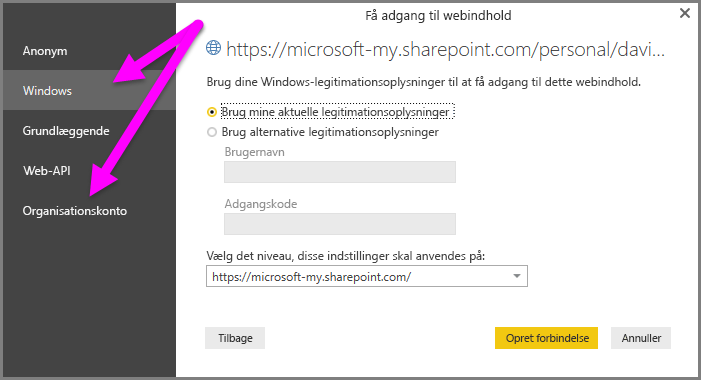

# Brug links til OneDrive for Business i Power BI Desktop
Mange brugere har Excel-projektmapper gemt på deres OneDrive for Business-drev, som vil være velegnet til brug med Power BI Desktop. Med **Power BI Desktop** kan du bruge onlinelinks til **Excel**-filer, der er gemt i **OneDrive for Business**, til at oprette rapporter og visualiseringer. Du kan bruge en **OneDrive for Business**-gruppekonto eller din egen **OneDrive for Business**-konto.

Der kræves nogle få specifikke trin, før du kan hente et onlinelink fra **OneDrive for Business**. I følgende afsnit beskrives de trin, som giver dig mulighed for at dele linket mellem grupper, på tværs af forskellige maskiner og med dine kolleger.

## Få et link fra Excel – start i browser
1. Gå til placeringen af OneDrive for Business ved hjælp af en browser. Højreklik på den fil, du vil bruge, og vælg **Åbn i Excel**.
   
   > [!NOTE]
   > Grænsefladen i browseren ligner måske ikke helt følgende billede. Der er mange måder at vælge **Åbn i Excel** på for filer i grænsefladen for browseren med **OneDrive for Business**. Du kan bruge en hvilken som helst indstilling, der giver dig mulighed for at åbne filen i Excel.
   > 
   > 
   
   
2. I **Excel** skal du vælge **Fil > Oplysninger** og vælge linket over knappen **Beskyt projektmappe**. Vælg **Kopiér link til udklipsholderen** (i din version står der muligvis **Kopiér stien til Udklipsholder**).
   
   

## Brug linket i Power BI Desktop
Du kan bruge det link, du lige har kopieret til Udklipsholder, i Power BI Desktop. Du kan benytte følgende fremgangsmåde:

1. Vælg **Hent data > Web** i Power BI Desktop.
   
   
2. Indsæt linket i dialogboksen **Fra web**. Vælg **ikke** OK endnu.
   
    
3. Bemærk strengen *?web=1* i slutningen af linket. Du skal *fjerne denne del af strengen for URL-adressen til webstedet*, **før** du vælger **OK**, for at **Power BI Desktop** kan navigere korrekt til filen.
4. Hvis **Power BI Desktop** beder dig om legitimationsoplysninger, skal du enten vælge **Windows** (i forbindelse med SharePoint-websteder i det lokale miljø) eller **Organisationskonto** (i forbindelse med Office 365- eller OneDrive for Business-websteder).
   
   

Et vindue af typen **Navigator** vises, som giver dig mulighed for at vælge på listen over tabeller, ark og områder, som blev fundet i Excel-projektmappen. Herfra kan du bruge OneDrive for Business-filen på samme måde som en anden Excel-fil og oprette rapporter og bruge den i datasæt, ligesom du ville bruge enhver anden datakilde.

> [!NOTE]
> Hvis du vil bruge en **OneDrive for Business**-fil som en datakilde i Power BI-tjenesten med **Opdater tjenesten** aktiveret for denne fil, skal du sørge for at vælge **OAuth2** som **Godkendelsesmetode**, når du konfigurerer indstillingerne for opdatering. Ellers kan der opstå en fejl, f.eks. *Legitimationsoplysninger for datakilde kunne ikke opdateres*, når du forsøger at oprette forbindelse eller opdatere. Når du vælger **OAuth2** som godkendelsesmetode, afhjælpes denne fejl om legitimationsoplysninger.
> 
> 

