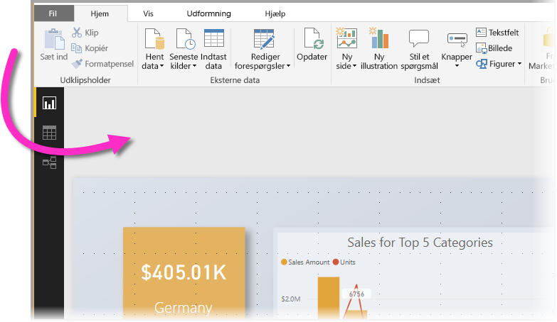
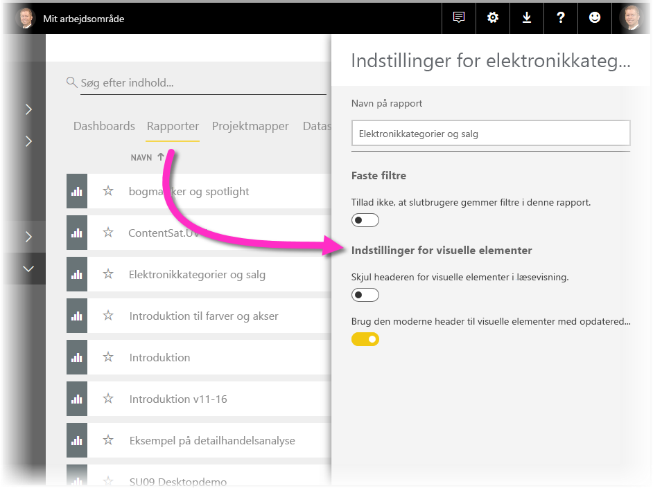

# Brug visuelle elementer til at forbedre Power BI-rapporter

Med **Power BI Desktop** kan du bruge visuelle elementer, f.eks baggrunde og forbedrede visuelle headers til visualiseringer, for at forbedre udseendet af dine rapporter.

Fra og med udgivelsen af **Power BI Desktop** fra juli 2018 kan du bruge forbedringer i dine rapporter og gøre dine analyser og rapporter endnu flottere end tidligere. De forbedringer, der er beskrevet i denne artikel, omfatter følgende: 

* Anvend **baggrund** i dine rapporter, så din baggrund kan forbedre eller fremhæve elementer i det, du vil fortælle med dine data
* Brug forbedrede **visuelle headers** for individuelle visualiseringer for at oprette perfekt justerede visualiseringer på dit rapportcanvas. 

I følgende afsnit beskrives det, hvordan du bruger disse forbedringer, og hvordan du kan anvende dem i dine rapporter.

## Brug af baggrund i Power BI-rapporter

Du kan formatere det grå område uden for din rapportside ved hjælp af en **baggrund**. Det følgende billede har en pil, der viser, hvor baggrundsområdet er. 

Du kan enten indstille baggrunden for hver side i rapporten, eller du kan have samme baggrund på alle sider i rapporten. Hvis du vil indstille en baggrund, skal du trykke eller klikke på ikonet **Formatering**, når der ikke er valgt visualiseringer i rapporten, hvorefter kortet **Baggrund** vises i ruden.

Du kan vælge en farve, der skal anvendes som **baggrund** ved at vælge rullelisten **Farve**, eller du kan vælge knappen **Tilføj billede** for at vælge et billede, der skal anvendes som baggrund. Du kan også anvende gennemsigtighed for din baggrund, uanset om det er en farve eller et billede, ved at bruge skyderen **Gennemsigtighed**.

Du bør være opmærksom på følgende definitioner omkring **baggrunde**:

* Det grå område uden for rapportområdet er **baggrunden**.
* Området på dit canvas, hvor du kan placere visualiseringer, kaldes **rapportsiden**, og i **ruden Formatering** kan den ændres med rullelisten **Sidebaggrund**.

**Rapportsiden** er altid i forgrunden (i forhold til baggrunden), mens **baggrunden** er placeret bag forgrunden og er det bageste element på rapportsiden. Når du anvender gennemsigtighed for siden, anvendes der også gennemsigtighed på visualiseringerne, så baggrunden kan ses gennem visualiseringerne.

For alle nye rapporter er der følgende standardindstillinger:

* **Rapportsiden** er indstillet til **hvid**, og gennemsigtigheden er indstillet til **100 %**
* **Baggrund** er indstillet til **hvid**, og baggrundens gennemsigtighed er indstillet til **0 %**

Når du har angivet din sidebaggrund til større end 50 % gennemsigtighed, vises der en stiplet kant, mens du opretter eller redigerer rapporten, så du kan se, hvor kanten af rapportens canvas går. 

Det er vigtigt at være opmærksom på, at den stiplede kant *kun* vises, når du redigerer rapporten. Den vises *ikke* for dem, der får vist din publicerede rapport, f.eks. når de får vist rapporten i **Power BI-tjenesten**.

> [!NOTE]
> Hvis du bruger mørke farver i baggrunden og angiver tekstfarven til hvid eller meget lys, skal du være opmærksom på, at funktionen **Eksportér til PDF** ikke medtager baggrunden, så hvid eller lys tekst vil være nærmest usynligt i den eksporterede PDF-fil. Se [Eksportér til PDF](desktop-export-to-pdf.md) for at få flere oplysninger om **Eksportér til PDF**.

## Brug af forbedrede visuelle overskrifter i Power BI-rapporter

Fra udgivelsen af **Power BI Desktop** i juli 2018 er overskrifter til visualiseringer i rapporter blevet forbedret betydeligt. De primære forbedringer er, at overskriften ikke længere er vedhæftet visualiseringen, så du kan flytte den baseret på dit layout, og overskriften vises nu i selve visualiseringen i stedet for at flyde oven på den. 

Som standard vises overskriften i visualiseringen justeret efter titlen. I følgende billede kan du se overskriften (ikonet for fastgørelse, ikonet for udvidelse og ellipseikonet) i visualiseringen og højrejusteret langs den samme vandrette placering som visualiseringens titel.

Hvis din visualisering ikke har en titel, vil headeren flyde over visualiseringen og være højrestillet som vist i følgende billede. 

Hvis din visualisering er placeret øverst i rapporten, vil den visuelle header i stedet bliver fastgjort til bunden af visualiseringen. 

Hver visualisering har også et kort i sektionen **Formatering** i ruden **Visualiseringer**, som hedder **Visuel header**. På kortet kan du justere alle mulige egenskaber for den visuelle header

> [!NOTE]
> Synligheden af til/fra-knapper påvirker ikke din rapport, når du opretter eller redigerer rapporten. Du skal publicere rapporten og få den vist i læsetilstand for at se effekten. Denne funktionsmåde sikrer, at de mange muligheder i visuelle headers vises under redigering, især advarselsikoner, der advarer dig om problemer under redigering.

For de rapporter, der kun vises i **Power BI-tjenesten**, kan du justere brugen af visuelle headers ved at gå til **Mit arbejdsområde > Rapporter** og derefter vælge ikonet **Indstillinger**. Der kan du se indstillingerne for den rapport, som du har valgt **Indstillinger** for, og du kan justere indstillingerne derfra som vist i følgende billede.

### Aktivér forbedrede visuelle headers for eksisterende rapporter

Den nye visuelle header er standardfunktionsmåden i alle nye rapporter. For eksisterende rapporter skal du aktivere funktionsmåden i **Power BI Desktop** ved at gå til **Fil > Indstillinger > Indstillinger** og derefter markere afkrydsningsfeltet **Brug den moderne visuelle header med opdaterede layoutindstillinger** i sektionen **Rapportindstillinger**.

## Næste trin
Du kan finde flere oplysninger om **Power BI Desktop**, og hvordan du kommer i gang, i følgende artikler.

* [Hvad er Power BI Desktop?](desktop-what-is-desktop.md)
* [Oversigt over forespørgsler i Power BI Desktop](desktop-query-overview.md)
* [Datakilder i Power BI Desktop](desktop-data-sources.md)
* [Opret forbindelse til data i Power BI Desktop](desktop-connect-to-data.md)
* [Udform og kombiner data med Power BI Desktop](desktop-shape-and-combine-data.md)
* [Almindelige forespørgselsopgaver i Power BI Desktop](desktop-common-query-tasks.md)   

