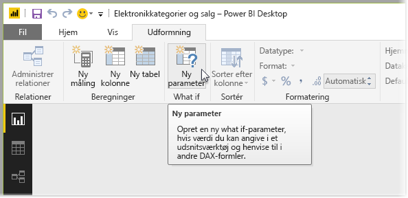
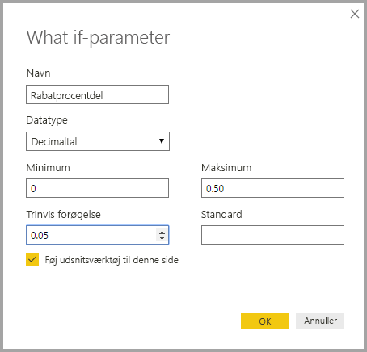
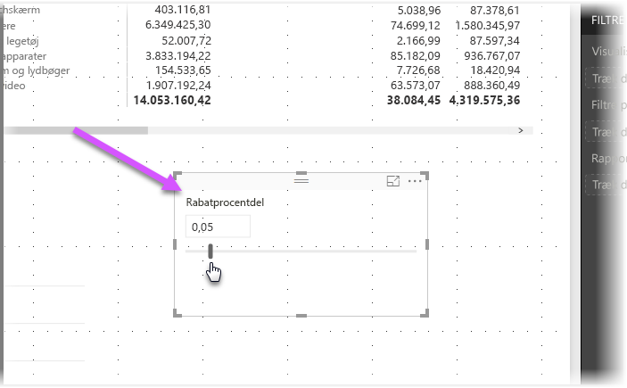
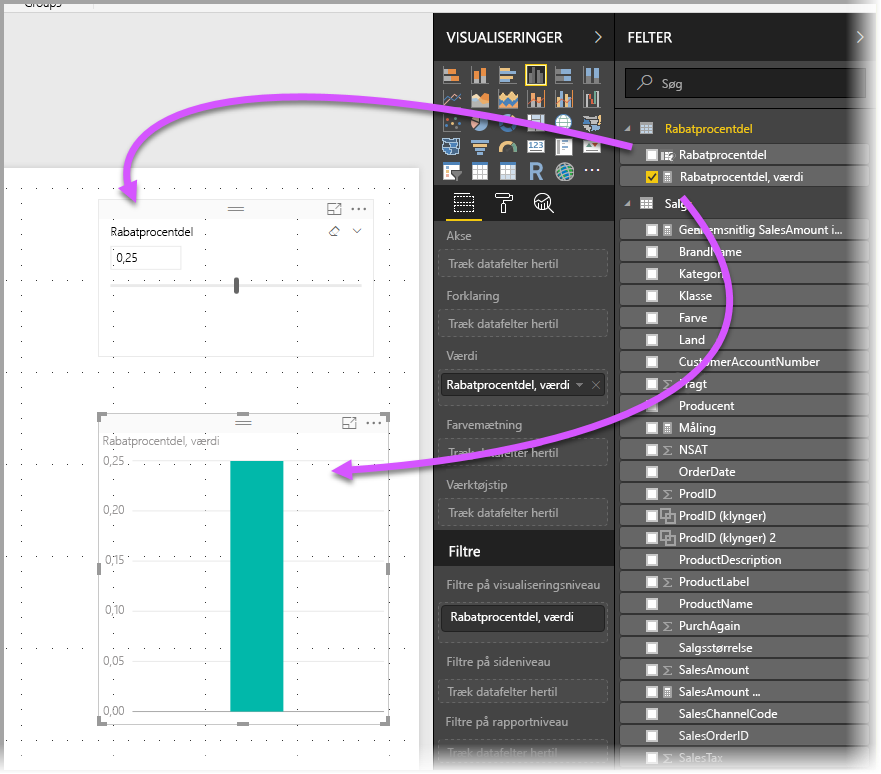
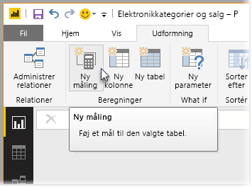
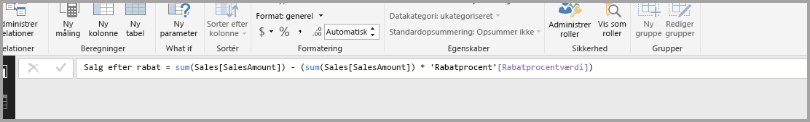
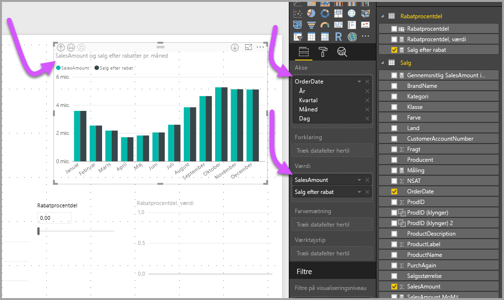

# Opret og brug What if-parametre til at visualisere variabler i Power BI Desktop
Fra og med udgivelsen af **Power BI Desktop** fra august 2017 kan du oprette **What if**-variabler til dine rapporter, arbejde med variablen som et udsnit og dermed visualisere og angive andre nøgleværdier i dine rapporter.

**What if**-parameteren er under fanen **Modellering** i **Power BI Desktop**. Når du vælger den, vises der en dialogboks, hvor du kan konfigurere parameteren.

## Opret en What if-parameter
Hvis du vil oprette en **What if**-parameter, skal du vælge knappen **What if** under fanen **Modellering** i **Power BI Desktop**. På følgende billede har vi oprettet en parameter, der kaldes *Discount percentage* og angivet datatypen til *decimaltal*. Værdien i *Minimum* er nul, og værdien i *Maksimum* er 0,50 (halvtreds procent). Vi har også angivet *Forøgelse* til 0,05 eller fem procent. Det angiver, hvor meget parameteren justeres, når der arbejdes med den i en rapport.

> [!NOTE]
> I forbindelse med decimaltal skal du sørge for at skrive det foranstillede nul, dvs. 0,50 og ikke bare ,50. Ellers valideres tallet ikke, og knappen **OK** kan ikke vælges.
> 
> 

For at gøre det nemmere for dig anbringer afkrydsningsfeltet **Føj udsnitsværktøj til denne side** automatisk et udsnit sammen med din **What if**-parameter på den aktuelle rapportside.

Ud over at oprette parameteren medfører oprettelsen af en **What if**-parameter også, at der oprettes en måling, som du kan bruge til at visualisere den aktuelle værdi i **What if**-parameteren.

Det er vigtigt at bemærke, at når du har oprettet en **What if**-parameter, bliver både parameteren og målingen en del af modellen. D er altså tilgængelige i hele rapporten og kan bruges på andre rapportsider. Og fordi de er en del af modellen, kan du slette udsnittet fra rapportsiden, eller hvis du vil have det tilbage, skal du bare vælge **What if**-parameteren på listen **Felter** og trække den over på canvasset (og derefter ændre det pågældende visual til et udsnit) for at få parameteren i din rapport igen.

## Brug en What if-parameter
Lad os oprette et simpelt eksempel på, hvordan du kan bruge en **What if**-parameter. Vi oprettede **What if**-parameteren i forrige afsnit. Nu skal vi prøve at bruge den ved at oprette en ny måling, hvis værdi justeres i forhold til skyderen. For at gøre dette opretter vi en ny måling.

Den nye måling skal bare være det samlede salgsbeløb, hvor der anvendes en rabatsats. Du kan naturligvis oprette komplekse og interessante målinger, så brugerne af dine egne rapporter kan visualisere variablen i din **What if**-parameter. Du kan f.eks. oprette en rapport, hvor sælgere kan se deres løn, hvis de opfylder visse salgsmål eller -procenter, eller se effekten af øget salg i forhold til større rabatter.

Når vi indtaster formlen for målingen i formellinjen og navnet **Sales after Discount**, kan vi se resultatet:

Vi opretter derefter en kolonnevisual med *OrderDate* på aksen og både *SalesAmount* og målingen *Sales after Discount*, der netop er oprettet, som værdier.

Efterhånden som vi flytter skyderen, kan vi derefter se, at kolonnen *Sales after Discount* afspejler salgsbeløbet med rabatten.

Så nemt er det. Du kan bruge **What if**-parametre i alle slags situationer for at give brugerne af rapporter mulighed for at interagere med forskellige scenarier, som du opretter i dine rapporter.

