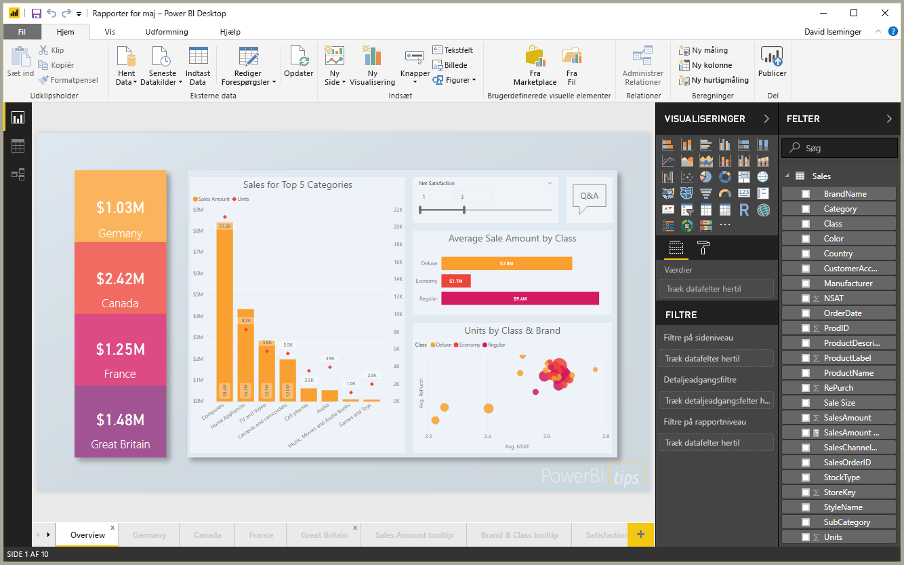
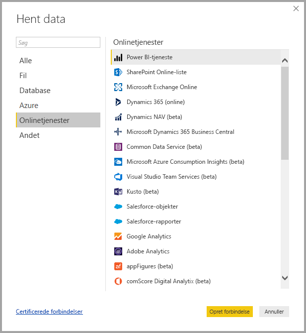
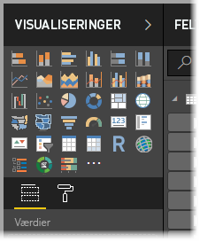
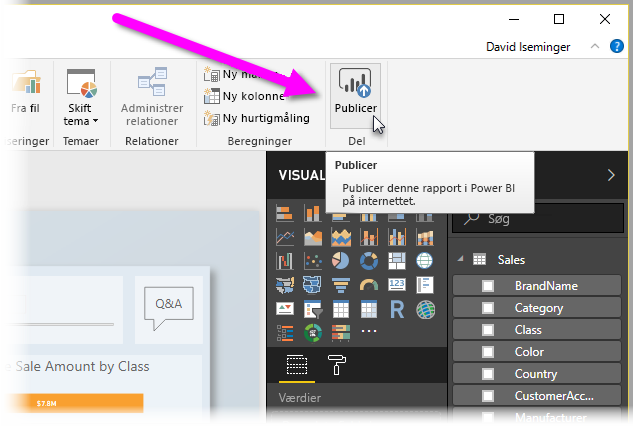

# Hvad er Power BI Desktop?

**Power BI Desktop** er et gratis program, som du kan installere på din lokale computer og bruge til at oprette forbindelse til, transformere og visualisere dine data. Med **Power BI Desktop** kan du oprette forbindelse til flere forskellige datakilder og kombinere dem (kaldes ofte modellering) i en datamodel, hvor du kan opbygge visuelle elementer og samlinger af visuelle elementer, som du kan dele som rapporter med andre personer i din organisation. De fleste brugere, der arbejder på Business Intelligence-projekter, bruger **Power BI Desktop** til at oprette rapporter og bruger derefter **Power BI-tjenesten** til at dele deres rapporter med andre.

De mest almindelige anvendelsesområder for **Power BI Desktop** er følgende:

* Opret forbindelse til data
* Transformér og ryd disse data for at oprette en datamodel
* Opret visuelle elementer, f.eks. diagrammer eller grafer, der giver visuelle præsentationer af dataene
* Opret rapporter, der er samlinger af visuelle elementer på en eller flere rapportsider
* Del rapporter med andre ved hjælp af **Power BI-tjenesten**

De personer, der oftest er ansvarlige for sådanne opgaver, opfattes ofte som *dataanalytikere* (kaldes også bare *analytikere*) eller Business Intelligence-medarbejdere (også kaldet *rapportoprettere*). Men mange, der ikke opfatter sig selv som analytiker eller en rapportopretter, bruger **Power BI Desktop** til at oprette overbevisende rapporter eller til at trække data fra forskellige datakilder og oprette datamodeller, som de kan dele med kolleger og organisationer.

Med **Power BI Desktop** kan du oprette komplekse og visuelt avancerede rapporter ved hjælp af data fra flere kilder – det hele i én rapport, som du kan dele med andre i din organisation. 

## Opret forbindelse til data
For at komme i gang med **Power BI Desktop** skal du som det første oprette forbindelse til data. Du kan oprette forbindelse til mange forskellige typer datakilder fra **Power BI Desktop**. Hvis du vil oprette forbindelse til data, skal du vælge båndet **Hjem** og derefter vælge **Hent data > Flere**. På følgende billede vises vinduet **Hent data**, der indeholder de mange kategorier, som Power BI Desktop kan oprette forbindelse til.

Når du vælger en datatype, bliver du bedt om at angive oplysninger, f.eks. URL-adressen og legitimationsoplysningerne, der er nødvendige, for at Power BI Desktop kan oprette forbindelse til datakilden på dine vegne.

Når du opretter forbindelse til en eller flere datakilder, kan du transformere dataene, så de er nyttige for dig.

## Transformér og rens dataene, og opret en model

I Power BI Desktop kan du rense og transformere data ved hjælp af den indbyggede **forespørgselseditor**. Med forespørgselseditoren kan du ændre dine data, f.eks. ændre en datatype, fjerne kolonner eller kombinere data fra flere kilder. Det er lidt lige som at lave en skulptur – du starter med en stor klump ler (eller data), og derefter barberer du stykker af eller tilføjer nogle efter behov, før formen af dataene er, som du ønsker det. 

De trin, du udfører under transformeringen (f.eks. omdøbning af en tabel, transformation af en datatype eller sletning af kolonner) registreres af **forespørgselseditoren**, og hver gang denne forespørgsel opretter forbindelse til datakilden, udføres disse trin, så dataene altid er formet på den måde, du har angivet.

På følgende billede vises ruden **Forespørgselsindstillinger** for en forespørgsel, der er formet og blevet til en model.

 

Når dine data er, som du ønsker det, kan du oprette visuelle elementer. 

## Opret visuelle elementer 

Når du har en datamodel, kan du trække *felter* til rapportlærredet for at oprette *visuelle elementer*. Et *visuelt element* er en grafisk repræsentation af dataene i din model. Det følgende visuelle element viser et simpelt søjlediagram. 

Du kan vælge mellem mange forskellige typer visuelle elementer i Power BI Desktop. Hvis du vil oprette eller ændre et visuelt element, skal du bare vælge ikonet for visuelle elementer i ruden **Visualiseringer**. Hvis du har et visuelt element, der er markeret på rapportlærredet, ændres det valgte visuelle element til den type, som du har valgt. Hvis der ikke er markeret et visuelt element, oprettes der et nyt visuelt element ud fra din markering.

## Opret rapporter

Typisk vil du oprette en samling visuelle elementer, der viser forskellige aspekter af de data, du har brugt til at oprette din model i Power BI Desktop. En samling visuelle elementer i én Power BI Desktop-fil kaldes en *rapport*. En rapport kan bestå af en eller flere sider, på samme måde som en Excel-fil kan bestå af et eller flere regneark. På følgende billede kan du se den første side i en Power BI Desktop-rapport, der kaldes Overview (du kan se fanen nederst på billedet). I denne rapport er der ti sider.

## Del rapporter

Når en rapport er klar til at blive delt med andre, kan du **udgive** rapporten til **Power BI-tjenesten** og gøre den tilgængelig for alle i din organisation, som har en licens til Power BI. For at udgive en rapport i Power BI Desktop skal du vælge knappen **Udgiv** på båndet **Hjem** i Power BI Desktop.

Når du har valgt **Udgiv**, opretter Power BI Desktop forbindelse til **Power BI-tjenesten** ved hjælp af din Power BI-konto, og derefter bliver du bedt om at vælge, hvor i Power BI-tjenesten du vil dele rapporten, f.eks. dit arbejdsområde, et teamarbejdsområde eller en anden placering i Power BI-tjenesten. Du skal have en licens til Power BI for at dele rapporter til Power BI-tjenesten.

## Næste trin

For at komme i gang med **Power BI Desktop** skal du først downloade og installere programmet. Du kan hente **Power BI Desktop** på to måder:

* [Download Power BI Desktop fra internettet](desktop-get-the-desktop.md)
* [Hent Power BI Desktop fra Windows Store](http://aka.ms/pbidesktopstore)
