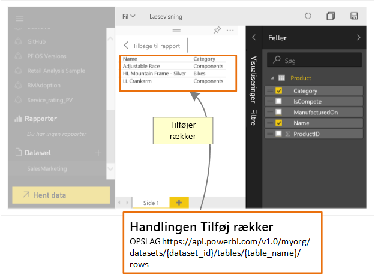

# Hvad kan udviklere bruge Power BI-API'en til?

Ved hjælp af REST API for Power BI kan du oprette apps, der kan integreres med Power BI-rapporter, -dashboards og -felter.

Med REST API for Power BI er det muligt at udføre administrationsopgaver på Power BI-objekter som rapporter, datasæt og arbejdsområder.

Her er nogle af de ting, du kan bruge Power BI-API'erne til.

| **Få mere at vide** | **Referer til disse oplysninger** |
|----------------------------------------------------------------------------------|------------------------------------------------------------------------------------|
| Integrer rapporter, dashboards og felter både for brugere af Power BI og brugere, der ikke anvender Power BI. | [Sådan integreres Power BI-dashboards, -rapporter og -felter](../embedded/embed-sample-for-customers.md) |
| Udfør administrationsopgaver på Power BI-objekter. | [Reference til Power BI REST-API](https://docs.microsoft.com/rest/api/power-bi/) |
| Udvid en eksisterende forretningsarbejdsproces til at overføre vigtige data til et Power BI-dashboard. | [Send data via push til et dashboard](walkthrough-push-data.md) |
| Godkend til Power BI. | [Godkend til Power BI](../embedded/get-azuread-access-token.md) |

> [!NOTE]
> Power BI-API'erne refererer stadig til arbejdsområder som grupper. Referencer til grupper betyder, at du arbejder med arbejdsområder.

## API-udviklerværktøjer

| Værktøj(er) | Beskrivelse |  |  |
|-------------------------|---------------------------------------------------------------------------------------------------------------------------------------------------|---|---|
| [Værktøj til teststed](https://microsoft.github.io/PowerBI-JavaScript/demo) | Oplev et komplet eksempel på brug af JavaScript-API'er for Power BI. Med dette værktøj kan du nemt prøve dig frem med forskellige typer Power BI Embedded-eksempler. |  |  |
| [JavaScript-wiki til Power BI](https://github.com/Microsoft/powerbi-javascript/wiki) | For at få flere oplysninger om JavaScript-API'er for Power BI. |  |  |
| [Postman](https://www.getpostman.com/) | Kør anmodninger, test, find fejl, overvåg, kør automatiserede test og meget mere. |

## Overfør data til Power BI

Du kan bruge Power BI-API'en til at [sende data til et datasæt via push](walkthrough-push-data.md). Denne funktion giver dig mulighed at føje en række til en tabel i et datasæt. De nye data afspejles derefter på felter på et dashboard og i visualiseringer i rapporten.

## GitHub-lagre

* [Eksempler på Power BI Developer](https://github.com/Microsoft/PowerBI-Developer-Samples)
* [.NET-SDK](https://github.com/Microsoft/PowerBI-CSharp)
* [JavaScript-API](https://github.com/Microsoft/PowerBI-JavaScript)

## Næste trin

* [Overfør data til et datasæt](walkthrough-push-data.md)
* [Udvikling af en Power BI-visualisering](../visuals/custom-visual-develop-tutorial.md)
* [Reference til Power BI REST API](rest-api-reference.md)
* [REST-API'er til Power BI](https://docs.microsoft.com/rest/api/power-bi/)

Har du flere spørgsmål? [Prøv at spørge Power BI-community'et](https://community.powerbi.com/)
