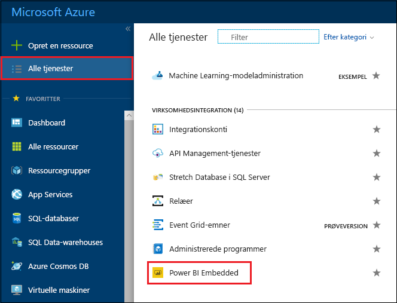
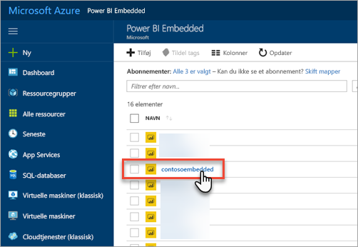
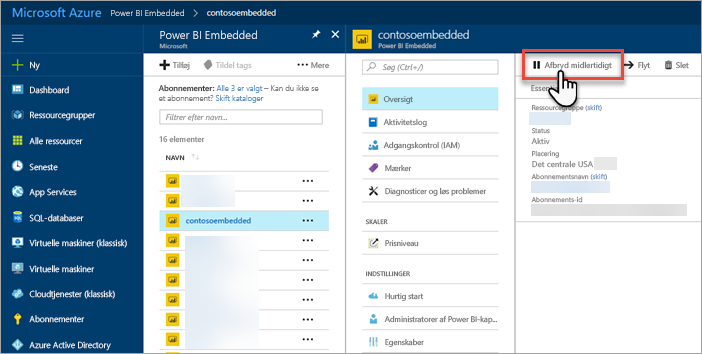
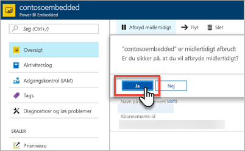
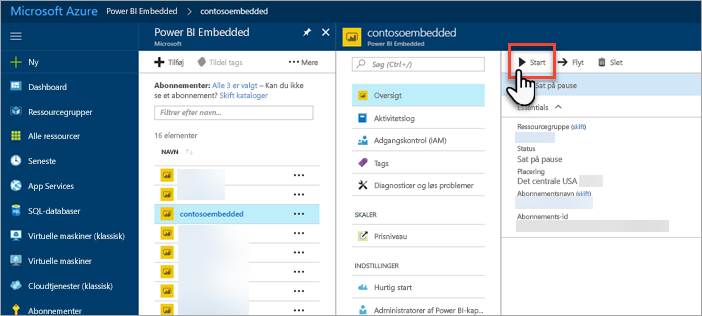
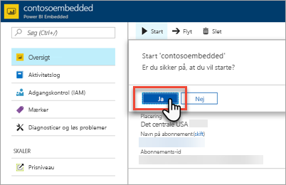

# Stands og start din Power BI Embedded-kapacitet på Azure-portalen

I denne artikel beskriver vi, hvordan du standser og starter en Power BI Embedded-kapacitet i Microsoft Azure. Dette forudsætter, at du har oprettet Power BI Embedded-kapacitet. Hvis du ikke har gjort det, skal du se [Opret Power BI Embedded-kapacitet på Azure-portalen](azure-pbie-create-capacity.md) for at komme i gang.

Hvis du ikke har et Azure-abonnement, skal du oprette en [gratis konto](https://azure.microsoft.com/free/), før du begynder.

## Stands din kapacitet midlertidigt

Når du standser din kapacitet midlertidigt, faktureres du ikke for den. Det er praktisk at standse kapaciteten midlertidigt, hvis du ikke har behov for den i et stykke tid. Gør følgende for midlertidigt at standse kapaciteten.

> [!NOTE]
> Når du standser kapaciteten midlertidigt, kan det forhindre, at der er indhold, der er tilgængeligt i Power BI. Sørg for at fjerne tildelingen af arbejdsområder fra kapaciteten, inden du midlertidigt standser den, så du undgår afbrydelser.

1. Log på [Azure-portalen](https://portal.azure.com/).

2. Vælg **Alle tjenester** > **Power BI Embedded** for at se dine kapaciteter.

    

3. Vælg den kapacitet, du vil standse.

    

4. Vælg **Stands midlertidigt** i oplysningerne om kapacitet.

    

5. Vælg **Ja** for at bekræfte, at du vil standse kapaciteten.

    

## Start kapaciteten igen

Du kan genoptage forbrug af kapaciteten ved at starte den igen. Når du starter kapaciteten igen, faktureres du også igen.

1. Log på [Azure-portalen](https://portal.azure.com/).

2. Vælg **Alle tjenester** > **Power BI Embedded** for at se dine kapaciteter.

    

3. Vælg den kapacitet, du vil starte.

    

4. Vælg **Start** i oplysningerne om kapacitet.

    

5. Vælg **Ja** for at bekræfte, at du vil starte kapaciteten.

    

Hvis der findes indhold, der er tilknyttet kapaciteten, vil det være tilgængeligt, når den starter igen.

## Næste trin

Hvis du vil skalere din kapacitet op eller ned, skal du se [Skalér din Power BI Embedded-kapacitet](azure-pbie-scale-capacity.md).

Hvis du vil i gang med at integrere Power BI-indhold i din app, skal du se [Sådan integrerer du Power BI-dashboards, -rapporter og -felter](https://powerbi.microsoft.com/documentation/powerbi-developer-embedding-content/).

Har du flere spørgsmål? [Prøv at spørge Power BI-community'et](http://community.powerbi.com/)