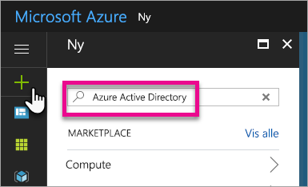
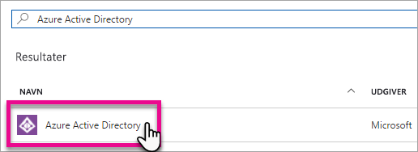
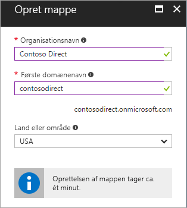
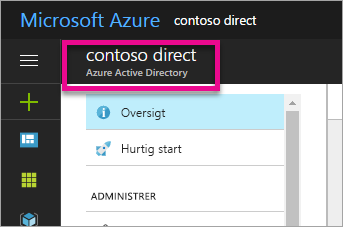
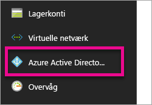
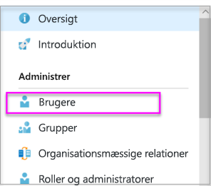
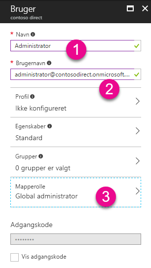
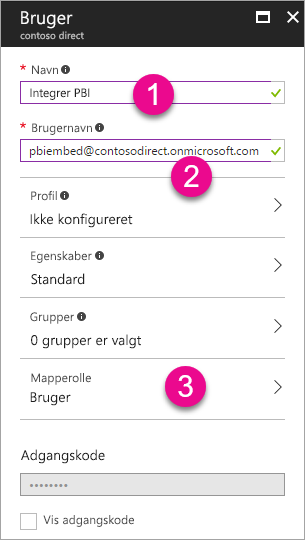
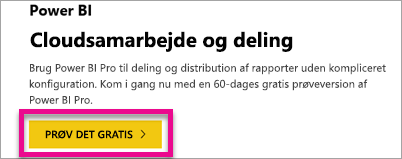

# Opret en Azure Active Directory-lejer, du kan bruge med Power BI

Du kan få mere at vide om, hvordan du opretter en ny Azure Active Directory-lejer (Azure AD), du kan bruge sammen med det brugerdefinerede program vha. Power BI REST-API'er.

En lejer repræsenterer en organisation i Azure Active Directory. Det er en dedikeret instans af Azure AD-tjenesten, som en organisation modtager og ejer, når den tilmelder sig en Microsoft-cloudtjeneste, f.eks Azure, Microsoft Intune eller Office 365. Hver enkelt Azure AD-lejer er specifik og adskilt fra andre Azure AD-lejere.

Når du har en Azure AD-lejer, kan du definere et program og tildele tilladelser, så programmet kan gøre brug af Power BI REST-API'er.

Din organisation har muligvis allerede en Azure AD-lejer, som du kan bruge til dit program. Du kan bruge denne lejer til dine programbehov, eller du kan oprette en ny lejer specielt til dit program. I denne artikel ser vi nærmere på, hvordan du opretter en ny lejer.

## Opret en Azure Active Directory-lejer

Hvis du vil integrere Power BI i dit brugerdefinerede program, skal du definere et program i Azure AD. Det gør du vha. en mappe i Azure AD. Dette er din lejer. Hvis din organisation endnu ikke har en lejer, fordi den ikke bruger Power BI eller Office 365, [skal du oprette en](https://docs.microsoft.com/azure/active-directory/develop/active-directory-howto-tenant). Du skal muligvis også oprette en, hvis du ikke vil have, at dit program bliver blandet med organisationens lejer. Det giver dig mulighed for at holde tingene adskilt.

Eller måske vil du kun oprette et program til testformål.

Benyt følgende fremgangsmåde for at oprette en ny Azure AD-lejer.

1. Gå til [Azure Portal](https://portal.azure.com), og log på med en konto, der har et Azure-abonnement.

2. Vælg **plusikonet (+)**, og søg efter *Azure Active Directory*.

    

3. Vælg **Azure Active Directory** i søgeresultaterne.

    

4. Vælg **Opret**.

5. Angiv et **navn for organisationen** sammen med det **oprindelige domænenavn**. Vælg derefter **Opret**. Dermed oprettes din mappe.

    

   > [!NOTE]
   > Det oprindelige domæne skal være en del af onmicrosoft.com. Du kan tilføje andre domænenavne senere. Mappen for en lejer kan have flere domæner tilknyttet.

6. Når du har fuldført oprettelsen af mappen, skal du markere oplysningsfeltet for at administrere din nye mappe.

Mappen er nu oprettet. Derefter vil vi føje en bruger til lejeren.

## Opret nogle brugere i Azure Active Directory-lejeren

Nu, hvor vi har en mappe, vil vi oprette mindst to brugere. Én, der skal være global administrator af lejeren, og én, der skal være vores overordnede bruger i forbindelse med integration. Tænk på denne konto som en tjenestekonto.

1. Kontrollér, at vi er på udfoldningsfanen Azure Active Directory på Azure Portal.

    

    Hvis det ikke er tilfældet, skal du vælge ikonet for Azure Active Directory på linjen med tjenester til venstre.

    
2. Under **Administrer** skal du vælge **Brugere og grupper**.

    
3. Vælg **Alle brugere**, og vælg derefter **+ ny bruger**.
4. Angiv et navn og et brugernavn for denne bruger. Dette er din globale administrator for lejeren. Du skal også ændre **Mapperollen** til *Global administrator*. Du kan også få vist den midlertidige adgangskode. Når du er færdig, skal du vælge **Næste**.

    

5. Du skal gøre det samme for almindelige brugere i din lejer. Du kan også benytte denne fremgangsmåde for din overordnede integrationskonto. På dette tidspunkt bevarer vi **Mapperolle** som *Bruger*. Sørg for at notere dig adgangskoden. Vælg derefter **Opret**.

    
6. Tilmeld dig Power BI med den konto, du oprettede under trin 5. Det kan du gøre ved at gå til [powerbi.com](https://powerbi.microsoft.com/get-started/) og vælge **Prøv gratis** under *Power BI – Cloudsamarbejde og deling*.

    

    Når du tilmelder dig, bliver du spurgt, om du vil prøve Power BI Pro gratis i 60 dage. Det kan du vælge for at blive professionel bruger. Nu kan du også begynde at udvikle en integreret løsning, hvis det er det, du er på udkig efter.

   > [!NOTE]
   > Sørg for at tilmelde dig med den mailadresse, du brugte til brugerkontoen.

## Næste trin

Nu, hvor du har en Azure AD-lejer, kan du bruge den til at teste elementer i Power BI og/eller gå videre med at integrere Power BI-dashboards og -rapporter i programmet. Du kan finde flere oplysninger om, hvordan du integrerer elementer under [Sådan integrerer du Power BI-dashboards, -rapporter og -felter](embedding-content.md).

[Hvad er en Azure AD-mappe?](https://docs.microsoft.com/azure/active-directory/active-directory-whatis)  
[Sådan henter du Azure Active Directory-lejer](https://docs.microsoft.com/azure/active-directory/develop/active-directory-howto-tenant)  

Har du flere spørgsmål? [Prøv at spørge Power BI-community'et](http://community.powerbi.com/)