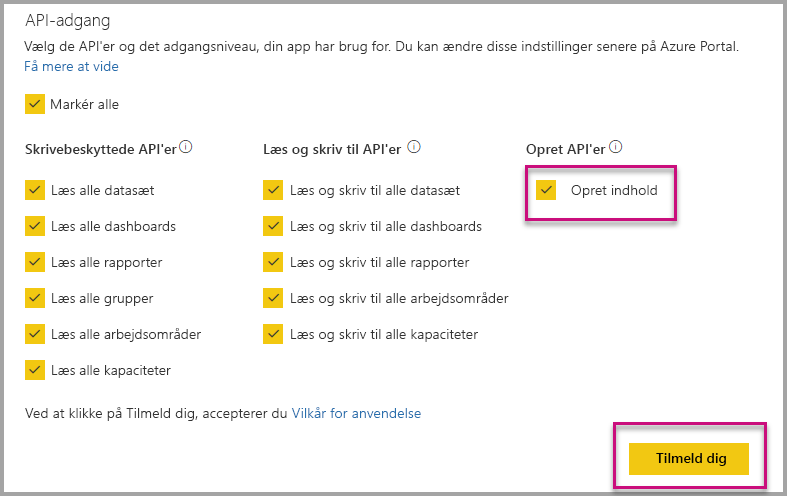

# Installer automatisk, når Power BI apps, når du integrerer for din organisation

Hvis du vil integrere indhold fra en app, skal have den bruger, der integrering [adgang til appen](../service-create-distribute-apps.md). Hvis appen er installeret for brugeren, fungerer derefter integrering uden problemer. Du kan finde flere oplysninger i [integrere rapporter eller dashboards fra app](embed-from-apps.md). Det er muligt at definere i PowerBI.com, alle apps kan være [installeres automatisk](https://powerbi.microsoft.com/blog/automatically-install-apps/). Dog denne handling udføres på lejerniveau og gælder for alle apps.

## Installer automatisk appen på integrering

Hvis en bruger har adgang til en app, men app, der ikke er installeret, derefter integrerer mislykkes. Så du kan undgå disse fejl, når du integrerer fra en app, kan du tillade automatisk installation af appen ved at integrere. Denne handling betyder, at hvis brugeren forsøger at integrere appen ikke er installeret, installeres den automatisk for dig. Så henter det ønskede indhold integrerede med det samme, hvilket resulterer i en problemfri oplevelse for brugeren.

## Integrer til Power BI-brugere (brugeren ejer dataene)

Hvis du vil tillade automatisk installation af apps til dine brugere, skal du give dit program tilladelsen 'Opret Content' når [registrere dit program](register-app.md#register-with-the-power-bi-application-registration-tool), eller tilføje den, hvis du allerede har registreret din app.

Derefter skal du angive app-ID'ET i den integrerede URL-adresse. For at give app-ID'ET, forfatteren app først skal til at installere appen og derefter bruge en af de understøttede [Power BI Rest API](https://docs.microsoft.com/rest/api/power-bi/) kald - [Hent rapporter](https://docs.microsoft.com/rest/api/power-bi/reports/getreports) eller [Get Dashboards](https://docs.microsoft.com/rest/api/power-bi/dashboards/getdashboards). Derefter skal opretter app tage den integrerede URL-adresse fra REST-API-svaret. App-ID'ET vises i URL-adressen, hvis indholdet er fra en app.  Når du har den integrerede URL-adresse, kan du bruge den til at integrere jævnligt.

## Sørg for at sikre integrere

Hvis du vil bruge automatisk installation af apps, skal appudvikler først til at installere appen og derefter gå til appen på PowerBI.com, skal du gå til rapporten, og Hent linket på en måde, der normalt. Alle andre brugere med adgang til den app, kan bruge linket kan indlejre rapporten.

## Overvejelser og begrænsninger

* Du kan kun integrere rapporter og dashboards i dette scenarie.

* Denne funktion understøttes ikke i øjeblikket for appen ejer dataene og SharePoint integrerede scenarier.