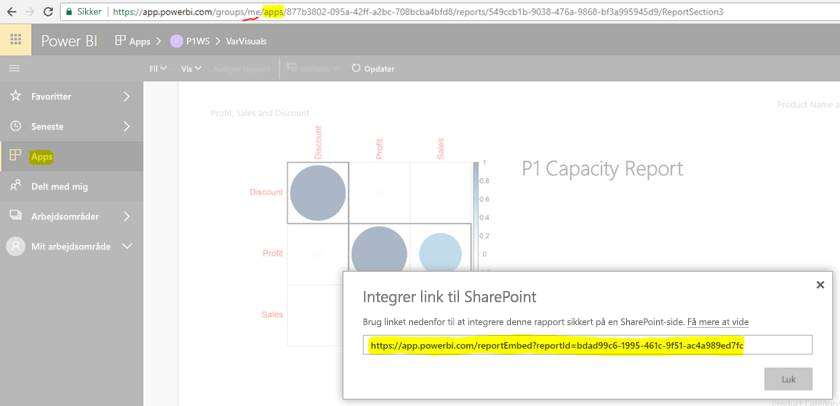

# Integrer rapporter eller dashboards fra apps

I **Power BI** kan du oprette apps for at samle relaterede **dashboards** og **rapporter** på ét sted og derefter publicere dem til større publikummer i din organisation. Brugen af disse apps er relevant, når alle dine brugere er Power BI-brugere, så du kan dele indhold med dem ved hjælp af Power BI-apps. Vi vil gerne give et par hurtige trin til, hvordan du integrerer indhold fra en publiceret Power BI-app i et tredjepartsprogram.

## Sådan får du URL-adressen for rapportintegrering for at integrere

1. Instantier programmet i et brugerarbejdsområde ("My Workspace") ved enten at dele det med dig selv eller ved at vejlede en anden bruger gennem dette flow.

2. Åbn den ønskede rapport i Power BI-tjenesten.

3. Gå til Filer->Integrer i SharePoint Online, og få URL-adressen for rapportintegrering derfra (kan ses i skærmbilledet nedenfor), eller kald efter GetReports/GetReport REST API, og udtræk det tilsvarende felt for URL-adresse for rapportintegrering ud af svaret. Bemærk, at REST-kaldet ikke skal have et arbejdsområde-id som del af URL-adressen, da appen blev instantieret i brugerens arbejdsområde.

4. Brug URL-adresse for integrering, der blev hentet i trin 3, for at bruge den med JS SDK.

    

## Sådan får du URL-adressen for dashboardintegrering for at integrere

1. Instantier programmet i et brugerarbejdsområde ("My Workspace") ved enten at dele det med dig selv eller ved at vejlede en anden bruger gennem dette flow.

2. Kald efter GetDashboards REST API, og træk det tilsvarende felt for URL-adresse for dashboardintegrering ud af svaret. Bemærk, at REST-kaldet ikke skal have et arbejdsområde-id som del af URL-adressen, da appen blev instantieret i brugerens arbejdsområde.

3. Brug URL-adressen for integrering, der blev hentet i trin 4, for at bruge den med vores JS SDK.

## Næste trin

I øvrigt skal du også gennemgå, hvordan du integrerer fra apparbejdsområder til tredjepartskunder og din organisation.

> [!div class="nextstepaction"]
>[Integrer til tredjepartskunder](embed-sample-for-customers.md)

> [!div class="nextstepaction"]
>[Integrer til din organisation](embed-sample-for-your-organization.md)