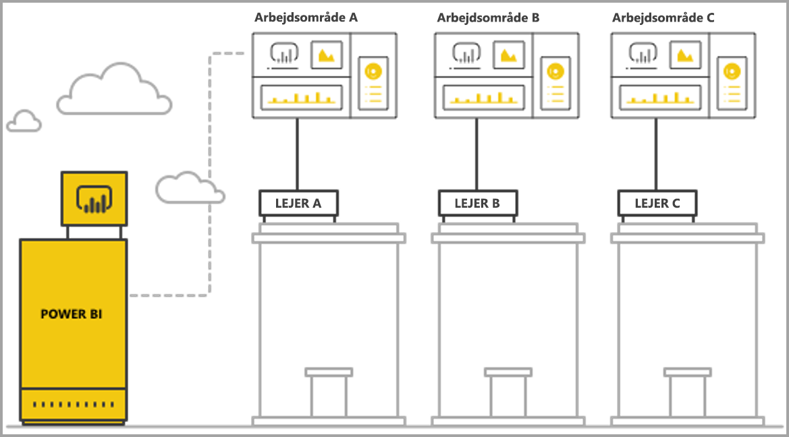
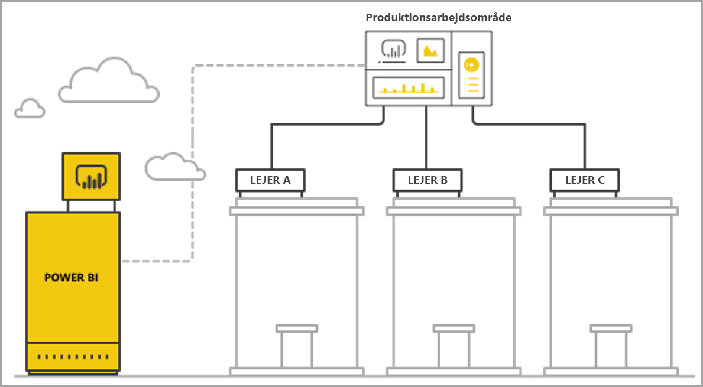

# Administrer flere lejere med Power BI Embedded-analyse

Når du designer et SaaS-program med flere lejere, skal du nøje vælge den lejermodel, der passer bedst til behovene i dit SaaS-program. Denne proces gælder også for Power BI som en integreret analysedel af dit SaaS-program. En lejermodel bestemmer, hvordan hver lejers data tilknyttes og administreres i Power BI og lagerkontoen. Lejermodellen påvirker programdesign og -administration. Hvis du skifter til en anden model på et senere tidspunkt, kan det blive dyrt og forstyrrende.

Med Power BI Embedded er der to primære grundlæggende metoder til at opretholde adskillelse mellem lejere.

   1. **Arbejdsområdebaseret isolation** – oprettelse af et separat Power BI-arbejdsområde pr. lejer.
   2. **Sikkerhedsbaseret isolation på rækkeniveau** – hvor de underliggende data bruges til at styre og administrere adgang til data pr. bruger eller gruppe.

I denne artikel beskrives og analyseres de forskellige tilgange i forhold til flere evalueringskriterier.

## Koncepter og terminologi

**[AAD](https://docs.microsoft.com/azure/active-directory/fundamentals/active-directory-whatis)** – Azure Active Directory.

**AAD-program** – en programidentitet i AAD. Der kræves et AAD-program til godkendelse.

**SaaS-program (software-as-a-service)** – et system, der er implementeret af en virksomhed eller ISV, der normalt er en onlinetjeneste. Det er også relaterede softwaresystemer til at varetage lejere for flere kunder (organisationer). I denne artikel **bruger SaaS-programmet Power BI Embedded til at levere analyser til sine forskellige lejere**. Power BI Embedded kan også fungere for alle typer programmer, når de har en onlineforbindelse.

**Lejer** – en enkelt kunde (organisation), der bruger SaaS-programmet og alle de ressourcer eller data, som kunden placerer i SaaS-programmet.

**[Power BI](../fundamentals/power-bi-overview.md)** – Power BI-cloudtjenesten, der fungerer som en platform for Power BI Embedded.

**Power BI-lejer** – et sæt Power BI-ressourcer, der er forbundet med en enkelt AAD-lejer.

**[Power BI-arbejdsområde](../service-create-workspaces.md)** – en objektbeholder til indhold i Power BI.

**Power BI-artefakter** – der er flere Power BI-artefakter i Power BI-arbejdsområder, f.eks dashboards, rapporter, datasæt og dataflow.

**[Power BI Embedded](azure-pbie-what-is-power-bi-embedded.md)** – et sæt offentlige API'er, der giver udviklere mulighed for at bygge programmer, der administrerer-Power BI indhold og integrerer Power BI-elementer.

**[Sikkerhed på rækkeniveau (RLS)](embedded-row-level-security.md)** – gør det muligt at styre brugeradgang til dataene for de enkelte rækker i en tabel. Du kan implementere sikkerhed på rækkeniveau på datakildeniveau eller i Power BI-semantikmodellen.

**Masterbruger** – den identitet, der repræsenterer SaaS-programmet i Power BI, og som SaaS-programmet bruger ved kald af Power BI-API'er. Skal være en AAD-bruger med en Power BI Pro-licens.

**AAD-programbruger (tjenesteprincipal)** – den identitet, der repræsenterer SaaS-programmet i Power BI, og som SaaS-programmet bruger ved kald af Power BI-API'er. Skal være et AAD-webprogram. Kan erstatte brugen af en *masterbruger* til at godkende med Power BI.

**Kapacitet** – et sæt ressourcer, der er dedikeret til at køre Power BI-tjenesten. [Power BI Premium-kapaciteter](../service-premium-what-is.md) – beregnet til virksomheder, der bruger Power BI internt, mens [Power BI Embedded-kapaciteter](azure-pbie-create-capacity.md) er beregnet til programudviklere til at udvikle SaaS-programmer til tredjeparter.

**[Power BI Pro-licens](../service-admin-purchasing-power-bi-pro.md)** – en brugerbaseret licens, der giver rettigheder til at publicere indhold i arbejdsområder, forbruge apps uden Premium-kapacitet, dele dashboards og abonnere på dashboards og rapporter.

**[Data-forbindelsestilstande](../desktop-directquery-about.md)** – knytter datakilder til Power BI, hvilket kan gøres i forskellige tilstande:

   * Import – hvilket er den mest almindelige måde at hente data på.
   * DirectQuery – opret forbindelse direkte til dataene i kildelageret.
   * Direkte forbindelse – en anden tilstand, der opretter direkte forbindelse til Analysis Services-data (både Azure og i det lokale miljø).

## Evalueringskriterier

Det bedste valg til den rette lejermodel for dit SaaS-program afhænger af de specifikke virksomhedsrelaterede og tekniske krav, dataarkitektur og meget mere. En forståelse af disse krav sammen med de tilgængelige lejermodelmuligheder og -kompromiser kan hjælpe med at definere en pålidelig, effektiv, omkostningseffektiv og skalerbar arkitektur til dit SaaS-program.

Du bør overveje følgende områder, når du vælger mellem de forskellige lejermodeller.

### Dataarkitektur

Udviklere bygger typisk programmer, hvor Power BI Embedded allerede har en database med en enkelt eller flere lejere. Det er lettere at bruge en lejermodel til Power BI Embedded, som svarer til databasens lejermodel. Hvis databasens lejermodel ikke er blevet defineret endnu, kan du overveje andre aspekter, inden du beslutter dig for en dataarkitektur.

### Dataisolation

Hvor følsomme er de data, der gemmes? Hvilket niveau af isolation har du brug for til at adskille de forskellige kundelejere? Svaret kan variere fra branche til branche, eller bestemte kunder kan have særlige krav.

### Skalerbarhed

Definer den størrelsesorden, du kan nå i en nær fremtid, for at finde den bedste løsning. Husk, at en løsning, som måske er passende nu, muligvis ikke er tilstrækkelig, når forbruget og dataene skaleres op. Når du analyserer skalerbarhed, skal du overveje følgende liste:

   * Antal lejere (kunder).
   * Antal rapporter, dashboards og datasæt for hver lejer.
   * Størrelsen på dataene i hvert datasæt og frekvensen af opdateringer.
   * Antal brugere.
   * Antallet af samtidige brugere på tidspunkter med spidsbelastning.

Nogle SaaS-programmer kan have et lavt antal kunder og et lavt forbrug, men store mængder data. Andre kan have mange kunder og et højt forbrug, men en lille mængde data og rapporter for hver kunde. Et højt antal i en af disse situationer kan påvirke omkostningerne og den driftsmæssige kompleksitet i fremtiden.

### Automatisering og driftsmæssig kompleksitet

Identificer ofte forekommende processer, der skal automatiseres.

   * Hvad er hyppigheden for onboarding af nye lejere? Hvilke handlinger er der behov for i forbindelse med onboarding af nye lejere?
   * Hvad er versionshyppigheden for nyt eller opdateret Power BI-indhold, der skal installeres?
   * Hvor mange sikkerhedsroller på rækkeniveau er defineret for hver lejer?  

Hvis du identificerer disse processer og hvordan du løser dem, kan du få hjælp til at forstå den driftsmæssige kompleksitet, der er involveret i vedligeholdelsen af hver model.

### Krav til dataopbevaring og behovet for at understøtte flere geografiske placeringer

Power BI Embedded understøtter Multi-Geo-installation (prøveversion). [Multi-Geo](embedded-multi-geo.md) gør det muligt at udrulle Power BI Embedded-ressourcer i forskellige områder, hvor bestemt indhold lagres i bestemte områder. Denne funktion kan bruges på tværs af alle modeller, men kan have en indvirkning på mængden af indhold, der skal administreres, og omkostningerne. I øjeblikket er Multi-Geo designet til at opfylde krav til dataopbevaring og forbedrer ikke ydeevnen ved at flytte data tættere på forbrugerne.

### Omkostning

[Power BI Embedded](https://azure.microsoft.com/services/power-bi-embedded/) har en ressourcebaseret købsmodel på samme måde som **Power BI Premium**. Du kan købe en eller flere kapaciteter med fast beregningskapacitet og hukommelse. Denne kapacitet er det vigtigste omkostningselement, når du arbejder med **Power BI Embedded**. Der er ingen grænse for antallet af brugere, der benytter kapaciteten. Den eneste begrænsning er ydeevnen for kapaciteten. En [Power BI Pro-licens](../service-admin-licensing-organization.md) er påkrævet for hver *masterbruger* eller bestemte brugere, der skal have adgang til Power BI-portalen.

Vi anbefaler, at du tester og måler den forventede belastning på din kapacitet ved at simulere livemiljøet og forbruget og køre belastningstest i kapaciteten. Du kan måle belastningen og ydeevnen med de forskellige målepunkter, der er tilgængelige i Azure-kapaciteten eller [Premium-appen Capacity Metrics](../service-admin-premium-monitor-capacity.md).

### Tilpasning og oprettelse af indhold

Der er to metoder til SaaS-programmer, der giver brugerne mulighed for at redigere og oprette rapporter eller overføre data til tjenesten som en del af flowet:

   * [Tilstanden Rediger/Opret i en integreret iFrame](https://github.com/Microsoft/PowerBI-JavaScript/wiki/Create-Report-in-Embed-View) – brugeren får en visning af rapporten eller et nyt tomt lærred i SaaS-programmet. På den måde kan de bruge værktøjslinjen i Power BI til at oprette indhold, der er baseret på et datasæt i arbejdsområdet. Vi anbefaler denne mulighed, da den er i brugerens kontekst i et velkendt miljø. Det er lettere at komme i gang med at arbejde og redigere, og brugeren opretter en rapport, der er knyttet til et eksisterende datasæt.

   * Brug Power BI Desktop til at oprette indhold, og upload indholdet via brugergrænsefladen i SaaS-programmet til arbejdsområdet. Når denne fremgangsmåde benyttes, har brugerne flere værktøjer til at arbejde med, når de bruger Power BI Desktop. Men vi anbefaler ikke denne fremgangsmåde, da brugerne skal være fortrolige med et ekstra værktøj uden for konteksten af SaaS-programmet. Upload af en PBIX-fil betyder, at brugeren tilføjer et ekstra datasæt, der kan være en dublet af datasæt, der allerede findes i arbejdsområdet.

## Arbejdsområdebaseret isolation i Power BI

Med arbejdsområdebaseret isolation i Power BI understøtter SaaS-programmet flere lejere fra en enkelt Power BI-lejer. Arbejdsområdebaseret isolation indeholder alt det Power BI-indhold, som forskellige lejere bruger. Adskillelsen af lejerne foretages på Power BI-arbejdsområdeniveauet ved at oprette flere arbejdsområder. Hvert arbejdsområde indeholder de relevante datasæt, rapporter og dashboards for denne lejer. Hvert arbejdsområde er også kun tilknyttet data for den pågældende lejer. Hvis du har brug for yderligere isolation, kan du oprette en *masterbruger* eller en tjenesteprincipal for hvert arbejdsområde og dets indhold.

### Dataarkitektur

Der er to primære metoder til at administrere lejerens data.

* En separat database pr. lejer
* En enkelt database med flere lejere

Hvis SaaS-programlageret indeholder en separat database pr. lejer, er det naturlige valg at bruge datasæt med en enkelt lejer i Power BI med forbindelsesstrengen for hvert datasæt, der peger på den tilsvarende database.

Hvis SaaS-programlageret bruger en database med flere lejere for alle lejere, er det er nemt at adskille lejere efter arbejdsområde. Du kan konfigurere databaseforbindelsen til Power BI-datasættet med en parameteriseret databaseforespørgsel, der kun henter den relevante lejers data. Du kan opdatere forbindelsen ved hjælp af [Power BI Desktop](../desktop-query-overview.md) eller ved hjælp af [API'en](https://docs.microsoft.com/rest/api/power-bi/datasets/updatedatasourcesingroup) med [parametre](https://docs.microsoft.com/rest/api/power-bi/datasets/updateparametersingroup) på forespørgslen.

### Dataisolation

Dataene i denne lejermodel er adskilt på arbejdsområdeniveau. En enkel tilknytning mellem et arbejdsområde og en lejer forhindrer, at brugere fra én lejer får vist indhold fra en anden lejer. Hvis du bruger en enkelt *masterbruger*, skal du have adgang til alle de forskellige arbejdsområder. Konfigurationen af, hvilke data der skal vises en slutbruger, defineres i løbet af [genereringen af indlejringstokenet](https://docs.microsoft.com/rest/api/power-bi/embedtoken), en back end-proces, som slutbrugerne ikke kan se eller ændre.

Hvis du vil tilføje yderligere isolation, kan en programudvikler definere en *masterbruger* eller et program pr. arbejdsområde i stedet for en enkelt *masterbruger* eller program med adgang til flere arbejdsområder. På den måde kan du sikre, at alle menneskelige fejl eller læk af legitimationsoplysninger ikke medfører, at flere kunders data blotlægges.

### Skalerbarhed

En fordel ved denne model er, at man ved at adskille dataene i flere datasæt for hver lejer omgår [størrelsesbegrænsningerne for et enkelt datasæt](https://docs.microsoft.com/power-bi/service-premium-large-datasets) (i øjeblikket 10 GB i en kapacitet). Når kapaciteten er overbelastet, kan den fjerne ubrugte datasæt for at frigøre hukommelse til aktive datasæt. Denne opgave er ikke mulig med et enkelt stort datasæt. Brug af flere datasæt gør det også muligt at opdele lejere i flere Power BI-kapaciteter, hvis det er nødvendigt.

På trods af disse fordele bør du overveje, hvor meget SaaS-programmet kan rumme i fremtiden. Du kan f.eks. nå begrænsningerne omkring antallet af artefakter, der kan administreres. Se [begrænsninger for udrulninger](#summary-comparison-of-the-different-approaches) senere i denne artikel for at få flere oplysninger. Den kapacitets-SKU, der bruges, introducerer en grænse for størrelsen af den hukommelse, som datasættene er indeholdt i, hvor mange opdateringer, der kan køre på samme tid, og den maksimale hyppighed af dataopdateringer. Det anbefales at teste, når der administreres hundred- eller tusindvis af datasæt. Det anbefales også at tage højde for det gennemsnitlige forbrug og forbruget ved spidsbelastninger, og om der er nogle bestemte lejere med store datasæt eller forskellige forbrugsmønstre, der administreres anderledes end for andre lejere.

### Automatisering og driftsmæssig kompleksitet

Med arbejdsområdebaseret isolation i Power BI kan programudvikleren muligvis være nødt til at administrere hundred- eller tusindvis af artefakter. Det er vigtigt at definere de processer, der ofte finder sted i administrationen af programlivscyklussen og sikre, at du har de rette værktøjer til at udføre disse handlinger i stor skala i denne lejermodel. Disse handlinger kunne for eksempel være:

   * Tilføjelse af en ny lejer (kunde)
   * Opdatering af en rapport eller et dashboard for nogle eller alle lejere
   * Opdatering af et datasætskema for nogle eller alle lejere
   * Ikke-planlagte tilpasninger for bestemte lejere
   * Hyppigheden af datasætopdateringer

Oprettelse af et arbejdsområde til en ny lejer er f.eks. en almindelig opgave, der kræver automatisering. Med [Power BI REST API'en](https://docs.microsoft.com/rest/api/power-bi/) kan du opnå [fuld automatisering, når du opretter arbejdsområder](https://powerbi.microsoft.com/blog/duplicate-workspaces-using-the-power-bi-rest-apis-a-step-by-step-tutorial/).

### Multi-Geo-behov

Multi-Geo involverer køb af kapacitet i de ønskede områder og tildeling af et arbejdsområde til den pågældende kapacitet. Hvis du har brug for at understøtte forskellige lejere i forskellige områder, skal du tildele lejerens arbejdsområde til en kapacitet i det ønskede område. Denne opgave er en enkel handling og én, hvor omkostningerne ikke er højere end at have alle arbejdsområder i den samme kapacitet. Men hvis du har lejere, der kræver data i flere områder, skal alle artefakter i arbejdsområdet duplikeres i hver regional kapacitet, hvilket øger både omkostningerne og kompleksiteten af administrationen.

### Omkostning

Programudviklere, der bruger Power BI Embedded, skal [købe Power BI Embedded-kapacitet for at kunne gå i produktion](embed-sample-for-customers.md#move-to-production).  Det er vigtigt at forstå indvirkningen af modellen med arbejdsområdebaseret isolation og effekten på kapaciteter.

Modellen med arbejdsområdebaseret isolation fungerer godt sammen med kapaciteter af følgende årsager:

   * Det mindste objekt, du kan tildele separat til en kapacitet, er et arbejdsområde (du kan f.eks. ikke tildele en rapport), så ved at adskille lejere efter arbejdsområder kan du få fuld fleksibilitet i administrationen af hver lejer og dens ydeevnebehov og optimere kapacitetsudnyttelsen ved at skalere op eller ned. Store og væsentlige lejere med høj volumen og høj grad af omskiftelighed kan f.eks. administreres i en separat kapacitet for at sikre et konsekvent serviceniveau, mens mindre lejere grupperes i en anden kapacitet for at optimere omkostningerne.

   * Adskillelse af arbejdsområder betyder også, at datasæt adskilles mellem lejere, så datamodellerne kan være i mindre dele, fremfor et enkelt stort datasæt. Denne opgave gør det muligt for kapaciteten at administrere hukommelsesforbruget bedre og fjerne små og ubrugte datasæt, når der ikke er brug for dem, mens brugerne forbliver tilfredse med ydeevnen.

Programudviklere skal også tage højde for grænsen for antallet af parallelle opdateringer, da opdateringsprocesser muligvis har brug for ekstra kapacitet, når du har flere datasæt.

### Tilpasning og oprettelse af indhold

I de fleste tilfælde i forbindelse med oprettelse af indhold skal programudvikleren nøje overveje, hvilke lejere der har redigeringsegenskaber, og hvor mange brugere i hver lejer der kan redigere. Hvis flere brugere i hver lejer får tilladelse til at redigere, kan det resultere i, at der oprettes meget indhold, som kan nå grænsen for et datasæt, f.eks. antallet af rapporter pr. datasæt eller antallet af datasæt i et arbejdsområde. Hvis brugerne får denne funktion, anbefaler vi, at indholdsgenereringen overvåges nøje, og der skaleres op efter behov. Af samme årsager anbefaler vi ikke at bruge denne funktion til tilpasning af indhold, hvor hver bruger kan foretage små ændringer i en rapport og gemme den til sig selv. Hvis SaaS-programmet giver mulighed for tilpasning af indhold, bør du overveje at introducere og informere om politikker for arbejdsområdeopbevaring for brugerspecifikt indhold for at lette flowet af sletning af indhold, når slutbrugere flytter til en ny stilling, forlader virksomheden eller ikke bruger platformen længere.

## Sikkerhedsbaseret isolation på rækkeniveau

Med sikkerhedsbaseret isolation på rækkeniveau bruger SaaS-programmet et enkelt arbejdsområde til at hoste flere lejere. Det betyder, at hvert Power BI-artefakt i form af en rapport, et dashboard eller et datasæt oprettes, når alle lejere bruger det. Dataadskillelse mellem lejere opnås ved hjælp af [sikkerhed på rækkeniveau](embedded-row-level-security.md) for datasættet med flere lejere. Når slutbrugerne logger på SaaS-programmet og åbner indhold, oprettes der et indlejringstoken for brugerens session med roller og filtre, der sikrer, at brugeren kun får vist de data, vedkommende har tilladelse til at se. Hvis brugere fra den samme lejer ikke har tilladelse til at få vist de samme data, skal programudvikleren implementere hierarkiske roller både mellem lejere og i den samme lejer.

### Dataarkitektur

Implementering af sikkerhedsbaseret isolation på rækkeniveau er mest praktisk, når alle lejeres data er gemt i et enkelt datalager. I dette tilfælde kan programudvikleren overføre de relevante data fra datalageret til Power BI-datasættet enten via DirectQuery eller dataimport. Hvis data i databasen er adskilt pr. lejer, skal de kombineres i et enkelt datasæt, hvilket resulterer i en lavere grad af adskillelse mellem lejerne i databasen.

### Dataisolation

Med sikkerhedsbaseret isolation på rækkeniveau opnås dataadskillelse ved hjælp af [sikkerhedsdefinitioner på rækkeniveau](embedded-row-level-security.md) for datasættet, hvilket betyder, at alle data fungerer sammen. Denne form for dataadskillelse er mere udsat for datalækage, der skyldes udviklerfejl. Selvom sikkerhed på rækkeniveau udføres back-end og er beskyttet mod en slutbruger, kan det være bedre at bruge arbejdsområdebaseret isolation, hvis dataene er yderst følsomme, eller kunderne efterspørger dataadskillelse.

### Skalerbarhed

Med sikkerhedsbaseret isolation på rækkeniveau skal dataene være inden for størrelsesgrænsen for datasættet, som i øjeblikket er 10 GB. Med introduktionen af [trinvis opdatering](../service-premium-incremental-refresh.md) og den kommende version af et XMLA-slutpunkt for Power BI-datasæt, forventes størrelsesgrænsen for datasæt at øges betydeligt. Dataene skal dog stadig passe til kapacitetens hukommelse med tilstrækkelig hukommelse til, at dataopdateringer kan køre. Udrulninger i stor skala har brug for en stor kapacitet for at undgå, at brugerne oplever problemer, som følge af at hukommelsen overstiger grænserne for den aktuelle kapacitet. En stor mængde data kan også håndteres via **[sammenlægninger](../desktop-aggregations.md)** eller ved at oprette forbindelse til datakilden direkte ved hjælp af en DirectQuery eller en direkte forbindelse i stedet for cachelagring af alle data i Power BI-kapaciteten.

### Automatisering og driftsmæssig kompleksitet

Administration af artefakter er langt mere praktisk med sikkerhedsbaseret isolation på rækkeniveau end med arbejdsområdebaseret isolation, eftersom der kun er én version af et artefakt for hvert miljø (udvikling/test/produktion) i stedet for én version pr. lejer. Administration af artefakter i stor skala betyder administration og opdatering af op til 100 artefakter i stedet for tusindvis til ti-tusindvis.

Power BI har endnu ikke en API til at redigere eller oprette RLS-roller og -regler. Tilføjelse eller ændringer af roller kan kun udføres manuelt i Power BI Desktop. Hvis et RLS-hierarki skal anvendes, kan det være kompliceret og fejlbehæftet, hvis du ikke planlægger det grundigt.

Hvis programudvikleren skal administrere mange roller og rolledefinitioner, som skal oprettes eller opdateres ofte, er sikkerhedsbaseret isolation på rækkeniveau ikke skalerbart fra et administrationsmæssigt synspunkt.

En anden driftsmæssig kompleksitet er behovet for at overvåge udnyttelsen af hukommelsen nøje og bygge en robust besked- og skaleringsmekanisme for at sikre, at brugerne får en problemfri oplevelse.  

### Multi-Geo-behov

Eftersom alle data er gemt i et enkelt datasæt, er det en udfordring at imødekomme de krav til dataopbevaring, der kræver, at visse data skal være bundet til bestemte placeringer. Det kan også øge omkostningerne væsentligt at bruge flere områder, da alle data replikeres og lagres i hvert område. Hvis kun et begrænset antal lejere har brug for forskellige geografiske områder, kan du bevare disse lejeres data i et andet område ved hjælp af modellen til arbejdsområdebaseret isolation, der er beskrevet ovenfor.

### Omkostning

Den primære omkostningsfaktor i forbindelse med sikkerhedsbaseret isolation på rækkeniveau er datasættets fodaftryk i hukommelsen. Du har brug for tilstrækkelig kapacitet til at gemme datasættet og have ekstra hukommelsesbuffer til spidsbelastninger, der kræver ekstra hukommelse. En måde at afhjælpe denne situation på er ved at gemme dataene i en SQL Server-database eller SQL Server Analysis Services-kube og bruge DirectQuery eller en direkte forbindelse til at hente data fra datakilden i realtid. Denne fremgangsmåde øger omkostningerne for datakilderne, men reducerer behovet for stor kapacitet på grund af hukommelsesbehov og reducerer dermed omkostningerne til Power BI-kapacitet.

### Tilpasning og oprettelse af indhold

Når slutbrugere redigerer eller opretter rapporter, kan de bruge produktionsdatasættet med flere lejere. Vi anbefaler derfor kun at bruge den integrerede iFrame-mulighed til at redigere eller [oprette rapporter](https://github.com/Microsoft/PowerBI-JavaScript/wiki/Create-Report-in-Embed-View), da den er afhængig af det samme datasæt, hvor sikkerhed på rækkeniveau er anvendt. Det kan være dyrt og vanskeligt at administrere brugere, der uploader PBIX-filer med flere datasæt, med sikkerhedsbaseret isolation på rækkeniveau. Når brugerne opretter nyt indhold, der er i det samme arbejdsområde, skal du også sikre, at produktionsarbejdsområdet ikke når grænserne, og bygge en robust mekanisme til at skelne mellem, hvilket indhold der er forbundet med hvilken lejer.

## Oversigt over de forskellige tilgange

> [!Important]
> Følgende analyse er baseret på den aktuelle tilstand af produktet. Da vi frigiver nye funktioner månedligt, kommer der løbende nye egenskaber og funktioner som svar på de eksisterende begrænsninger og svage punkter. Sørg for at tjekke vores månedlige blogindlæg for at se, hvad der er af nyheder, og vend tilbage til denne artikel for at se, hvordan de nye funktioner påvirker anbefalingerne til lejermodel.

| Evalueringskriterier | Arbejdsområdebaseret   | Sikkerhedsbaseret på rækkeniveau  |  |  |
|--------------------------------------|----------------------------------------------------------------------------------------------------------------------|---------------------------------------------------------------------------------------|---|---|
| Dataarkitektur  | Nemmest, når der er en separat database pr. lejer  | Nemmest, når alle data for alle lejere er i et enkelt datalager   |  |  |
| Dataisolation  | God. Hver lejer har et dedikeret datasæt.  | Moderat. Alle data er i det samme delte datasæt, men administreres via adgangskontrol.  |  |  |
| Skalerbarhed  | Mellem. Opdeling af dataene i flere datasæt gør det muligt at optimere.  | Lavest. Begrænset af begrænsninger for datasæt.  |  |  |
| Multi-Geo-behov  | Passer godt, når de fleste lejere kun er i ét område.  | Anbefales ikke. Det er nødvendigt at have hele datasættet gemt i flere områder.  |  |  |
| Automatisering og driftsmæssig kompleksitet  | God automatisering for den enkelte lejer.   Komplekst at administrere mange artefakter i stor skala.  | Let at administrere Power BI-artefakter, men komplekst at administrere sikkerhed på rækkeniveau i stor skala.  |  |  |
| Omkostning  | Lav-mellem. Kan optimere udnyttelsen for at reducere omkostningerne pr. lejer.  Kan øge behovet for hyppige opdateringer.  | Mellem-høj, hvis importtilstanden benyttes.  Lav-mellem, hvis den direkte forespørgselsstilstand benyttes.  |  |  |
| Tilpasning og oprettelse af indhold  | Passer godt. Kan nå begrænsninger i stor skala.  | Kun oprettelse af indhold i integreret iFrame  |  |  |

## Overvejelser og begrænsninger i forbindelse med installationen

**Begrænsninger for Power BI-artefakter:**

* Det antal V1-arbejdsområder (grupper), som en enkelt bruger/et enkelt program kan være medlem af/administrator for, er 250.
* Det antal V2-arbejdsområder (mapper), som en enkelt bruger/et enkelt program kan være medlem af/administrator for, er 1000.
* Antallet af datasæt i et enkelt arbejdsområde er 1000.
* Antallet af rapporter/dashboards, der er tilknyttet et enkelt datasæt, er 1000.
* Størrelsesgrænsen for datasæthukommelsen ved upload af en *PBIX*-fil er 10 GB.

**Overvejelser og begrænsninger i forbindelse med Power BI-kapacitet:**

* Hver kapacitet kan kun bruge den hukommelse og de V-kerner, kapaciteten har fået tildelt, i overensstemmelse med det [SKU, der er købt](../service-premium-what-is.md).
* Du kan finde den anbefalede datasætstørrelse for hver SKU i [store datasæt i Premium](../service-premium-what-is.md#large-datasets).
* Den maksimale datasætstørrelse i en dedikeret kapacitet er 10 GB.
* Antallet af planlagte opdateringer for et datasæt i *importtilstand* i løbet af en dag er 48.
* Intervallet mellem planlagte opdateringer for et datasæt i *importtilstand* er 30 minutter.
* Du kan få oplysninger om det antal opdateringer, der kan køre samtidigt på en kapacitet, i [ressourcestyring og optimering](../service-premium-what-is.md#capacity-nodes).
* Den gennemsnitlige tid, det tager at skalere en kapacitet, er mellem 1-2 minutter. Kapaciteten er ikke tilgængelig i denne periode. Det anbefales at bruge en scale-out-tilgang for at [undgå nedetid](https://powerbi.microsoft.com/blog/power-bi-developer-community-november-update-2018/#scale-script).

## Næste trin

* [Integreret analyse med Power BI](embedding.md)
* [Power BI Embedded](azure-pbie-what-is-power-bi-embedded.md)
* [Power BI Premium](../service-premium-what-is.md)
* [Sikkerhed på rækkeniveau](embedded-row-level-security.md)
