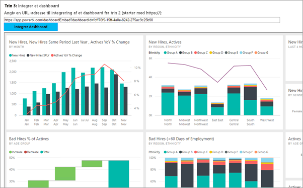
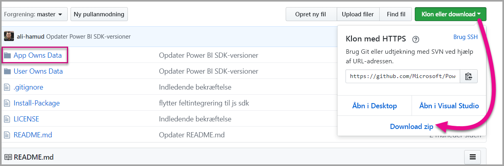

# <a name="tutorial-embed-a-power-bi-content-into-your-application-for-national-clouds"></a>Selvstudium: Integrer Power BI-indhold i dit program for nationale cloudmiljøer

Få mere at vide om, hvordan du integrerer analyseindhold i dine virksomhedsprogrammer for det nationale cloudmiljø. Du kan bruge Power BI .NET SDK med Power BI JavaScript-API'en til at integrere en rapport, et dashboard eller et felt i dine webprogrammer.

Power BI understøtter også [nationale cloudmiljøer](https://docs.microsoft.com/azure/active-directory/develop/authentication-national-cloud).

De forskellige nationale cloudmiljøer er:

* U.S. Government Community Cloud (GCC)

* U. S. Government Community Cloud High (GCC High)

* U. S. Military Contractors (DoDCON)

* U. S. Military (DoD)

* Cloudmiljøet Power BI til Tyskland

* Cloudmiljøet Power BI til Kina



Før du begynder denne gennemgang, skal du have en **Power BI**-konto. Hvis du ikke har konfigureret en konto, kan du vælge det rette nationale cloudmiljø for dig afhængigt af typen af land eller offentlige myndighed. Du kan tilmelde dig en [Power BI-konto af typen US Government](../service-govus-signup.md), [en cloudkonto af typen Power BI til Tyskland](https://powerbi.microsoft.com/power-bi-germany/?ru=https%3A%2F%2Fapp.powerbi.de%2F%3FnoSignUpCheck%3D1) eller en [cloudkonto af typen Power BI til Kina](https://www.21vbluecloud.com/powerbi/).

> [!NOTE]
> Vil du integrere et dashboard for din organisation i stedet? Se i [Integrer et dashboard i en app for din organisation](integrate-dashboard.md).

Hvis du vil integrere et dashboard i en webapp, skal du bruge API'en til **Power BI** og et **adgangstoken** til Azure Active Directory for at hente et dashboard. Derefter skal du indlæse dashboardet ved hjælp af et integrationstoken. **Power BI** API'en leverer programmeringsmæssig adgang til bestemte **Power BI**-ressourcer. Du kan finde flere oplysninger under [Power BI REST API](https://docs.microsoft.com/rest/api/power-bi/), [Power BI .NET SDK] og [JavaScript-API'en til Power BI](https://github.com/Microsoft/PowerBI-JavaScript).

## <a name="download-the-sample"></a>Download eksemplet

I denne artikel vises den kode, der bruges i [prøveappen App Owns Data](https://github.com/Microsoft/PowerBI-Developer-Samples) på GitHub. For at kunne følge med i denne gennemgang skal du downloade eksemplet. 



* Government Community Cloud (GCC):

    > [!NOTE]
    > Integration af Power BI-indhold fra en GCC (Government Community Cloud) kan kun udføres med en Office 356 SKU. GCC High-kunder kan bruge [Office 356 eller Azure SKU'er](embedded-faq.md#what-is-the-difference-between-the-a-skus-in-azure-and-the-em-skus-in-office-365).

1. Overskriv Cloud.config-filen med GCCCloud.config-indhold.

2. Opdater program-id (program-id i oprindelig app), arbejdsområde-id, brugeren (din overordnede bruger) og adgangskoden i Web.config-filen.

3. Tilføj GCC-parametrene i web.config-filen som følger.

```xml
<add key="authorityUrl" value="https://login.microsoftonline.net/common/" />
<add key="resourceUrl" value="https://analysis.usgovcloudapi.net/powerbi/api" />
<add key="apiUrl" value="https://api.powerbigov.us/" />
<add key="embedUrlBase" value="https://app.powerbigov.us" />
```

* Military Contractors (DoDCON):

1. Overskriv Cloud.config-filen med TBCloud.config-indhold.

2. Opdater program-id (program-id i oprindelig app), arbejdsområde-id, brugeren (din overordnede bruger) og adgangskoden i Web.config-filen.

3. Tilføj DoDCON-parametrene i web.config-filen som følger.

```xml
<add key="authorityUrl" value="https://login.microsoftonlineS.net/common/" />
<add key="resourceUrl" value="https://high.analysis.usgovcloudapi.net/powerbi/api" />
<add key="apiUrl" value="https://api.high.powerbigov.us/" />
<add key="embedUrlBase" value="https://app.high.powerbigov.us" />
```

* Military (DoD):

1. Overskriv Cloud.config-filen med PFCloud.config-indhold.

2. Opdater program-id (program-id i oprindelig app), arbejdsområde-id, brugeren (din overordnede bruger) og adgangskoden i Web.config-filen.

3. Tilføj DoDCON-parametrene i web.config-filen som følger.

```xml
<add key="authorityUrl" value="https://login.microsoftonline.net/common/" />
<add key="resourceUrl" value="https://mil.analysis.usgovcloudapi.net/powerbi/api" />
<add key="apiUrl" value="https://api.mil.powerbigov.us/" />
<add key="embedUrlBase" value="https://app.mil.powerbigov.us" />
```

* Parametre for cloudmiljøet Power BI til Tyskland

1. Overskriv Cloud.config-filen med indhold for cloudmiljøet for Power BI til Tyskland.

2. Opdater program-id (program-id i oprindelig app), arbejdsområde-id, brugeren (din overordnede bruger) og adgangskoden i Web.config-filen.

3. Tilføj parametrene for cloudmiljøet Power BI til Tyskland i web.config-filen som følger.

```xml
<add key="authorityUrl" value="https://login.microsoftonline.de/common/" />
<add key="resourceUrl" value="https://analysis.cloudapi.de/powerbi/api" />
<add key="apiUrl" value="https://api.powerbi.de/" />
<add key="embedUrlBase" value="https://app.powerbi.de" />
```

* Parametre for cloudmiljøet Power BI til Kina

1. Overskriv Cloud.config-filen med indhold for cloudmiljøet for [Power BI til Kina](https://github.com/Microsoft/PowerBI-Developer-Samples/blob/master/App%20Owns%20Data/PowerBIEmbedded_AppOwnsData/CloudConfigs/Power%20BI%20operated%20by%2021Vianet%20in%20China/Cloud.config).

2. Opdater program-id (program-id i oprindelig app), arbejdsområde-id, brugeren (din overordnede bruger) og adgangskoden i Web.config-filen.

3. Tilføj parametrene for cloudmiljøet Power BI til Kina i web.config-filen som følger.

```xml
<add key="authorityUrl" value="https://login.chinacloudapi.cn/common/" />
<add key="resourceUrl" value="https://analysis.chinacloudapi.cn/powerbi/api" />
<add key="apiUrl" value="https://api.powerbi.cn/" />
<add key="embedUrlBase" value="https://app.powerbi.cn" />
```

## <a name="step-1---register-an-app-in-azure-ad"></a>Trin 1 – Registrer en app i Azure AD

Registrer din app i Azure AD for at foretage REST-API-kald. Du kan finde flere oplysninger under [Registrer en Azure AD-app for at integrere Power BI-indhold](register-app.md). Da der er forskellige tilhørsforhold for nationale cloudmiljøer, er der særskilte URL-adresser til registrering af dit program.

* Government Community Cloud (GCC) – ```https://app.powerbigov.us/apps```

* Military Contractors (DoDCON) – ```https://app.high.powerbigov.us/apps```

* Military (DoD) – ```https://app.mil.powerbigov.us/apps```

* Cloudmiljøet Power BI til Tyskland – ```https://app.powerbi.de/apps```

* Cloudmiljøet Power BI til Kina – ```https://app.powerbi.cn/apps```

Hvis du har downloadet [eksemplet Integration for din kunde](https://github.com/Microsoft/PowerBI-Developer-Samples/tree/master/App%20Owns%20Data), skal du bruge det **program-id**, du får, så eksemplet kan godkendes i Azure AD. Du kan konfigurere prøveappen ved at ændre **program-id** i filen *web.config*.

## <a name="step-2---get-an-access-token-from-azure-ad"></a>Trin 2 – Få et adgangstoken fra Azure AD

I programmet skal du hente et **adgangstoken** fra Azure AD, før du kan foretage kald til Power BI REST-API'en. Du kan finde flere oplysninger under [Godkend brugere, og få et Azure AD-adgangstoken til din Power BI-app](get-azuread-access-token.md). Da der er forskellige tilhørsforhold for nationale cloudmiljøer, er der særskilte URL-adresser til at få et adgangstoken til dit program.

* Government Community Cloud (GCC) – ```https://login.microsoftonline.com```

* Military Contractors (DoDCON) – ```https://login.microsoftonline.us```

* Military (DoD) – ```https://login.microsoftonline.us```

* Cloudmiljøet Power BI til Tyskland – ```https://login.microsoftonline.de```

* Cloudmiljøet Power BI til Kina – ```https://login.chinacloudapi.cn```

Du kan se eksempler på disse adgangstokens i de enkelte indholdselementopgaver i filen **Controllers\HomeController.cs**.

## <a name="step-3---get-a-content-item"></a>Trin 3: Hent et indholdselement

Før du integrerer dit Power BI-indhold, er der nogle ting, du skal gøre for at sikre, at det bliver korrekt integreret. Selvom alle disse trin kan udføres direkte med REST API, er .NET SDK blevet brugt til prøveappen og eksemplerne her.

### <a name="create-the-power-bi-client-with-your-access-token"></a>Opret Power BI-klienten med dit eget adgangstoken

Brug dit adgangstoken til at oprette dit Power BI-klientobjekt, som gør det muligt for dig at interagere med API'erne til Power BI. Du kan oprette dit Power BI-klientobjekt ved at omgive AccessToken med objektet *Microsoft.Rest.TokenCredentials*.

```csharp
using Microsoft.IdentityModel.Clients.ActiveDirectory;
using Microsoft.Rest;
using Microsoft.PowerBI.Api.V2;

var tokenCredentials = new TokenCredentials(authenticationResult.AccessToken, "Bearer");

// Create a Power BI Client object. This is used to call the Power BI APIs.
using (var client = new PowerBIClient(new Uri(ApiUrl), tokenCredentials))
{
    // Your code to embed items.
}
```

### <a name="get-the-content-item-you-want-to-embed"></a>Hent det indholdselementet, du vil integrere

Du kan bruge Power BI-klientobjektet til at hente en reference til det element, du vil integrere. Du kan integrere dashboards, felter eller rapporter. Her er et eksempel på, hvordan du henter det første dashboard, det første felt eller den første rapport fra et givent arbejdsområde.

Du kan finde et eksempel i **Controllers\HomeController.cs** i [prøveappen App Owns Data](https://github.com/Microsoft/PowerBI-Developer-Samples/tree/master/App%20Owns%20Data).

#### <a name="reports"></a>Rapporter

```csharp
using Microsoft.PowerBI.Api.V2;
using Microsoft.PowerBI.Api.V2.Models;

// You need to provide the workspaceId where the dashboard resides.
ODataResponseListReport reports = client.Reports.GetReportsInGroupAsync(workspaceId);

// Get the first report in the group.
Report report = reports.Value.FirstOrDefault();
```

#### <a name="dashboards"></a>Dashboards

```csharp
using Microsoft.PowerBI.Api.V2;
using Microsoft.PowerBI.Api.V2.Models;

// You need to provide the workspaceId where the dashboard resides.
ODataResponseListDashboard dashboards = client.Dashboards.GetDashboardsInGroup(workspaceId);

// Get the first report in the group.
Dashboard dashboard = dashboards.Value.FirstOrDefault();
```

#### <a name="tiles"></a>Felter

```csharp
using Microsoft.PowerBI.Api.V2;
using Microsoft.PowerBI.Api.V2.Models;

// To retrieve the tile, you first need to retrieve the dashboard.

// You need to provide the workspaceId where the dashboard resides.
ODataResponseListDashboard dashboards = client.Dashboards.GetDashboardsInGroup(workspaceId);

// Get the first report in the group.
Dashboard dashboard = dashboards.Value.FirstOrDefault();

// Get a list of tiles from a specific dashboard
ODataResponseListTile tiles = client.Dashboards.GetTilesInGroup(workspaceId, dashboard.Id);

// Get the first tile in the group.
Tile tile = tiles.Value.FirstOrDefault();
```

### <a name="create-the-embed-token"></a>Opret integrationstokenet

Ved hjælp af JavaScript-API'en kan du generere et integrationstoken. Dette integreringstoken er specifikt for det element, du integrerer. Hver gang du integrerer Power BI-indhold, skal du oprette et nyt integreringstoken for det. Du kan finde flere oplysninger, herunder hvilket **adgangsniveau** du skal bruge, i [Integreringstoken](https://docs.microsoft.com/rest/api/power-bi/embedtoken).

> [!IMPORTANT]
> Da integrerede tokens kun er beregnet til udviklingstest, er antallet af integrerede tokens, der kan genereres fra en Power BI-hovedkonto, begrænset. Der [skal købes en kapacitet](https://docs.microsoft.com/power-bi/developer/embedded-faq#technical) til integrerede produktionsscenarier. Der er ingen grænse for generering af integrerede tokens, når der er købt en kapacitet.

Du kan finde et eksempel i **Controllers\HomeController.cs** i [prøveappen Embedding for your organization](https://github.com/Microsoft/PowerBI-Developer-Samples/tree/master/App%20Owns%20Data).

Der oprettes en klasse for **EmbedConfig** og **TileEmbedConfig**. Du kan finde et eksempel i **Models\EmbedConfig.cs** og **Models\TileEmbedConfig.cs**.

#### <a name="reports"></a>Rapporter

```csharp
using Microsoft.PowerBI.Api.V2;
using Microsoft.PowerBI.Api.V2.Models;

// Generate Embed Token.
var generateTokenRequestParameters = new GenerateTokenRequest(accessLevel: "view");
EmbedToken tokenResponse = client.Reports.GenerateTokenInGroup(workspaceId, report.Id, generateTokenRequestParameters);

// Generate Embed Configuration.
var embedConfig = new EmbedConfig()
{
    EmbedToken = tokenResponse,
    EmbedUrl = report.EmbedUrl,
    Id = report.Id
};
```

#### <a name="dashboards"></a>Dashboards

```csharp
using Microsoft.PowerBI.Api.V2;
using Microsoft.PowerBI.Api.V2.Models;

// Generate Embed Token.
var generateTokenRequestParameters = new GenerateTokenRequest(accessLevel: "view");
EmbedToken tokenResponse = client.Dashboards.GenerateTokenInGroup(workspaceId, dashboard.Id, generateTokenRequestParameters);

// Generate Embed Configuration.
var embedConfig = new EmbedConfig()
{
    EmbedToken = tokenResponse,
    EmbedUrl = dashboard.EmbedUrl,
    Id = dashboard.Id
};
```

#### <a name="tiles"></a>Felter

```csharp
using Microsoft.PowerBI.Api.V2;
using Microsoft.PowerBI.Api.V2.Models;

// Generate Embed Token for a tile.
var generateTokenRequestParameters = new GenerateTokenRequest(accessLevel: "view");
EmbedToken tokenResponse = client.Tiles.GenerateTokenInGroup(workspaceId, dashboard.Id, tile.Id, generateTokenRequestParameters);

// Generate Embed Configuration.
var embedConfig = new TileEmbedConfig()
{
    EmbedToken = tokenResponse,
    EmbedUrl = tile.EmbedUrl,
    Id = tile.Id,
    dashboardId = dashboard.Id
};
```

## <a name="step-4---load-an-item-using-javascript"></a>Trin 4: Indlæs et element, ved hjælp af JavaScript

Du kan bruge JavaScript til at indlæse et dashboard i et div-element på din webside. Modellen EmbedConfig/TileEmbedConfig bruges sammen med visninger for et dashboard, et felt eller en rapport i dette eksempel. Hvis du vi se et komplet eksempel, hvor JavaScript API'en bruges, kan du bruge [prøveappen Microsoft Power BI Embedded](https://microsoft.github.io/PowerBI-JavaScript/demo).

Du kan finde et eksempel på et program i [Eksempel på integrering for din organisation](https://github.com/Microsoft/PowerBI-Developer-Samples/tree/master/App%20Owns%20Data).

### <a name="viewshomeembeddashboardcshtml"></a>Views\Home\EmbedDashboard.cshtml

```csharp
<script src="~/scripts/powerbi.js"></script>
<div id="dashboardContainer"></div>
<script>
    // Read embed application token from Model
    var accessToken = "@Model.EmbedToken.Token";

    // Read embed URL from Model
    var embedUrl = "@Html.Raw(Model.EmbedUrl)";

    // Read dashboard Id from Model
    var embedDashboardId = "@Model.Id";

    // Get models. models contains enums that can be used.
    var models = window['powerbi-client'].models;

    // Embed configuration used to describe the what and how to embed.
    // This object is used when calling powerbi.embed.
    // This also includes settings and options such as filters.
    // You can find more information at https://github.com/Microsoft/PowerBI-JavaScript/wiki/Embed-Configuration-Details.
    var config = {
        type: 'dashboard',
        tokenType: models.TokenType.Embed,
        accessToken: accessToken,
        embedUrl: embedUrl,
        id: embedDashboardId
    };

    // Get a reference to the embedded dashboard HTML element
    var dashboardContainer = $('#dashboardContainer')[0];

    // Embed the dashboard and display it within the div container.
    var dashboard = powerbi.embed(dashboardContainer, config);
</script>
```

### <a name="viewshomeembedtilecshtml"></a>Views\Home\EmbedTile.cshtml

```csharp
<script src="~/scripts/powerbi.js"></script>
<div id="tileContainer"></div>
<script>
    // Read embed application token from Model
    var accessToken = "@Model.EmbedToken.Token";

    // Read embed URL from Model
    var embedUrl = "@Html.Raw(Model.EmbedUrl)";

    // Read tile Id from Model
    var embedTileId = "@Model.Id";

    // Read dashboard Id from Model
    var embedDashboardId = "@Model.dashboardId";

    // Get models. models contains enums that can be used.
    var models = window['powerbi-client'].models;

    // Embed configuration used to describe the what and how to embed.
    // This object is used when calling powerbi.embed.
    // This also includes settings and options such as filters.
    // You can find more information at https://github.com/Microsoft/PowerBI-JavaScript/wiki/Embed-Configuration-Details.
    var config = {
        type: 'tile',
        tokenType: models.TokenType.Embed,
        accessToken: accessToken,
        embedUrl: embedUrl,
        id: embedTileId,
        dashboardId: embedDashboardId
    };

    // Get a reference to the embedded tile HTML element
    var tileContainer = $('#tileContainer')[0];

    // Embed the tile and display it within the div container.
    var tile = powerbi.embed(tileContainer, config);
</script>
```

### <a name="viewshomeembedreportcshtml"></a>Views\Home\EmbedReport.cshtml

```csharp
<script src="~/scripts/powerbi.js"></script>
<div id="reportContainer"></div>
<script>
    // Read embed application token from Model
    var accessToken = "@Model.EmbedToken.Token";

    // Read embed URL from Model
    var embedUrl = "@Html.Raw(Model.EmbedUrl)";

    // Read report Id from Model
    var embedReportId = "@Model.Id";

    // Get models. models contains enums that can be used.
    var models = window['powerbi-client'].models;

    // Embed configuration used to describe the what and how to embed.
    // This object is used when calling powerbi.embed.
    // This also includes settings and options such as filters.
    // You can find more information at https://github.com/Microsoft/PowerBI-JavaScript/wiki/Embed-Configuration-Details.
    var config = {
        type: 'report',
        tokenType: models.TokenType.Embed,
        accessToken: accessToken,
        embedUrl: embedUrl,
        id: embedReportId,
        permissions: models.Permissions.All,
        settings: {
            filterPaneEnabled: true,
            navContentPaneEnabled: true
        }
    };

    // Get a reference to the embedded report HTML element
    var reportContainer = $('#reportContainer')[0];

    // Embed the report and display it within the div container.
    var report = powerbi.embed(reportContainer, config);
</script>
```

## <a name="next-steps"></a>Næste trin

* Du kan finde en prøveapp på GitHub, som du kan gennemse. Ovenstående eksempler er baseret på denne prøveapp. Du kan finde flere oplysninger i [Prøveappen Embedding for your organization](https://github.com/Microsoft/PowerBI-Developer-Samples/tree/master/App%20Owns%20Data).

* Du kan finde flere oplysninger om JavaScript-API'en i [JavaScript-API til Power BI](https://github.com/Microsoft/PowerBI-JavaScript).

* Du kan finde flere oplysninger om cloudmiljøet Power BI til Tyskland i [Ofte stillede spørgsmål om cloudmiljøet Power BI til Tyskland](https://docs.microsoft.com/power-bi/service-govde-faq)

* [Sådan overfører du indhold fra Power BI Workspace Collection til Power BI](migrate-from-powerbi-embedded.md)

Overvejelser og begrænsninger

Har du flere spørgsmål? [Prøv at spørge Power BI-community'et](https://community.powerbi.com/)
