# Selvstudium: Integrer en rapport, et dashboard eller et felt i Power BI i et program til dine kunder
Med **Power BI Embedded i Azure** kan du integrere rapporter, dashboards eller felter i et program vha. **App owns data**. **App owns data** handler om at have et program, der bruger Power BI som sin integrerede analyseplatform. Dette er normalt et **ISV-udvikler**-scenarie. Som **ISV-udvikler** kan du oprette Power BI-indhold, der viser rapporter, dashboards eller dele i et program, der er fuldt integreret og interaktivt, uden at brugere af programmet behøver at have en Power BI-licens, eller endda uden at være klar over, at der er tale om Power BI. I dette selvstudium vises, hvordan du kan integrere en rapport i et program ved hjælp af **Power BI** .NET SDK sammen med **Power BI** JavaScript-API'en, når du bruger **Power BI Embedded i Azure**  til dine kunder ved hjælp af **appen ejer data**.

I dette selvstudium lærer du, hvordan du kan:
>[!div class="checklist"]
>* Registrere en app i Azure.
>* Integrer en Power BI-rapport i et program.

## Forudsætninger
Når du vil i gang, skal du have en **Power BI Pro**-konto, som er din **masterkonto** og et **Microsoft Azure**-abonnement.

* Hvis du ikke er tilmeldt **Power BI Pro**, kan du [tilmelde dig en gratis prøveversion](https://powerbi.microsoft.com/en-us/pricing/), før du begynder.
* Hvis du ikke har et Azure-abonnement, skal du oprette en [gratis konto](https://azure.microsoft.com/free/?WT.mc_id=A261C142F), før du begynder.
* Du skal have din egen konfiguration af [Azure Active Directory-lejer](create-an-azure-active-directory-tenant.md).
* Du skal have [Visual Studio](https://www.visualstudio.com/) installeret (version 2013 eller nyere).

## Konfigurer dit integrerede analyseudviklingsmiljø

Før du begynder at integrere rapporter, dashboards eller felter i din app, skal du sikre dig, at du kan integrere i dit miljø. Du skal gøre følgende som en del af konfigurationen.

### Registrer et program i Azure Active Directory (Azure AD)

Du kan registrere dit program i Azure Active Directory, så dit program får adgang til Power BI REST-API'er. Det giver dig mulighed for at oprette et id for dit program og angive tilladelser til Power BI REST-ressourcer.

1. Acceptér [vilkårene for Microsoft Power BI API](https://powerbi.microsoft.com/api-terms).

2. Log på [Azure-portalen](https://portal.azure.com).
 
    

3. Vælg **Alle tjenester** i navigationsruden til venstre, vælg **Appregistreringer**, og vælg derefter **Registrering af nyt program**.
   
     
    

4. Følg prompterne, og opret et nyt program. I forbindelse med "apps ejer data" skal du bruge **Oprindelig** for programtypen. Du skal også angive en **omdirigerings-URI**, som **Azure Active Directory** bruger til at returnere tokensvar. Angiv en værdi, der er specifik for dit program (f.eks.: http://localhost:13526/redirect).

    

### Anvend tilladelser til dit program i Azure Active Directory

Du skal aktivere yderligere tilladelser til dit program ud over det, der er angivet på siden til appregistrering. Du skal være logget på via den *hovedkonto*, der er anvendt til integrering, som skal være en global administratorkonto.

### Brug Azure Active Directory-portalen

1. Gå til [App registrations](https://portal.azure.com/#blade/Microsoft_AAD_IAM/ApplicationsListBlade) (Appregistreringer) på Azure-portalen, og vælg den app, du bruger til at integrere.
   
    

2. Vælg **Indstillinger**, og vælg derefter **Påkrævede tilladelser** under **API-adgang**.
   
    

3. Vælg **Azure Active Directory**, og kontrollér, at **Åbn mappen som den bruger, der er logget på** er markeret. Vælg **Gem**.
   
    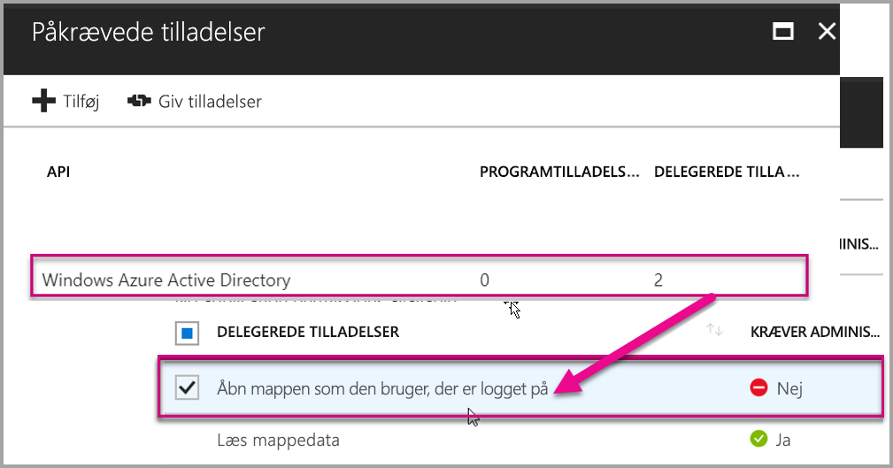

4. Vælg **Tilføj**

    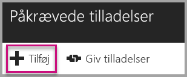

5. Vælg **Vælg en API**.

    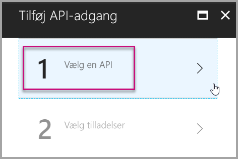

6. Vælg **Power BI-tjeneste**, og vælg derefter **Vælg**.

    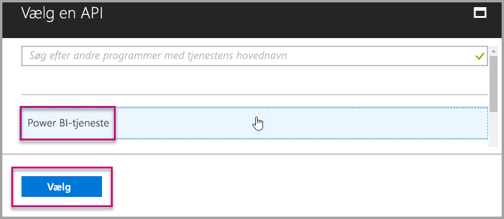

7. Vælg alle tilladelser under **Delegated Permission** (Delegerede tilladelser). Du skal vælge dem én for én for at kunne gemme dine valg. Vælg **Gem**, når du er færdig.
   
    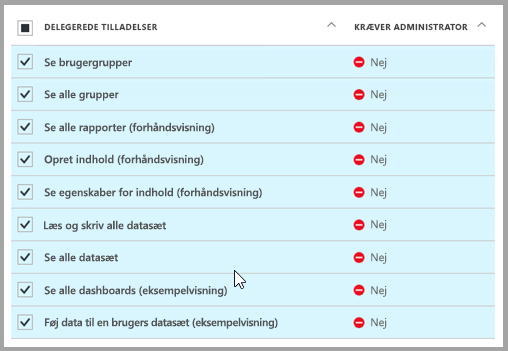

8. I **Required permissions** (Krævede tilladelser), skal du vælge **Grant Permissions** (Tildel tilladelser).
   
    Handlingen **Grant Permissions** (Tildel tilladelser) skal bruges til *hovedkontoen* for at undgå at blive bedt af Azure AD om at angive dit samtykke. Hvis kontoen, der udfører denne handling, er en Global administrator, giver du tilladelser til alle brugere i organisationen til programmet. Hvis kontoen, der udfører denne handling, er *hovedkontoen* og ikke en global administrator, giver du kun tilladelser til *hovedkontoen*  til programmet.
   
    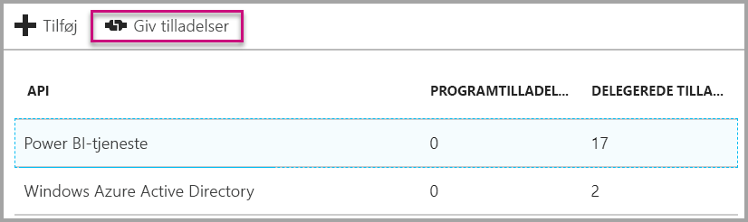

## Konfigurer dit Power BI-miljø

### Opret et apparbejdsområde

Hvis du integrerer rapporter, dashboards eller felter til dine kunder, skal du placere dit indhold i et apparbejdsområde. *Hovedkontoen* skal være administrator af apparbejdsområdet.

1. Start med at oprette arbejdsområdet. Vælg **Arbejdsområder** > **Opret apparbejdsområde**. Det bliver det sted, hvor du skal placere indhold, som dit program skal have adgang til.

    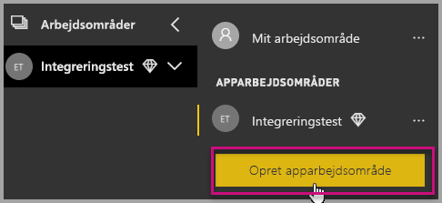

2. Giv arbejdsområdet et navn. Hvis det tilsvarende **Arbejdsområde-id** ikke er tilgængeligt, skal du redigere det og angive et entydigt id. Dette vil også være navnet på appen.

    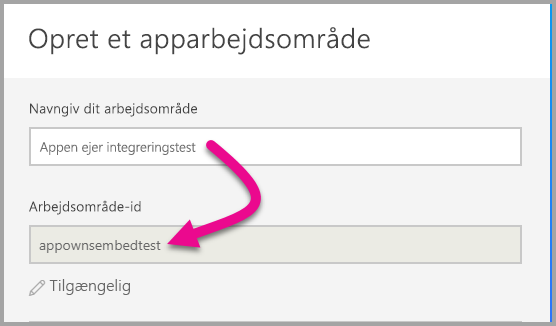

3. Du kan angive nogle forskellige indstillinger. Hvis du vælger **Offentligt** kan alle i din organisation se, hvad arbejdsområdet indeholder. **Privat** betyder, at det kun er medlemmerne af arbejdsområdet, der kan se indholdet.

    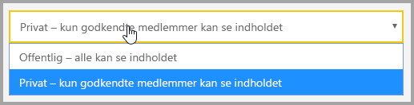

    Du kan ikke ændre indstillingen Offentligt/Privat, efter at du har oprettet gruppen.

4. Du kan også vælge, om medlemmer har adgang til at **redigere** eller har **skrivebeskyttet** adgang.

    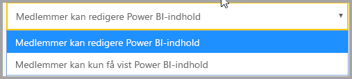

5. Tilføj mailadresser på de personer, du vil give adgang til arbejdsområdet, og vælg **Tilføj**. Du kan ikke tilføje gruppealiasser. Kun enkeltpersoner.

6. Beslut, om hver person skal være medlem eller administrator. Administratorer kan redigere selve arbejdsområdet, herunder tilføje andre medlemmer. Medlemmer kan redigere indholdet i arbejdsområdet, medmindre de har skrivebeskyttet adgang. Både administratorer og medlemmer kan udgive appen.

Du kan nu se det nye arbejdsområde. Power BI opretter arbejdsområdet og åbner det. Det vises på listen over de arbejdsområder, du er medlem af. Da du er administrator, kan du vælge de tre prikker (…) for at gå tilbage og ændre arbejdsområdet, tilføje nye medlemmer eller ændre deres tilladelser.

   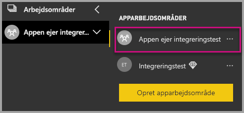

### Opret og udgiv dine rapporter

Du kan oprette rapporter og datasæt ved hjælp af Power BI Desktop og derefter udgive disse rapporter til et apparbejdsområde. Den slutbruger, der udgiver rapporterne, skal have en Power BI Pro-licens for at kunne udgive til et apparbejdsområde.

1. Download eksemplet [Blogdemo](https://github.com/Microsoft/powerbi-desktop-samples) fra GitHub.

    

2. Åbn en PBIX-eksempelrapport i **Power BI Desktop**

   

3. Udgiv på **apparbejdsområdet**

   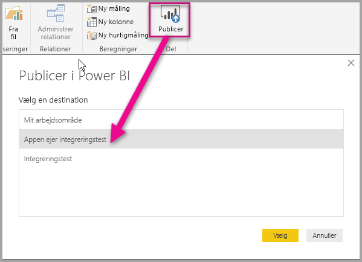

    Nu kan du se rapporten online i Power BI-tjenesten

   

## Integrer dit indhold

Integration for kunderne i dit program kræver, at du kan få en **adgangstoken** til din masterkonto fra **Azure AD**. Det er påkrævet, at du [får et Azure AD-adgangstoen](get-azuread-access-token.md#access-token-for-non-power-bi-users-app-owns-data) til dit Power BI-program vha, App owns data, før du foretager kald til Power BI-API.

Følg disse trin for at begynde at integrere dit indhold vha. et eksempelprogram.

1. Download [eksemplet, hvor appen ejer data,](https://github.com/Microsoft/PowerBI-Developer-Samples) fra GitHub for at komme i gang.

    

2. Åbn filen Web.config i eksempelprogrammet. Der er 5 felter, som du skal udfylde for at køre programmet. **clientID**, **groupId**, **reportId**, **pbiUsername** og **pbiPassword**.

      

    * Udfyld **clientId** med **program-id'et** fra **Azure**. **clientId** bruges af programmet til at identificere sig selv over for de brugere, som du anmoder om tilladelser fra. Hvis du vil hente **clientId**, skal du følge disse trin:

    1. Log på [Azure-portalen](https://portal.azure.com).

        

    2. Vælg **Alle tjenester** i navigationsruden til venstre, og vælg **Appregistreringer**.

        
    3. Vælg det program, du vil hente **clientId** for.

        

    4. Du kan se et **program-id**, der er angivet som GUID. Brug dette **program-id** som **clientId** for programmet.

             

    * Udfyld **groupId** med **apparbejdsområde-GUID'et** fra Power BI.

        

    * Udfyld **reportId** med **rapport-GUID'et** fra Power BI.

            

    * Udfyld **pbiUsername** med den overordnede brugers Power BI-konto.
    * Udfyld **pbiPassword** med adgangskoden for den overordnede brugers Power BI-konto.

3. Kør programmet!

    Først skal du vælge **Kør** i **Visual Studio**.

    

    Vælg derefter **Integrer rapport**. Afhængigt af hvilket indhold du vælger at udføre test med – rapporter, dashboards eller felter – skal du vælge den pågældende indstilling i programmet.

    
 
    Du kan nu se rapporten i eksempelprogrammet.

    

## Flyt til produktion

Nu, hvor du er færdig med at udvikle dit program, er tiden kommet til at underbygge dit arbejdsområde med dedikerede kapacitet. Dedikeret kapacitet er påkrævet for at flytte til produktionen.

### Opret en dedikeret kapacitet
Når du opretter en dedikeret kapacitet, kan du drage fordel af at have en dedikeret ressource for din kunde. Arbejdsområder, der ikke er knyttet til en dedikeret kapacitet, vil være i en delt kapacitet. Du kan oprette en dedikeret kapacitet ved hjælp af løsningen med [integreret dedikeret kapacitet i Power BI](https://docs.microsoft.com/azure/power-bi-embedded/create-capacity) på Azure.

>[!Note]
>Med PRO-licenser er integrerede tokens kun beregnet til udviklingstest, så antallet af integrerede tokens, der kan genereres fra en Power BI-masterkonto, er begrænset. Du skal købe en dedikeret kapacitet for at kunne integrere i et produktionsmiljø. Der er ingen grænse for, hvor mange integrerede tokens, du kan generere vha. en dedikeret kapacitet. Gå til [Hent tilgængelige funktioner](https://msdn.microsoft.com/library/mt846473.aspx) for at undersøge den brugsværdi, der angiver brugen af integrerede tokens i procent.
>

### Tildel et apparbejdsområde til en dedikeret kapacitet

Når der er oprettet dedikeret kapacitet, kan du tildele apparbejdsområdet til den dedikerede kapacitet. Gennemgå følgende trin for at udføre denne handling.

1. I **Power BI-tjenesten** skal du udvide arbejdsområder og vælge ellipsen for det arbejdsområde du integrerer dit indhold i. Vælg derefter **Rediger arbejdsområder**.

    

2. Udvid **Avanceret**, aktivér derefter **Dedikeret kapacitet**, og vælg derefter den dedikerede kapacitet, du har oprettet. Vælg derefter **Gem**.

    

Hvis du vil se et komplet eksempel, hvor JavaScript API'en bruges, kan du bruge [værktøjet Playground](https://microsoft.github.io/PowerBI-JavaScript/demo). Med dette værktøj kan du nemt prøve dig frem med forskellige typer af Power BI Embedded-eksempler. Du kan også få flere oplysninger om JavaScript-API'en ved at gå til siden [wiki for PowerBI-JavaScript](https://github.com/Microsoft/powerbi-javascript/wiki).

Hvis du har flere spørgsmål om Power BI Embedded, kan du gå til siden med [ofte stillede spørgsmål](embedded-faq.md).  Hvis du har problemer med Power Bi Embedded i dit program, kan du gå til siden med [fejlfinding](embedded-troubleshoot.md).

Har du flere spørgsmål? [Prøv at spørge Power BI-community'et](http://community.powerbi.com/)