# <a name="tutorial-embed-a-power-bi-report-dashboard-or-tile-into-an-application-for-your-organization"></a>Selvstudium: Integrer en rapport, et dashboard eller et felt i Power BI i et program til din organisation
I dette selvstudium vises, hvordan du kan integrere en rapport i et program ved hjælp af **Power BI** .NET SDK sammen med **Power BI** JavaScript-API'en, når du integrerer **Power BI** i et program til din organisation. Med **Power BI** kan du integrere rapporter, dashboards eller felter i et program vha. **brugeren ejer dataene**. **Brugeren ejer dataene** gør det muligt for programmet at udvide Power BI-tjenesten.


I dette selvstudium lærer du, hvordan du kan:
>[!div class="checklist"]
>* Registrere en app i Azure.
>* Integrer en Power BI-rapport i et program.

## <a name="prerequisites"></a>Forudsætninger
For at komme i gang skal du have en **Power BI Pro**-konto og et **Microsoft Azure**-abonnement.

* Hvis du ikke er tilmeldt **Power BI Pro**, kan du [tilmelde dig en gratis prøveversion](https://powerbi.microsoft.com/en-us/pricing/), før du begynder.
* Hvis du ikke har et Azure-abonnement, skal du oprette en [gratis konto](https://azure.microsoft.com/free/?WT.mc_id=A261C142F), før du begynder.
* Du skal have din egen konfiguration af [Azure Active Directory-lejer](create-an-azure-active-directory-tenant.md).
* Du skal have [Visual Studio](https://www.visualstudio.com/) installeret (version 2013 eller nyere).

## <a name="setup-your-embedded-analytics-development-environment"></a>Konfigurer dit integrerede analyseudviklingsmiljø

Før du begynder at integrere rapporter, dashboards eller felter i din app, skal du sikre dig, at du kan integrere i dit miljø. Du skal gøre følgende som en del af konfigurationen.

Du kan gennemgå [Onboarding Experience Tool](https://aka.ms/embedsetup/UserOwnsData) for hurtigt komme i gang med og downloade en eksempelapp, hvor du kan se, hvordan du opretter et miljø og integrerer en rapport.

Hvis du vælger at konfigurere miljøet manuelt, kan du dog fortsætte nedenfor.
### <a name="register-an-application-in-azure-active-directory-azure-ad"></a>Registrer et program i Azure Active Directory (Azure AD)

Du kan registrere dit program i Azure Active Directory, så dit program får adgang til Power BI REST-API'er. Det giver dig mulighed for at oprette et id for dit program og angive tilladelser til Power BI REST-ressourcer.

1. Acceptér [vilkårene for Microsoft Power BI API](https://powerbi.microsoft.com/api-terms).

2. Log på [Azure-portalen](https://portal.azure.com).

    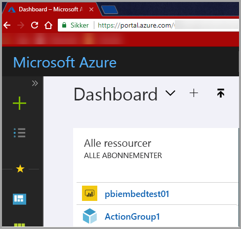

3. Vælg **Alle tjenester** i navigationsruden til venstre, vælg **Appregistreringer**, og vælg derefter **Registrering af nyt program**.

    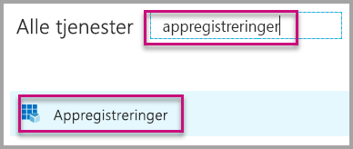</br>
    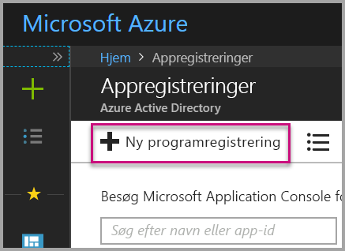

4. Følg prompterne, og opret et nyt program. I forbindelse med **brugeren ejer dataene** skal du bruge **Webapp/API** for programtypen. Du skal også angive en **Logon-URL**, som **Azure AD** bruger til at returnere tokensvar. Angiv en værdi, der er specifik for dit program (f. eks. http://localhost:13526/).

    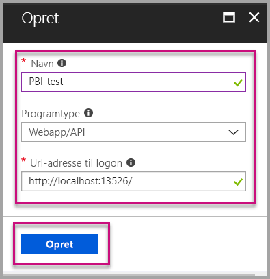

### <a name="apply-permissions-to-your-application-within-azure-active-directory"></a>Anvend tilladelser til dit program i Azure Active Directory

Du skal aktivere yderligere tilladelser til dit program ud over det, der er angivet på siden til appregistrering. Du skal være logget på med en *global administrator*-konto for at aktivere tilladelser.

### <a name="use-the-azure-active-directory-portal"></a>Brug Azure Active Directory-portalen

1. Gå til [App registrations](https://portal.azure.com/#blade/Microsoft_AAD_IAM/ApplicationsListBlade) (Appregistreringer) på Azure-portalen, og vælg den app, du bruger til at integrere.

    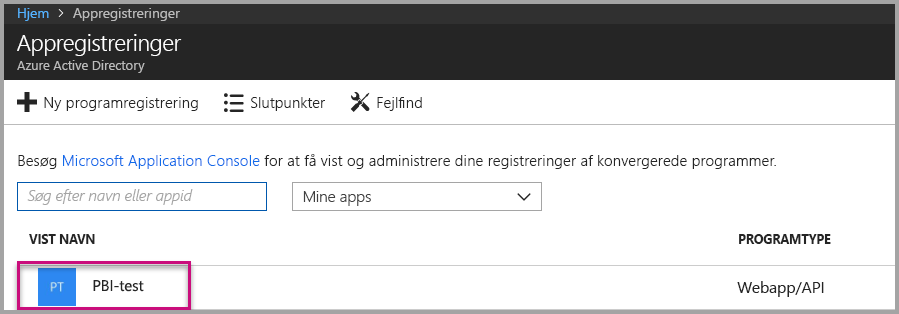

2. Vælg **Indstillinger**, og vælg derefter **Påkrævede tilladelser** under **API-adgang**.

    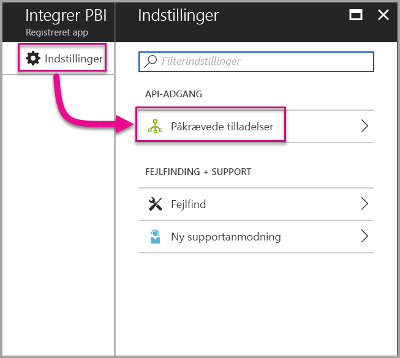

3. Vælg **Azure Active Directory**, og kontrollér, at **Åbn mappen som den bruger, der er logget på** er markeret. Vælg **Gem**.

    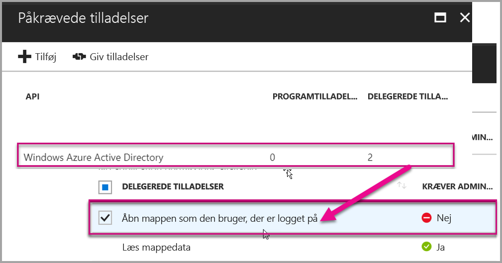

4. Vælg **Tilføj**

    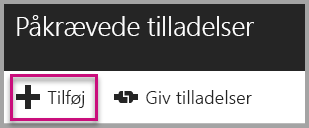

5. Vælg **Vælg en API**.

    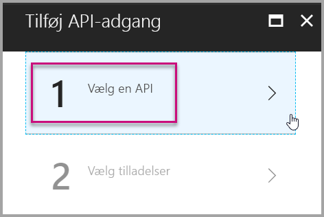

6. Vælg **Power BI-tjeneste**, og vælg derefter **Vælg**.

    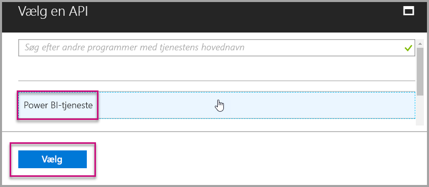

7. Vælg alle tilladelser under **Delegated Permission** (Delegerede tilladelser). Du skal vælge dem én for én for at kunne gemme dine valg. Vælg **Gem**, når du er færdig.

    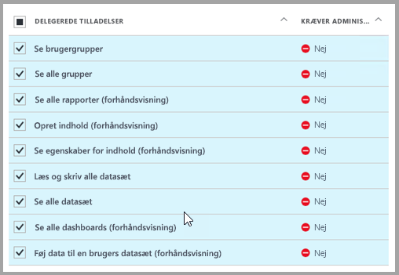

## <a name="setup-your-power-bi-environment"></a>Konfigurer dit Power BI-miljø

### <a name="create-an-app-workspace"></a>Opret et apparbejdsområde

Hvis du integrerer rapporter, dashboards eller felter til dine kunder, skal du placere dit indhold i et apparbejdsområde.

1. Start med at oprette arbejdsområdet. Vælg **Arbejdsområder** > **Opret apparbejdsområde**. Det er det sted, hvor du placerer indholdet, som dit program skal have adgang til.

    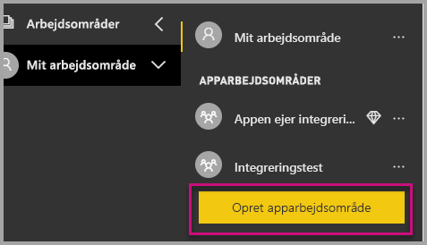

2. Giv arbejdsområdet et navn. Hvis det tilsvarende **Arbejdsområde-id** ikke er tilgængeligt, skal du redigere det og angive et entydigt id. Dette skal også være navnet på appen.

    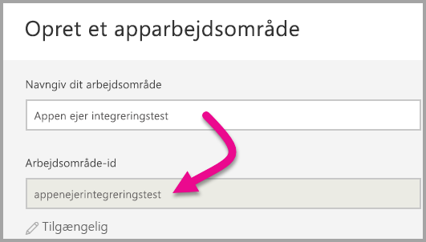

3. Du kan angive nogle forskellige indstillinger. Hvis du vælger **Offentligt** kan alle i din organisation se, hvad arbejdsområdet indeholder. **Privat** betyder, at det kun er medlemmerne af arbejdsområdet, der kan se indholdet.

    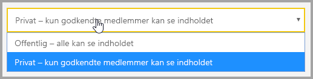

    Du kan ikke ændre indstillingen Offentligt/Privat, efter at du har oprettet gruppen.

4. Du kan også vælge, om medlemmer har adgang til at **redigere** eller har **skrivebeskyttet** adgang.

    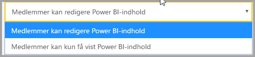

5. Tilføj mailadresser på de personer, du vil give adgang til arbejdsområdet, og vælg **Tilføj**. Du kan ikke tilføje gruppealiasser. Kun enkeltpersoner.

6. Beslut, om hver person skal være medlem eller administrator. Administratorer kan redigere selve arbejdsområdet, herunder tilføje andre medlemmer. Medlemmer kan redigere indholdet i arbejdsområdet, medmindre de har skrivebeskyttet adgang. Både administratorer og medlemmer kan udgive appen.

    Du kan nu se det nye arbejdsområde. Power BI opretter arbejdsområdet og åbner det. Det vises på listen over de arbejdsområder, du er medlem af. Da du er administrator, kan du vælge de tre prikker (…) for at gå tilbage og ændre arbejdsområdet, tilføje nye medlemmer eller ændre deres tilladelser.

    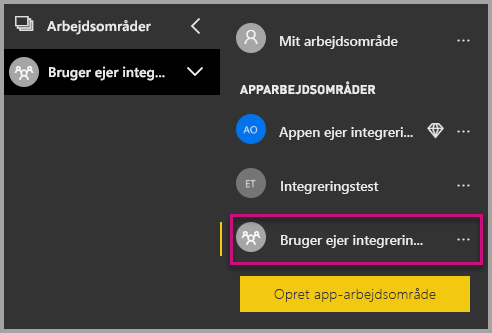

### <a name="create-and-publish-your-reports"></a>Opret og udgiv dine rapporter

Du kan oprette rapporter og datasæt ved hjælp af Power BI Desktop og derefter udgive disse rapporter til et apparbejdsområde. Den slutbruger, der udgiver rapporterne, skal have en Power BI Pro-licens for at kunne udgive til et apparbejdsområde.

1. Download eksemplet [Blogdemo](https://github.com/Microsoft/powerbi-desktop-samples) fra GitHub.

    

2. Åbn en PBIX-eksempelrapport i **Power BI Desktop**

   

3. Udgiv på **apparbejdsområdet**

   

    Nu kan du se rapporten online i Power BI-tjenesten.

   

## <a name="embed-your-content-using-the-sample-application"></a>Integrer dit indhold ved hjælp af eksempelprogrammet

Følg disse trin for at begynde at integrere dit indhold vha. et eksempelprogram.

1. Download [eksemplet Brugeren ejer dataene](https://github.com/Microsoft/PowerBI-Developer-Samples) fra GitHub for at komme i gang.  Der er tre forskellige eksempelprogrammer, et til [rapporter](https://github.com/Microsoft/PowerBI-Developer-Samples/tree/master/User%20Owns%20Data/integrate-report-web-app), et til [dashboards](https://github.com/Microsoft/PowerBI-Developer-Samples/tree/master/User%20Owns%20Data/integrate-dashboard-web-app) og et til [felter](https://github.com/Microsoft/PowerBI-Developer-Samples/tree/master/User%20Owns%20Data/integrate-tile-web-app).  Denne artikel henviser til programmet **Rapporter**, som vi diskuterer i de nedenstående trin.

    

2. Åbn filen Cloud.config i eksempelprogrammet. Der er et par felter, du skal udfylde for at køre programmet. **ClientID** og **ClientSecret**.

    

    Udfyld **ClientID** med oplysningerne fra **Program-id'et** fra **Azure**. **ClientID** bruges af programmet til at identificere sig selv over for de brugere, som du anmoder om tilladelser fra.

    Hvis du vil hente **ClientID**, skal du følge disse trin:

    Log på [Azure-portalen](https://portal.azure.com).

    

    Vælg **Alle tjenester** i navigationsruden til venstre, og vælg **Appregistreringer**.

    

    Vælg programmet, der skal bruge **ClientID**.

    

    Du kan se et **program-id**, der er angivet som GUID. Brug dette **Program-id** som **ClientID** for programmet.

    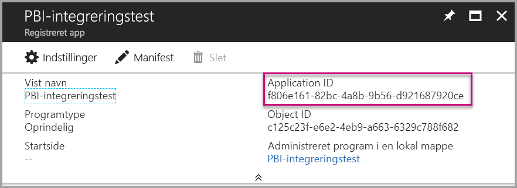

    Udfyld oplysningerne for **ClientSecret** ud fra sektionen **Nøgler** i sektionen **Appregistreringer** i **Azure**.

    Hvis du vil hente **ClientSecret**, skal du følge disse trin:

    Log på [Azure-portalen](https://portal.azure.com).

    

    Vælg **Alle tjenester** i navigationsruden til venstre, og vælg **Appregistreringer**.

    

    Vælg programmet, der skal bruge **ClientSecret**.

    

    Vælg **Indstillinger**.

    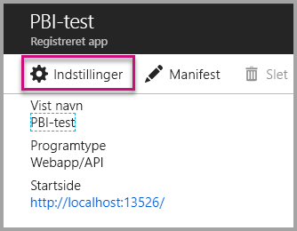

    Vælg **Nøgler**.

    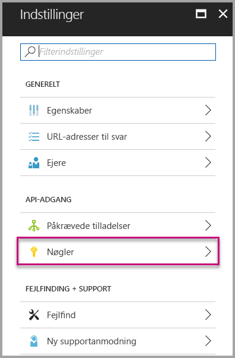

    Udfyld **Beskrivelsen** med et navn, og vælg en **Varighed**, og vælg derefter **Gem** for at få **Værdien** til dit program. Når du lukker bladet **Nøgler**, efter du har gemt **nøgleværdien**, vises værdifeltet kun som **_Skjult_**, og du vil herefter ikke kunne hente **nøgleværdien**. Hvis du mister den pågældende **nøgleværdi**, skal du oprette en ny på **Azure Portal**.

    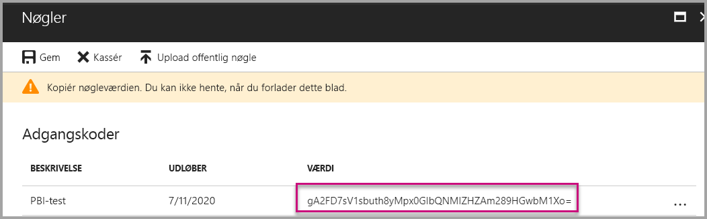

     Udfyld **groupId** med **apparbejdsområde-GUID'et** fra Power BI.

    

    Udfyld **reportId** med **rapport-GUID'et** fra Power BI.

    

3. Kør programmet!

    Først skal du vælge **Kør** i **Visual Studio**.

    

    Vælg derefter **Hent rapport**.

    

    Du kan nu se rapporten i eksempelprogrammet.

    

## <a name="embed-your-content-within-your-application"></a>Integrer dit indhold i dit program
Selvom trinnene til at integrere dit indhold kan gøres med [Power BI REST API'er](https://docs.microsoft.com/rest/api/power-bi/), foretages eksempelkoderne, der er beskrevet i denne artikel, med **.NET SDK**.

Du integrerer en rapport i en webapp ved hjælp af **Power BI REST-API'en** eller **Power BI C#-SDK'en** og et **adgangstoken** til Azure Active Directory (AD) for at hente en rapport. Derefter skal du indlæse rapporten ved hjælp af det samme **adgangstoken**. **Power BI REST-API'en** leverer programmatisk adgang til bestemte **Power BI**-ressourcer. Du kan finde flere oplysninger under [Power BI REST API](https://docs.microsoft.com/rest/api/power-bi/) og [Power BI JavaScript API](https://github.com/Microsoft/PowerBI-JavaScript).

### <a name="get-an-access-token-from-azure-ad"></a>Hent et adgangstoken fra Azure AD
I programmet skal du først hente et **adgangstoken** fra Azure AD, før du kan foretage kald til Power BI REST-API'en. Du kan finde flere oplysninger under [Godkend brugere, og få et Azure AD-adgangstoken til din Power BI-app](get-azuread-access-token.md).

### <a name="get-a-report"></a>Hent en rapport
Du henter en **Power BI**-rapport ved at bruge handlingen [Hent rapporter](https://docs.microsoft.com/rest/api/power-bi/reports/getreports), hvorved en liste over **Power BI-rapporter** hentes. Du kan få et rapport-id fra listen over rapporter.

### <a name="get-reports-using-an-access-token"></a>Hent rapporter ved hjælp af et adgangstoken
Handlingen [Hent rapporter](https://docs.microsoft.com/rest/api/power-bi/reports/getreports) returnerer en liste over rapporter. Du kan få en enkelt rapport på listen over rapporter.

Du skal inkludere en *godkendelsesheader* i formatet *Bearer {adgangstoken}* for at kunne foretage REST-API-kaldet.

#### <a name="get-reports-with-the-rest-api"></a>Hent rapport ved hjælp af REST-API'en

Her er et kodeeksempel på, hvordan du henter rapporter med **REST-API'en**.

*Et eksempel på, hvordan du henter et indholdselement, du ønsker at integrere (rapport, dashboard eller felt), er tilgængelig i filen **_Default.aspx.cs_** i [eksempelprogrammet](#embed-your-content-using-the-sample-application).*

```csharp
using Newtonsoft.Json;

//Get a Report. In this sample, you get the first Report.
protected void GetReport(int index)
{
    //Configure Reports request
    System.Net.WebRequest request = System.Net.WebRequest.Create(
        String.Format("{0}/Reports",
        baseUri)) as System.Net.HttpWebRequest;

    request.Method = "GET";
    request.ContentLength = 0;
    request.Headers.Add("Authorization", String.Format("Bearer {0}", accessToken.Value));

    //Get Reports response from request.GetResponse()
    using (var response = request.GetResponse() as System.Net.HttpWebResponse)
    {
        //Get reader from response stream
        using (var reader = new System.IO.StreamReader(response.GetResponseStream()))
        {
            //Deserialize JSON string
            PBIReports Reports = JsonConvert.DeserializeObject<PBIReports>(reader.ReadToEnd());

            //Sample assumes at least one Report.
            //You could write an app that lists all Reports
            if (Reports.value.Length > 0)
            {
                var report = Reports.value[index];

                txtEmbedUrl.Text = report.embedUrl;
                txtReportId.Text = report.id;
                txtReportName.Text = report.name;
            }
        }
    }
}

//Power BI Reports used to deserialize the Get Reports response.
public class PBIReports
{
    public PBIReport[] value { get; set; }
}
public class PBIReport
{
    public string id { get; set; }
    public string name { get; set; }
    public string webUrl { get; set; }
    public string embedUrl { get; set; }
}
```

#### <a name="get-reports-using-the-net-sdk"></a>Hent rapporter ved hjælp af .NET-SDK
Du kan bruge .NET-SDK'et til at hente en liste over rapporter i stedet for at kalde REST-API'en direkte. Her er et kodeeksempel på, hvordan du opretter en liste over rapporter.

```csharp
using Microsoft.IdentityModel.Clients.ActiveDirectory;
using Microsoft.PowerBI.Api.V2;
using Microsoft.PowerBI.Api.V2.Models;

var tokenCredentials = new TokenCredentials(<ACCESS TOKEN>, "Bearer");

// Create a Power BI Client object. It is used to call Power BI APIs.
using (var client = new PowerBIClient(new Uri(ApiUrl), tokenCredentials))
{
    // Get the first report all reports in that workspace
    ODataResponseListReport reports = client.Reports.GetReports();

    Report report = reports.Value.FirstOrDefault();

    var embedUrl = report.EmbedUrl;
}
```

### <a name="load-a-report-using-javascript"></a>Indlæs en rapport ved hjælp af JavaScript
Du kan bruge JavaScript til at indlæse en rapport i et div-element på din webside.

Her er et kodeeksempel på, hvordan du henter en rapport fra et givent arbejdsområde.

*Et eksempel på, hvordan du indlæser et indholdselement, uanset om det er en rapport, et dashboard eller et felt, du vil integrere, er tilgængelig i filen **_Default.aspx_** i [eksempelprogrammet](#embed-your-content-using-the-sample-application).*

```javascript
<!-- Embed Report-->
<div> 
    <asp:Panel ID="PanelEmbed" runat="server" Visible="true">
        <div>
            <div><b class="step">Step 3</b>: Embed a report</div>

            <div>Enter an embed url for a report from Step 2 (starts with https://):</div>
            <input type="text" id="tb_EmbedURL" style="width: 1024px;" />
            <br />
            <input type="button" id="bEmbedReportAction" value="Embed Report" />
        </div>

        <div id="reportContainer"></div>
    </asp:Panel>
</div>
```

**Site.master**

```javascript
window.onload = function () {
    // client side click to embed a selected report.
    var el = document.getElementById("bEmbedReportAction");
    if (el.addEventListener) {
        el.addEventListener("click", updateEmbedReporte, false);
    } else {
        el.attachEvent('onclick', updateEmbedReport);
    }

    // handle server side post backs, optimize for reload scenarios
    // show embedded report if all fields were filled in.
    var accessTokenElement = document.getElementById('MainContent_accessTokenTextbox');
    if (accessTokenElement !== null) {
        var accessToken = accessTokenElement.value;
        if (accessToken !== "")
            updateEmbedReport();
    }
};

// update embed report
function updateEmbedReport() {

    // check if the embed url was selected
    var embedUrl = document.getElementById('tb_EmbedURL').value;
    if (embedUrl === "")
        return;

    // get the access token.
    accessToken = document.getElementById('MainContent_accessTokenTextbox').value;

    // Embed configuration used to describe the what and how to embed.
    // This object is used when calling powerbi.embed.
    // You can find more information at https://github.com/Microsoft/PowerBI-JavaScript/wiki/Embed-Configuration-Details.
    var config = {
        type: 'report',
        accessToken: accessToken,
        embedUrl: embedUrl
    };

    // Grab the reference to the div HTML element that will host the report.
    var reportContainer = document.getElementById('reportContainer');

    // Embed the report and display it within the div container.
    var report = powerbi.embed(reportContainer, config);

    // report.on will add an event handler which prints to Log window.
    report.on("error", function (event) {
        var logView = document.getElementById('logView');
        logView.innerHTML = logView.innerHTML + "Error<br/>";
        logView.innerHTML = logView.innerHTML + JSON.stringify(event.detail, null, "  ") + "<br/>";
        logView.innerHTML = logView.innerHTML + "---------<br/>";
    }
  );
}
```

## <a name="using-a-power-bi-premium-dedicated-capacity"></a>Ved brug af en dedikeret kapacitet fra Power BI Premium

Nu, hvor du er færdig med at udvikle dit program, er tiden kommet til at underbygge dit arbejdsområde med dedikerede kapacitet.

### <a name="create-a-dedicated-capacity"></a>Opret en dedikeret kapacitet
Når du opretter en dedikeret kapacitet, kan du drage fordel af at have en dedikeret ressource for indholdet i dit apparbejdsområde. Hvis et arbejdsområde ikke er tildelt en dedikeret kapacitet, anses den som en delt kapacitet. Du kan oprette en dedikeret kapacitet ved hjælp af [Power BI Premium ](../service-admin-premium-purchase.md).

### <a name="assign-an-app-workspace-to-a-dedicated-capacity"></a>Tildel et apparbejdsområde til en dedikeret kapacitet

Når der er oprettet en dedikeret kapacitet, kan du tildele dit apparbejdsområde til den dedikerede kapacitet. Gennemgå følgende trin for at udføre denne handling.

1. I **Power BI-tjenesten** skal du udvide arbejdsområder og vælge ellipsen for det arbejdsområde, du bruger til at integrere dit indhold i. Vælg derefter **Rediger arbejdsområder**.

    

2. Udvid **Avanceret**, aktivér derefter **Dedikeret kapacitet**, og vælg derefter den dedikerede kapacitet, du har oprettet. Vælg derefter **Gem**.

    

3. Efter du har valgt **Gem**, burde du se en **rombe** ud for navnet på apparbejdsområdet.

    

## <a name="next-steps"></a>Næste trin
I dette selvstudium har du lært, hvordan du integrerer Power BI-indhold i et program ved hjælp af din **Power BI-organisationskonto**. Nu kan du prøve at integrere Power BI-indhold i et program ved hjælp af apps.  Du kan også prøve at integrere Power BI-indhold til tredjepartskunder.

> [!div class="nextstepaction"]
> [Integrer fra apps](embed-from-apps.md)

> [!div class="nextstepaction"]
>[Integrer til tredjepartskunder](embed-sample-for-customers.md)

Har du flere spørgsmål? [Prøv at spørge Power BI-community'et](http://community.powerbi.com/)
