# <a name="tutorial-embed-power-bi-content-into-an-application-for-your-organization"></a>Selvstudium: Integrer Power BI-indhold i en app til din organisation

I **Power BI** kan du integrere rapporter (Power BI eller sideinddelte), dashboards eller felter i et program ved hjælp af funktionen "brugeren ejer data". Ved hjælp af funktionen **Brugeren ejer data** kan programmet udvide Power BI-tjenesten til at bruge integreret analyse. Dette selvstudium viser, hvordan du integrerer en rapport (Power BI eller sideinddelt) i et program. Du kan bruge Power BI .NET SDK med Power BI JavaScript-API'en til at integrere Power BI i et program for din organisation.

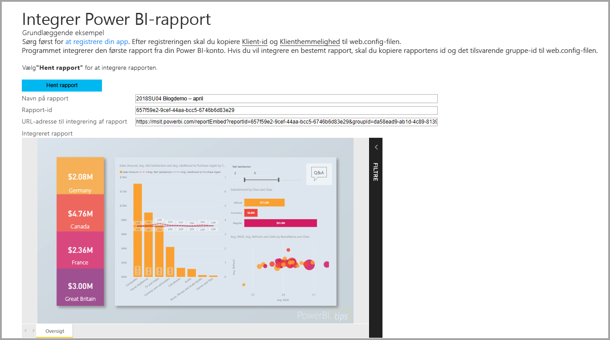

I dette selvstudium får du at vide, hvordan du udfører følgende opgaver:
> [!div class="checklist"]
> * Registrere en app i Azure.
> * Integrer en Power BI- eller sideinddelt rapport i et program ved hjælp af din Power BI-lejer.

## <a name="prerequisites"></a>Forudsætninger

Du skal have følgende for at komme i gang:

* En [Power BI Pro-konto](../service-self-service-signup-for-power-bi.md).
* Et [Microsoft Azure](https://azure.microsoft.com/)-abonnement.
* Du skal have din egen konfiguration af [Azure Active Directory-lejer](create-an-azure-active-directory-tenant.md).
* Hvis du vil integrere sideinddelte rapporter, skal du som minimum have en P1-kapacitet. Se [Hvilken størrelse Premium-kapacitet skal jeg bruge til sideinddelte rapporter?](../paginated-reports-faq.md#what-size-premium-capacity-do-i-need-for-paginated-reports).

Hvis du ikke er tilmeldt **Power BI Pro**, kan du [tilmelde dig en gratis prøveversion](https://powerbi.microsoft.com/pricing/), før du begynder.

Hvis du ikke har et Azure-abonnement, skal du oprette en [gratis konto](https://azure.microsoft.com/free/?WT.mc_id=A261C142F), før du begynder.

## <a name="set-up-your-embedded-analytics-development-environment"></a>Konfigurer dit integrerede analyseudviklingsmiljø

Før du begynder at integrere rapporter, dashboards eller felter i dit program, skal du sikre dig, at du kan integrere med Power BI i dit miljø.

Du kan gennemgå [værktøjet til konfiguration af integrering](https://aka.ms/embedsetup/UserOwnsData) for hurtigt at komme i gang med og downloade et eksempelprogram, der hjælper dig med at oprette et miljø og integrere en rapport. Hvis du vil integrere en sideinddelt rapport, skal du som minimum tildele en P1-kapacitet til det oprettede arbejdsområde.

Hvis du vælger at konfigurere miljøet manuelt, kan du fortsætte nedenfor.

### <a name="register-an-application-in-azure-active-directory"></a>Registrer et program i Microsoft Azure Active Directory

[Registrer dit program](register-app.md) med Azure Active Directory for at give dit program adgang til [REST API'erne til Power BI](https://docs.microsoft.com/rest/api/power-bi/). Når du registrerer dit program, får du mulighed for at oprette en identitet for programmet og angive tilladelser til Power BI REST-ressourcer.

Du skal fortsætte med at registrere en app med et **serverbaseret webprogram**. Du registrerer et serverbaseret webprogram for at oprette en programhemmelighed.

## <a name="set-up-your-power-bi-environment"></a>Konfigurer dit Power BI-miljø

### <a name="create-a-workspace"></a>Opret et arbejdsområde

Hvis du integrerer rapporter, dashboards eller felter for dine kunder, skal du placere dit indhold i et arbejdsområde. Der er forskellige typer arbejdsområder, som du kan konfigurere: [traditionelle arbejdsområder](../service-create-workspaces.md) eller [nye arbejdsområder](../service-create-the-new-workspaces.md).

### <a name="create-and-publish-your-power-bi-reports"></a>Opret og udgiv dine Power BI-rapporter

Du kan oprette dine rapporter og datasæt ved hjælp af Power BI Desktop. Du kan derefter udgive rapporterne i et arbejdsområde. Den slutbruger, der udgiver rapporterne, skal have en Power BI Pro-licens for at kunne udgive til et arbejdsområde.

1. Download eksemplet [Demo](https://github.com/Microsoft/powerbi-desktop-samples) fra GitHub.

    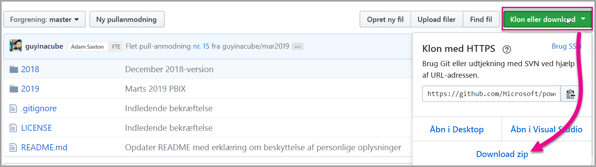

2. Åbn .pbix-eksempelrapporten i Power BI Desktop.

   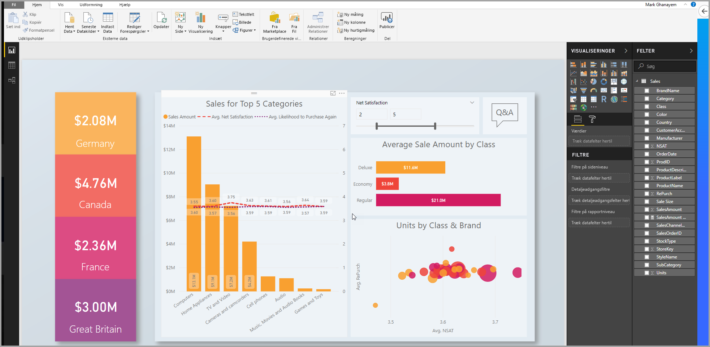

3. Udgiv til arbejdsområdet.

   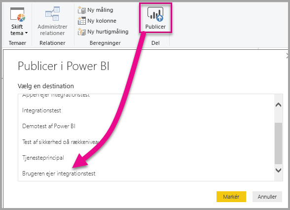

    Nu kan du se rapporten online i Power BI-tjenesten.

   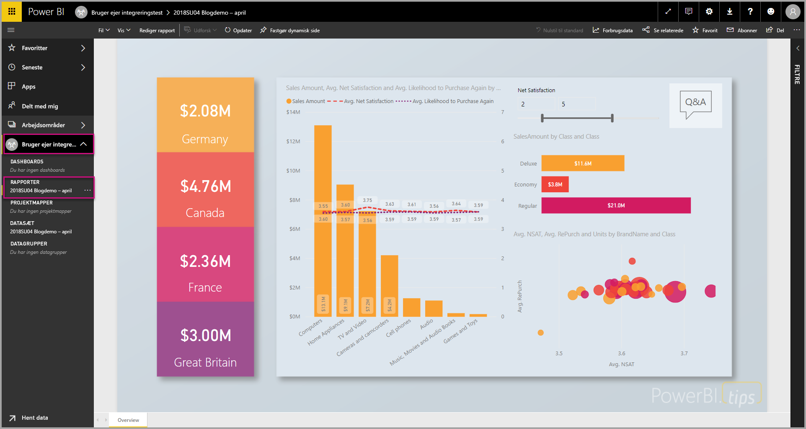
   
### <a name="create-and-publish-your-paginated-reports"></a>Opret og udgiv dine sideinddelte rapporter

Du kan oprette dine sideinddelte rapporter ved hjælp af [Power BI Report Builder](../paginated-reports-report-builder-power-bi.md#create-reports-in-power-bi-report-builder). Derefter kan du [uploade rapporten](../paginated-reports-quickstart-aw.md#upload-the-report-to-the-service) til et arbejdsområde, der som minimum har fået tildelt en P1-kapacitet. Den slutbruger, der uploader rapporten, skal have en Power BI Pro-licens for at kunne udgive til et arbejdsområde.
   
## <a name="embed-your-content-by-using-the-sample-application"></a>Integrer dit indhold ved hjælp af eksempelprogrammet

Dette eksempel er med vilje enkelt, da det kun skal bruges til demonstrationen.

Følg nedenstående trin for at begynde at integrere indhold ved hjælp af eksempelprogrammet.

1. Download [Visual Studio](https://www.visualstudio.com/) (version 2013 eller nyere). Sørg for at downloade den nyeste [NuGet-pakke](https://www.nuget.org/profiles/powerbi).

2. Download [eksemplet Brugeren ejer dataene](https://github.com/Microsoft/PowerBI-Developer-Samples) fra GitHub for at komme i gang.

    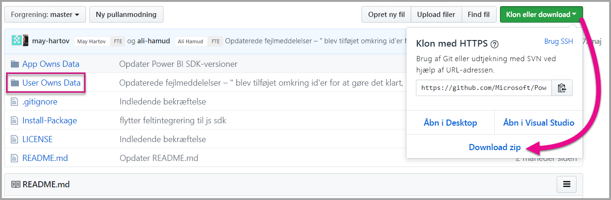

3. Åbn filen **Cloud.config** i eksempelprogrammet.

    Der er nogle felter, du skal udfylde, for at køre programmet.

    | Felt |
    |--------------------|
    | **[Program-id](#application-id)** |
    | **[Arbejdsområde-id](#workspace-id)** |
    | **[Rapport-id](#report-id)** |
    | **[AADAuthorityUrl](#aadauthorityurl)** |

    

### <a name="application-id"></a>Program-id

Udfyld oplysningerne om **applicationId** med **program-id'et** fra **Azure**. **Program-id'et** bruges af programmet til at identificere sig selv over for de brugere, du anmoder om tilladelser fra.

Hvis du vil hente **applicationId**, skal du følge disse trin:

1. Log på [Azure-portalen](https://portal.azure.com).

2. Vælg **Alle tjenester** i navigationsruden til venstre, og vælg **Appregistreringer**.

3. Vælg programmet, der skal bruge **applicationId**.

    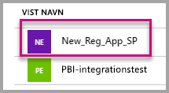

4. Der er angivet et **program-id** som GUID. Brug dette **Program-id** som **applicationId** for programmet.

    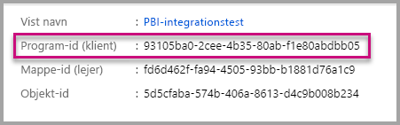

### <a name="workspace-id"></a>Id for arbejdsområde

Udfyld oplysningerne for **workspaceId** med GUID for arbejdsområdet fra Power BI. Du kan få disse oplysninger enten fra URL-adressen, når du er logget på Power BI-tjenesten, eller ved hjælp af Powershell.

URL-adresse <br>


PowerShell <br>

```powershell
Get-PowerBIworkspace -name "User Owns Embed Test"
```

   

### <a name="report-id"></a>Rapport-id

Udfyld **reportId** med GUID for rapporten fra Power BI. Du kan få disse oplysninger enten fra URL-adressen, når du er logget på Power BI-tjenesten, eller ved hjælp af Powershell.

URL til Power BI-rapport <br>


URL til sideinddelt rapport<br>


PowerShell <br>

```powershell
Get-PowerBIworkspace -name "User Owns Embed Test" | Get-PowerBIReport
```


### <a name="aadauthorityurl"></a>AADAuthorityUrl

Udfyld oplysningerne for **AADAuthorityUrl** med den URL-adresse, der enten gør det muligt at integrere med din organisations lejer eller integrere med en gæstebruger.

Brug URL-adressen – *https://login.microsoftonline.com/common/oauth2/authorize* for at integrere med din organisations lejer.

Hvis du vil integrere med en gæst, skal du bruge URL-adressen – *https://login.microsoftonline.com/report-owner-tenant-id* – hvor du tilføjer lejer-id'et for rapportens ejer i stedet for *report-owner-tenant-id*.

### <a name="run-the-application"></a>Kør programmet

1. Vælg **Kør** i **Visual Studio**.

    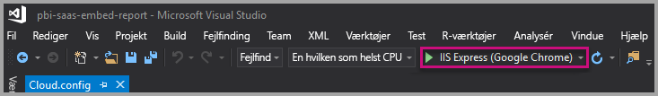

2. Vælg derefter **Integrer rapport**. Afhængigt af hvilket indhold du vælger at udføre test med – rapporter, dashboards eller felter – skal du vælge den pågældende indstilling i programmet.

    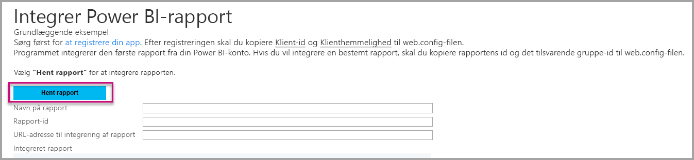

3. Du kan nu se rapporten i eksempelprogrammet.

    

## <a name="embed-your-content-within-your-application"></a>Integrer dit indhold i dit program

Selvom trinnene til at integrere dit indhold kan gøres med [Power BI REST-API'er](https://docs.microsoft.com/rest/api/power-bi/), oprettes de eksempelkoder, der er beskrevet i denne artikel, med .NET-SDK'en.

Hvis du vil integrere en rapport i en webapp, kan du bruge Power BI REST-API'en eller Power BI C#-SDK'en. Du kan også bruge et adgangstoken til godkendelse af Microsoft Azure Active Directory til at hente en rapport. Derefter skal du indlæse rapporten ved hjælp af det samme adgangstoken. Power BI REST-API'en leverer programmatisk adgang til bestemte Power BI-ressourcer. Du kan finde flere oplysninger under [Power BI REST-API'er](https://docs.microsoft.com/rest/api/power-bi/) og [Power BI JavaScript-API](https://github.com/Microsoft/PowerBI-JavaScript).

### <a name="get-an-access-token-from-azure-ad"></a>Hent et adgangstoken fra Azure AD

I programmet skal du hente et adgangstoken fra Microsoft Azure Active Directory, før du kan foretage kald til Power BI REST-API'en. Du kan finde flere oplysninger under [Godkend brugere, og få et Azure AD-adgangstoken til din Power BI-app](get-azuread-access-token.md).

### <a name="get-a-report"></a>Hent en rapport

Du henter en Power BI eller sideinddelt rapport ved at bruge handlingen [Hent rapporter](https://docs.microsoft.com/rest/api/power-bi/reports/getreports), hvilket bevirker, at der hentes en liste over Power BI og sideinddelte rapporter. Du kan få et rapport-id fra listen over rapporter.

### <a name="get-reports-by-using-an-access-token"></a>Hent rapporter ved hjælp af et adgangstoken

Handlingen [Hent rapporter](https://docs.microsoft.com/rest/api/power-bi/reports/getreports) returnerer en liste over rapporter. Du kan få en enkelt rapport på listen over rapporter.

Du skal inkludere en *godkendelsesheader* i formatet *Bearer {adgangstoken}* for at kunne foretage REST-API-kaldet.

#### <a name="get-reports-with-the-rest-api"></a>Hent rapport ved hjælp af REST-API'en

I følgende kodeeksempel kan du se, hvordan du henter rapporter med REST-API'en:

> [!Note]
> Du kan se et eksempel på, hvordan du henter et indholdselement, du ønsker at integrere, i filen Default.aspx.cs i [eksempelprogrammet](https://github.com/Microsoft/PowerBI-Developer-Samples). Eksempler er en rapport, et dashboard eller et felt.

```csharp
using Newtonsoft.Json;

//Get a Report. In this sample, you get the first Report.
protected void GetReport(int index)
{
    //Configure Reports request
    System.Net.WebRequest request = System.Net.WebRequest.Create(
        String.Format("{0}/Reports",
        baseUri)) as System.Net.HttpWebRequest;

    request.Method = "GET";
    request.ContentLength = 0;
    request.Headers.Add("Authorization", String.Format("Bearer {0}", accessToken.Value));

    //Get Reports response from request.GetResponse()
    using (var response = request.GetResponse() as System.Net.HttpWebResponse)
    {
        //Get reader from response stream
        using (var reader = new System.IO.StreamReader(response.GetResponseStream()))
        {
            //Deserialize JSON string
            PBIReports Reports = JsonConvert.DeserializeObject<PBIReports>(reader.ReadToEnd());

            //Sample assumes at least one Report.
            //You could write an app that lists all Reports
            if (Reports.value.Length > 0)
            {
                var report = Reports.value[index];

                txtEmbedUrl.Text = report.embedUrl;
                txtReportId.Text = report.id;
                txtReportName.Text = report.name;
            }
        }
    }
}

//Power BI Reports used to deserialize the Get Reports response.
public class PBIReports
{
    public PBIReport[] value { get; set; }
}
public class PBIReport
{
    public string id { get; set; }
    public string reportType { get; set }
    public string name { get; set; }
    public string webUrl { get; set; }
    public string embedUrl { get; set; }
}
```

#### <a name="get-reports-by-using-the-net-sdk"></a>Hent rapporter ved hjælp af .NET-SDK

Du kan bruge .NET-SDK'et til at hente en liste over rapporter i stedet for at kalde REST-API'en direkte. Følgende kodeeksempel viser, hvordan du får vist en liste over rapporter:

```csharp
using Microsoft.IdentityModel.Clients.ActiveDirectory;
using Microsoft.PowerBI.Api.V2;
using Microsoft.PowerBI.Api.V2.Models;

var tokenCredentials = new TokenCredentials(<ACCESS TOKEN>, "Bearer");

// Create a Power BI Client object. It is used to call Power BI APIs.
using (var client = new PowerBIClient(new Uri(ApiUrl), tokenCredentials))
{
    // Get the first report all reports in that workspace
    ODataResponseListReport reports = client.Reports.GetReports();

    Report report = reports.Value.FirstOrDefault();

    var embedUrl = report.EmbedUrl;
}
```

### <a name="load-a-report-by-using-javascript"></a>Indlæs en rapport ved hjælp af JavaScript

Du kan bruge JavaScript til at indlæse en rapport i et div-element på din webside. Her er et kodeeksempel på, hvordan du henter en rapport fra et givet arbejdsområde:

> [!NOTE]  
> Du kan se et eksempel på, hvordan du indlæser et indholdselement, du ønsker at integrere, i filen **Default.aspx.cs** i [eksempelprogrammet](https://github.com/Microsoft/PowerBI-Developer-Samples).

```javascript
<!-- Embed Report-->
<div> 
    <asp:Panel ID="PanelEmbed" runat="server" Visible="true">
        <div>
            <div><b class="step">Step 3</b>: Embed a report</div>

            <div>Enter an embed url for a report from Step 2 (starts with https://):</div>
            <input type="text" id="tb_EmbedURL" style="width: 1024px;" />
            <br />
            <input type="button" id="bEmbedReportAction" value="Embed Report" />
        </div>

        <div id="reportContainer"></div>
    </asp:Panel>
</div>
```

#### <a name="sitemaster"></a>Site.master

```javascript
window.onload = function () {
    // client side click to embed a selected report.
    var el = document.getElementById("bEmbedReportAction");
    if (el.addEventListener) {
        el.addEventListener("click", updateEmbedReport, false);
    } else {
        el.attachEvent('onclick', updateEmbedReport);
    }

    // handle server side post backs, optimize for reload scenarios
    // show embedded report if all fields were filled in.
    var accessTokenElement = document.getElementById('MainContent_accessTokenTextbox');
    if (accessTokenElement !== null) {
        var accessToken = accessTokenElement.value;
        if (accessToken !== "")
            updateEmbedReport();
    }
};

// update embed report
function updateEmbedReport() {

    // check if the embed url was selected
    var embedUrl = document.getElementById('tb_EmbedURL').value;
    if (embedUrl === "")
        return;

    // get the access token.
    accessToken = document.getElementById('MainContent_accessTokenTextbox').value;

    // Embed configuration used to describe the what and how to embed.
    // This object is used when calling powerbi.embed.
    // You can find more information at https://github.com/Microsoft/PowerBI-JavaScript/wiki/Embed-Configuration-Details.
    var config = {
        type: 'report',
        accessToken: accessToken,
        embedUrl: embedUrl
    };

    // Grab the reference to the div HTML element that will host the report.
    var reportContainer = document.getElementById('reportContainer');

    // Embed the report and display it within the div container.
    var report = powerbi.embed(reportContainer, config);

    // report.on will add an event handler which prints to Log window.
    report.on("error", function (event) {
        var logView = document.getElementById('logView');
        logView.innerHTML = logView.innerHTML + "Error<br/>";
        logView.innerHTML = logView.innerHTML + JSON.stringify(event.detail, null, "  ") + "<br/>";
        logView.innerHTML = logView.innerHTML + "---------<br/>";
    }
  );
}
```

## <a name="using-a-power-bi-premium-dedicated-capacity"></a>Ved brug af en dedikeret kapacitet fra Power BI Premium

Nu, hvor du er færdig med at udvikle dit program, er tiden kommet til at underbygge dit arbejdsområde med en dedikeret kapacitet.

### <a name="create-a-dedicated-capacity"></a>Opret en dedikeret kapacitet

Når du opretter en dedikeret kapacitet, kan du drage fordel af at have en dedikeret ressource for indholdet i dit arbejdsområde. I forbindelse med sideinddelte rapporter skal du som minimum understøtte dit arbejdsområde med en P1-kapacitet. Du kan oprette en dedikeret kapacitet ved hjælp af [Power BI Premium ](../service-premium-what-is.md).

I tabellen nedenfor kan du se en oversigt over de Power BI Premium-SKU'er, der er tilgængelige i [Microsoft Office 365](../service-admin-premium-purchase.md):

| Kapacitetsnode | Samlet antal vCores<br/>(back-end + front-end) | Back end-vCores | Front-end-vCores | Grænser for DirectQuery/liveforbindelser |
| --- | --- | --- | --- | --- | --- |
| EM1 |1 vCore |0,5 vCore, 10 GB RAM |0,5 vCore |3.75 pr. sekund |
| EM2 |2 vCores |1 vCore, 10 GB RAM |1 vCores |7.5 pr. sekund |
| EM3 |4 vCores |2 vCores, 10 GB RAM |2 vCores |15 pr. sekund |
| P1 |8 vCores |4 vCores, 25 GB RAM |4 vCores |30 pr. sekund |
| P2 |16 vCores |8 vCores, 50 GB RAM |8 vCores |60 pr. sekund |
| P3 |32 vCores |16 vCores, 100 GB RAM |16 vCores |120 pr. sekund |
| P4 |64 vCores |32 vCores, 200 GB RAM |32 vCores |240 pr. sekund |
| P5 |128 vCores |64 vCores, 400 GB RAM |64 vCores |480 pr. sekund |

> [!NOTE]
> - Når du forsøger at integrere med Microsoft Office-apps, kan du bruge EM-SKU'er til at få adgang til indhold med en gratis Power BI-licens. Men du kan ikke få adgang til indhold med en gratis Power BI-licens, når du bruger Powerbi.com eller Power BI – Mobil.
> - Når du forsøger at integrere med Microsoft Office-apps ved hjælp af Powerbi.com eller Power BI – Mobil, kan du få adgang til indhold med en gratis Power BI-licens.

### <a name="assign-a-workspace-to-a-dedicated-capacity"></a>Tildel et arbejdsområde til en dedikeret kapacitet

Når du har oprettet en dedikeret kapacitet, kan du tildele dit arbejdsområde til den dedikerede kapacitet. Gennemgå følgende trin for at udføre denne handling:

1. I Power BI-tjenesten skal du udvide arbejdsområder og vælge ellipsen for det arbejdsområde, du bruger til integrering af dit indhold. Vælg derefter **Rediger arbejdsområder**.

    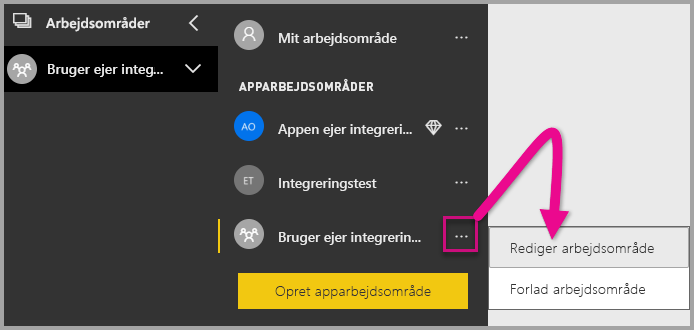

2. Udvid **Avanceret**, og aktiver **Dedikeret kapacitet**. Vælg den dedikerede kapacitet, du har oprettet. Vælg derefter **Gem**.

    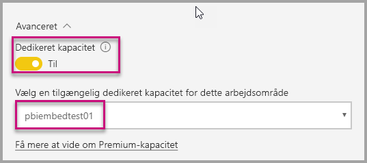

3. Når du har valgt **Gem**, kan du se en rombe ud for navnet på arbejdsområdet.

    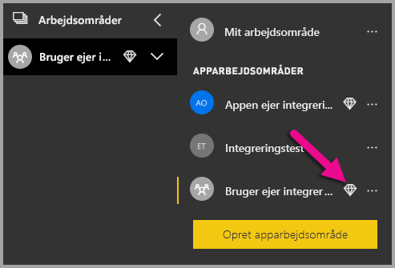

## <a name="admin-settings"></a>Administratorindstillinger

Globale administratorer, eller Power BI-tjenesteadministratorer, kan slå muligheden for at bruge REST-API'erne til eller fra for en lejer. Power BI-administratorer kan angive denne indstilling for hele organisationen eller for enkelte sikkerhedsgrupper. Den er som standard aktiveret for hele organisationen. Du kan foretage disse ændringer i [Power BI-administrationsportalen](../service-admin-portal.md).

## <a name="next-steps"></a>Næste trin

I dette selvstudium har du fået at vide, hvordan du integrerer Power BI-indhold i et program ved hjælp af din Power BI-organisationskonto. Nu kan du prøve at integrere Power BI-indhold i et program ved hjælp af apps. Du kan også prøve at integrere Power BI-indhold for dine kunder (understøttes endnu ikke til integrering af sideinddelte rapporter):

> [!div class="nextstepaction"]
> [Integrer fra apps](embed-from-apps.md)

> [!div class="nextstepaction"]
>[Integrer indhold for dine kunder](embed-sample-for-customers.md)

Hvis du har flere spørgsmål, kan du [prøve at spørge Power BI-community'et](https://community.powerbi.com/).
