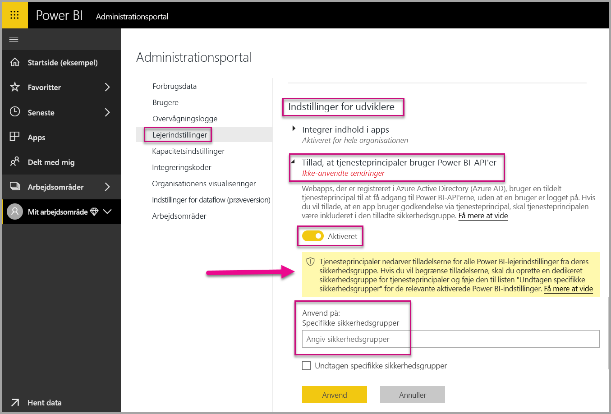
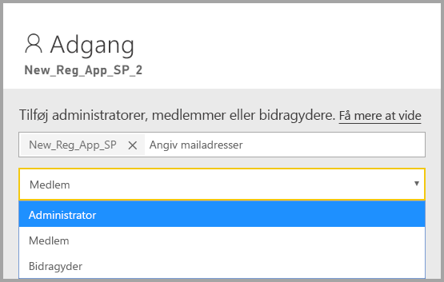
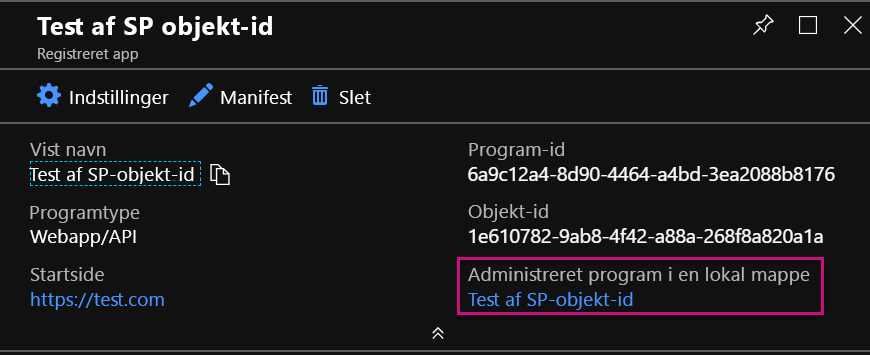
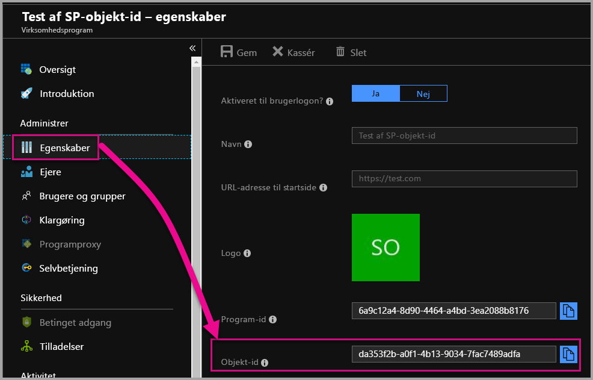

# <a name="service-principal-with-power-bi"></a>Tjenesteprincipal med Power BI

Med en **tjenesteprincipal** kan du integrere Power BI-indhold i et program og bruge automatisering med Power BI ved hjælp af et **kun program**-token. En tjenesteprincipal er nyttig, når du bruger **Power BI Embedded**, eller når du **automatiserer Power BI-opgaver og -processer**.

Når du arbejder med Power BI Embedded, er der fordele ved at bruge en tjenesteprincipal. En af de primære fordele er, at du ikke behøver en masterkonto (Power BI Pro-licens, der blot er et brugernavn og adgangskode til at logge på med) til at godkende dit program. En tjenesteprincipal bruger et program-id og en programhemmelighed til at godkende programmet.

Når du arbejder på at automatisere Power BI-opgaver, kan du også oprette et script for den måde, du vil behandle og administrere tjenesteprincipalerne på i forbindelse med skalering.

## <a name="application-and-service-principal-relationship"></a>Relation mellem program og tjenesteprincipal

For at få adgang til ressourcer, der sikrer en Azure AD-lejer, repræsenterer den enhed, der kræver adgang, en sikkerhedskonto. Denne handling gør sig gældende for både brugere (brugerens hovednavn) og programmer (tjenesteprincipal).

Sikkerhedskontoen definerer adgangspolitikken og tilladelserne for brugere og programmer i Azure AD-lejeren. Denne adgangspolitik aktiverer kernefunktioner, såsom godkendelse af brugere og programmer i forbindelse med logon og autorisation i forbindelse med ressourceadgang. Du kan finde flere oplysninger i artiklen [Program og tjenesteprincipal i Azure Active Directory (AAD)](https://docs.microsoft.com/azure/active-directory/develop/app-objects-and-service-principals).

Når du registrerer et Azure AD-program på Azure Portal, oprettes der to objekter i din Azure AD-lejer:

* Et [objekt for programmet](https://docs.microsoft.com/azure/active-directory/develop/app-objects-and-service-principals#application-object)
* Et [objekt for tjenesteprincipalen](https://docs.microsoft.com/azure/active-directory/develop/app-objects-and-service-principals#service-principal-object)

Anse objektet for programmet for at være den *globale* repræsentation af dit program, som skal bruges på tværs af alle lejere, og objektet for tjenesteprincipalen for at være den *lokale* repræsentation, som skal bruges i en bestemt lejer.

Objektet for programmet fungerer som den skabelon, hvorfra fælles egenskaber og standardegenskaber, som skal bruges i forbindelse med oprettelse af tilsvarende objekter for tjenesteprincipalen, *afledes*.

Der kræves en tjenesteprincipal for hver lejer, hvor programmet bruges. Det gør det muligt at etablere en identitet til logon og adgang til ressourcer, som er sikret af lejeren. Et program af typen enkelt lejer har kun én tjenesteprincipal (i sin startlejer), som blev oprettet og godkendt til brug under registreringen af programmet.

## <a name="service-principal-with-power-bi-embedded"></a>Tjenesteprincipal med Power BI Embedded

Med en tjenesteprincipal kan du maskere oplysningerne om din masterkonto i dit program ved hjælp af et program-id og en programhemmelighed. Du behøver ikke længere at bruge hårdkodning for din masterkonto i dit program for at kunne godkende.

Da **Power BI-API'erne** og **Power BI .NET SDK** nu understøtter kald ved hjælp af en tjenesteprincipal, kan du bruge [REST API'erne til Power BI](https://docs.microsoft.com/rest/api/power-bi/) med en tjenesteprincipal. Du kan f.eks. foretage ændringer af arbejdsområder, såsom oprette arbejdsområder, tilføje eller fjerne brugere fra arbejdsområder og importere indhold i arbejdsområder.

Du kan kun bruge en tjenesteprincipal, hvis dine Power BI-artefakter og -ressourcer er gemt i det [nye Power BI-arbejdsområde](../service-create-the-new-workspaces.md).

## <a name="service-principal-vs-master-account"></a>Tjenesteprincipal i forhold til masterkonto

Der er forskelle mellem at bruge en tjenesteprincipal og en standardmasterkonto (Power BI Pro-licens) til godkendelse. I nedenstående tabel fremhæves nogle væsentlige forskelle.

| Funktion | Masterbrugerkonto <br> (Power BI Pro-licenser) | Tjenesteprincipal <br> (kun program-token) |
|------------------------------------------------------|---------------------|-------------------|
| Kan logge på Power BI-tjenesten  | Ja | Nej |
| Aktiveret på Power BI-administrationsportalen | Nej | Ja |
| [Fungerer sammen med arbejdsområder (v1)](../service-create-workspaces.md) | Ja | Nej |
| [Fungerer sammen med de nye arbejdsområder (v2)](../service-create-the-new-workspaces.md) | Ja | Ja |
| Man skal være administrator af et arbejdsområde, hvis det bruges med Power BI Embedded | Ja | Ja |
| Kan bruge REST API'er til Power BI | Ja | Ja |
| Der skal være en global administrator for at kunne oprettes | Ja | Nej |
| Kan installere og administrere en datagateway i det lokale miljø | Ja | Nej |

## <a name="get-started-with-a-service-principal"></a>Kom i gang med en tjenesteprincipal

I modsætning til den traditionelle brug af en masterkonto kræves der nogle få andre ting til konfigurationen, når tjenesteprincipalen (kun program-token) bruges. Du skal konfigurere det rette miljø for at komme godt i gang med tjenesteprincipalen (kun program-token).

1. [Registrer et serverbaseret webprogram](register-app.md) i Azure Active Directory (AAD), som skal bruges med Power BI. Når du har registreret et program, kan du hente et program-id, en programhemmelighed og et objekt-id for tjenesteprincipalen for at få adgang til dit Power BI-indhold. Du kan oprette en tjenesteprincipal med [PowerShell](https://docs.microsoft.com/powershell/azure/create-azure-service-principal-azureps?view=azps-1.1.0).

    Nedenfor er et eksempel på et script, der kan bruges til at oprette et nyt program til Azure Active Directory.

    ```powershell
    # The app id - $app.appid
    # The service principal object id - $sp.objectId
    # The app key - $key.value

    # Sign in as a user that is allowed to create an app.
    Connect-AzureAD

    # Create a new AAD web application
    $app = New-AzureADApplication -DisplayName "testApp1" -Homepage "https://localhost:44322" -ReplyUrls "https://localhost:44322"

    # Creates a service principal
    $sp = New-AzureADServicePrincipal -AppId $app.AppId

    # Get the service principal key.
    $key = New-AzureADServicePrincipalPasswordCredential -ObjectId $sp.ObjectId
    ```

   > [!Important]
   > Når du aktiverer en tjenesteprincipal, der skal bruges med Power BI, er AD-tilladelserne for programmet ikke længere gældende. Tilladelserne for programmet administreres derefter via Power BI-administrationsportalen.

2.  **Anbefalet** – Opret en sikkerhedsgruppe i Azure Active Directory (AAD), og føj det [program](https://docs.microsoft.com/azure/active-directory/develop/app-objects-and-service-principals), du oprettede, til denne sikkerhedsgruppe. Du kan oprette en AAD-sikkerhedsgruppe med [PowerShell](https://docs.microsoft.com/powershell/azure/create-azure-service-principal-azureps?view=azps-1.1.0).

    Nedenfor er et eksempel på et script, der kan bruges til at oprette en ny sikkerhedsgruppe og føje et program til denne sikkerhedsgruppe.

    ```powershell
    # Required to sign in as a tenant admin
    Connect-AzureAD

    # Create an AAD security group
    $group = New-AzureADGroup -DisplayName <Group display name> -SecurityEnabled $true -MailEnabled $false -MailNickName notSet

    # Add the service principal to the group
    Add-AzureADGroupMember -ObjectId $($group.ObjectId) -RefObjectId $($sp.ObjectId)
    ```

3. Som Power BI-administrator skal du aktivere tjenesteprincipalen under **Indstillinger for udvikler** på Power BI-administrationsportalen. Føj den sikkerhedsgruppe, du oprettede i Azure AD, til det specifikke afsnit for sikkerhedsgruppen under **Indstillinger for udvikler**. Du kan også aktivere adgang til tjenesteprincipal for hele organisationen. I så fald er trin 2 ikke nødvendig.

   > [!Important]
   > Tjenesteprincipaler har adgang til alle lejerindstillinger, der er aktiveret for hele organisationen eller aktiveret for sikkerhedsgrupper, der har tjenesteprincipaler som en del af gruppen. Hvis du vil begrænse tjenesteprincipalens adgang til specifikke lejerindstillinger, skal du kun tillade adgang til specifikke sikkerhedsgrupper eller oprette en dedikeret sikkerhedsgruppe for tjenesteprincipaler og ekskludere den pågældende tjenesteprincipal.

    

4. Konfigurer dit [Power BI-miljø](embed-sample-for-customers.md#set-up-your-power-bi-environment).

5. Tilføj tjenesteprincipalen som **administrator** til det nye arbejdsområde, du har oprettet. Du kan administrere denne opgave via [API'erne](https://docs.microsoft.com/rest/api/power-bi/groups/addgroupuser) eller Power BI-tjenesten.

    

6. Du kan nu vælge at integrere indhold i et eksempelprogram eller i dit eget program.

    * [Integrer indhold ved hjælp af eksempelprogrammet](embed-sample-for-customers.md#embed-content-using-the-sample-application)
    * [Integrer indhold i dit program](embed-sample-for-customers.md#embed-content-within-your-application)

7. Nu er du klar til at [begynde at producere noget](embed-sample-for-customers.md#move-to-production).

## <a name="migrate-to-service-principal"></a>Migrer til tjenesteprincipalen

Du kan migrere for at bruge en tjenesteprincipal, hvis du i øjeblikket bruger en masterkonto med Power BI eller Power BI Embedded.

Fuldfør de tre første trin i afsnittet [Kom i gang med en tjenesteprincipal](#get-started-with-a-service-principal), og følg nedenstående oplysninger, når processen er fuldført.

Hvis du allerede bruger de [nye arbejdsområder](../service-create-the-new-workspaces.md) i Power BI, skal du tilføje tjenesteprincipalen som **administrator** til arbejdsområderne med dine Power BI-artefakter. Hvis du derimod bruger de [traditionelle arbejdsområder](../service-create-workspaces.md), skal du kopiere eller flytte dine Power BI-artefakter og -ressourcer til de nye arbejdsområder og derefter tilføje tjenesteprincipalen som **administrator** til disse arbejdsområder.

Der er ingen funktion i brugergrænsefladen, som kan bruges til at flytte Power BI-artefakter og -ressourcer fra ét arbejdsområde til et andet, så du skal bruge [API'er](https://powerbi.microsoft.com/pt-br/blog/duplicate-workspaces-using-the-power-bi-rest-apis-a-step-by-step-tutorial/) til at udføre denne opgave. Når du bruger API'er med tjenesteprincipalen, har du brug for objekt-id'et for tjenesteprincipalen.

### <a name="how-to-get-the-service-principal-object-id"></a>Sådan får du objekt-id'et for tjenesteprincipalen

Hvis du vil tildele en tjenesteprincipal til et nyt arbejdsområde, skal du bruge [REST API'erne til Power BI](https://docs.microsoft.com/rest/api/power-bi/groups/addgroupuser). Hvis du vil henvise til en tjenesteprincipal for at udføre handlinger eller foretage ændringer, skal du bruge **objekt-id'et for tjenesteprincipalen**, f.eks. ved anvendelse af en tjenesteprincipal som administrator i et arbejdsområde.

Herunder finder du trin til at hente objekt'id'et for tjenesteprincipalen fra Azure Portal.

1. Opret en ny programregistrering på Azure Portal.  

2. Vælg derefter navnet på det program, du oprettede, under **Administreret program i lokal mappe**.

   

    > [!Note]
    > Objektet-id'et på billedet ovenfor er ikke det, der bruges med tjenesteprincipalen.

3. Vælg **Egenskaber** for at se objekt-id'et.

    

Nedenfor er et eksempel på et script, der kan bruges til at hente objekt-id'et for tjenesteprincipalen med PowerShell.

   ```powershell
   Get-AzureADServicePrincipal -Filter "DisplayName eq '<application name>'"
   ```

## <a name="considerations-and-limitations"></a>Overvejelser og begrænsninger

* Tjenesteprincipalen fungerer kun med [nye arbejdsområder](../service-create-the-new-workspaces.md).
* **Mit arbejdsområde** understøttes ikke til brug sammen med tjenesteprincipalen.
* Der kræves dedikeret kapacitet for at kunne begynde at producere.
* Du kan ikke logge på Power BI-portalen ved hjælp af en tjenesteprincipal.
* Der kræves rettigheder som Power BI-administrator for at kunne aktivere tjenesteprincipalen under Indstillinger for udvikler på Power BI-administrationsportalen.
* Du kan ikke installere eller administrere en datagateway i det lokale miljø ved hjælp af en tjenesteprincipal.
* Programmer til [integration i din organisation](embed-sample-for-your-organization.md) kan ikke bruge en tjenesteprincipal.
* Administration af [dataflow](../service-dataflows-overview.md) understøttes ikke.
* Tjenesteprincipaler understøtter i øjeblikket ingen administrator-API'er.

## <a name="next-steps"></a>Næste trin

* [Registrer et program](register-app.md)
* [Power BI Embedded til dine kunder](embed-sample-for-customers.md)
* [Objekter for et program og en tjenesteprincipal i Azure Active Directory](https://docs.microsoft.com/azure/active-directory/develop/app-objects-and-service-principals)
* [Sikkerhed på rækkeniveau ved hjælp af datagateway i det lokale miljø med tjenesteprincipal](embedded-row-level-security.md#on-premises-data-gateway-with-service-principal)
