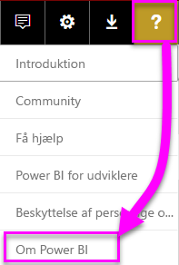
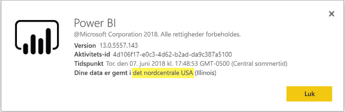

# <a name="frequently-asked-questions-about-power-bi-embedded"></a>Ofte stillede spørgsmål om Power BI Embedded

* Hvis du har andre spørgsmål, kan du [prøve at spørge Power BI-community'et](http://community.powerbi.com/).
* Har du stadig problemer? Gå til [supportsiden for Power BI](https://powerbi.microsoft.com/support/).

## <a name="general"></a>Generelt

### <a name="what-is-power-bi-embedded"></a>Hvad er Power BI Embedded?

Microsoft Power BI Embedded (PBIE) tillader programudviklere at integrere flotte, fuldt interaktive rapporter i programmer, uden at de skal bruge tid og penge på at oprette deres egne datavisualiseringer og -kontrolelementer fra bunden.

### <a name="who-is-the-target-audience-for-power-bi-embedded"></a>Hvem er målgruppen for Power BI Embedded?

Udviklere og softwarefirmaer, der fremstiller deres egne programmer, også kaldet uafhængige softwareleverandører (eller ISV'er).

### <a name="how-is-power-bi-embedded-different-from-power-bi-the-service"></a>Hvordan er Power BI Embedded anderledes end Power BI-tjenesten?

Power BI Embedded er beregnet til ISV'er eller udviklere, der fremstiller programmer og vil integrere visuals i disse programmer, der kan hjælpe deres kunder med at træffe beslutninger, uden at de skal bygge analyseløsninger op fra bunden. Integrerede analyser gør det muligt for virksomhedsbrugere at tilgå virksomhedsdata og udføre forespørgsler for at generere indsigter i at bruge disse data i programmet.

Power BI er på den anden side en såkaldt software-as-a-service-analyseløsning, der giver virksomheder et enkelt overblik over deres vigtigste virksomhedsdata.

### <a name="what-is-the-difference-between-power-bi-premium-and-power-bi-embedded"></a>Hvad er forskellen mellem Power BI Premium og Power BI Embedded?

Power BI Premium er kapacitetsmæssigt gearet mod virksomheder, som vil have en komplet BI-løsning, der giver adgang til en enkelt visning af virksomheden, kunderne og leverandørerne. Power BI Premium hjælper din virksomhed med at træffe beslutninger. Power BI Premium er et SaaS-produkt og giver mulighed for brugere at forbruge indhold gennem Power BI-portalen, mobil-app og gennem internt udviklede apps.

Power BI Embedded er beregnet til ISV'er eller udviklere, der fremstiller programmer, og som vil integrere visuals i de pågældende programmer. Power BI Embedded hjælper dine kunder med at træffe beslutninger, og fordi Power BI Embedded er beregnet til programudviklere, så kan kunderne af det pågældende program forbruge indhold lagret på Power BI Embedded-kapaciteter, herunder alle indenfor og udenfor virksomheden. Kapacitetsindhold i Power BI Embedded kan ikke deles gennem publicering med et enkelt klik til web eller publicering med et enkelt klik til SharePoint, og det understøtter ikke SSRS-rapporter.

### <a name="what-is-the-microsoft-recommendation-for-when-a-customer-should-buy-power-bi-premium-vs-power-bi-embedded"></a>Hvad anbefaler Microsoft, når en kunde står over for valget mellem Power BI Premium eller Power BI Embedded?

Microsoft anbefaler, at virksomheder køber Power BI Premium, en professionel, selvbetjent skybaseret BI-løsning, og at ISV'er køber Power BI Embedded, som er skybaserede integrerede analysekomponenter. Kunder kan dog købe begge produkter uden begrænsning.

Der kan være situationer, hvor en ISV (typisk en større) ønsker at bruge en P SKU for at få adgang til yderligere fordele i den færdigpakkede Power BI-tjenesten i virksomheden såvel som at integrere den i programmer. Desuden kan nogle virksomheder måske beslutte at bruge A SKU'er i Azure, hvis de kun er interesserede i at producere line-of-business-programmer og integrere analyser i dem uden interesse for at bruge den færdigpakkede Power BI-tjeneste.

### <a name="how-many-embed-tokens-can-i-create"></a>Hvor mange integrerede tokens kan jeg oprette?

Med en PRO-licens er integrerede tokens kun beregnet til udviklingstest, så antallet af integrerede tokens, der kan genereres fra en Power BI-masterkonto, er begrænset. Du skal [købe en kapacitet](#technical) for at kunne integrere i et produktionsmiljø. Der er ingen grænse for hvor mange integrerede tokens, du kan generere, når der er købt en kapacitet. Gå til [Tilgængelige funktioner](https://docs.microsoft.com/rest/api/power-bi/availablefeatures) for at undersøge den brugsværdi, der angiver brugen af integrerede tokens i procent.

## <a name="technical"></a>Tekniske spørgsmål

### <a name="what-is-the-difference-between-the-a-skus-in-azure-and-the-em-skus-in-office-365"></a>Hvad er forskellen mellem A SKU'erne i Azure og EM-SKU'erne i Office 365?

PowerBI.com er en virksomhedsløsning, der indeholder mange funktioner som f.eks. socialt samarbejde, mailabonnement, osv. i en SaaS-ydelse

Power BI Embedded er en række API'er, der er tilgængelige for udviklere til produktionen af integrerede analyseløsninger på en Platform-as-a-Service-tjeneste. I forbindelse med scenarier i relation til integrerede analyser skal PowerBI.com bruges til at hjælpe ISV'er og udviklere med at administrere deres integrerede analyseløsningsindhold og indstillinger på lejerniveau.

Her er en delvis liste over forskelle, som du kan bruge i hver.

| Udvalgt | Power BI Embedded | Power BI Premium-kapacitet | Power BI Premium-kapacitet |
|----------------------------------------------------------------------------------|-------------------|---------------------------|---------------------------|
|   | (A-SKU'er) | (EM-SKU'er) | (P-SKU'er) |
| Integrer artefakter fra arbejdsområder i en Power BI-app | Azure-kapacitet | Office 365-kapacitet | Office 365-kapacitet |
| Forbrug Power BI-rapporter i en integreret app | Ja | Ja | Ja |
| Forbrug Power BI-rapporter i SharePoint | Nej | Ja | Ja |
| Forbrug Power BI-rapporter i Dynamics | Nej | Ja | Ja |
| Forbrug Power BI-rapporter i Teams (omfatter ikke mobilapp) | Nej | Ja | Ja |
| Få adgang til indhold med en GRATIS Power BI-licens på Powerbi.com og i Power BI Mobile | Nej | Nej | Ja |
| Få adgang til indhold med en GRATIS Power BI-licens integreret i MS Office-apps | Nej | Ja | Ja |

### <a name="power-bi-now-offers-three-skus-for-embedding-a-skus-em-skus-and-p-skus-which-one-should-i-purchase-for-my-scenario"></a>Power BI omfatter nu tre SKU'er til integration: A-SKU'er og P-SKU'er. Hvilken skal jeg købe til mit scenarie?

|  |A-SKU (Power BI Embedded)  |EM-SKU (Power BI Premium)  |P-SKU (Power BI Premium)  |
|---------|---------|---------|---------|
|Køb  |Azure-portal |Office |Office |
|Use cases | Integrer indhold i din egen app | <li> Integrer indhold i din egen app <br><br></br> <li> Integrer indhold i MS Office-programmer: <br> - [SharePoint](https://powerbi.microsoft.com/blog/integrate-power-bi-reports-in-sharepoint-online/) <br> - [Teams (omfatter ikke mobilapp)](https://powerbi.microsoft.com/blog/power-bi-teams-up-with-microsoft-teams/) <br> - [Dynamics 365](https://docs.microsoft.com/en-us/dynamics365/customer-engagement/basics/add-edit-power-bi-visualizations-dashboard) | <li> Integrer indhold i din egen app <br><br></br> <li> Integrer indhold i MS Office-programmer: <br> - [SharePoint](https://powerbi.microsoft.com/blog/integrate-power-bi-reports-in-sharepoint-online/) <br> - [Teams (omfatter ikke mobilapp)](https://powerbi.microsoft.com/blog/power-bi-teams-up-with-microsoft-teams/) <br> - [Dynamics 365](https://docs.microsoft.com/en-us/dynamics365/customer-engagement/basics/add-edit-power-bi-visualizations-dashboard) <br><br></br> <li> Del indhold med Power BI-brugere via [Power BI-tjenesten](https://powerbi.microsoft.com/en-us/)  |
|Fakturering |Pr. time |Månedlig |Månedlig |
|Tilsagn  |Intet tilsagn |Årligt  |Månedligt/årligt |
|Differentiering |Fuld elasticitet, kan skaleres op / ned, pausestille / genoptage ressourcer i Azure-portalen eller gennem API  |Kan bruges til at integrere indhold i SharePoint Online og Microsoft Teams (omfatter ikke mobilapp) |Kombiner integration i programmer og brug Power BI-tjenesten i den samme egenskab |

### <a name="what-are-the-prerequisites-to-create-a-pbie-capacity-in-azure"></a>Hvad er forudsætningerne for at oprette en PBIE-kapacitet i Azure? 

* Du skal logge på din organisationsmappe (MSA-konti understøttes ikke).
* Du skal have en Power BI-lejer, dvs. at mindst én bruger i din mappe har tilmeldt sig Power BI. 
* Du skal have et Azure-abonnement i din organisationsmappe.

### <a name="how-can-i-monitor-capacity-consumption"></a>Hvordan kan jeg overvåge kapacitetsforbrug?

Overvågning vha. Azure er omfattet af køreplanen på kort sigt. Azure-ressourcen, Power BI Embedded, vil omfatte overvågning af KPI'er, der vli vise tilstand og brug.

### <a name="will-my-capacity-scale-automatically-to-adjust-to-the-consumption-of-my-app"></a>Vil min kapacitetsskala automatisk justere iht. forbruget af min app?

Selvom der ikke er nogen skalering nu, så er alle API'erne tilgængelige for skalering når som helst.

### <a name="why-creatingscalingresuming-a-capacity-results-in-putting-the-capacity-into-a-suspended-state"></a>Hvorfor afbrydes kapaciteten midlertidigt, når man opretter/skalerer/genoptager en kapacitet?

Klargøring af en kapacitet (skalering/genoptagelse/oprettelse) kan mislykkes. Den, som kalder klargøringsopkaldet, skal kontrollere en kapacitets ProvisioningState med Få oplysninger om API: [Kapaciteter – Få oplysninger](https://docs.microsoft.com/rest/api/power-bi-embedded/capacities/getdetails).

### <a name="why-can-i-only-create-pbie-in-a-specific-region"></a>Hvorfor kan jeg kun oprette PBIE i et bestemt område?

Du kan kun oprette PBIE-kapaciteter for dit PBI-lejerområder.

### <a name="how-can-i-find-what-is-my-pbi-tenant-region"></a>Hvordan kan jeg se mit PBI-lejerområde?

Du kan bruge PBI-portalen til at finde ud af, hvad er dit PBI-lejerområde er.

https://app.powerbi.com/ > ? > Om Power BI




### <a name="what-is-supported-with-the-communicating-sequential-processes-csp-channel"></a>Hvad understøttes med CSP-kanalen (kommunikerende sekventielle processer)?

* Du kan oprette PBIE for din lejer med abonnementstype CSP
* Partnerkonto kan logge på kundelejer og købe PBIE for kundelejeren, angive kundelejerbruger som administrator af Power BI-kapacitet

### <a name="why-do-i-get-an-unsupported-account-message"></a>Hvorfor får jeg en meddelelse om en ikke-understøttet konto?

Power BI kræver, at du tilmelder dig med en organisationskonto. Forsøg på at tilmelde sig til Power BI med en MSA (Microsoft-konto) understøttes ikke.

### <a name="can-i-use-apis-to-create--manage-azure-capacities"></a>Kan jeg bruge API'er til at oprette og administrere Azure-kapaciteter?

Ja. Der er Powershell-cmdlet'er og ARM-API'er (Azure Resource Manager), du kan bruge til at oprette og administrere PBIE ressourcer.

* Rest API'er – https://docs.microsoft.com/rest/api/power-bi-embedded/
* PowerShell-cmdlet'er – https://docs.microsoft.com/powershell/module/azurerm.powerbiembedded/

### <a name="what-is-the-pbi-embedded-dedicated-capacity-role-in-a-pbi-embedded-solution"></a>Hvilken rolle har PBI's integrerede dedikerede kapacitet i en PBI-integreret løsning?

For at [gøre din løsning produktionsklar](https://docs.microsoft.com/en-us/power-bi/developer/embedding-content#step-3-promote-your-solution-to-production) har du brug for Power BI-indhold (apparbejdsområde, du bruger i din app, der skal tildeles til Power BI Embedded-kapacitet (A SKU)).

### <a name="what-are-the-azure-regions-pbi-embedded-is-available"></a>Hvilke Azure-områder er tilgængelige i PBI integreret?

[PAM](https://ecosystemmanager.azurewebsites.net/home) (EcoManager) – se produkttilgængelighedsstyringen

Tilgængelige områder (16 – samme områder som Power BI)
* USA (6) – Det østlige USA, Det østlige USA 2, Det nordcentrale USA, Det sydcentrale USA, Det vestlige USA, Det vestlige USA 2
* Europa (2) – Det nordlige Europa, Det vestlige Europa
* Asien og Stillehavsområdet (2) – Det sydøstlige Asien, Det østlige Asien
* Brasilien (1) – Det sydlige Brasilien
* Japan (1) – Østjapan
* Australien (1) – Det sydøstlige Australien
* Indien (1) – Vestindien
* Canada (1) – Det centrale Canada
* Storbritannien (1) – Det sydlige Storbritannien

### <a name="what-is-the-authentication-model-for-power-bi-embedded"></a>Hvilken godkendelsesmodel benyttes i Power BI Embedded?

Power BI Embedded vil fortsat bruge Azure AD til godkendelse af master-brugeren (en udpeget Power BI Pro-licenseret bruger), der godkender programmet internt i Power BI.

Godkendelse og godkendelse af programbrugerne bliver implementeret af ISV'en, ISV'en kan implementere sin egen godkendelse til sine programmer.

Hvis du allerede har en Azure AD-lejer, kan du bruge din eksisterende mappe, eller du kan oprette en ny Azure AD-lejer med henblik på at sørge for dit integrerede programindholds sikkerhed.

Hvis du skal have et AAD-token, kan du bruge et af Azure Active Directory-godkendelsesbibliotekerne – https://docs.microsoft.com/en-us/azure/active-directory/develop/active-directory-authentication-libraries. Der er klientbiblioteker til flere platforme.

### <a name="my-application-already-uses-aad-for-user-authentication-how-can-we-use-this-identity-when-authenticating-to-power-bi-in-a-user-owns-data-scenario"></a>Mit program allerede bruger AAD til brugergodkendelse. Hvordan kan vi bruge dette id til godkendelse til Power BI i et scenarie, hvor "Bruger ejer Data"? 

Det er standard OAuth på vegne af flow (https://docs.microsoft.com/en-us/azure/active-directory/develop/active-directory-authentication-scenarios#web-application-to-web-api) programmet skal være konfigureret til at kræve tilladelser til Power BI-tjenesten (med de påkrævede områder), og når du har et bruger-token til din app, skal du bare kalde ADAL API AcquireTokenAsync ved hjælp af brugeradgangstoken og angive Power BI-ressourcens URL-adresse ressource-id. Se kodestykke nedenfor, der viser, hvordan dette kan gøres:

```csharp
var context = new AD.AuthenticationContext(authorityUrl);
var userAssertion = new AD.UserAssertion(userAccessToken);
var clientAssertion = new AD.ClientAssertionCertificate(MyAppId, MyAppCertificate)
var authenticationResult = await context.AcquireTokenAsync(resourceId, clientAssertion, userAssertion);
```

### <a name="how-is-power-bi-embedded-different-from-other-azure-services"></a>Hvordan er Power BI Embedded anderledes end andre Azure-tjenester?

ISV'en/udvikleren skal have en Power BI-konto før købet af Power BI Embedded i Azure. Power BI Embedded-installationens område bestemmes af din Power BI-konto. Administrer din Power BI Embedded-ressource i Azure for at:

* Skalere op/ned
* Tilføje kapacitetsadministratorer
* Pausestille/genoptage tjenesten

Brug PowerBI.com til at tildele/fjerne tildelte arbejdsområder fra Power BI Embedded-kapaciteten.

### <a name="what-deploy-regions-are-supported"></a>Hvilke installationsområder understøttes?

Det sydøstlige Australien, det sydlige Brasilien, det centrale Canada, det østlige USA 2, det vestlige Indien, det østlige Japan, det nordlige-centrale USA, det nordlige Europa, det sydlige-centrale USA, Sydøstasien, det sydlige Storbritannien, Vesteuropa, det vestlige USA og det vestlige USA 2.

### <a name="what-type-of-content-pack-data-can-be-embedded"></a>Hvilken type indholdspakke med data kan integreres?

**Dashboards** og **felter**, der er bygget på baggrund af indholdspakker med datasæt *kan ikke* integreres, men **rapporter** bygget på baggrund af en indholdspakke med datasæt *kan* godt integreres.

## <a name="licensing"></a>Licensering

### <a name="how-do-i-purchase-power-bi-embedded"></a>Hvordan køber jeg Power BI Embedded?

Power BI Embedded fås gennem Azure.

### <a name="what-happens-if-i-already-purchased-power-bi-premium-and-now-i-want-some-of-the-benefits-of-power-bi-embedded-in-azure"></a>Hvad sker der, hvis jeg allerede har købt Power BI Premium, og jeg nu vil have nogle af fordelene i Power BI Embedded i Azure?

Kunder vil fortsætte med at betale for alle eksisterende Power BI Premium-køb, indtil udløbet af deres aktuelle aftaleperiode og kan derefter skifte deres Power BI Premium-køb ud efter behov på det pågældende tidspunkt.

### <a name="do-i-still-have-to-buy-power-bi-premium-to-get-access-to-power-bi-embedded"></a>Er jeg stadig nødt til at købe Power BI Premium for at få adgang til Power BI Embedded?

Nej, Power BI Embedded omfatter Azure-baseret kapacitet, som du skal bruge for at installere og distribuere løsningen til kunder.

### <a name="whats-the-purchase-commitment-for-power-bi-embedded"></a>Hvilke købsbindinger er knyttet til Power BI Embedded? 

Kunder kan ændre deres brug på timebasis. Der er ingen månedlig eller årlig binding knyttet til Power BI Embedded-tjenesten.

### <a name="how-does-the-usage-of-power-bi-embedded-show-up-on-my-bill"></a>Hvordan vises forbruget af Power BI Embedded på min regning?

Power BI Embedded fakturerer på en forudsigelig timebaseret rate baseret på typen af node(r), der er installeret. Bemærk, at så længe ressourcen er aktiv, faktureres du, selvom der ikke er noget forbrug. For at stoppe faktureringen skal du aktivt afbryde din ressource.

### <a name="who-needs-a-power-bi-pro-license-for-power-bi-embedded-and-why"></a>Hvem har brug for et Power BI Pro-licens til Power BI Embedded og hvorfor?

Det er obligatorisk for alle analytikere, der skal føje rapporter til et Power BI-arbejdsområde, for alle udviklere, der skal bruge REST API'er, for alle lejer-administratorer, der skal administrere Power BI-lejeren og -kapacitet at have en Power BI Pro-licens.

Idet Power BI Embedded tillader brugen af Power BI-portalen til administration og validering af integreret indhold, så er Power BI Pro-licens påkrævet for at godkende App'en internt i PowerBI.com for at få adgang til rapporter i de korrekte lagre.

Men hvis du vil [oprette/redigere integrerede rapporter](https://github.com/Microsoft/PowerBI-JavaScript/wiki/Create-Report-in-Embed-View) i dit eget program, behøver slutbrugeren ikke en Pro-licens, da det ikke er et krav, at slutbrugeren er Power BI-bruger.

### <a name="can-i-get-started-for-free"></a>Kan jeg komme i gang gratis?

Ja, du kan bruge din [Azure-kredit](https://azure.microsoft.com/free/) til Power BI Embedded.

### <a name="can-i-get-a-trial-experience-for-power-bi-embedded-in-azure"></a>Kan jeg få adgang til en prøveversion af Power BI Embedded i Azure?

Idet Power BI Embedded er en del af Azure, er det muligt at bruge tjenesten med [USD200 kreditten, der modtages ved tilmeldingen til Azure](https://azure.microsoft.com/free/).

### <a name="is-power-bi-embedded-available-for-sovereign-clouds-us-government-germany-china"></a>Er Power BI Embedded tilgængelig for suveræne cloudløsninger (den amerikanske regering, Tyskland, Kina)?

Power BI Embedded er tilgængelig for visse [suveræne cloudløsninger](embed-sample-for-customers-sovereign-clouds.md). Det er stadig **IKKE** tilgængeligt for cloudløsninger i Kina.

### <a name="is-power-bi-embedded-available-for-non-profits-and-educational"></a>Er Power BI Embedded tilgængelig for almennyttige organisationer og uddannelsesinstitutioner?

Almennyttige organisationer og uddannelsesinstitutioner kan købe Azure. Der er ingen særlige priser for disse typer kunder i Azure.

## <a name="power-bi-workspace-collection"></a>Power BI Workspace Collection

### <a name="what-is-power-bi-workspace-collection"></a>Hvad er Power BI Workspace Collection?

**Power BI Workspace Collection** (**Power BI Embedded** Version 1) er en løsning, der er baseret på Azure-ressourcen **Power BI Workspace Collection**. Denne løsning gør det muligt at oprette **Power BI Embedded**-programmer til dine kunder ved hjælp af Power BI-indhold under **Power BI Workspace Collection**-løsningen, dedikerede-API'er og nøgler til arbejdsområdesamlinger til godkendelse af programmet til Power BI.

### <a name="can-i-migrate-from-power-bi-workspace-collection-to-power-bi-embedded"></a>Kan jeg overføre indhold fra Power BI Workspace Collection til Power BI Embedded?

1. Du kan bruge overførselsværktøjet til at klone indhold fra **Power BI Workspace Collection** til Power BI – https://docs.microsoft.com/power-bi/developer/migrate-from-powerbi-embedded#content-migration.

2. Start med den **Power BI Embedded**-program-POC, der bruger Power BI-indhold.

3. Når du er klar til produktion, skal du købe en **Power BI Embedded**-dedikeret kapacitet og tildele dit Power BI-indhold (arbejdsområde) til denne kapacitet.

> [!Note]
> Du kan fortsætte med at bruge **Power BI Workspace Collection**, når du opretter parallelt med en **Power BI Embedded**-løsning. Når du er klar, kan du flytte kunden til den nye **Power BI Embedded**-løsning og lade **Power BI Workspace Collection**-løsningen udgå.

Du kan finde flere oplysninger under [Sådan overfører du indhold fra Power BI Workspace Collection til Power BI Embedded](https://docs.microsoft.com/power-bi/developer/migrate-from-powerbi-embedded)

### <a name="is-power-bi-workspace-collection-on-a-path-to-be-deprecated"></a>Frarådes det senere at bruge Power BI Workspace Collection på en sti?

Ja, men kunder, der allerede bruger **Power BI Workspace Collection**-løsningen, kan fortsætte med at bruge den, indtil det frarådes. Kunder kan også oprette nye arbejdsområdesamlinger og **Power BI Embedded**-programmer, der stadig bruger **Power BI Workspace Collection**-løsningen.

Det betyder dog også, at der ikke føjes nye funktioner til **Power BI Workspace Collection**-løsninger, og at kunder opfordres til at planlægge overførsel af deres data til den nye **Power BI Embedded**-løsning.
### <a name="when-will-power-bi-workspace-collection-support-be-discontinued"></a>Hvornår ophører support til Power BI Workspace Collection?

Kunder, der allerede bruger **Power BI Workspace Collections**-løsningen, kan fortsætte med at bruge den indtil udgangen af juni 2018 eller indtil udgangen af deres supportaftale.

### <a name="in-what-regions-can-pbi-workspace-collection-be-created"></a>I hvilke områder kan der oprettes PBI Workspace Collection?

De tilgængelige områder er det sydøstlige Australien, det sydlige Brasilien, det centrale Canada, det østlige USA 2, det østlige Japan, det nordcentrale USA, det nordlige Europa, det sydcentrale USA, Sydøstasien, det sydlige Storbritannien, det vestlige Europa, det vestlige Indien og det vestlige USA.

### <a name="why-should-i-migrate-from-pbi-workspace-collection-to-power-bi-embedded"></a>Hvorfor skal jeg overføre indhold fra PBI Workspace Collection til Power BI Embedded?

Der er nye funktioner og egenskaber, som introduceres i **Power BI Embedded**-løsningen, som ikke findes i **Power BI Workspace Collection**.

Nogle af funktionerne er:
* Alle PBI-datakilder understøttes i modsætning til de 2 datakilder, der er inkluderet i **Power BI Workspace Collection**). 
* Nye funktioner, f.eks. Spørgsmål og svar, opdatering, bogmærker, integrering af dashboards og felter, brugerdefinerede menuer, understøttes kun i **Power BI Embedded**-løsningen.
* Model for fakturering af kapacitet.

## <a name="onboarding-experience-tool-for-embedding"></a>Onboarding Experience Tool til integration

### <a name="what-is-the-onboarding-experience-tool"></a>Hvad er Onboarding Experience Tool?

Med [Onboarding Experience Tool](https://aka.ms/embedsetup) kan du hurtigt komme i gang og downloade en eksempelapp for at komme i gang med at integrere med Power BI.

### <a name="which-solution-should-i-choose"></a>Hvilken løsning skal jeg vælge?

* [Embedding for your customers](embedding.md#embedding-for-your-customers) giver mulighed for at integrere dashboards og rapporter for de brugere, der ikke har en Power BI-konto. Kør løsningen [Embed for your customers](https://aka.ms/embedsetup/AppOwnsData).
* Med [Embedding for your organization](embedding.md#embedding-for-your-organization) kan du udvide Power BI-tjenesten. Kør løsningen [Embed for your organization](https://aka.ms/embedsetup/UserOwnsData).

### <a name="ive-downloaded-the-sample-app-which-solution-do-i-choose"></a>Jeg har downloadet eksempelappen. Hvilken løsning skal jeg vælge?

Hvis du arbejder med **Embed for your customers**, skal du gemme og udpakke filen *PowerBI-Developer-Samples.zip*. Derefter skal du åbne mappen *PowerBI-Developer-Samples-master\App Owns Data* og køre filen *PowerBIEmbedded_AppOwnsData.sln*.

Hvis du arbejder med **Embed for your organization**, skal du gemme og udpakke filen *PowerBI-Developer-Samples.zip*. Derefter skal du åbne mappen *PowerBI-Developer-Samples-master\User Owns Data\integrate-report-web-app* og køre filen *pbi-saas-embed-report.sln*.

### <a name="how-can-i-edit-my-registered-application"></a>Hvordan kan jeg redigere min registrerede app?

Du kan se, hvordan du redigerer AAD-registrerede apps [her](https://docs.microsoft.com/azure/active-directory/develop/active-directory-integrating-applications#updating-an-application).

### <a name="how-can-i-edit-my-power-bi-user-profile-or-data"></a>Hvordan kan jeg redigere Power BI-brugerprofilen eller -dataene?

Du kan se, hvordan du redigerer dine Power BI-data, [her](https://docs.microsoft.com/en-us/power-bi/service-basic-concepts).

Du kan finde flere oplysninger under [Fejlfinding af det integrerede program](embedded-troubleshoot.md)

Har du flere spørgsmål? [Prøv at spørge Power BI-community'et](http://community.powerbi.com/)
