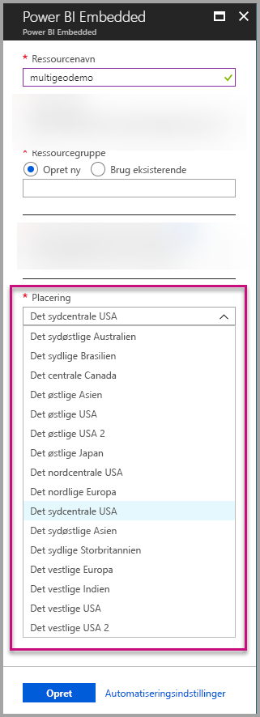
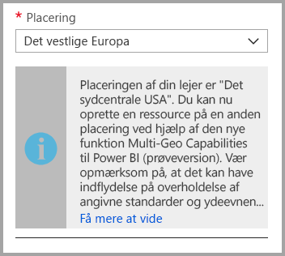
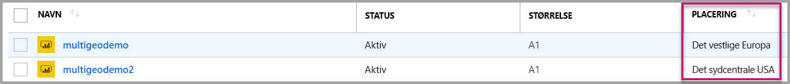
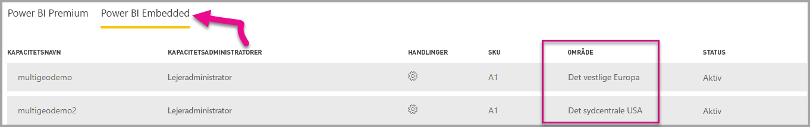

# Multi-Geo-understøttelse af Power BI Embedded

**Multi-Geo-understøttelse af Power BI Embedded** betyder, at ISV'er og organisationer, der bygger programmer ved at bruge Power BI Embedded til at integrere analyser i deres apps, nu kan udrulle deres data i forskellige områder over hele verden.

Nu kan kunder, der bruger **Power BI Embedded**, konfigurere en **A-kapacitet** ved hjælp af indstillinger for **Multi-Geo** baseret på de samme funktioner og begrænsninger, som [Power BI Premium understøtter ved hjælp af Multi-Geo](../service-admin-premium-Multi-Geo.md).

## Opret ny ressource til Power BI Embedded-kapacitet med Multi-Geo

På skærmen **Opret ressource** skal du vælge placeringen af din kapacitet. Indtil nu har det været begrænset til placeringen af din Power BI-lejer, så der har kun været en enkelt placering tilgængelig. Med Multi-Geo kan du vælge mellem forskellige områder til udrulning af din kapacitet.

Bemærk, at når du åbner rullemenuen for placeringer, er din lokale lejer valgt som standard.
  

Når du vælger en anden placering, bliver du bedt om at bekræfte valget.

## Få vist kapacitetsplacering

Du kan nemt se placeringen af dine kapaciteter, når du går til hovedadministrationssiden i Power BI Embedded på Azure-portalen.

Det er også tilgængeligt på administrationsportalen på Powerbi.com. Vælg "Kapacitetsindstillinger" på administrationsportalen, og skift derefter til fanen "Power BI Embedded".

[Få mere at vide om at oprette kapaciteter med Power BI Embedded.](azure-pbie-create-capacity.md)

## Administrer placeringen af eksisterende kapaciteter

Du kan ikke ændre placeringen af en Power BI Embedded-ressource, når du har oprettet en ny kapacitet.

Hvis du vil flytte dit Power BI-indhold til et andet område, skal du følge disse trin:

1. [Opret en ny kapacitet](azure-pbie-create-capacity.md) i et andet område.

2. Tildel alle arbejdsområder fra den eksisterende kapacitet til den nye kapacitet.

3. Slet den gamle kapacitet, eller afbryd den midlertidigt.

Det er vigtigt at bemærke, at hvis du beslutter at slette en kapacitet uden at tildele indholdet, flyttes alt indholdet i den pågældende kapacitet til en delt kapacitet, som er i dit lokale område.

## API-understøttelse af Multi-Geo

Vi har foretaget nogle ændringer af eksisterende API'er for at understøtte administration af kapaciteter med Multi-Geo via API:

1. **[Hent kapaciteter](https://docs.microsoft.com/rest/api/power-bi/capacities/getcapacities)** –API'en returnerer en liste over kapaciteter med adgang til brugeren. Svaret omfatter nu endnu en egenskab, der kaldes "region", som angiver placeringen af kapaciteten.

2. **[Tildel til kapacitet](https://docs.microsoft.com/rest/api/power-bi/capacities)** – API'en gør det muligt at tildele et givent arbejdsområde til en kapacitet. Denne handling tillader ikke, at du tildeler arbejdsområder til en kapacitet uden for dit lokale område eller flytter arbejdsområder mellem kapaciteter i forskellige områder. For at udføre denne handling skal brugeren eller [tjenesteprincipalen](embed-service-principal.md) stadig have administratortilladelser til arbejdsområdet og administrator- eller tildelingstilladelser til målkapaciteten.

3. **[Azure Resource Manager-API](https://docs.microsoft.com/rest/api/power-bi-embedded/capacities)** – Alle Azure Resource Manager-API-handlinger, herunder *Opret* og *Slet*, understøtter Multi-Geo.

## Begrænsninger og overvejelser

* Bekræft, at alle flytninger, du foretager mellem områder, overholder alle forretningsmæssige og offentlige bestemmelser, før du starter dataoverførslen.

* En cachelagret forespørgsel, der er gemt i et fjernområde, forbliver i dette område som inaktive data. Men andre data, der overføres, kan føres frem og tilbage mellem forskellige geografiske områder.

* Når du flytter data fra ét område til et andet i et Multi-Geo-miljø, kan kildedataene forblive i det område, som dataene blev flyttet fra, i op til 30 dage. I denne periode har brugere ikke adgang til dem. De fjernes fra det pågældende område og destrueres i løbet perioden på 30 dage.

* Multi-Geo medfører ikke en forbedring af ydeevnen generelt set. Indlæsning af rapporter og dashboards omfatter stadig anmodninger til det lokale område for metadata.

## Næste trin

Få mere at vide om Power BI Embedded-kapaciteter og Multi-Geo-indstillinger for alle kapaciteter ved at klikke på nedenstående links.

* [Hvad er Power BI Embedded?](azure-pbie-what-is-power-bi-embedded.md)

* [Opret Power BI Embedded-kapacitet](azure-pbie-create-capacity.md)

* [Multi-Geo i Power BI Premium-kapaciteter](../service-admin-premium-multi-geo.md)

Har du flere spørgsmål? [Prøv at spørge Power BI-community'et](https://community.powerbi.com/)