# <a name="row-level-security-with-power-bi-embedded"></a>Sikkerhed på rækkeniveau med Power BI Embedded

**Sikkerhed på rækkeniveau (Row Level Security eller RLS)** kan bruges til at begrænse brugeradgang til data i dashboards, felter, rapporter og datasæt. Forskellige brugere kan arbejde med de samme artefakter og stadig få vist forskellige data. Integrering understøtter RLS.

Du bør læse denne artikel, hvis du integrerer for brugere, der ikke anvender Power Bi (appen ejer dataene), hvilket er typisk ved et Independent Software Vendor-scenarie (ISV). Konfigurer integreringstokenet for at tage højde for brugeren og rollen.

Hvis du integrerer til Power BI-brugere (brugeren ejer dataene) i din organisation, fungerer sikkerhed på rækkeniveau på samme måde, som det gør direkte i Power BI-tjenesten. Der er ikke mere, du skal gøre i dit program. Du kan finde flere oplysninger i [Sikkerhed på rækkeniveau med Power BI](../service-admin-rls.md).


Hvis du vil benytte sikkerhed på rækkeniveau, er der tre vigtige begreber, du skal kende: brugere, roller og regler. Lad os se nærmere på dem:

**Brugere** – slutbrugere, der får vist artefakten (dashboardet, feltet, rapporten eller datasættet). I Power BI Embedded identificeres brugerne ved hjælp af egenskaben username i et integreringstoken.

**Roller** – brugerne tilhører roller. En rolle er en objektbeholder til regler og kan have navne i stil med *Sales Manager* eller *Sales Rep*. Du opretter roller i Power BI Desktop. Du kan finde flere oplysninger i [Sikkerhed på rækkeniveau med Power BI Desktop](../desktop-rls.md).

**Regler** – rollerne har regler, og reglerne er de faktiske filtre, der anvendes på dataene. Reglerne kan f.eks. være noget så simpelt som "Country = USA" eller noget, der er meget mere dynamisk.
Resten af denne artikel indeholder et eksempel på, hvordan du opretter sikkerhed på rækkeniveau og derefter bruger det i et integreret program. Vi bruger PBIX-filen [Retail Analysis Sample](http://go.microsoft.com/fwlink/?LinkID=780547) i eksemplet.


## <a name="adding-roles-with-power-bi-desktop"></a>Tilføj roller med Power BI Desktop

I **eksemplet Retail Analysis** vises salgstallene for alle butikkerne i en detailkæde. Uden sikkerhed på rækkeniveau får områdecheferne vist de samme data, når de logger på og åbner rapporten. Den øverste ledelse har besluttet, at de enkelte områdechefer kun skal kunne se salgstallene for de butikker, som de styrer. Ved hjælp af sikkerhed på rækkeniveau kan en øverste ledelse begrænse data på baggrund af en distriktschef.

Sikkerhed på rækkeniveau oprettes i Power BI Desktop. Når datasættet og rapporten åbnes, kan vi skifte til diagramvisning for at se skemaet:


Her er nogle ting, du bør bemærke i dette skema:

* Alle mål, f.eks. **Total Sales**, gemmes i faktatabellen **Sales**.
* Der er fire andre relaterede tabeller med mål: **Item**, **Time**, **Store** og **District**.
* Pilene på relationslinjerne angiver, hvilken vej filtrene kan gå fra en tabel til en anden. Hvis der f.eks. filtreres på **Time[Date]**, vil det kun være værdierne fra tabellen **Sales**, der medtages i det aktuelle skema. Ingen andre tabeller vil blive påvirket af dette filter, da alle pilene på relationslinjerne peger mod tabellen Sales og ikke væk fra den.
* Tabellen **District** angiver, hvem der er chef for hvert område:
  
    

Hvis vi ud fra dette skema anvender et filter på kolonnen **District Manager** i tabellen **District**, og hvis filteret stemmer overens med den bruger, der får vist rapporten, vil filteret også vise værdierne fra tabellerne **Store** og **Sales**, så det kun er data for den pågældende områdechef, der vises.

Sådan gør du:

1. Vælg **Administrer roller** under fanen **Udformning**.

    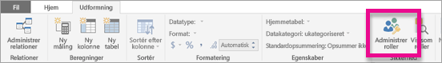
2. Opret en ny rolle, der kaldes **Manager**.

    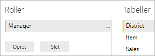
3. Angiv DAX-udtrykket **[District Manager] = USERNAME()** i tabellen **District**.

    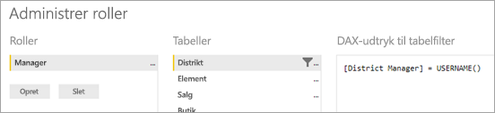
4. Du kan kontrollere, at reglen virker, ved at vælge **Vis som roller** under fanen **Udformning** og derefter vælge både rollen **Chef**, som du har oprettet, og rollen **Andre brugere**. Angiv **AndrewMa** som bruger.

    

    De data, der nu bliver vist i rapporten, er dem, der bliver vist, når du logger på som **AndrewMa**.

Når du anvender filteret på den måde, som vi gjorde her, vises alle de relevante værdier fra tabellerne **District**, **Store** og **Sales**. Men på grund af filtreringsretningen for relationen mellem tabellerne **Sales** og **Time**, vises værdierne fra tabellerne **Sales** og **Item** og **Item** og **Time** ikke. Du kan få mere at vide om tovejskrydsfiltrering ved at downloade hvidbogen [Bidirectional cross-filtering in SQL Server Analysis Services 2016 and Power BI Desktop](http://download.microsoft.com/download/2/7/8/2782DF95-3E0D-40CD-BFC8-749A2882E109/Bidirectional%20cross-filtering%20in%20Analysis%20Services%202016%20and%20Power%20BI.docx).

## <a name="applying-user-and-role-to-an-embed-token"></a>Anvend bruger og rolle for at integrere et token

Nu hvor du har konfigureret roller i Power BI Desktop, er der nogle opgaver, du skal udføre i dit program, så du kan udnytte rollerne.

Brugerne godkendes af dit program, og integreringstokens bruges til at give en bruger adgang til en bestemt rapport i Power BI Embedded. Der findes ingen specifikke oplysninger om, hvem brugeren er, i Power BI Embedded. Hvis sikkerhed på rækkeniveau skal fungere, skal du overføre ekstra kontekst som en del af dit integreringstoken i form af identiteter. Du kan overføre identiteterne ved hjælp af API'en [Integrer Token](https://docs.microsoft.com/rest/api/power-bi/embedtoken).

API'en accepterer en liste over identiteter med angivelse af de relevante datasæt. Hvis sikkerhed på rækkeniveau skal fungere, skal du overføre nedenstående dele som en del af identiteten.

* **username (obligatorisk)** – en streng, der kan bruges til at identificere brugeren, når reglerne for sikkerhed på rækkeniveau anvendes. Du kan kun angive én enkelt bruger. Dit brugernavn kan oprettes med *ASCII*-tegn.
* **roles (obligatorisk)** – en streng med de roller, der skal vælges, når reglerne for sikkerhed på rækkeniveau anvendes. Hvis du overfører mere end én rolle, skal de overføres som en strengmatrix.
* **dataset (obligatorisk)** – det datasæt, der gælder for det artefakt, du integrerer.

Du kan oprette integreringstokenet ved hjælp af metoden **GenerateTokenInGroup** på **PowerBIClient.Reports**.

Du kan f.eks. ændre eksemplet [PowerBIEmbedded_AppOwnsData](https://github.com/Microsoft/PowerBI-Developer-Samples/tree/master/App%20Owns%20Data). *Services\EmbedService.cs line 76 and 77* kunne opdateres fra:

```csharp
// Generate Embed Token.
var generateTokenRequestParameters = new GenerateTokenRequest(accessLevel: "view");

var tokenResponse = await client.Reports.GenerateTokenInGroupAsync(GroupId, report.Id, generateTokenRequestParameters);
```

til

```csharp
var generateTokenRequestParameters = new GenerateTokenRequest("View", null, identities: new List<EffectiveIdentity> { new EffectiveIdentity(username: "username", roles: new List<string> { "roleA", "roleB" }, datasets: new List<string> { "datasetId" }) });

var tokenResponse = await client.Reports.GenerateTokenInGroupAsync("groupId", "reportId", generateTokenRequestParameters);
```

Hvis du kalder REST-API'en, accepterer den opdaterede API nu en ekstra JSON-matrix med navnet **identities**, der indeholder et brugernavn, en liste over strengroller og en liste over strengdatasæt. 

Brug følgende kode som et eksempel:

```json
{
    "accessLevel": "View",
    "identities": [
        {
            "username": "EffectiveIdentity",
            "roles": [ "Role1", "Role2" ],
            "datasets": [ "fe0a1aeb-f6a4-4b27-a2d3-b5df3bb28bdc" ]
        }
    ]
}
```

Nu hvor alle delene er samlet, vil brugerne kun se de data, de har tilladelse til at få vist ifølge sikkerheden på rækkeniveau, når de logger på programmet for at få vist dette artefakt.

## <a name="working-with-analysis-services-live-connections"></a>Arbejde med Analysis Services-liveforbindelser

Sikkerhed på rækkeniveau kan bruges med Analysis Services-liveforbindelser for lokale servere. Der er nogle specifikke begreber, du bør kende, når du bruger denne type forbindelse.

Den faktiske identitet, der leveres for egenskaben brugernavn, skal være en Windows-bruger med tilladelser til Analysis Services-serveren.

### <a name="on-premises-data-gateway-configuration"></a>Konfigurer en datagateway i det lokale miljø

En [datagateway i det lokale miljø](../service-gateway-onprem.md) bruges, når du arbejder med Analysis Services-liveforbindelser. Når du genererer et integreringstoken med et id angivet, skal den overordnede konto være angivet som en administrator af gatewayen. Hvis den overordnede konto ikke er angivet, anvendes sikkerhed på rækkeniveau ikke på egenskaben for dataene. En bruger uden administrative rettigheder kan levere roller, men skal angive sit eget brugernavn til den eksisterende identitet.

### <a name="use-of-roles"></a>Brug af roller

Roller kan angives med identiteten i et integreringstoken. Hvis der ikke angives nogen rolle, bruges det brugernavn, der blev angivet, til at løse de tilknyttede roller.

### <a name="using-the-customdata-feature"></a>Brug af funktionen CustomData

Funktionen CustomData fungerer kun for modeller, der findes i **Azure Analysis Services**, og den fungerer kun i **Connect-live**tilstand. Til forskel fra brugere og roller kan CustomData-funktionen ikke angives i en PBIX-fil. Når et token genereres med funktionen CustomData, skal du have et brugernavn.

Funktionen CustomData gør det muligt for dig at tilføje et rækkefilter, når du får vist Power BI-data i dit program, mens du bruger **Azure Analysis Services** som datakilde (visning af Power BI-data, der er forbundet med Azure Analysis Services i dit program).

Funktionen CustomData gør det muligt at fortolke fritekst (streng) vha. egenskaben CustomData for forbindelsesstrengen. Analysis Services bruger denne værdi via funktionen *CUSTOMDATA()*.

Den eneste måde, du kan få dynamisk sikkerhed på rækkeniveau (som bruger dynamiske værdier til filterevaluering) i **Azure Analysis Services** er at bruge funktionen *CUSTOMDATA()*.

Du kan bruge den i rollen DAX-forespørgsel, og du kan bruge den uden en rolle i en DAX-målingsforespørgsel.
Funktionen CustomData er en del af vores tokengenerations funktionalitet for følgende artefakter: dashboard, rapport og felt. Dashboards kan have flere CustomData-identiteter (én pr. felt/model).

#### <a name="customdata-sdk-additions"></a>CustomData SDK-tilføjelser

Strengegenskaben CustomData blev føjet til vores effektive identitet i tokengenerationsscenariet.

```json
[JsonProperty(PropertyName = "customData")]
public string CustomData { get; set; }
```

Identiteten kan oprettes med brugerdefinerede data vha. følgende kald:

```csharp
public EffectiveIdentity(string username, IList<string> datasets, IList<string> roles = null, string customData = null);
```

#### <a name="customdata-sdk-usage"></a>CustomData SDK-forbrug

Hvis du kalder REST-API'en, kan du tilføje brugerdefinerede data i hver enkelt identitet, f.eks.:

```json
{
    "accessLevel": "View",
    "identities": [
        {
            "username": "EffectiveIdentity",
            "roles": [ "Role1", "Role2" ],
            "customData": "MyCustomData",
            "datasets": [ "fe0a1aeb-f6a4-4b27-a2d3-b5df3bb28bdc" ]
        }
    ]
}
```

Her er trinnene, så du kan begynde at konfigurere funktionen CustomData() med dit Power BI Embedded-program.

1. Opret din Azure Analysis Services-database. Log på din Azure Analysis Services-server via [SQL Server Management Studio](https://docs.microsoft.com/sql/ssms/download-sql-server-management-studio-ssms?view=sql-server-2017).

    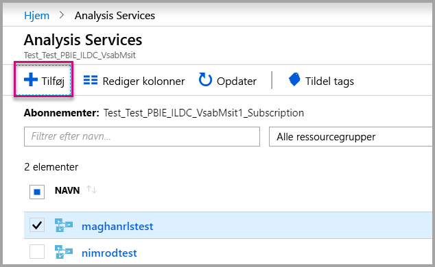

    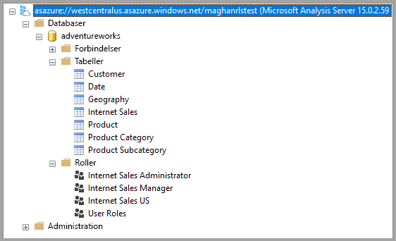

2. Opret en rolle på Analysis Services-serveren.

    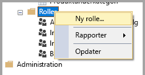

3. Angiv dine **generelle** indstillinger.  Her angiver du **rollenavn** og angiver databasetilladelserne til **Skrivebeskyttet**.

    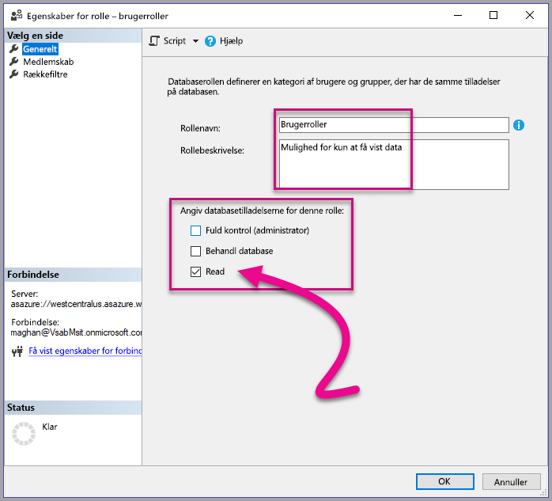

4. Angiv indstillingerne for **Medlemskab**. Her kan du tilføje de brugere, der berøres af denne rolle.

    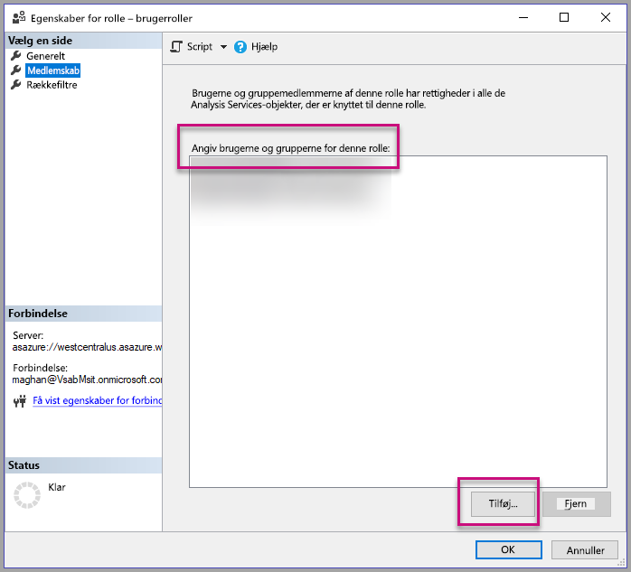

5. Angiv din DAX-forespørgsel for **rækkefiltre** ved hjælp af funktionen*CUSTOMDATA()*.

    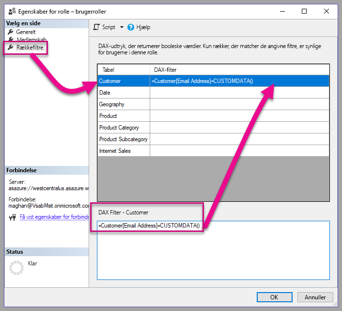

6. Byg en PBI-rapport, og publicer den i et arbejdsområde med dedikeret kapacitet.

    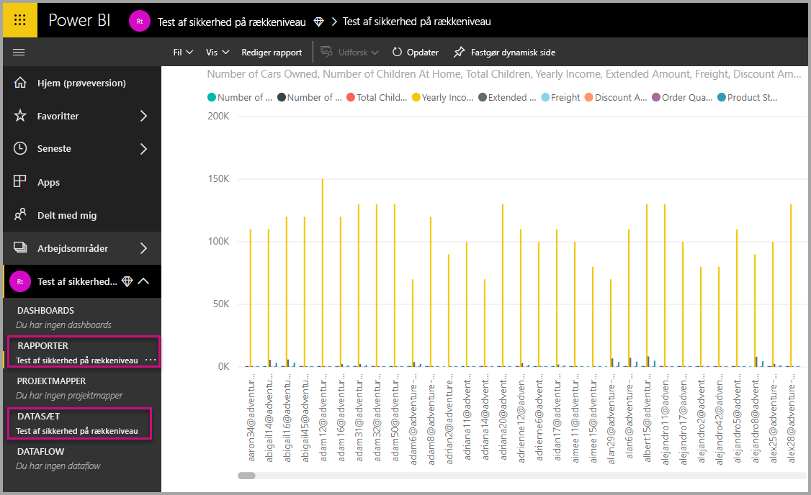

7. Brug Power BI-API'er til at anvende funktionen CustomData i dit program.  Når et token genereres med funktionen CustomData, skal du have et brugernavn. Brugernavnet skal være lig med UPN for masterbrugeren. Masterbrugeren skal være medlem af den eller de roller, du har oprettet. Hvis der ikke er angivet nogen roller, bruges alle de roller, masterbrugeren er medlem af, til evaluering af sikkerhed på rækkeniveau.

    > [!Note]
    > Når du er klar til at udrulle dit program til produktion, må feltet eller indstillingen for masterbrugerkontoen ikke være synlig for slutbrugeren.

    Få vist den [kode](#customdata-sdk-additions), der skal føjes til funktionen CustomData.

8. Du kan nu få vist rapporten i dit program, før du anvender CustomData-værdierne, for at se alle de data rapporten indeholder.

    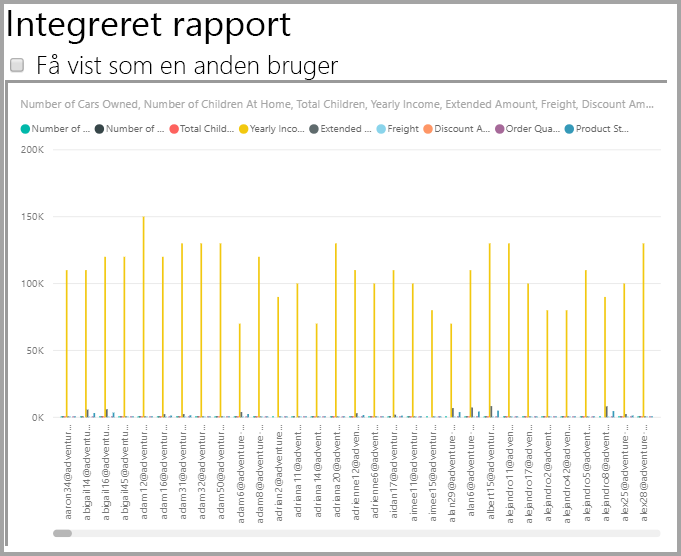

    Derefter skal du anvende Customdata-værdierne for at se, hvordan rapporten viser et andet sæt data.
    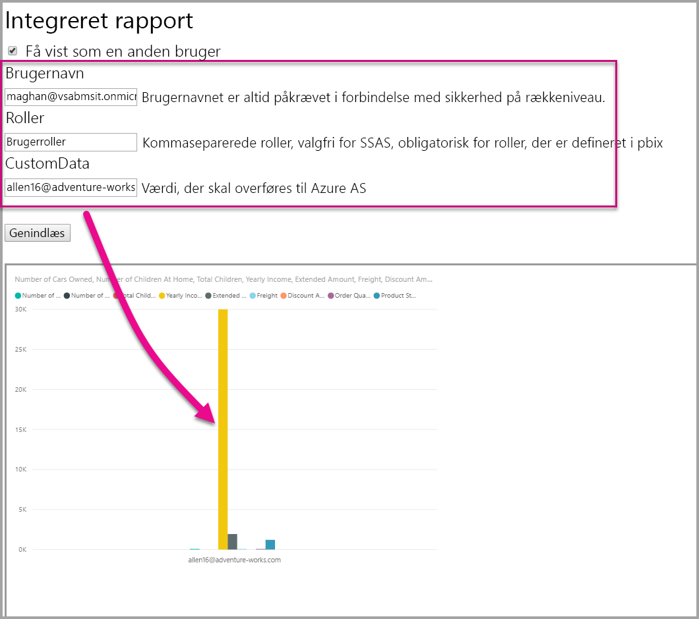

## <a name="using-rls-vs-javascript-filters"></a>Brug af sikkerhed på rækkeniveau i forhold til JavaScript-filtre

Når du beslutter dig for at filtrere dine data i en rapport, kan du bruge **RLS (sikkerhed på rækkeniveau)** eller **JavaScript-filtre**.

[Sikkerhed på rækkeniveau](../service-admin-rls.md) er en funktion, der filtrerer data på datamodelniveau. Din backend-datakilde styrer dine RLS-indstillinger. Den integrerede tokengeneration, der er baseret på din datamodel, angiver brugernavnet og rollerne for sessionen. Den kan ikke tilsidesættes, fjernet eller styres af koden på klientsiden, og derfor anses den for at være sikker. Vi anbefaler brugen af RLS til filtrering af data på en sikker måde. Du kan filtrere data med RLS ved hjælp af en af nedenstående indstillinger.

* [Konfiguration af roller i en Power BI-rapport](../desktop-rls.md).
* Konfiguration af roller på datakildeniveau (kun direkte forbindelse til Analysis Services).
* Ved hjælp af programmering med et [Integreringstoken](https://docs.microsoft.com/rest/api/power-bi/embedtoken/datasets_generatetokeningroup) via `EffectiveIdentity`. Når du bruger et integreringstoken, går det faktiske filter gennem integreringstokenet for en bestemt session.

[JavaScript-filtre](https://github.com/Microsoft/PowerBI-JavaScript/wiki/Filters#page-level-and-visual-level-filters) bruges til at tillade brugeren at forbruge en reduceret, omfangsangivet eller filtreret visning af dataene. Men brugeren stadig har adgang til modelskematabeller, -kolonner og -målinger og kan potentielt få adgang til alle dataene der. Begrænset dataadgang kan kun anvendes med sikkerhed på rækkeniveau og ikke via filtrerings-API'er på klientsiden.

## <a name="token-based-identity-with-azure-sql-database-preview"></a>Tokenbaseret identitet med Azure SQL Database (prøveversion)

Den **tokenbaserede identitet** giver dig mulighed for at angive den eksisterende identitet for et indlejringstoken ved hjælp af adgangstokenet **AAD (Azure Active Directory)** til en **Azure SQL Database**.

Kunder, der har deres data i **Azure SQL Database**, kan nu få glæde af en ny funktionalitet til at administrere brugere og deres adgang til data i Azure SQL, når der integreres med **Power BI Embedded**.

Når du genererer indlejringstokenet, kan du angive den eksisterende identitet for en bruger i Azure SQL. Du kan angive den eksisterende identitet for en bruger ved at overføre AAD-adgangstokenet til serveren. Adgangstokenet bruges til at hente de relevante data for den pågældende bruger fra Azure SQL i den pågældende session.

Det kan bruges til at administrere visningen af hver enkelt bruger i Azure SQL eller til at logge på SQL Azure som en bestemt kunde i en database med flere lejere. Det kan også bruges til at anvende sikkerhed på rækkeniveau i den pågældende session i Azure SQL og kun hente de relevante data for den pågældende session, hvilket fjerner behovet for at administrere sikkerhed på rækkeniveau i Power BI.

Sådanne problemer med eksisterende identiteter gælder for RLS-regler direkte på Azure SQL Server. Power BI Embedded bruger det angivne adgangstoken ved forespørgsler om data fra Azure SQL Server. UPN'et for brugerne (som adgangstokenet blev angivet for) er tilgængeligt som et resultat af funktionen USER_NAME() SQL.

Den tokenbaserede identitet gælder kun for DirectQuery-modeller på dedikeret kapacitet, som er forbundet med en Azure SQL Database, der er konfigureret til at tillade AAD-godkendelse ([få mere at vide om AAD-godkendelse til Azure SQL Database](https://docs.microsoft.com/azure/sql-database/sql-database-manage-logins)). Datasættets datakilde skal konfigureres til at bruge slutbrugernes OAuth2-legitimationsoplysninger for at bruge en tokenbaseret identitet.

   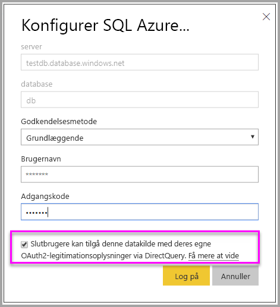

### <a name="token-based-identity-sdk-additions"></a>SDK-tilføjelser til tokenbaseret identitet

Identitetsblobegenskaben blev føjet til vores aktuelle identitet i tokengenereringsscenariet.

```JSON
[JsonProperty(PropertyName = "identityBlob")]
public IdentityBlob IdentityBlob { get; set; }
```

IdentityBlob-typen er en enkel JSON-struktur, der indeholder en værdistrengsegenskab

```JSON
[JsonProperty(PropertyName = "value")]
public string value { get; set; }
```

EffectiveIdentity kan oprettes med identitetsblob ved hjælp af følgende kald:

```C#
public EffectiveIdentity(string username, IList<string> datasets, IList<string> roles = null, string customData = null, IdentityBlob identityBlob = null);
```

Identitetsblob kan oprettes ved hjælp af følgende kald.

```C#
public IdentityBlob(string value);
```

### <a name="token-based-identity-rest-api-usage"></a>Brug af tokenbaseret identitets-REST-API

Hvis du kalder [REST-API'en](https://docs.microsoft.com/rest/api/power-bi/embedtoken/reports_generatetoken#definitions), kan du tilføje identitetsblob i hver enkelt identitet.

```JSON
{
    "accessLevel": "View",
    "identities": [
        {
            "datasets": ["fe0a1aeb-f6a4-4b27-a2d3-b5df3bb28bdc"],
        “identityBlob”: {
            “value”: “eyJ0eXAiOiJKV1QiLCJh….”
         }
        }
    ]
}
```

Værdien i den pågældende identitetsblob skal være et gyldigt adgangstoken til Azure SQL Server (med en URL-adresse til en ressource for (<https://database.windows.net/>).

   > [!Note]
   > Hvis du vil oprette et adgangstoken til Azure SQL, skal programmet have **adgang til Azure SQL Database og Data Warehouse** og delegeret tilladelse til **Azure SQL Database**-API til AAD-konfiguration af appregistrering i Azure-portalen.

   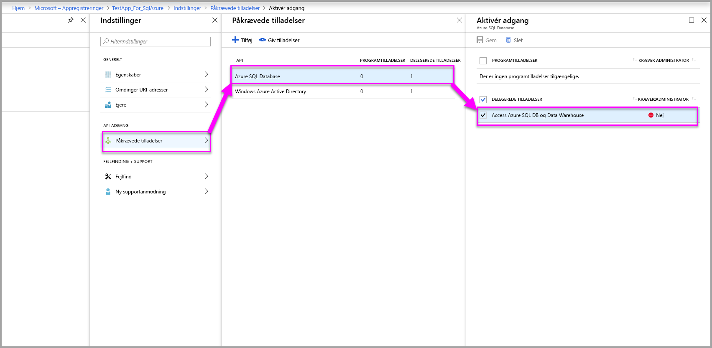

## <a name="on-premises-data-gateway-with-service-principal-preview"></a>Datagateway i det lokale miljø med tjenesteprincipal (prøveversion)

Kunder, der konfigurerer sikkerhed på rækkeniveau ved hjælp af en datakilde med direkte forbindelse via SQL Server Analysis Services (SSAS) kan benytte sig af den nye funktionalitet med en [tjenesteprincipal](embed-service-principal.md) til at administrere brugere og deres adgang til data i SSAS, når der integreres med **Power BI Embedded**.

Ved hjælp af [REST API'er til Power BI](https://docs.microsoft.com/rest/api/power-bi/) kan du angive den eksisterende identitet for direkte forbindelser via SSAS i det lokale miljø for et integreringstoken ved hjælp af et [objekt for tjenesteprincipal](https://docs.microsoft.com/azure/active-directory/develop/app-objects-and-service-principals#service-principal-object).

Indtil nu skulle masterbrugeren, som skulle generere integreringstokenet, være gatewayadministrator for at kunne angive den eksisterende identitet for direkte forbindelser via SSAS. I stedet for at kræve at brugeren er gatewayadministrator, kan gatewayadministratoren give brugeren dedikeret tilladelse til den pågældende datakilde, hvilket giver brugeren mulighed for at tilsidesætte den eksisterende identitet, når integreringstokenet genereres. Denne nye funktionalitet gør det muligt at integrere med en tjenesteprincipal i forbindelse med en direkte forbindelse via SSAS.

For at muliggøre dette scenarie bruger gatewayadministratoren [Tilføj REST API for bruger af datakilde](https://docs.microsoft.com/rest/api/power-bi/gateways/adddatasourceuser) for at tildele tjenesteprincipalen tilladelsen *ReadOverrideEffectiveIdentity* for Power BI Embedded.

Du kan ikke angive denne tilladelse ved hjælp af administrationsportalen. Denne tilladelse kan kun angives ved hjælp af API'en. På administrationsportalen kan du se en angivelse for brugere og tjenesters hovednavne med disse tilladelser.

## <a name="considerations-and-limitations"></a>Overvejelser og begrænsninger

* Tildeling af brugere til roller i Power BI-tjenesten påvirker ikke sikkerheden på rækkeniveau, når du anvender et integreringstoken.
* Selvom Power BI-tjenesten ikke anvender indstillingen for sikkerhed på rækkeniveau for administratorer eller medlemmer med redigeringsrettigheder, vil den blive anvendt på dataene, når du angiver en identitet med et indlejringstoken.
* Analysis Services-liveforbindelser understøttes på lokale servere.
* Direkte forbindelser i Azure Analysis Services understøtter filtrering efter roller. Dynamisk filtrering kan udføres ved hjælp af CustomData.
* Hvis der ikke skal bruges sikkerhed på rækkeniveau på det underliggende datasæt, må GenerateToken-anmodningen **ikke** indeholde en eksisterende identitet.
* Hvis det underliggende datasæt er en cloudmodel (cachelagret model eller DirectQuery), skal den eksisterende identitet indeholde mindst én rolle, ellers tildeles der ikke en rolle.
* En liste over identiteter gør det muligt at have flere identitetstokens ved integrering i dashboardet. For alle andre artefakter vil listen indeholde en enkelt identitet.

### <a name="token-based-identity-limitations-preview"></a>Begrænsninger for tokenbaseret identitet (prøveversion)

* Denne funktion begrænser kun brugen sammen med Power BI Premium.
* Denne funktion fungerer ikke sammen med SQL Server i det lokale miljø.
* Denne funktion fungerer ikke sammen med Multi-Geo.

Har du flere spørgsmål? [Prøv at spørge Power BI-community'et](https://community.powerbi.com/)
