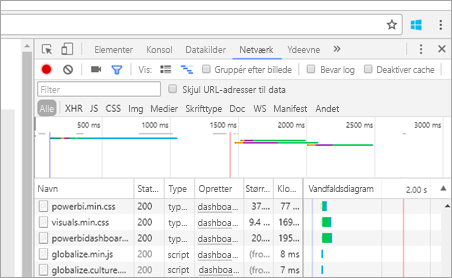
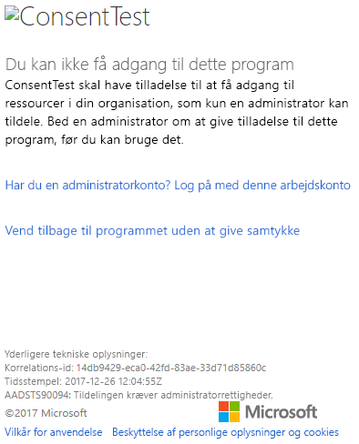
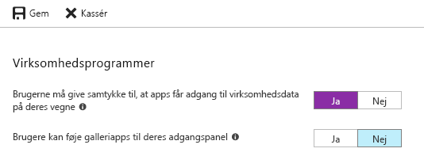

# <a name="troubleshoot-your-embedded-application"></a>Foretag fejlfinding af dit integrerede program

I denne artikel beskrives nogle almindelige problemer, som kan opstå, når du integrerer indhold fra Power BI.

## <a name="tools-to-troubleshoot"></a>Værktøjer til fejlfinding

### <a name="fiddler-trace"></a>Fiddler-sporing

[Fiddler](https://www.telerik.com/fiddler) er et gratis værktøj fra Telerik, der overvåger HTTP-trafik.  Du kan se trafikken vha. Power BI-API'er fra klientcomputeren. Dette værktøj kan vise fejl og andre relaterede oplysninger.


### <a name="f12-in-browser-for-front-end-debugging"></a>F12 i browser for fejlfinding af front-end

F12 starter udviklervinduet i din browser. Du kan bruge dette værktøj til at se netværkstrafik og andre oplysninger.



### <a name="extract-error-details-from-power-bi-response"></a>Udtræk oplysninger om fejl fra Power BI-svar

Dette kodestykke viser, hvordan du udtrækker fejloplysninger fra HTTP-undtagelse:

```csharp
public static string GetExceptionText(this HttpOperationException exc)
{
    var errorText = string.Format("Request: {0}\r\nStatus: {1} ({2})\r\nResponse: {3}",
    exc.Request.Content, exc.Response.StatusCode, (int)exc.Response.StatusCode, exc.Response.Content);
    if (exc.Response.Headers.ContainsKey("RequestId"))
    {
        var requestId = exc.Response.Headers["RequestId"].FirstOrDefault();
        errorText += string.Format("\r\nRequestId: {0}", requestId);
    }

    return errorText;
}
```

Vi anbefaler, at du logfører anmodnings-id'et (og fejloplysninger med henblik på fejlfinding).
Oplys om anmodnings-id'et, når du henvender dig til Microsoft Support.

## <a name="app-registration"></a>Programregistrering

### <a name="app-registration-failure"></a>Fejl ved programregistrering

Fejlmeddelelser internt på Azure-portalen eller Power BI-programmets registreringsside angiver utilstrækkelige rettigheder. For at registrere et program skal du være administrator i Azure AD-lejeren, eller programregistreringer skal være aktiveret for brugere uden administratorstatus.

### <a name="power-bi-service-doesnt-appear-in-the-azure-portal-when-registering-a-new-app"></a>Power BI-tjenesten vises ikke på Azure Portal, når et nyt program registreres

Mindst en bruger skal være tilmeldt Power BI. Hvis du ikke kan se **Power BI-tjenesten** på API-listen, er der ikke tilmeldt nogen brugere i Power BI.

## <a name="rest-api"></a>REST API

### <a name="api-call-returning-401"></a>API-kald returnerer 401

En fiddler-optagelse kan være påkrævet med henblik på yderligere efterforskning. Det påkrævede tilladelsesomfang kan være utilstrækkeligt for det registrerede program internt i Azure AD. Bekræft, at det påkrævede omfang er til stede i programregistreringen til Azure AD internt på Azure-portalen.

### <a name="api-call-returning-403"></a>API-kald returnerer 403

En fiddler-optagelse kan være påkrævet med henblik på yderligere efterforskning. Der kan være flere grunde til en 403-fejl.

* Brugeren har overskredet antallet af integrerede tokens, der kan genereres på en delt kapacitet. Køb Azure-kapacitet for at generere integreringstokens og tildele arbejdsområdet til den pågældende kapacitet. Se [Opret Power BI Embedded-kapacitet på Azure Portal](https://docs.microsoft.com/azure/power-bi-embedded/create-capacity).
* Azure AD auth-tokenet kan være udløbet.
* Den godkendte bruger er ikke et medlem af gruppen (arbejdsområde).
* Den godkendte bruger er ikke en administrator af gruppen (arbejdsområde).
* Den godkendte bruger har ikke tilladelser. Tilladelser kan opdateres ved hjælp af [refreshUserPermissions API](https://docs.microsoft.com/rest/api/power-bi/users/refreshuserpermissions)
* Godkendelsesheaderen kan være angivet forkert. Kontroller for tastefejl.

Programmets backend skal muligvis opdatere godkendelsestokenet før kaldet til GenerateToken.

    ```
    GET https://wabi-us-north-central-redirect.analysis.windows.net/metadata/cluster HTTP/1.1
    Host: wabi-us-north-central-redirect.analysis.windows.net
    ...
    Authorization: Bearer eyJ0eXAiOi...
    ...

    HTTP/1.1 403 Forbidden
    ...

    {"error":{"code":"TokenExpired","message":"Access token has expired, resubmit with a new access token"}}
    ```

## <a name="authentication"></a>Godkendelse

### <a name="authentication-failed-with-aadsts90002-tenant-authorize-not-found"></a>Godkendelse mislykkedes med AADSTS90002: Lejeren "godkend" blev ikke fundet

 Hvis du modtager meddelelseslogge, såsom ***fejl: invalid_request, error_description: AADSTS90002: Lejeren "godkend" blev ikke fundet***, er det fordi, ADAL 4.x ikke understøtter "https://login.microsoftonline.com/{Tenant}/oauth2/authorize/" som en URL-adresse for autoritet.
 
Hvis du vil løse dette problem, skal du fjerne "oauth2/authorize/" fra slutningen af din URL-adresse for autoritet. Du kan se flere oplysninger under [Eksempler på Power BI Developer](https://github.com/Microsoft/PowerBI-Developer-Samples).

 Kontrollér [Bedre myndighedsvalidering](https://github.com/AzureAD/azure-activedirectory-library-for-dotnet/wiki/Changes-adalnet-4.0#better-authority-validation) i produktbemærkningerne til ADAL 4.x.

### <a name="authentication-failed-with-aadsts70002-or-aadsts50053"></a>Godkendelsen mislykkedes med AADSTS70002 eller AADSTS50053

**_(AADSTS70002: Der opstod en fejl under validering af legitimationsoplysningerne. AADSTS50053: Du har forsøgt at logge på for mange gange med et forkert bruger-id eller en forkert adgangskode)_**

Hvis du bruger Power BI Embedded og Azure AD Direkte-godkendelse, og du modtager meddelelser, når du logger på, f.eks. ***fejl: uautoriseret_klient, fejlbeskrivelse:AADSTS70002: Der opstod en fejl under validering af legitimationsoplysningerne. AADSTS50053: Du har forsøgt at logge på for mange gange med et forkert bruger-id eller en forkert adgangskode***, fordi direkte godkendelse som standard ikke har været i brug siden d. 14. juni 2018.

Dette kan aktiveres igen ved hjælp af en [Azure AD-politik](https://docs.microsoft.com/azure/active-directory/manage-apps/configure-authentication-for-federated-users-portal#enable-direct-authentication-for-legacy-applications), der er begrænset til organisationen eller en [tjenesteprincipal](https://docs.microsoft.com/azure/active-directory/develop/active-directory-application-objects#service-principal-object).

Vi anbefaler, at du kun aktiverer denne politik for ét program ad gangen.

Hvis du vil oprette denne politik, skal du være **Global Administrator** for den mappe, hvor du opretter politikken og tildelingen. Her er et eksempel på et script til oprettelse af politikken og tildeling af den til SP for dette program:

1. Installér [Azure AD PowerShell-modulet som prøveversion](https://docs.microsoft.com/powershell/azure/active-directory/install-adv2?view=azureadps-2.0).

2. Kør følgende PowerShell-kommandoer linje for linje. Sørg for, at variablen $sp ikke har mere end ét program som resultat.

```powershell
Connect-AzureAD
```

```powershell
$sp = Get-AzureADServicePrincipal -SearchString "Name_Of_Application"
```

```powershell
$policy = New-AzureADPolicy -Definition @("{`"HomeRealmDiscoveryPolicy`":{`"AllowCloudPasswordValidation`":true}}") -DisplayName EnableDirectAuth -Type HomeRealmDiscoveryPolicy -IsOrganizationDefault $false
```

```powershell
Add-AzureADServicePrincipalPolicy -Id $sp.ObjectId -RefObjectId $policy.Id 
```

Efter tildeling af politikken skal du vente ca. 15-20 sekunder på overførslen, inden du tester.

### <a name="generate-token-fails-when-providing-effective-identity"></a>Generering af token mislykkes ved angivelse af effektiv identitet

GenerateToken kan mislykkes af forskellige grunde, når effektiv identitet er angivet.

* Datasæt understøtter ikke effektiv identitet
* Brugernavnet blev ikke angivet
* Rollen blev ikke angivet
* Datasæt-id'et blev ikke angivet
* Brugeren har ikke de korrekte tilladelser

Prøv nedenstående trin for at bekræfte, hvilken en det er.

* Kør [get dataset](https://docs.microsoft.com/rest/api/power-bi/datasets). Er egenskaben IsEffectiveIdentityRequired sand?
* Brugernavn er obligatorisk for enhver EffectiveIdentity.
* Hvis IsEffectiveIdentityRolesRequired er sandt, så er Rolle påkrævet.
* DatasetId er obligatorisk for enhver EffectiveIdentity.
* For Analysis Services skal den overordnede bruger være en gateway-administrator.

### <a name="aadsts90094-the-grant-requires-admin-permission"></a>AADSTS90094: Tildelingen kræver administratorrettigheder

**_Symptomer:_**<br>
Når en bruger, der ikke er administrator, forsøger at logge på et program første gang og giver samtykke, får vedkommende vist en af følgende fejl:

* ConsentTest skal have tilladelse til at få adgang til ressourcer i din organisation, som kun en administrator kan tildele. Bed en administrator om at give tilladelse til dette program, før du kan bruge det.
* AADSTS90094: Tildelingen kræver administratorrettigheder.

    

En administratorbruger kan logge på og give samtykke.

**_Hovedårsag:_**<br>
Brugersamtykke er deaktiveret for lejeren.

**_Der er flere mulige fejlrettelser:_**

*Aktivere brugersamtykke for hele lejeren (alle brugere, alle programmer)*

1. På Azure Portal skal du gå til "Azure Active Directory" = > "Brugere og grupper" = > "Brugerindstillinger"
2. Aktivér "Brugerne må give samtykke til, at apps får adgang til virksomhedsdata på deres vegne", og gem ændringerne

    

*Tildel tilladelser* til programmet af en administrator – enten til hele lejeren eller til en bestemt bruger.

### <a name="cs1061-error"></a>CS1061-fejl

Download [Microsoft.IdentityModel.Clients.ActiveDirectory](https://www.nuget.org/packages/Microsoft.IdentityModel.Clients.ActiveDirectory/2.22.302111727), hvis du oplever fejlmeddelelsen: "'AuthenticationContext' doesn't contain a definition for 'AcquireToken' and no accessible 'AcquireToken' accepting a first argument of type 'AuthenticationContext' could be found (are you missing a using directive or an assembly reference?)".

## <a name="data-sources"></a>Datakilder

### <a name="isv-wants-to-have-different-credentials-for-the-same-data-source"></a>Softwareproducenten vil have andre legitimationsoplysninger til den samme datakilde

En datakilde kan have et enkelt sæt legitimationsoplysninger til én overordnet bruger. Hvis du har brug for at oprette andre legitimationsoplysninger, skal du oprette andre overordnede brugere. Derefter skal du tildele de andre legitimationsoplysninger til hver af den overordnede brugers kontekster og integrere vha. den pågældende brugers Azure AD-token.

## <a name="troubleshoot-your-embedded-application-with-the-ierror-object"></a>Foretag fejlfinding af det integrerede program med IError-objektet

Brug det [**IError-objekt**, der returneres af *fejl*hændelsen fra **JavaScript-SDK'en**](https://github.com/Microsoft/PowerBI-JavaScript/wiki/Troubleshooting-and-debugging-of-embedded-parts), til at foretage fejlfinding af din app, så du bedre kan forstå årsagen til dine fejl.

Når du har modtaget IError-objektet, skal du kigge i den relevante tabel over almindelige fejl, der svarer til den integreringstype, du bruger. Sammenlign **IError-egenskaberne** med dem i tabellen, og find mulige årsager til fejlen.

### <a name="typical-errors-when-embedding-for-power-bi-users"></a>Typiske fejl, når du integrerer til Power BI-brugere

| Meddelelse | Detaljeret meddelelse | Fejlkode | Mulige årsager |
|-------------------------------------------------------|-----------------------------------------------------------------------------------------------------------------------------|-----------|--------------------------------------------------------|
| TokenExpired | Adgangstokenet er udløbet. Send igen med et nyt adgangstoken | 403 | Udløbet token  |
| PowerBIEntityNotFound | Rapporten blev ikke hentet | 404 | <li> Forkert rapport-id <li> Rapporten findes ikke  |
| Ugyldige parametre | Parameteren powerbiToken er ikke angivet | I/T | <li> Der er ikke angivet et adgangstoken <li> Der er ikke angivet et rapport-id |
| LoadReportFailed | Initialisering mislykkedes – Klyngen kunne ikke løses | 403 | * Forkert adgangstoken * Integreringstypen svarer ikke til tokentypen |
| PowerBINotAuthorizedException | Rapporten blev ikke hentet | 401 | <li> Forkert gruppe-id <li> Uautoriseret gruppe |
| TokenExpired | Adgangstokenet er udløbet. Send igen med et nyt adgangstoken. Det var ikke muligt at gengive en visualisering i en rapport med titlen: <visual title> | I/T | Udløbet token for forespørgselsdata |
| OpenConnectionError | Visualiseringen kan ikke vises. Det var ikke muligt at gengive en visualisering i en rapport med titlen: <visual title> | I/T | Kapacitet, der er sat på pause eller slettet, mens en rapport, der er relateret til en kapacitet, var åben i en session |
| ExplorationContainer_FailedToLoadModel_DefaultDetails | Det modelskema, der er knyttet til denne rapport, kunne ikke indlæses. Kontrollér, at du har forbindelse til serveren, og prøv igen. | I/T | <li> Kapaciteten er midlertidigt afbrudt <li> Kapaciteten er slettet |

### <a name="typical-errors-when-embedding-for-non-power-bi-users-using-an-embed-token"></a>Typiske fejl, der opstår, når du integrerer til brugere, der ikke har Power BI (ved hjælp af et integreret token)

| Meddelelse | Detaljeret meddelelse | Fejlkode | Årsag(er) |
|-------------------------------------------------------|-------------------------------------------------------------------------------------------------------------------------------|------------|-------------------------------------------------|
| TokenExpired | Adgangstokenet er udløbet. Send igen med et nyt adgangstoken | 403 | Udløbet token  |
| LoadReportFailed | Rapporten blev ikke hentet | 404 | <li> Forkert rapport-id <li> Rapporten findes ikke  |
| Rapporten blev ikke indlæst | Rapporten blev ikke hentet | 403 | Rapport-id'et svarer ikke til tokenet |
| LoadReportFailed | Rapporten blev ikke hentet | 500 | Det angivne rapport-id er ikke et GUID |
| Ugyldige parametre | Parameteren powerbiToken er ikke angivet | I/T | <li> Der er ikke angivet et adgangstoken <li> Der er ikke angivet et rapport-id |
| LoadReportFailed | Initialisering mislykkedes – Klyngen kunne ikke løses | 403 | Forkert tokentype, ugyldigt token |
| PowerBINotAuthorizedException | Rapporten blev ikke hentet | 401 | Forkert/uautoriseset gruppe-id |
| TokenExpired | Adgangstokenet er udløbet. Send igen med et nyt adgangstoken. Det var ikke muligt at gengive en visualisering i en rapport med titlen: <visual title> | I/T | Udløbet token for forespørgselsdata |
| OpenConnectionError | Visualiseringen kan ikke vises. Det var ikke muligt at gengive en visualisering i en rapport med titlen: <visual title> | I/T | Kapacitet, der er sat på pause eller slettet, mens en rapport, der er relateret til en kapacitet, var åben i en session |
| ExplorationContainer_FailedToLoadModel_DefaultDetails | Det modelskema, der er knyttet til denne rapport, kunne ikke indlæses. Kontrollér, at du har forbindelse til serveren, og prøv igen. | I/T | <li> Kapaciteten er midlertidigt afbrudt <li> Kapaciteten er slettet |

## <a name="content-rendering"></a>Indholdsgengivelse

### <a name="performance"></a>Ydeevne

[Ydeevnen i Power BI Embedded](embedded-performance-best-practices.md)

### <a name="rendering-or-consumption-of-embedded-content-fails-or-times-out"></a>Gengivelse eller forbrug af integreret indhold mislykkes, eller der opstår timeout

Sørg for, at det integrerede token ikke er udløbet. Sørg for at kontrollere udløbet for integreringstokenet og opdatere det. Du kan få flere oplysninger under [Opdatér token ved hjælp af JavaScript SDK](https://github.com/Microsoft/PowerBI-JavaScript/wiki/Refresh-token-using-JavaScript-SDK-example).

### <a name="report-or-dashboard-doesnt-load"></a>Rapporten eller dashboardet indlæses ikke

Hvis brugeren ikke kan se rapporten eller dashboardet, skal du sørge for, at rapporten eller dashboardet indlæses korrekt i powerbi.com. Rapporten eller dashboardet fungerer ikke internt i programmet, hvis det ikke indlæses internt i powerbi.com.

### <a name="report-or-dashboard-is-performing-slowly"></a>Ydeevnen for rapporten eller dashboardet er langsom

Åbn filen fra Power BI Desktop eller internt i powerbi.com, og bekræft, at ydeevnen er acceptabel, for at udelukke, at der er problemer med dit program eller integrations-API'erne.

## <a name="embed-setup-tool"></a>Værktøjet til integrering af konfiguration

Du kan gennemgå [Embedding-konfigurationsværktøjet](https://aka.ms/embedsetup) for hurtigt at downloade en eksempelapp. Derefter kan du sammenligne din app med eksemplet.

### <a name="prerequisites"></a>Forudsætninger

Kontrollér, at du opfylder de påkrævede forudsætninger, før du bruger Embedding-konfigurationsværktøjet. Du skal have en **Power BI Pro**-konto og et **Microsoft Azure**-abonnement.

* Hvis du ikke er tilmeldt **Power BI Pro**, kan du [tilmelde dig en gratis prøveversion](https://powerbi.microsoft.com/pricing/), før du begynder.
* Hvis du ikke har et Azure-abonnement, skal du oprette en [gratis konto](https://azure.microsoft.com/free/?WT.mc_id=A261C142F), før du begynder.
* Du skal have din egen konfiguration af [Azure Active Directory-lejer](create-an-azure-active-directory-tenant.md).
* Du skal have [Visual Studio](https://www.visualstudio.com/) installeret (version 2013 eller nyere).

### <a name="common-issues"></a>Almindelige problemer

Nogle af de mest almindelige problemer, du kan støde på, når du tester værktøjet til integrering af konfiguration, er:

#### <a name="using-the-embed-for-your-customers-sample-application"></a>Brug af eksempelappen Embed for your customers

Hvis du arbejder med oplevelsen **Embed for your customers**, skal du gemme og udpakke filen *PowerBI-Developer-Samples.zip*. Derefter skal du åbne mappen *PowerBI-Developer-Samples-master\App Owns Data* og køre filen *PowerBIEmbedded_AppOwnsData.sln*.

Når du vælger **Grant permissions**, får du vist følgende fejl:

    AADSTS70001: Application with identifier <client ID> wasn't found in the directory <directory ID>

Du kan løse fejlen ved at lukke pop op-vinduet, vente nogle sekunder og prøve igen. Det kan være nødvendigt at gentage dette nogle gange. Et tidsinterval er årsag til problemet, hvor programregistreringsprocessen ikke kan fuldføres, når den er tilgængelig for eksterne API'er.

Følgende fejlmeddelelse vises, når eksempelappen køres:

    Password is empty. Please fill password of Power BI username in web.config.

Denne fejl opstår, fordi den eneste værdi, der ikke bliver overført til eksempelprogrammet, er din brugeradgangskode. Åbn filen Web.config i løsningen, og udfyld feltet pbiPassword med din brugeradgangskode.

Hvis du får vist fejlen – AADSTS50079: Brugeren skal anvende multifaktorgodkendelse.

    Need to use an AAD account that doesn't have MFA enabled.

#### <a name="using-the-embed-for-your-organization-sample-application"></a>Brug af eksempelappen Embed for your organization

Hvis du arbejder med **Embed for your organization**, skal du gemme og udpakke filen *PowerBI-Developer-Samples.zip*. Derefter skal du åbne mappen *PowerBI-Developer-Samples-master\User Owns Data\integrate-report-web-app* og køre filen *pbi-saas-embed-report.sln*.

Når du kører eksempelappen **Embed for your organization**, får du følgende fejl:

    AADSTS50011: The reply URL specified in the request doesn't match the reply URLs configured for the application: <client ID>

Denne fejl skyldes, at den URL-adresse til omdirigering, der er angivet for webserverprogrammet, er forskellig fra URL-adressen i eksemplet. Hvis du vil registrere eksempelappen, skal du bruge `https://localhost:13526/` som URL-adresse til omdirigering.

Hvis du vil redigere det registrerede program, skal du lære at [opdatere den Azure AD-registrerede app](https://docs.microsoft.com/azure/active-directory/develop/quickstart-v1-update-azure-ad-app), så den kan give adgang til web-API'erne.

Hvis du vil redigere Power BI-brugerprofilen eller -dataene, skal du lære, hvordan du redigere dine [Power BI-data](https://docs.microsoft.com/power-bi/service-basic-concepts).

Hvis du får vist fejlen – AADSTS50079: Brugeren skal anvende multifaktorgodkendelse.

    Need to use an AAD account that doesn't have MFA enabled.

Du kan finde flere oplysninger under [Ofte stillede spørgsmål om Power BI Embedded](embedded-faq.md).

Har du flere spørgsmål? [Prøv at spørge Power BI-community'et](https://community.powerbi.com/)

Hvis du har brug for yderligere hjælp, kan du [kontakte support](https://powerbi.microsoft.com/support/pro/?Type=documentation&q=power+bi+embedded) eller [oprette en supportanmodning via Azure Portal](https://ms.portal.azure.com/#blade/Microsoft_Azure_Support/HelpAndSupportBlade/newsupportrequest) og angive de fejlmeddelelser, du får vist.

## <a name="next-steps"></a>Næste trin

Du kan finde flere oplysninger under [Ofte stillede spørgsmål](embedded-faq.md).

Har du flere spørgsmål? [Prøv at spørge Power BI-community'et](https://community.powerbi.com/)
