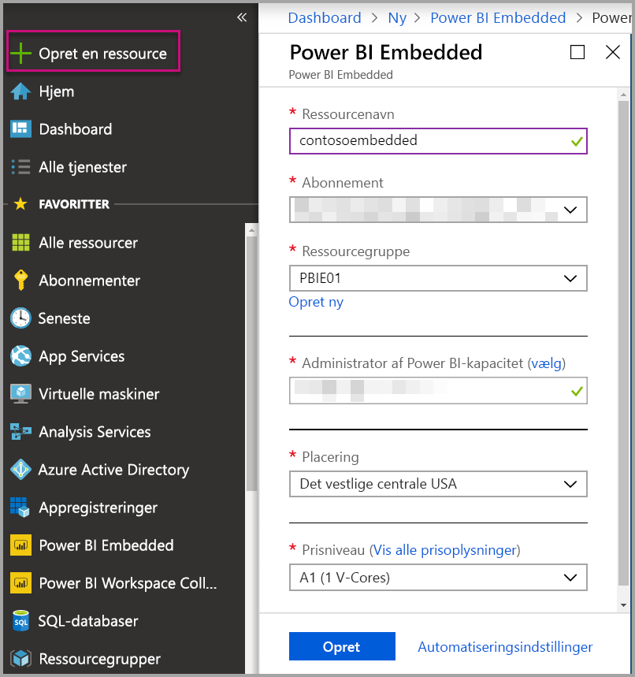
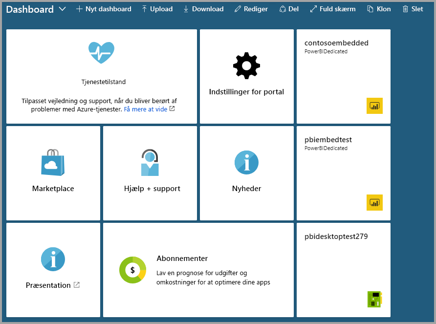

# Opret Power BI Embedded-kapacitet på Azure-portalen

Denne artikel indeholder en beskrivelse af, hvordan du opretter [Power BI Embedded](azure-pbie-what-is-power-bi-embedded.md)-kapacitet i Microsoft Azure. Power BI Embedded gør det nemmere for dig at bruge Power BI-funktionerne, så du hurtigt kan tilføje imponerende visualiseringer, rapporter og dashboards i dine apps.

Hvis du ikke har et Azure-abonnement, skal du oprette en [gratis konto](https://azure.microsoft.com/free/), før du begynder.

> [!VIDEO https://www.youtube.com/embed/aXrvFfg_iSk]

## Inden du starter

For at følge denne hurtige start skal du have følgende:

* **Azure-abonnement:** Gå til [den gratis prøveversion af Azure](https://azure.microsoft.com/free/) for at oprette en konto.
* **Azure Active Directory:** Abonnementet skal være tilknyttet en AAD-lejer (Azure Active Directory). Du skal desuden ***være logget på Azure med en konto i den lejer***. Microsoft-konti understøttes ikke. Du kan finde flere oplysninger under [Godkendelse og brugertilladelser](https://docs.microsoft.com/azure/analysis-services/analysis-services-manage-users).
* **Power BI-lejer:** Mindst én konto i din AAD-lejer skal være tilmeldt Power BI.
* **Ressourcegruppe:** Brug en eksisterende ressourcegruppe, eller [opret en ny](https://docs.microsoft.com/azure/azure-resource-manager/resource-group-overview).

## Opret kapacitet

1. Log på [Azure-portalen](https://portal.azure.com/).

2. Søg efter *Power BI Embedded* i søgefeltet.

3. Vælg **Opret** i Power BI Embedded.

4. Angiv de påkrævede oplysninger, og vælg derefter **Opret**.

    

    |Indstilling |Beskrivelse |
    |---------|---------|
    |**Ressourcenavn**|Et navn, så du kan identificere kapaciteten. Ressourcenavnet vises både på Power BI-administrationsportalen og på Azure-portalen.|
    |**Abonnement**|Det abonnement, som kapaciteten skal oprettes for.|
    |**Ressourcegruppe**|Den ressourcegruppe, der indeholder den nye kapacitet. Vælg mellem en eksisterende ressourcegruppe, eller opret en anden. Du kan finde flere oplysninger under [Oversigt over Azure Resource Manager](https://docs.microsoft.com/azure/azure-resource-manager/resource-group-overview).|
    |**Administrator af Power BI-kapacitet**|Administratorer af Power BI-kapacitet kan få vist kapaciteten på Power BI-administrationsportalen og give tildelingstilladelser til andre brugere. Administratoren af kapacitet er som standard din konto. Kapacitetsadministratoren skal findes i din Power BI-lejer.|
    |**Placering**|Den placering, hvor Power BI hostes for din lejer. Din standardplacering er dit lokale område, men du kan ændre placeringen ved hjælp af [Multi-Geo-indstillinger](embedded-multi-geo.md).
    |**Prisniveau**|Vælg det varenummer (antal v-kerner og hukommelsesstørrelse), der opfylder dine behov.  Du kan finde flere oplysninger under [Power BI Embedded-prisberegner](https://azure.microsoft.com/pricing/details/power-bi-embedded/)|

Du kan navigere til **Alle tjenester** > **Power BI Embedded** for at se, om kapaciteten er klar. Du kan også vælge **Fastgør til dashboard** fra sektionen med meddelelser eller fra bladet for at navigere til dit dashboard og se din nye kapacitet.

## Næste trin

For at bruge den nye Power BI Embedded-kapacitet skal du gå til Power BI-administrationsportalen for at tildele arbejdsområder. Du kan finde flere oplysninger under [Administrer kapaciteter i Power BI Premium og Power BI Embedded](https://powerbi.microsoft.com/documentation/powerbi-admin-premium-manage/).

Hvis du ikke længere har behov for kapaciteten, kan du midlertidigt standse den for at stoppe faktureringen. Du kan finde flere oplysninger under [Stands din Power BI Embedded-kapacitet midlertidigt, og start den igen på Azure-portalen](azure-pbie-pause-start.md).

Hvis du vil i gang med at integrere Power BI-indhold i din app, skal du se [Sådan integrerer du Power BI-dashboards, -rapporter og -felter](https://powerbi.microsoft.com/documentation/powerbi-developer-embedding-content/).

Har du flere spørgsmål? [Prøv at spørge Power BI-community'et](https://community.powerbi.com/)