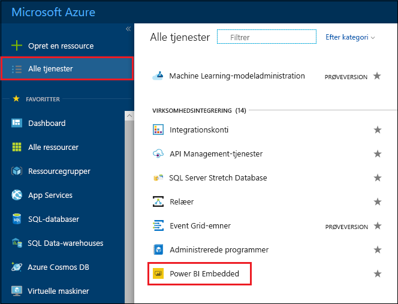
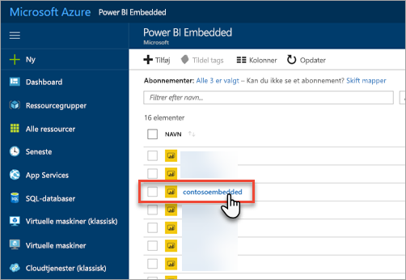
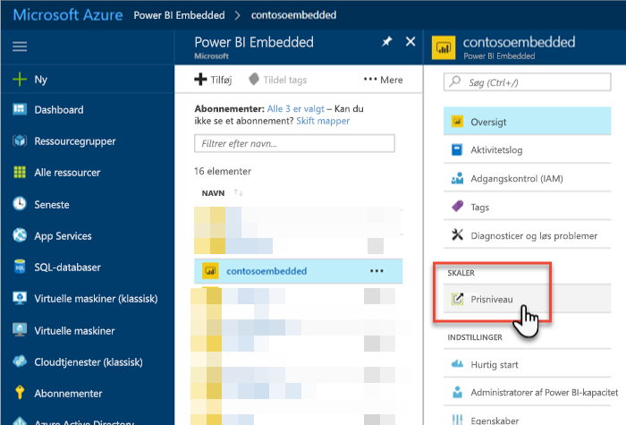
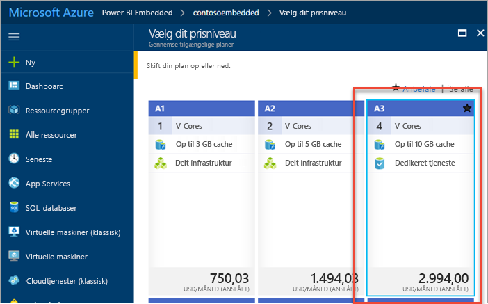
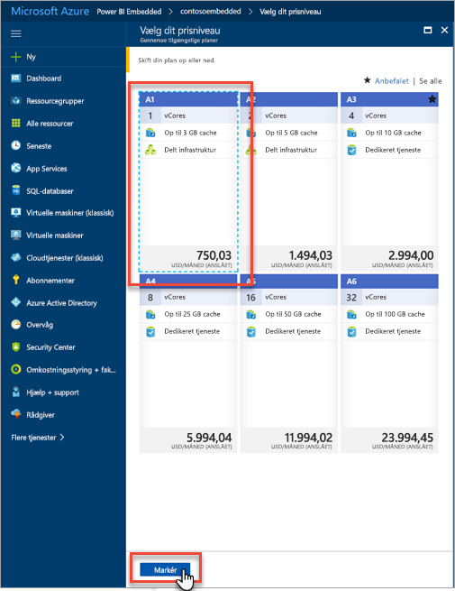
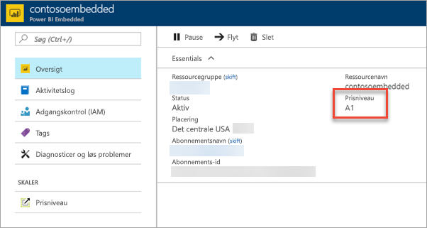

# Skaler din Power BI Embedded-kapacitet på Azure-portalen

I denne artikel beskriver vi, hvordan du skalerer en Power BI Embedded-kapacitet i Microsoft Azure. Du kan bruge skalering til at øge eller mindske størrelsen på din kapacitet.

Dette antager, at du har oprettet en Power BI Embedded-kapacitet. Hvis du ikke har det, kan du se [Opret Power BI Embedded-kapacitet på Azure-portalen](azure-pbie-create-capacity.md) for at komme i gang.

> [!NOTE]
> En skalering kan tage omkring et minut. I løbet af den periode vil kapaciteten ikke være tilgængelig. Integreret indhold kan muligvis ikke indlæses.

## Skaler en kapacitet

1. Log på [Azure-portalen](https://portal.azure.com/).

2. Vælg **Alle tjenester** > **Power BI Embedded** for at se dine kapaciteter.

    

3. Vælg den kapacitet, du vil skalere.

    

4. Vælg **Prisniveau** under **Skaler** i din kapacitet.

    

    Dit aktuelle prisniveau er angivet med et blåt omrids.

    

5. Hvis du vil skalere op eller ned, skal du vælge det nye niveau, du vil skifte til. Når du vælger et nyt niveau, vises det valgte niveau med et blåt omrids. Vælg **Vælg** for at skalere til det nye niveau.

    

    Det kan tage et minut eller to at skalere til din nye kapacitet.

6. Du kan bekræfte dit niveau under oversigtsfanen. Det aktuelle prisniveau vises.

    

## Næste trin

Hvis du vil standse din kapacitet midlertidigt eller starte den, skal du se [Stands din Power BI Embedded-kapacitet midlertidigt, og start den igen på Azure-portalen](azure-pbie-pause-start.md).

Hvis du vil i gang med at integrere Power BI-indhold i din app, skal du se [Sådan integrerer du Power BI-dashboards, -rapporter og -felter](https://powerbi.microsoft.com/documentation/powerbi-developer-embedding-content/).

Har du flere spørgsmål? [Prøv at spørge Power BI-community'et](https://community.powerbi.com/)
