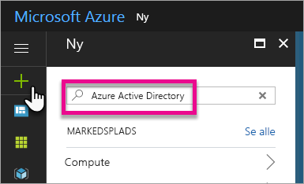
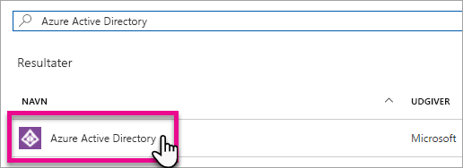
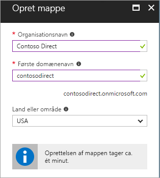
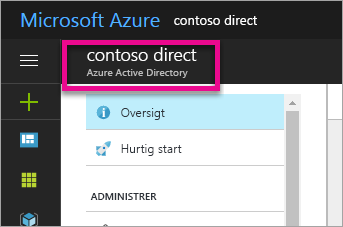
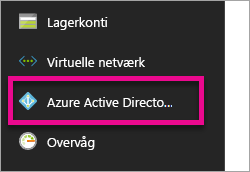
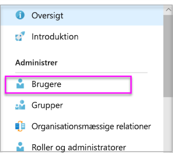
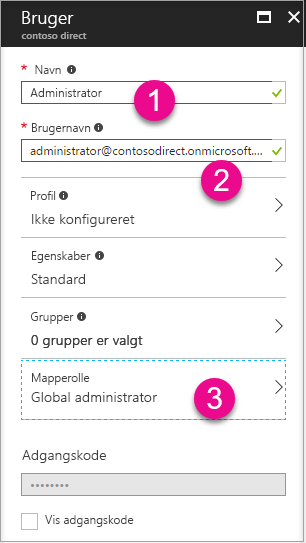
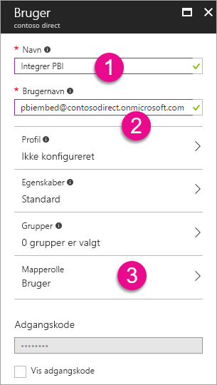
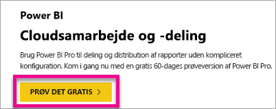

# Opret en Azure Active Directory-lejer, du kan bruge med Power BI

Du kan få mere at vide om, hvordan du opretter en ny Azure Active Directory-lejer (Azure AD) til et brugerdefineret program, der kalder [REST API'er for Power BI](../automation/rest-api-reference.md).

En lejer repræsenterer en organisation i Azure Active Directory. Det er en dedikeret instans af Azure AD-tjenesten, som en organisation modtager og ejer, når den tilmelder sig en Microsoft-cloudtjeneste, f.eks. Azure, Microsoft Intune eller Office 365. Hver enkelt Azure AD-lejer er specifik og adskilt fra andre Azure AD-lejere.

Når du har en Azure AD-lejer, kan du definere et program og tildele tilladelser, så programmet kan kalde REST API'er for [Power BI](../automation/rest-api-reference.md).

Din organisation har muligvis allerede en Azure AD-lejer, som du kan bruge til dit program. Du kan også oprette en ny lejer specifikt til dit program. I denne artikel kan du se, hvordan du opretter en ny lejer.

## Opret en Azure Active Directory-lejer

Hvis du vil integrere Power BI i dit brugerdefinerede program, skal du definere et program i Azure AD, hvilket kræver en Azure AD-mappe. Denne mappe er din *lejer*. Hvis din organisation endnu ikke har en lejer, fordi den ikke bruger Power BI eller Office 365, så [skal du oprette et udviklingsmiljø](https://docs.microsoft.com/azure/active-directory/develop/active-directory-howto-tenant). Du skal også oprette en, hvis du ikke vil have, at dit program bliver blandet med organisationens lejer, hvilket giver dig mulighed for at isolere ting. Eller måske vil du kun oprette et program til testformål.

Sådan opretter du en ny Azure AD-lejer:

1. Gå til [Azure Portal](https://portal.azure.com), og log på med en konto, der har et Azure-abonnement.

2. Vælg **plusikonet (+)** , og søg efter **Azure Active Directory**.

    

3. Vælg **Azure Active Directory** i søgeresultaterne.

    

4. Vælg **Opret**.

5. Angiv et **Organisationsnavn** og et **Indledende domænenavn**. Vælg derefter **Opret**. Mappen er oprettet.

    

   > [!NOTE]
   > Det indledende domæne er en del af onmicrosoft.com. Du kan tilføje andre domænenavne senere. En lejermappe kan have flere domæner tilknyttet.

6. Når mappen er blevet oprettet, skal du markere oplysningsfeltet for at administrere din nye mappe.

Derefter skal du tilføje brugere af lejeren.

## Opret brugere af Azure Active Directory-lejeren

Nu, hvor vi har en mappe, skal vi oprette mindst to brugere. En har rollen Global administrator for lejeren, og den anden er overordnet bruger i forbindelse med integrering. Du kan tænke på sidstnævnte som en tjenestekonto.

1. Kontrollér, at du er på udfoldningsfanen Azure Active Directory på Azure Portal.

    

    Hvis det ikke er tilfældet, skal du vælge ikonet for Azure Active Directory i navigationen for tjenester til venstre.

    

2. Under **Administrer** skal du vælge **Brugere**.

    

3. Vælg **Alle brugere**, og vælg derefter **+ ny bruger**.

4. Angiv et **Navn** og **Brugernavn** for den Globale administrator for lejeren. Skift **Mapperollen** til **Global administrator**. Du kan også få vist den midlertidige adgangskode. Når du er færdig, skal du vælge **Opret**.

    

5. Gør det samme for en almindelige bruger af lejeren. Du kan bruge denne konto til din overordnede integreringskonto. Lad **Mapperolle** være angivet som **Bruger** på nuværende tidspunkt. Angiv adgangskoden, og vælg derefter **Opret**.

    

6. Tilmeld dig Power BI med den konto, du oprettede under trin 5. Gå til [powerbi.com](https://powerbi.microsoft.com/get-started/), og vælg **Prøv gratis** under **Power BI – Cloudsamarbejde og deling**.

    

    Når du tilmelder dig, bliver du spurgt, om du vil prøve Power BI Pro gratis i 60 dage. Det kan du vælge at gøre, så du kan blive Pro-bruger, hvilket giver dig mulighed for at [begynde at udvikle en integreret løsning](embed-sample-for-customers.md).

   > [!NOTE]
   > Sørg for at tilmelde dig med mailadressen for din brugerkonto.

## Næste trin

Nu, hvor du har en Azure AD-lejer, kan du bruge denne lejer til at teste elementer i Power BI. Du kan også integrere Power BI-dashboards og -rapporter i dit program. Du kan finde flere oplysninger i [Sådan integrerer du Power BI-dashboards, -rapporter og -felter](embed-sample-for-customers.md).

[Hvad er en Azure Active-mappe?](https://docs.microsoft.com/azure/active-directory/active-directory-whatis) 
 
[Hurtig start: Konfigurer et udviklingsmiljø](https://docs.microsoft.com/azure/active-directory/develop/active-directory-howto-tenant)  

Har du flere spørgsmål? [Prøv at spørge Power BI-community'et](https://community.powerbi.com/)
