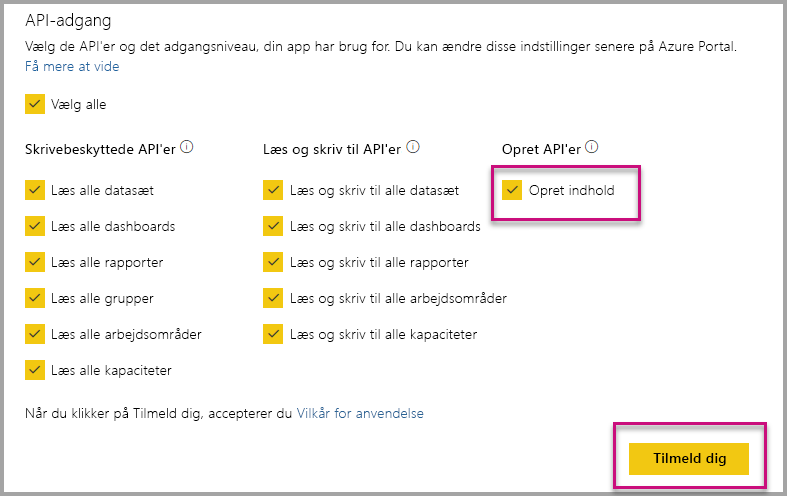

# Installér Power BI-apps automatisk, når du integrerer for din organisation

Hvis du vil integrere indhold fra en app, skal den bruger, der integrerer, have [adgang til appen](../../service-create-distribute-apps.md). Hvis appen er installeret for brugeren, fungerer integrering uden problemer. Du kan finde flere oplysninger i [Integrer rapporter eller dashboards fra app](embed-from-apps.md). Det er muligt at definere, at alle apps kan [installeres automatisk](https://powerbi.microsoft.com/blog/automatically-install-apps/) på PowerBI.com. Denne handling udføres dog på lejerniveau og gælder for alle apps.

## Installér appen automatisk i forbindelse med integrering

Hvis en bruger har adgang til en app, men appen ikke er installeret, fungerer integrering ikke. Så du kan undgå disse fejl, når du integrerer fra en app, ved at tillade automatisk installation af appen i forbindelse med integrering. Denne handling betyder, at hvis den app, brugeren forsøger at integrere, ikke er installeret, installeres den automatisk for dig. Så det indhold, du vil have, integreres øjeblikkeligt, hvilket resulterer i en problemfri oplevelse for brugeren.

## Integrer for Power BI-brugere (brugeren ejer data)

Hvis du vil tillade automatisk installation af apps for dine brugere, skal du give appen tilladelsen "Opret indhold", når du [registrerer appen](register-app.md#register-with-the-power-bi-application-registration-tool), eller tilføje den, hvis du allerede har registreret appen.

Derefter skal du angive app-id'et i URL-adressen til integrering. For at angive app-id'et skal forfatteren af appen først installere appen og derefter bruge en af de understøttede [REST API-opkald for Power BI](https://docs.microsoft.com/rest/api/power-bi/) – [Hent rapporter](https://docs.microsoft.com/rest/api/power-bi/reports/getreports) eller [Hent dashboards](https://docs.microsoft.com/rest/api/power-bi/dashboards/getdashboards). Derefter skal forfatteren af appen tage URL-adressen til integrering fra REST API-svaret. App-id'et vises i URL-adressen, hvis indholdet er fra en app.  Når du har URL-adressen til integrering, kan du bruge den til at integrere regelmæssigt.

## Sikker integrering

Hvis du vil bruge automatisk installation af apps, skal forfatteren af appen først installere appen og derefter gå til appen på PowerBI.com, navigere til rapporten og hente linket ligesom normalt. Alle andre brugere med adgang til appen, som kan bruge linket, kan integrere rapporten.

## Overvejelser og begrænsninger

* Du kan kun integrere rapporter og dashboards for dette scenarie.

* Denne funktion understøttes ikke i øjeblikket for scenarier, hvor appen ejer data og integrering med SharePoint.