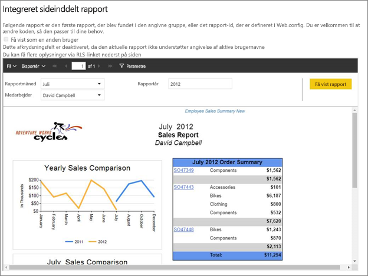
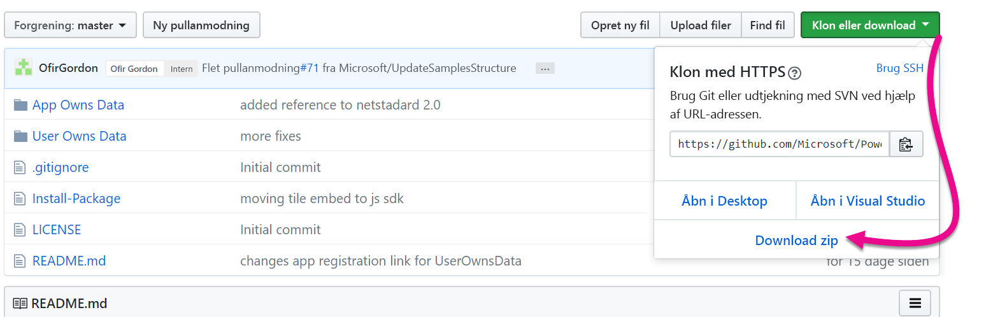
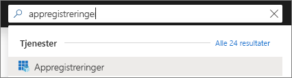
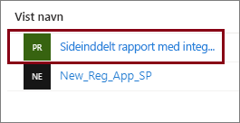
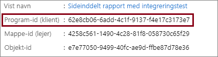
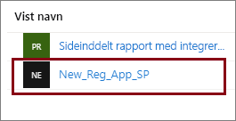
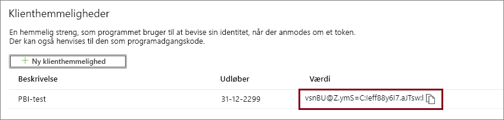
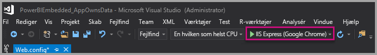
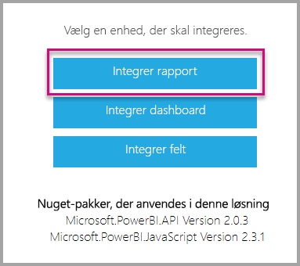

# <a name="tutorial-embed-power-bi-paginated-reports-into-an-application-for-your-customers-preview"></a>Selvstudium: Integrer sideinddelte Power BI-rapporter i et program til dine kunder (prøveversion)

Med **Power BI Embedded i Azure** eller **Power BI-integration i Office** kan du integrere sideinddelte rapporter i et program ved hjælp af "appen ejer dataene". **App owns data** handler om at have et program, der bruger Power BI som sin integrerede analyseplatform. Som **ISV** eller **udvikler** kan du oprette Power BI-indhold, der viser sideinddelte rapporter i et program, som er fuldt integreret og interaktivt, uden at brugerne skal have en Power BI-licens. I dette selvstudium kan du se, hvordan du integrerer en sideinddelt rapport i et program ved hjælp af Power BI .NET SDK med Power BI JavaScript-API'en.



I dette selvstudium lærer du, hvordan du kan:
> [!div class="checklist"]
> * Registrere en app i Azure.
> * Integrer en sideinddelt Power BI-rapport i et program.

## <a name="prerequisites"></a>Forudsætninger

Du skal have følgende for at komme i gang:

* En [tjenesteprincipal (kun app-token)](embed-service-principal.md)
* Et [Microsoft Azure](https://azure.microsoft.com/)-abonnement
* Din egen konfiguration af [Azure Active Directory-lejer](create-an-azure-active-directory-tenant.md)
* Mindst en [kapacitet](#create-a-dedicated-capacity) på A4-eller P1, hvor arbejdsbelastning for [sideinddelte rapporter](../../service-admin-premium-workloads.md#paginated-reports) er aktiveret

Hvis du ikke har et Azure-abonnement, skal du oprette en [gratis konto](https://azure.microsoft.com/free/?WT.mc_id=A261C142F), før du begynder.

> [!IMPORTANT]
> * Du skal bruge en **tjenesteprincipal**. Masterbruger understøttes ikke.
> * Datakilder, der kræver enkeltlogon (SSO), understøttes ikke.
> * Power BI-datasæt understøttes ikke som en [datakilde](../../service-get-data.md).

## <a name="set-up-your-power-bi-environment"></a>Konfigurer dit Power BI-miljø

Hvis du integrerer en sideinddelt rapport, skal du tildele et arbejdsområde til en dedikeret kapacitet og uploade rapporten til arbejdsområdet.

### <a name="create-an-app-workspace"></a>Opret et apparbejdsområde

Men hvis du bruger en [tjenesteprincipal](embed-service-principal.md) til at logge på dit program, skal du bruge de [nye arbejdsområder](../../service-create-the-new-workspaces.md). Som *tjenesteprincipal* skal du også være administrator for eller medlem af de apparbejdsområder, der er knyttet til dit program.

### <a name="create-a-dedicated-capacity"></a>Opret en dedikeret kapacitet

Før du importerer eller uploader en sideinddelt rapport, der skal integreres, skal det arbejdsområde, der indeholder rapporten, være tildelt til mindst en kapacitet på A4 eller P1. Du kan vælge mellem to kapacitetstyper:
* **Power BI Premium** – når du integrerer en sideinddelt rapport, kræves der en *P*-SKU-kapacitet. Når du integrerer Power BI-indhold, kaldes denne løsning for *Power BI integration*. Du kan finde flere oplysninger om dette abonnement under [Hvad er Power BI Premium?](../../service-premium-what-is.md)
* **Azure Power BI Embedded** – du kan købe en dedikeret kapacitet på [Microsoft Azure-portalen](https://portal.azure.com). Dette abonnement bruger *A*-SKU'erne. Hvis du vil integrere sideinddelte rapporter, skal du mindst have et *A4*-abonnement. Du kan finde flere oplysninger om, hvordan du opretter en kapacitet til Power BI Embedded, under [Opret kapacitet til Power BI Embedded på Azure-portalen](azure-pbie-create-capacity.md).

I nedenstående tabel beskrives ressourcerne og grænserne for de enkelte SKU'er. Hvis du vil finde ud af, hvilken kapacitet der passer bedst til dine behov, skal du se tabellen [Hvilken SKU skal jeg købe til mit scenarie?](https://docs.microsoft.com/power-bi/developer/embedded-faq#which-solution-should-i-choose)

| Kapacitetsnoder | V-kerner i alt | Backend-v-kerner | RAM (GB) | Frontend-v-kerner | 
| --- | --- | --- | --- | --- |
| P1/A4 | 8 | 4 | 25 | 4 |
| P2/A5 | 16 | 8 | 50 | 8 |
| P3/A6 | 32 | 16 | 100 | 16 |
| | | | | |

### <a name="assign-an-app-workspace-to-a-dedicated-capacity"></a>Tildel et apparbejdsområde til en dedikeret kapacitet

Når du opretter en dedikeret kapacitet, kan du tildele dit apparbejdsområde til den dedikerede kapacitet.

Hvis du vil tildele en dedikeret kapacitet til et arbejdsområde ved hjælp af en [tjenesteprincipal](embed-service-principal.md), skal du bruge [REST API'er til Power BI](https://docs.microsoft.com/rest/api/power-bi/capacities/groups_assigntocapacity). Når du bruger REST API'er til Power BI, skal du sørge for at bruge [objekt-id'et for tjenesteprincipalen](embed-service-principal.md).

### <a name="create-and-upload-your-paginated-reports"></a>Opret og upload dine sideinddelte rapporter

Du kan oprette din sideinddelte rapport ved hjælp af [Power BI Report Builder](../../paginated-reports/paginated-reports-report-builder-power-bi.md#create-reports-in-power-bi-report-builder)og derefter [uploade rapporten til tjenesten](../../paginated-reports/paginated-reports-quickstart-aw.md#upload-the-report-to-the-service).

Du kan importere sideinddelte rapporter i de nye arbejdsområder ved hjælp af [REST API'erne til Power BI](https://docs.microsoft.com/rest/api/power-bi/imports/postimportingroup).

## <a name="embed-content-using-the-sample-application"></a>Integrer indhold ved hjælp af eksempelprogrammet

Dette eksempel er med vilje enkelt, da det kun skal bruges til demonstrationen. Det er op til dig eller dine udviklere at beskytte programhemmeligheden.

Følg nedenstående trin for at begynde at integrere indhold ved hjælp af eksempelprogrammet.

1. Download [Visual Studio](https://www.visualstudio.com/) (version 2013 eller nyere). Sørg for at downloade den nyeste [NuGet-pakke](https://www.nuget.org/profiles/powerbi).

2. Download [eksemplet, hvor appen ejer data,](https://github.com/Microsoft/PowerBI-Developer-Samples) fra GitHub for at komme i gang.

    

3. Åbn filen **Web.config** i eksempelprogrammet. Der er nogle felter, du skal udfylde, for at køre programmet. Du kan vælge **ServicePrincipal** som **AuthenticationType**.

    Udfyld følgende felter:
    * [applicationId](#application-id)
    * [workspaceId](#workspace-id)
    * [reportId](#report-id)
    * [applicationsecret](#application-secret)
    * [tenant](#tenant)

    > [!Note]
    > **Standardgodkendelsestypen** i dette eksempel er MasterUser. Kontrollér, at du har ændret den til **ServicePrincipal**. 


    

### <a name="application-id"></a>Program-id

Udfyld oplysningerne om **applicationId** med **program-id'et** fra **Azure**. **Program-id'et** bruges af programmet til at identificere sig selv over for de brugere, du anmoder om tilladelser fra.

Hvis du vil hente **applicationId**, skal du følge disse trin:

1. Log på [Azure-portalen](https://portal.azure.com).

2. Vælg **Alle tjenester** i navigationsruden til venstre, og søg efter **Appregistreringer**.

    

3. Vælg programmet, der skal bruge **applicationId**.

    

4. Der er angivet et **program-id** som GUID. Brug dette **Program-id** som **applicationId** for programmet.

    

### <a name="workspace-id"></a>Id for arbejdsområde

Udfyld oplysningerne for **workspaceId** med GUID for programarbejdsområdet fra Power BI. Du kan få disse oplysninger enten fra URL-adressen, når du er logget på Power BI-tjenesten, eller ved hjælp af PowerShell.

URL-adresse <br>


PowerShell <br>

```powershell
Get-PowerBIworkspace -name "Paginated Report Embed"
```

   

### <a name="report-id"></a>Rapport-id

Udfyld **reportId** med GUID for rapporten fra Power BI. Du kan få disse oplysninger enten fra URL-adressen, når du er logget på Power BI-tjenesten, eller ved hjælp af PowerShell.

URL-adresse<br>


PowerShell <br>

```powershell
Get-PowerBIworkspace -name "Paginated Report Embed" | Get-PowerBIReport
```


### <a name="application-secret"></a>Programhemmelighed

Udfyld oplysningerne for **ApplicationSecret** ud fra sektionen **Nøgler** i sektionen **Appregistreringer** i **Azure**.

Hvis du vil hente **ApplicationSecret**, skal du følge disse trin:

1. Log på [Azure Portal](https://portal.azure.com).

2. Vælg **Alle tjenester** i navigationsruden til venstre, og søg efter **Appregistreringer**.

    

3. Vælg programmet, der skal bruge **ApplicationSecret**.

    

4. Vælg **Certifikater og hemmeligheder** under **Administrer**.

5. Vælg **Nye kundehemmeligheder**.

6. Angiv et navn i feltet **Beskrivelse**, og vælg en varighed. Vælg derefter **Gem** for at hente **værdien** til dit program. Når du lukker ruden **Nøgler** efter at have gemt nøgleværdien, vises feltet med værdien kun som skjult. På det tidspunkt kan du ikke hente nøgleværdien. Hvis du mister nøgleværdien, skal du oprette en ny i Azure Portal.

    

### <a name="tenant"></a>Lejer

Udfyld oplysningerne om **tenant** med dit lejer-id til Azure. Du kan få disse oplysninger fra [Azure AD Administration](/onedrive/find-your-office-365-tenant-id), når du er logget på Power BI-tjenesten, eller ved hjælp af PowerShell.

### <a name="run-the-application"></a>Kør programmet

1. Vælg **Kør** i **Visual Studio**.

    

2. Vælg derefter **Integrer rapport**.

    

3. Du kan nu se rapporten i eksempelprogrammet.

    

## <a name="embed-power-bi-paginated-reports-within-your-application"></a>Integrer sideinddelte Power BI-rapporter i dit program

Selvom trinnene til at integrere dine sideinddelte Power BI-rapporter udføres ved hjælp af [REST API'er til Power BI](https://docs.microsoft.com/rest/api/power-bi/), oprettes de eksempelkoder, der er beskrevet i denne artikel, med **.NET-SDK'en**.

Når du integrerer sideinddelte Power BI-rapporter for kunderne i dit program, kræver det, at du har en **Azure AD**-[tjenesteprincipal](embed-service-principal.md) og får et [Azure AD-adgangstoken](get-azuread-access-token.md#access-token-for-non-power-bi-users-app-owns-data) til dit Power BI-program, før du foretager kald til [REST API'erne til Power BI](https://docs.microsoft.com/rest/api/power-bi/).

Hvis du vil oprette Power BI-klienten med dit **adgangstoken**, skal du oprette dit Power BI klientobjekt, som gør det muligt for dig at interagere med [REST API'erne til Power BI](https://docs.microsoft.com/rest/api/power-bi/). Du kan oprette dit Power BI-klientobjekt ved at omgive **AccessToken** med objektet ***Microsoft.Rest.TokenCredentials***.

```csharp
using Microsoft.IdentityModel.Clients.ActiveDirectory;
using Microsoft.Rest;
using Microsoft.PowerBI.Api.V2;

var tokenCredentials = new TokenCredentials(authenticationResult.AccessToken, "Bearer");

// Create a Power BI Client object. it's used to call Power BI APIs.
using (var client = new PowerBIClient(new Uri(ApiUrl), tokenCredentials))
{
    // Your code to embed items.
}
```

### <a name="get-the-paginated-report-you-want-to-embed"></a>Hent den sideinddelte rapport, du vil integrere

Du kan bruge Power BI-klientobjektet til at hente en reference til det element, du vil integrere.

Her er et kodeeksempel på, hvordan du henter den første rapport fra et givent arbejdsområde.

*Du kan se et eksempel på, hvordan du henter et indholdselement, uanset om det er en rapport, et dashboard eller et felt, du vil integrere, i filen Services\EmbedService.cs i [eksempelprogrammet](https://github.com/Microsoft/PowerBI-Developer-Samples).*

```csharp
using Microsoft.PowerBI.Api.V2;
using Microsoft.PowerBI.Api.V2.Models;

// You need to provide the workspaceId where the dashboard resides.
ODataResponseListReport reports = await client.Reports.GetReportsInGroupAsync(workspaceId);

// Get the first report in the group.
Report report = reports.Value.FirstOrDefault();
```

### <a name="create-the-embed-token"></a>Opret integrationstokenet

Generer et integreringstoken, som kan bruges fra JavaScript-API'en. Hvis du vil oprette et integreringstoken til integrering af sideinddelte Power BI-rapporter, skal du bruge API'en [Reports GenerateTokenForCreateInGroup](https://docs.microsoft.com/rest/api/power-bi/embedtoken/reports_generatetokenforcreateingroup).

Du kan se et eksempel på, hvordan du opretter et integreringstoken, i filen  *Services\EmbedService.cs* i [eksempelprogrammet](https://github.com/Microsoft/PowerBI-Developer-Samples).

```csharp
using Microsoft.PowerBI.Api.V2;
using Microsoft.PowerBI.Api.V2.Models;

// Generate Embed Token.
var generateTokenRequestParameters = new GenerateTokenRequest(accessLevel: "view");
EmbedToken tokenResponse = client.Reports.GenerateTokenInGroup(workspaceId, report.Id, generateTokenRequestParameters);

// Generate Embed Configuration.
var embedConfig = new EmbedConfig()
{
    EmbedToken = tokenResponse,
    EmbedUrl = report.EmbedUrl,
    Id = report.Id
};
```

### <a name="load-an-item-using-javascript"></a>Indlæs et element ved hjælp af JavaScript

Du kan bruge JavaScript til at indlæse en sideinddelt rapport i et div-element på din webside.

Hvis du vil se et komplet eksempel, hvor JavaScript API'en bruges, kan du bruge [værktøjet Playground](https://microsoft.github.io/PowerBI-JavaScript/demo). Med værktøjet Playground kan du hurtigt prøve dig frem med forskellige typer af eksempler på Power BI Embedded. Du kan også få flere oplysninger om JavaScript-API'en ved at gå til siden [Wiki for PowerBI-JavaScript](https://github.com/Microsoft/powerbi-javascript/wiki).

## <a name="next-steps"></a>Næste trin

I dette selvstudium har du lært, hvordan du integrerer sideinddelte Power BI-rapporter i et program til dine kunder. Du kan også prøve at integrere Power BI-indhold til dine kunder eller din organisation.

> [!div class="nextstepaction"]
>[Integrer indhold til dine kunder](embed-sample-for-customers.md)

> [!div class="nextstepaction"]
>[Integrer indhold til din organisation](embed-sample-for-your-organization.md)

Har du flere spørgsmål? [Prøv at spørge Power BI-community'et](https://community.powerbi.com/)
