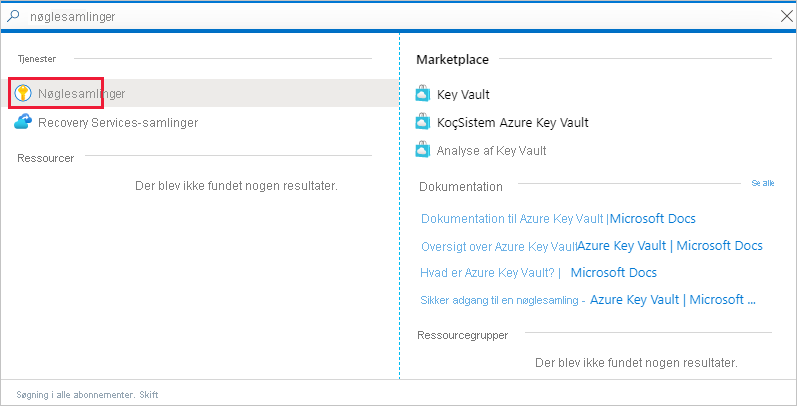
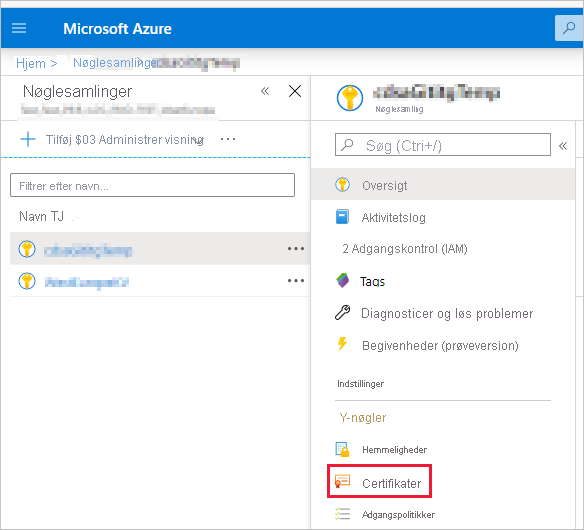
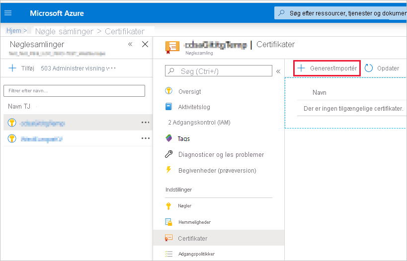
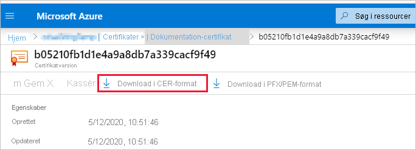
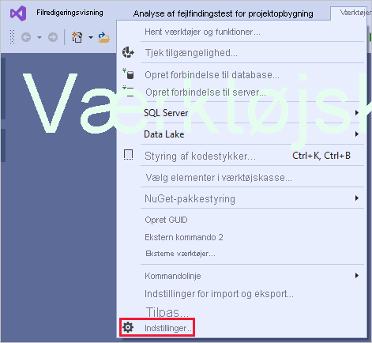
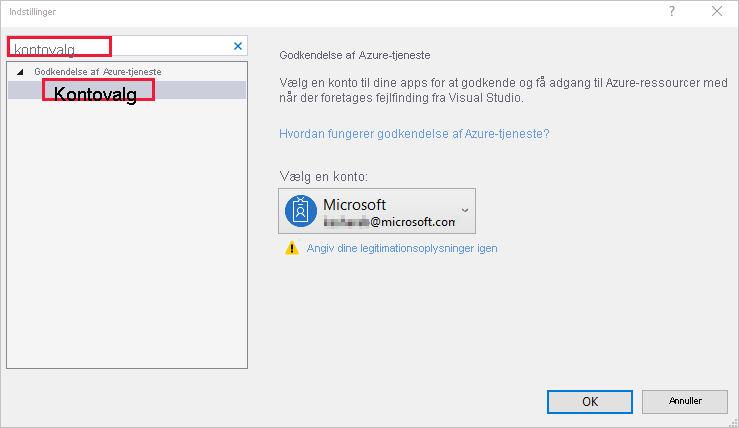

# <a name="embed-power-bi-content-with-service-principal-and-a-certificate"></a>Integrer Power BI-indhold med tjenesteprincipal og et certifikat

[!INCLUDE[service principal overview](../../includes/service-principal-overview.md)]

>[!NOTE]
>Vi anbefaler, at du sikrer dine backend-tjenester ved hjælp af certifikater i stedet for hemmelige nøgler. [Få mere at vide om at hente adgangstoken fra Azure AD ved hjælp af hemmelige nøgler eller certifikater](https://docs.microsoft.com/azure/architecture/multitenant-identity/client-assertion).

## <a name="certificate-based-authentication"></a>Certifikatbaseret godkendelse

Certifikatbaseret godkendelse gør det muligt for dig at blive godkendt af Azure Active Directory (Azure AD) med et klientcertifikat på en Windows-, Android- eller iOS-enhed eller opbevaret i en [Azure Key Vault](https://docs.microsoft.com/azure/key-vault/basic-concepts).

Ved hjælp af denne godkendelsesmetode kan du administrere certifikater fra et centralt sted ved hjælp af nøglecentret, til rotation eller tilbagekaldelse.

Du kan få mere at vide om certifikater i Azure AD på GitHub-siden [Klientens legitimationsoplysninger](https://github.com/AzureAD/microsoft-authentication-library-for-dotnet/wiki/Client-credential-flows).

## <a name="method"></a>Metode

Hvis du vil bruge tjenesteprincipalen og et certifikat med integreret analyse, skal du følge disse trin:

1. Opret et certifikat.

2. Opret en Azure AD-app.

3. Konfigurer certifikatgodkendelse.

4. Hent certifikatet fra Azure Key Vault.

5. Godkend ved hjælp af en tjenesteprincipal og et certifikat.

## <a name="step-1---create-a-certificate"></a>Trin 1 – Opret et certifikat

Du kan oprette et certifikat fra et *nøglecenter*, der er tillid til, eller du kan selv oprette et certifikat.

I dette afsnit beskrives det, hvordan du opretter et certifikat ved hjælp af [Azure Key Vault](https://docs.microsoft.com/azure/key-vault/create-certificate) og downloader *.cer-* filen, som indeholder den offentlige nøgle.

1. Log på [Microsoft Azure](https://ms.portal.azure.com/#allservices).

2. Søg efter **Key Vaults**, og klik på linket **Key Vaults**.

    

3. Klik på den key vault, du vil føje et certifikat til.

    

4. Klik på **Certifikater**.

    

5. Klik på **Generer/Importér**.

    

6. Konfigurer feltet **Opret et certifikat** på følgende måde:

    * **Metode til oprettelse af certifikat** – Generelt

    * **Certifikatnavn** – Angiv et navn til certifikatet

    * **Type nøglecenter** – Selvsigneret certifikat

    * **Emne** – Et [X.500](https://wikipedia.org/wiki/X.500)-entydigt navn

    * **DNS-navne** – 0 DNS-navne

    * **Gyldighedsperiode (i måneder)** – Angiv certifikatets gyldighedsperiode

    * **Indholdstype** – PKCS #12

    * **Handlingstype for levetiden** – Forny automatisk til en given procents levetid

    * **Procents levetid** – 80

    * **Konfiguration af avanceret politik** – Ikke konfigureret

7. Klik på **Opret**. Det netop oprettede certifikat er deaktiveret som standard. Det kan tage op til fem minutter at blive aktiveret.

8. Vælg det certifikat, du har oprettet.

9. Klik på **Download i CER-format**. Den downloadede fil indeholder den offentlige nøgle.

    

## <a name="step-2---create-an-azure-ad-application"></a>Trin 2 – Opret et Azure AD-program

[!INCLUDE[service principal create app](../../includes/service-principal-create-app.md)]

## <a name="step-3---set-up-certificate-authentication"></a>Trin 3 – Konfigurer certifikatgodkendelse

1. I dit Azure AD-program skal du klikke på fanen **Certifikater og hemmeligheder**.

     

2. Klik på **Upload certifikat**, og upload den *.cer-* -fil, du har oprettet og downloadet, i [første trin](#step-1---create-a-certificate) i dette selvstudium. *.cer*-filen indeholder den offentlige nøgle.

## <a name="step-4---get-the-certificate-from-azure-key-vault"></a>Trin 4 – Hent certifikatet fra Azure Key Vault

Brug Managed Service Identity (MSI) til at hente certifikatet fra Azure Key Vault. Denne proces omfatter hentning af det *.pfx*-certifikat, der indeholder både offentlige og private nøgler.

Se kodeeksemplet til læsning af certifikatet fra Azure Key Vault. Hvis du vil bruge Visual Studio, kan du se [Konfigurer Visual Studio til at bruge MSI](#configure-visual-studio-to-use-msi).

```csharp
private X509Certificate2 ReadCertificateFromVault(string certName)
{
    var serviceTokenProvider = new AzureServiceTokenProvider();
    var keyVaultClient = new KeyVaultClient(new KeyVaultClient.AuthenticationCallback(serviceTokenProvider.KeyVaultTokenCallback));
    CertificateBundle certificate = null;
    SecretBundle secret = null;
    try
    {
        certificate = keyVaultClient.GetCertificateAsync($"https://{KeyVaultName}.vault.azure.net/", certName).Result;
        secret = keyVaultClient.GetSecretAsync(certificate.SecretIdentifier.Identifier).Result;
    }
    catch (Exception)
    {
        return null;
    }

    return new X509Certificate2(Convert.FromBase64String(secret.Value));
}
```

## <a name="step-5---authenticate-using-service-principal-and-a-certificate"></a>Trin 5 – Godkend ved hjælp af en tjenesteprincipal og et certifikat

Du kan godkende din app ved hjælp af tjenesteprincipalen og et certifikat, der er gemt i Azure Key Vault, ved at oprette forbindelse til Azure Key Vault.

Hvis du vil oprette forbindelse til og læse certifikatet fra Azure Key Vault, skal du se nedenstående kode.

>[!NOTE]
>Hvis du allerede har et certifikat, der er oprettet af din organisation, skal du overføre *.pfx-* -filen til Azure Key Vault.

```csharp
// Preparing needed variables
var Scope = "https://analysis.windows.net/powerbi/api/.default"
var ApplicationId = "{YourApplicationId}"
var tenantSpecificURL = "https://login.microsoftonline.com/{YourTenantId}/"
X509Certificate2 certificate = ReadCertificateFromVault(CertificateName);

// Authenticating with a SP and a certificate
public async Task<AuthenticationResult> DoAuthentication(){
    IConfidentialClientApplication clientApp = null;
    clientApp = ConfidentialClientApplicationBuilder.Create(ApplicationId)
                                                    .WithCertificate(certificate)
                                                    .WithAuthority(tenantSpecificURL)
                                                    .Build();
    try
    {
        authenticationResult = await clientApp.AcquireTokenForClient(Scope).ExecuteAsync();
    }
    catch (MsalException)
    {
        throw;
    }
    return authenticationResult
}
```

## <a name="configure-visual-studio-to-use-msi"></a>Konfigurer Visual Studio til at bruge MSI

Når du opretter din integrerede løsning, kan det være en god ide at konfigurere Visual Studio til at bruge Managed Service Identity (MSI). [MSI](https://docs.microsoft.com/azure/active-directory/managed-identities-azure-resources/overview) er en funktion, der gør det muligt for dig at administrere din Azure AD-identitet. Når den er konfigureret, kan Visual Studio godkende i forhold til din Azure Key Vault.

1. Åbn dit projekt i Visual Studio.

2. Klik på **Værktøjer** > **Indstillinger**.

     

3. Søg efter **Kontovalg**, og klik på **Kontovalg**.

    

4. Tilføj den konto, der har adgang til din Azure Key Vault.

[!INCLUDE[service principal limitations](../../includes/service-principal-limitations.md)]

## <a name="next-steps"></a>Næste trin

>[!div class="nextstepaction"]
>[Registrer et program](register-app.md)

>[!div class="nextstepaction"]
>[Power BI Embedded til dine kunder](embed-sample-for-customers.md)

>[!div class="nextstepaction"]
>[Objekter for et program og en tjenesteprincipal i Azure Active Directory](https://docs.microsoft.com/azure/active-directory/develop/app-objects-and-service-principals)

>[!div class="nextstepaction"]
>[Sikkerhed på rækkeniveau ved hjælp af datagateway i det lokale miljø med tjenesteprincipal](embedded-row-level-security.md#on-premises-data-gateway-with-service-principal)

>[!div class="nextstepaction"]
>[Integrer Power BI-indhold med tjenesteprincipal og en programhemmelighed](embed-service-principal.md)