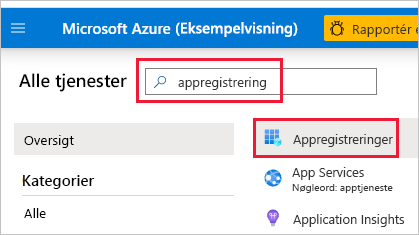
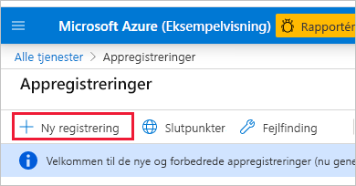
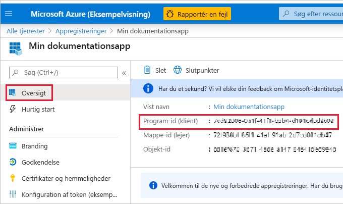
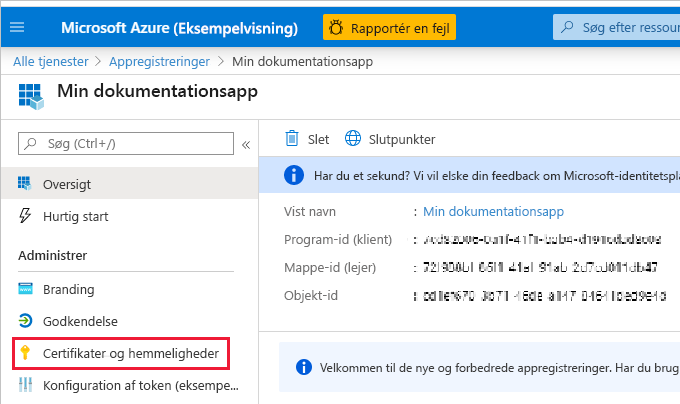
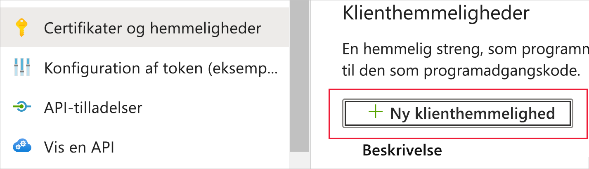
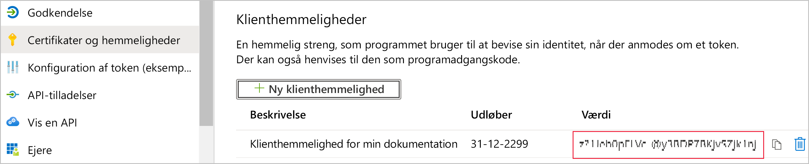
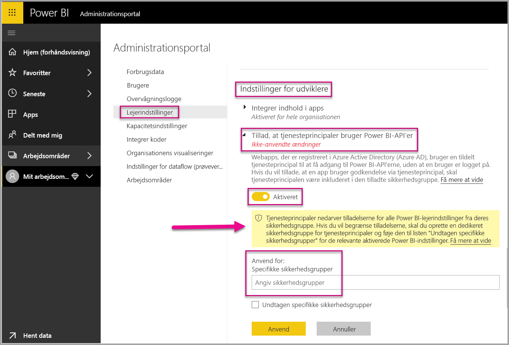
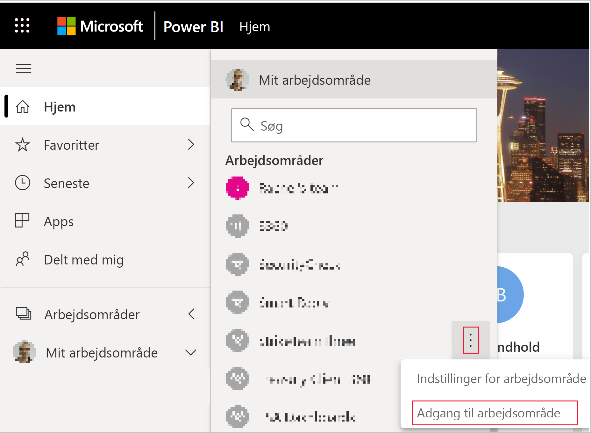
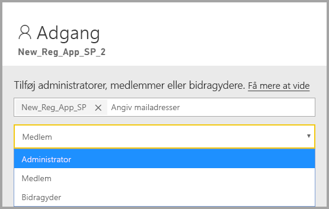

# <a name="embedding-power-bi-content-with-service-principal-and-application-secret"></a>Integrering af Power BI-indhold med tjenesteprincipal og programhemmelighed

[!INCLUDE[service principal overview](../../includes/service-principal-overview.md)]

I denne artikel beskrives godkendelse af tjenesteprincipalen ved hjælp af et *program-id* og en *programhemmelighed*.

## <a name="method"></a>Metode

Hvis du vil bruge tjenesteprincipalen og et program-id med integreret analyse, skal du følge disse trin:

1. Opret en [Microsoft Azure AD-app](https://docs.microsoft.com/azure/active-directory/manage-apps/what-is-application-management).

    1. Opret Microsoft Azure AD-appens hemmelighed.
    
    2. Hent appens *program-id* og *programhemmelighed*.

    >[!NOTE]
    >Disse trin er beskrevet i **trin 1**. Du kan finde flere oplysninger om, hvordan du opretter en Microsoft Azure AD-app, i artiklen [Opret en Microsoft Azure ADD-app](https://docs.microsoft.com/azure/active-directory/develop/howto-create-service-principal-portal).

2. Opret en Microsoft Azure AD-sikkerhedsgruppe.

3. Aktivér indstillingerne for Power BI-tjenesteadministration.

4. Føj tjenesteprincipalen til dit arbejdsområde.

5. Integrer dit indhold.

> [!IMPORTANT]
> Når du aktiverer en tjenesteprincipal, der skal bruges med Power BI, er AD-tilladelserne for programmet ikke længere gældende. Tilladelserne for programmet administreres derefter via Power BI-administrationsportalen.

## <a name="step-1---create-an-azure-ad-app"></a>Trin 1 – Opret en Microsoft Azure AD-app

Opret en Microsoft Azure AD-app ved hjælp af en af disse metoder:
* Opret appen i [Microsoft Azure-portalen](https://portal.azure.com/#allservices)
* Opret appen ved hjælp af [PowerShell-](https://docs.microsoft.com/powershell/azure/create-azure-service-principal-azureps?view=azps-3.6.1).

### <a name="creating-an-azure-ad-app-in-the-microsoft-azure-portal"></a>Oprettelse af en Microsoft Azure AD-app i Microsoft Azure-portalen

1. Log på [Microsoft Azure](https://portal.azure.com/#allservices).

2. Søg efter **appregistreringer**, og klik på linket **Appregistreringer**.

    

3. Klik på **Ny registrering**.

    

4. Udfyld de påkrævede oplysninger:
    * **Navn** – Angiv et navn til programmet
    * **Understøttede kontotyper** – vælg den Azure AD-konto, du har brug for
    * (Valgfrit) **URI til omdirigering** – Angiv en URI, hvis det er nødvendigt

5. Klik på **Registrer**.

6. Efter registrering er *program-id'et* tilgængeligt via fanen **Oversigt**. Kopiér og gem *program-id'et* til senere brug.

    

7. Klik på fanen **Certifikater og hemmeligheder**.

     

8. Klik på **Ny klienthemmelighed**

    

9. Angiv en beskrivelse i vinduet *Tilføj klienthemmelighed*, angiv, hvornår klientens hemmelighed skal udløbe, og klik på **Tilføj**.

10. Kopiér og gem værdien for *Klienthemmelighed*.

    

    >[!NOTE]
    >Når du forlader dette vindue, skjules værdien for klienthemmeligheden, og du kan ikke se eller kopiere den igen.

### <a name="creating-an-azure-ad-app-using-powershell"></a>Oprettelse af en Microsoft Azure AD-app ved hjælp af PowerShell

Dette afsnit indeholder et eksempelscript til oprettelse af en ny Microsoft Azure AD-app ved hjælp af [PowerShell](https://docs.microsoft.com/powershell/azure/create-azure-service-principal-azureps?view=azps-1.1.0).

```powershell
# The app ID - $app.appid
# The service principal object ID - $sp.objectId
# The app key - $key.value

# Sign in as a user that's allowed to create an app
Connect-AzureAD

# Create a new Azure AD web application
$app = New-AzureADApplication -DisplayName "testApp1" -Homepage "https://localhost:44322" -ReplyUrls "https://localhost:44322"

# Creates a service principal
$sp = New-AzureADServicePrincipal -AppId $app.AppId

# Get the service principal key
$key = New-AzureADServicePrincipalPasswordCredential -ObjectId $sp.ObjectId
```

## <a name="step-2---create-an-azure-ad-security-group"></a>Trin 2 – Opret en Microsoft Azure AD-sikkerhedsgruppe

Din tjenesteprincipal har ikke adgang til Power BI-indholdet og API'erne. Hvis du vil give tjenesteprincipalen adgang, skal du oprette en sikkerhedsgruppe i Microsoft Azure AD og tilføje den tjenesteprincipal, du har oprettet til den pågældende sikkerhedsgruppe.

Du kan oprette en Microsoft Azure AD-sikkerhedsgruppe på to måder:
* Manuelt (i Azure)
* Brug af PowerShell

### <a name="create-a-security-group-manually"></a>Opret en sikkerhedsgruppe manuelt

Hvis du vil oprette en Azure-sikkerhedsgruppe manuelt, skal du følge vejledningen i artiklen [Opret en basisgruppe, og tilføj medlemmer ved hjælp af Azure Active Directory (Create a basic group and add members using Azure Active Directory)](https://docs.microsoft.com/azure/active-directory/fundamentals/active-directory-groups-create-azure-portal). 

### <a name="create-a-security-group-using-powershell"></a>Opret en sikkerhedsgruppe ved hjælp af PowerShell

Nedenfor er et eksempelscript, der kan bruges til at oprette en ny sikkerhedsgruppe og føje et program til den pågældende sikkerhedsgruppe.

>[!NOTE]
>Hvis du vil give tjenesteprincipaler adgang til hele organisationen, skal du springe dette trin over.

```powershell
# Required to sign in as a tenant admin
Connect-AzureAD

# Create an Azure AD security group
$group = New-AzureADGroup -DisplayName <Group display name> -SecurityEnabled $true -MailEnabled $false -MailNickName notSet

# Add the service principal to the group
Add-AzureADGroupMember -ObjectId $($group.ObjectId) -RefObjectId $($sp.ObjectId)
```

## <a name="step-3---enable-the-power-bi-service-admin-settings"></a>Trin 3 – Aktivér indstillingerne for Power BI-tjenesteadministration

Hvis en Microsoft Azure AD-app skal kunne få adgang til Power BI-indholdet og API'erne, skal en Power BI-administrator have mulighed for at aktivere adgangen til tjenesteprincipalen i Power BI-administrationsportalen.

Føj den sikkerhedsgruppe, du oprettede i Microsoft Azure AD, til det specifikke afsnit for sikkerhedsgruppen under **Indstillinger for udvikler**.

>[!IMPORTANT]
>Tjenesteprincipalerne har adgang til alle de lejerindstillinger, de er aktiveret for. Afhængigt af administratorindstillingerne omfatter dette specifikke sikkerhedsgrupper eller hele organisationen.
>
>Hvis du vil begrænse tjenesteprincipalers adgang til specifikke lejerindstillinger, skal du kun give adgang til specifikke sikkerhedsgrupper. Du kan også oprette en dedikeret sikkerhedsgruppe til tjenesteprincipaler og udelukke den fra de ønskede lejerindstillinger.



## <a name="step-4---add-the-service-principal-as-an-admin-to-your-workspace"></a>Trin 4 – Tilføj tjenesteprincipalen som administrator til dit arbejdsområde

Hvis du vil aktivere dine Microsoft Azure AD-adgangsartefakter, f. eks. rapporter, dashboards og datasæt i Power BI-tjenesten, skal du tilføje tjenestens principalenhed som medlem eller administrator til dit arbejdsområde.

>[!NOTE]
>Dette afsnit indeholder instruktioner til brugergrænsefladen. Du kan også føje en tjenesteprincipal til et arbejdsområde ved hjælp af [Grupper – Tilføj API for gruppebruger](https://docs.microsoft.com/rest/api/power-bi/groups/addgroupuser).

1. Rul til det arbejdsområde, du vil aktivere adgang til, og vælg **Adgang til arbejdsområde** i menuen **Mere**.

    

2. Tilføj tjenesteprincipalen som **Administrator** eller **Medlem** til det nye arbejdsområde.

    

## <a name="step-5---embed-your-content"></a>Trin 5 – Integrer dit indhold

Du kan integrere dit indhold i et eksempelprogram eller i dit eget program.

* [Integrer indhold ved hjælp af eksempelprogrammet](embed-sample-for-customers.md#embed-content-using-the-sample-application)
* [Integrer indhold i dit program](embed-sample-for-customers.md#embed-content-within-your-application)

Når dit indhold er integreret, er du klar til at [gå videre til produktionen](embed-sample-for-customers.md#move-to-production).

## <a name="considerations-and-limitations"></a>Overvejelser og begrænsninger

* Tjenesteprincipalen fungerer kun med [nye arbejdsområder](../../collaborate-share/service-create-the-new-workspaces.md).
* **Mit arbejdsområde** understøttes ikke til brug sammen med tjenesteprincipalen.
* Der kræves dedikeret kapacitet for at kunne begynde at producere.
* Du kan ikke logge på Power BI-portalen ved hjælp af en tjenesteprincipal.
* Der kræves rettigheder som Power BI-administrator for at kunne aktivere tjenesteprincipalen under Indstillinger for udvikler på Power BI-administrationsportalen.
* Programmer til [integration i din organisation](embed-sample-for-your-organization.md) kan ikke bruge en tjenesteprincipal.
* Administration af [dataflow](../../transform-model/service-dataflows-overview.md) understøttes ikke.
* Tjenesteprincipaler understøtter i øjeblikket ingen administrator-API'er.
* Når du bruger en tjenesteprincipal med en [Azure Analysis Services](https://docs.microsoft.com/azure/analysis-services/analysis-services-overview)-datakilde, skal selve tjenesteprincipalen have tilladelser til en forekomst af Azure Analysis Services. Brug af en sikkerhedsgruppe, der indeholder tjenesteprincipalen til dette formål, fungerer ikke.

## <a name="next-steps"></a>Næste trin

* [Power BI Embedded til dine kunder](embed-sample-for-customers.md)

* [Sikkerhed på rækkeniveau ved hjælp af datagateway i det lokale miljø med tjenesteprincipal](embedded-row-level-security.md#on-premises-data-gateway-with-service-principal)
