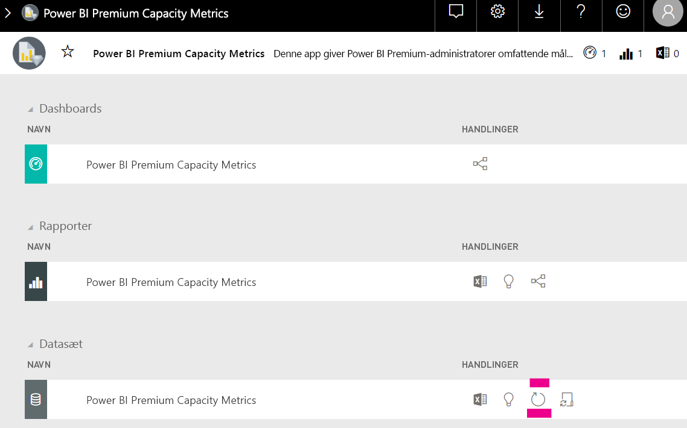

# Kapacitetsplanlægning i Power BI Embedded-analyser

Det kan være kompliceret at beregne, hvilken type kapacitet der kræves for udrulningen af en Power BI Embedded-analyse. Det skyldes, at denne beregning er baseret på flere parametre, hvoraf nogle af dem er vanskelige at forudsige.

Nogle af de ting, du skal tage højde for, når du planlægger din kapacitet, er:

* De datamodeller, du bruger.
* Antallet og kompleksiteten af de påkrævede forespørgsler.
* Timefordelingen af forbruget af dit program.
* Dataopdateringshastigheder.
* Yderligere forbrugsmønstre, der er vanskelige at forudsige.

Denne artikel har til formål at lette kapacitetsplanlægningen i forbindelse med Power BI Embedded-analyser ved at introducere [værktøj til evaluering af arbejdsbelastning for dedikerede kapaciteter i Power BI](https://github.com/microsoft/PowerBI-Tools-For-Capacities/tree/master/LoadTestingPowerShellTool/), der er udviklet til automatisering af belastningstest for kapaciteter til Power BI Embedded-analyser (*A-* , *EM-* eller *P*-SKU'er).

## Planlægningsværktøj

 [Værktøjet til evaluering af arbejdsbelastning for dedikerede kapaciteter i Power BI](https://github.com/microsoft/PowerBI-Tools-For-Capacities/tree/master/LoadTestingPowerShellTool/) kan hjælpe dig med at forstå, hvor meget brugerbelastning din kapacitet kan håndtere. Værktøjet gør brug af PowerShell til at oprette automatiserede belastningstest i forhold til dine kapaciteter, og du kan vælge, hvilke rapporter der skal testes, og hvor mange samtidige brugere der skal simuleres.

Værktøjet opretter belastning på en kapacitet ved løbende at gengive hver rapport med nye filterværdier (for at forhindre en realistisk god ydeevne, der skyldes cachelagring af rapporten), indtil det token, der kræves for at godkende værktøjet i forhold til tjenesten, udløber.

### Brug af planlægningsværktøjet

Når du kører værktøjet, skal du være opmærksom på den eksisterende belastning af dine kapaciteter og sikre, at du ikke kører belastningstest på spidsbelastningstidspunkter.

Her er nogle eksempler på, hvordan du kan bruge planlægningsværktøjet.

* Kapacitetsadministratorer kan få en bedre forståelse af, hvor mange brugere deres kapacitet kan håndtere i et bestemt tidsrum.
* Rapportudviklere kan få en forståelse af brugerbelastningseffekten, som måles med Power BI Desktops [Ydeevneanalyse](https://docs.microsoft.com/power-bi/desktop-performance-analyzer).
* Du kan se, at gengivelser sker i realtid i din browser.
* Du kan ved at bruge SQL Server Profiler [oprette forbindelse til XMLA-slutpunkterne](https://powerbi.microsoft.com/blog/power-bi-open-platform-connectivity-with-xmla-endpoints-public-preview/) for de kapaciteter, der måles, for at få vist de forespørgsler, der udføres.
* Belastningstesteffekterne er synlige på siden med datasæt for Premium Capacity Metrics-appen. Kapacitetsadministratorer kan bruge dette værktøj til at generere belastning og se, hvordan den pågældende belastning vises.

### Gennemgang af testresultaterne

Hvis du vil se virkningen af belastningstesten i appen Metrics, når testene er blevet kørt, skal du følge vejledningen nedenfor. Du kan forvente en forsinkelse på op til 15 minutter, fra det tidspunkt hvor testen starter med at generere belastning, indtil indlæsningen er synlig i målepunkterne.

1. Udvid fanen **Datasæt** på landingssiden i [Metrics-appen](../../service-admin-premium-monitor-capacity.md).
2. Start en opdatering efter behov ved at klikke på **Opdater nu**. Administratorer skal.

    

## GitHub-lager til Power BI-kapacitetsværktøjer

[GitHub-lageret til Power BI-kapacitetsværktøjer](https://github.com/microsoft/PowerBI-Tools-For-Capacities) blev oprettet til at hoste kapacitetsplanlægningsværktøjet og andre fremtidige værktøjer og hjælpeprogrammer.

Lageret har åben kildekode, og brugerne opfordres til at bidrage og tilføje yderligere værktøjer, der er relateret til Power BI Premium- og Embedded-kapaciteter, og forbedre de eksisterende.

## Næste trin

> [!div class="nextstepaction"]
>[Kapacitet og SKU'er i Power BI Embedded-analyser](embedded-capacity.md)

> [!div class="nextstepaction"]
>[Bedste praksis for ydeevnen i Power BI Embedded](embedded-performance-best-practices.md)