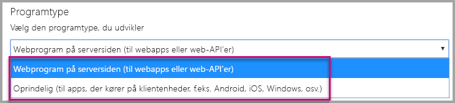
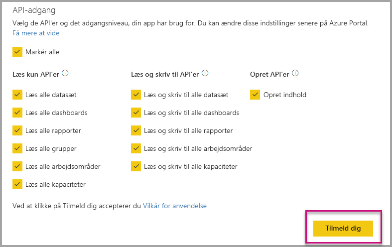
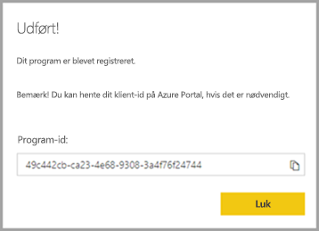
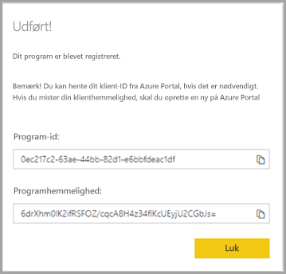
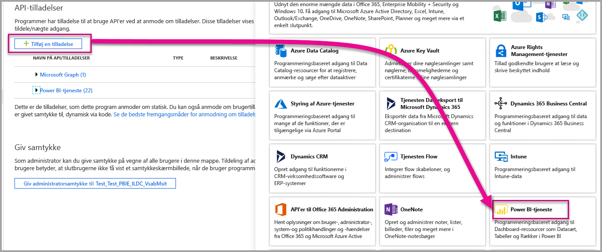

# <a name="register-an-azure-ad-application-to-use-with-power-bi"></a>Registrer et Azure AD-program, som skal bruges sammen med Power BI

Få mere at vide om, hvordan du registrerer et program i Azure Active Directory (Azure AD), som skal bruges til at integrere Power BI-indhold.

Du kan registrere dit program i Azure AD for at give programmet adgang til REST [API'erne til Power BI](https://docs.microsoft.com/rest/api/power-bi/). Når du har registreret dit program, kan du oprette en identitet for programmet og angive tilladelser til Power BI REST-ressourcer.

> [!IMPORTANT]
> Før du kan registrere et Power BI-app, skal du have en [Azure Active Directory-lejer og en organisationsbruger](create-an-azure-active-directory-tenant.md). Hvis du ikke har tilmeldt dig Power BI med en bruger i din lejer, fuldføres registreringen af appen ikke.

Der er to måder at registrere din app på. Den første er med brug af [værktøjet Power BI App Registration](https://dev.powerbi.com/apps/), men du kan også vælge at gøre det direkte fra Azure-portalen. Værktøjet Power BI App Registration er mere praktisk at bruge, da der kun er nogle få felter at udfylde. Brug Azure-portalen, hvis du vil foretage ændringer i din app.

## <a name="register-with-the-power-bi-application-registration-tool"></a>Registrer ved hjælp af værktøjet Power BI Application Registration

Du skal registrere dit program i **Azure Active Directory** for at kunne oprette en identitet for dit program og angive tilladelser til Power BI REST-ressourcer. Når du registrerer et program, f.eks. et konsolprogram eller et websted, modtager du en identifikator, som bruges af programmet til at identificere sig selv over for de brugere, der anmodes om tilladelser fra.

Sådan registrerer du dit program ved hjælp af værktøjet Power BI App Registration:

1. Gå til [dev.powerbi.com/apps](https://dev.powerbi.com/apps).

2. Vælg **Log på** med din eksisterende konto, og vælg derefter **Næste**.

3. Angiv et **programnavn**.

4. Angiv en **programtype**.

    Her kan du se, hvad forskellen er på at vælge **oprindeligt** i forhold til **serverbaseret webprogram** som programtype.

    Oprindeligt:
    * Du planlægger at oprette et program, der er [designet til dine kunder](embed-sample-for-customers.md), ved hjælp af en masterbrugerkonto (en Power BI Pro-licens, der bruges til at logge på Power BI) for at godkende.

    Serverbaseret webprogram:
    * Du planlægger at oprette et program, der er [designet til din organisation](embed-sample-for-your-organization.md).
    * Du planlægger at oprette et program, der er [designet til dine kunder](embed-sample-for-customers.md), ved hjælp af en tjenesteprincipal for at godkende.
    * Du planlægger at oprette webprogrammer eller web-API'er.

    

5. Hvis du har valgt **serverbaseret webprogram** som programtype, skal du fortsætte med at angive en værdi for **URL-adresse til startside** og **URL-adresse til omdirigering**. **URL-adressen til omdirigering** fungerer sammen med en hvilken som helst gyldig URL-adresse og bør stemme overens med det program, du har oprettet. Hvis du har valgt **oprindeligt**, skal du fortsætte til trin 6.

6. Vælg de Power BI-API'er, som dit program har brug for. Du kan få flere oplysninger om adgangstilladelser til Power BI i [Power BI-tilladelser](power-bi-permissions.md). Vælg derefter **Registrer**.

    

    > [!Important]
    > Hvis du aktiverer tjenesteprincipaler, der skal bruges med Power BI, er Azure Active Directory-tilladelserne ikke længere gældende. Tilladelserne administreres via Power BI-administrationsportalen.

7. Hvis du vælger **oprindeligt** som programtype, modtager du et **program-id**. Hvis du vælger **Serverbaseret webprogram** som programtype, modtager du et **program-id** og en **programhemmelighed**.

    > [!Note]
    > **Program-id'et** kan hentes fra Azure Portal på et senere tidspunkt, hvis det er nødvendigt. Hvis du mister **programhemmeligheden**, skal du oprette en ny på Azure Portal.

| Oprindelig | Serverbaseret webprogram |
|--------|-----------------------------|
|  |  |

Du kan nu bruge det registrerede program som en del af dit brugerdefinerede program til at interagere med Power BI-tjenesten og dit Power BI Embedded-program.

## <a name="register-with-the-azure-portal"></a>Registrer via Azure-portalen

Din anden mulighed for at registrere dit program er at gør det direkte på Azure-portalen. Følg nedenstående trin, når du vil registrere dit program.

1. Acceptér [vilkårene for Microsoft Power BI API](https://powerbi.microsoft.com/api-terms).

2. Log på [Azure-portalen](https://portal.azure.com).

3. Vælg din Azure AD-lejer ved at vælge din konto i øverste højre hjørne af siden.

4. Vælg **Alle tjenester** i navigationsruden til venstre, vælg **Appregistreringer**, og vælg derefter **Ny registrering**.

5. Følg prompterne, og opret et nyt program.

   Du kan finde flere oplysninger om, hvordan du registrerer programmer i Azure Active Directory i [Registrer en app med Azure Active Directory](https://docs.microsoft.com/azure/active-directory/develop/quickstart-v2-register-an-app)

## <a name="how-to-get-the-application-id"></a>Sådan får du program-id'et

Når du registrerer et program, modtager du et [program-id](embed-sample-for-customers.md#application-id).  **Program-id'et** anmoder programmet om, at der gives tilladelser til brugerne, så de kan identificere sig selv.

## <a name="how-to-get-the-service-principal-object-id"></a>Sådan får du objekt-id'et for tjenesteprincipalen

Når du bruger [Power BI-API'erne](https://docs.microsoft.com/rest/api/power-bi/), skal du sørge for at definere handlinger ved hjælp af [objekt-id'et for tjenesteprincipalen](embed-service-principal.md#how-to-get-the-service-principal-object-id) for at henvise til tjenesteprincipalen, f.eks. ved anvendelse af tjenesteprincipalen som administrator i et arbejdsområde.

## <a name="apply-permissions-to-your-application-within-azure-ad"></a>Anvend tilladelser til dit program i Azure AD

Aktivér yderligere tilladelser for din app ud over det, der er angivet på siden til appregistrering. Du kan opnå dette via Azure AD-portalen eller fra et program.

Du skal være logget på enten via *hovedkontoen*, der er brugt til integrering, eller en global administratorkonto.

### <a name="using-the-azure-ad-portal"></a>Brug af Azure AD-portalen

1. Gå til [App registrations](https://portal.azure.com/#blade/Microsoft_AAD_RegisteredApps/ApplicationsListBlade/quickStartType//sourceType/) (Appregistreringer) i Azure Portal, og vælg den app, du bruger til at integrere.

2. Vælg **API-tilladelser** under **Administrer**.

3. Vælg **Tilføj en tilladelse** under **API-tilladelser**, og vælg derefter **Power BI-tjeneste**.

    

4. Vælg de specifikke tilladelser, du har brug for, under **Delegerede tilladelser**. Vælg dem én for én for at gemme valgene. Vælg **Gem**, når du er færdig.

5. Vælg **Tildel samtykke**.

    Handlingen **Tildel samtykke** skal bruges til *hovedkontoen* for at undgå at blive bedt af Azure AD om at angive dit samtykke. Hvis kontoen, der udfører denne handling, er en Global administrator, giver du tilladelser til alle brugere i organisationen til appen. Hvis kontoen, der udfører denne handling, er *masterkontoen* og ikke en Global administrator, tildeler du kun tilladelser til *masterkontoen* for dette program.

### <a name="applying-permissions-programmatically"></a>Anvendelse af tilladelser fra et program

1. Du skal hente de eksisterende tjenesteprincipaler (brugere) inden for din lejer. Du kan finde oplysninger om, hvordan du gør det, i [ servicePrincipal](https://docs.microsoft.com/graph/api/resources/serviceprincipal?view=graph-rest-beta).

    Du kan kalde API'en *Get servicePrincipal* uden {ID}, så får du alle tjenesteprincipalerne i lejeren.

2. Kig efter en tjenesteprincipal med dit program-id med egenskaben **appId**.

3. Opret en ny serviceaftale, hvis der mangler en til din app.

    ```json
    Post https://graph.microsoft.com/beta/servicePrincipals
    Authorization: Bearer ey..qw
    Content-Type: application/json
    {
    "accountEnabled" : true,
    "appId" : "{App_Client_ID}",
    "displayName" : "{App_DisplayName}"
    }
    ```

4. Tildel apptilladelse til PowerBI API

   Hvis du bruger en eksisterende lejer og ikke er interesseret i at tildele tilladelser på vegne af alle brugere af lejeren, kan du tildele tilladelser til en bestemt bruger ved at erstatte værdien af **contentType** med **Principal**.

   Værdien for **consentType** kan være enten **AllPrincipals** eller **Principal**.

   * **AllPrincipals** kan kun bruges af en lejeradministrator til at give tilladelser på vegne af alle brugere i lejeren.
   * **Principal** bruges til at give tilladelser på vegne af en bestemt bruger. I dette tilfælde skal endnu en egenskab føjes til anmodningens brødtekst – *principalId = {User_ObjectId}* .

     Du skal bruge *Tildel tilladelser* for masterkontoen for at undgå, at Azure AD beder om dit samtykke, hvilket ikke er muligt, når der ikke logges på interaktivt.

     ```json
     Post https://graph.microsoft.com/beta/OAuth2PermissionGrants
     Authorization: Bearer ey..qw
     Content-Type: application/json
     {
     "clientId":"{Service_Plan_ID}",
     "consentType":"AllPrincipals",
     "resourceId":"c78a3685-1ce7-52cd-95f7-dc5aea8ec98e",
     "scope":"Dataset.ReadWrite.All Dashboard.Read.All Report.Read.All Group.Read Group.Read.All Content.Create Metadata.View_Any Dataset.Read.All Data.Alter_Any",
     "expiryTime":"2018-03-29T14:35:32.4943409+03:00",
     "startTime":"2017-03-29T14:35:32.4933413+03:00"
     }
     ```

    **Ressource-id'et** *c78a3685-1ce7-52cd-95f7-dc5aea8ec98e* er ikke universelt, men er afhængig af en lejer. Denne værdi er objectId for programmet "Power BI-tjeneste" i Azure Active Directory-lejeren (AAD).

    Brugeren kan hurtigt hente denne værdi på Azure Portal:
    1. https://portal.azure.com/#blade/Microsoft_AAD_IAM/StartboardApplicationsMenuBlade/AllApps

    2. Søg efter "Power BI-tjeneste" i søgefeltet

5. Tildel apptilladelser til Azure Active Directory (AAD)

   Værdien for **consentType** kan være enten **AllPrincipals** eller **Principal**.

   * **AllPrincipals** kan kun bruges af en lejeradministrator til at give tilladelser til alle brugere i lejeren.
   * **Principal** bruges til at give tilladelser til en bestemt bruger. I dette tilfælde skal endnu en egenskab føjes til anmodningens brødtekst – *principalId = {User_ObjectId}* .

   Du skal bruge *Tildel tilladelser* for masterkontoen for at undgå, at Azure AD beder om dit samtykke, hvilket ikke er muligt, når der ikke logges på interaktivt.

   ```json
   Post https://graph.microsoft.com/beta/OAuth2PermissionGrants
   Authorization: Bearer ey..qw
   Content-Type: application/json
   { 
   "clientId":"{Service_Plan_ID}",
   "consentType":"AllPrincipals",
   "resourceId":"61e57743-d5cf-41ba-bd1a-2b381390a3f1",
   "scope":"User.Read Directory.AccessAsUser.All",
   "expiryTime":"2018-03-29T14:35:32.4943409+03:00",
   "startTime":"2017-03-29T14:35:32.4933413+03:00"
   }
   ```

## <a name="next-steps"></a>Næste trin

Nu, hvor du har registreret dit program i Azure AD, skal du godkende brugere i dit program. Du kan finde flere oplysninger under [Godkend brugere, og få et Azure AD-adgangstoken til din Power BI-app](get-azuread-access-token.md).

Har du flere spørgsmål? [Prøv at spørge Power BI-community'et](https://community.powerbi.com/)