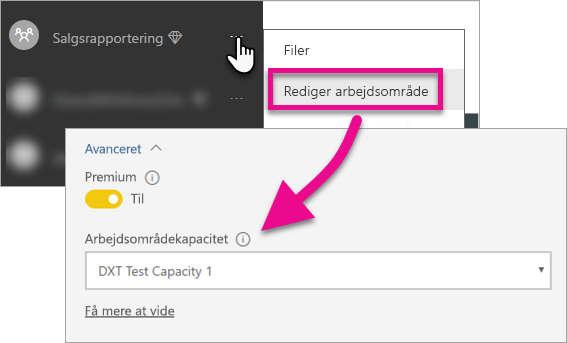

# Integrer dine Power BI-dashboards, -rapporter og -felter

Få mere at vide om, hvordan du integrerer Power BI-indhold i din app.

Microsoft [annoncerede Power BI Premium](https://powerbi.microsoft.com/blog/microsoft-accelerates-modern-bi-adoption-with-power-bi-premium/), en ny kapacitetsbaseret licensmodel, der giver øget fleksibilitet i forhold til den måde, brugerne får adgang til, deler og distribuerer indhold. Den nye model giver også øget skalerbarhed og ydeevne til Power BI-tjenesten. Power BI Embedded blev også annonceret. Det giver mulighed for at oprette kapacitet i Microsoft Azure. Power BI Embedded fokuserer på din app og dine kunder. 

Denne artikel gennemgår, hvordan du integrerer dit Power BI-indhold for både din organisation og dine kunder. Fremgangsmåden for de to scenarier er ens. Det vises, hvis et trin kun gælder integration for kunder.

Der er nogle opgaver, du skal udføre i din app, før du kan integrere for dine kunder. Vi gennemgår de trin, der er nødvendige for, at du kan oprette og bruge integreret indhold i din app.

> [!NOTE]
> Power BI-API'erne refererer stadig til apparbejdsområder som grupper. Alle referencer til grupper betyder, at du arbejder med apparbejdsområder.

## Trin 1: Konfigurer dit integrerede analyseudviklingsmiljø

Før du begynder at integrere dashboards og rapporter i din app, skal du sikre dig, at du kan integrere i dit miljø. Du skal gøre følgende som en del af konfigurationen.

* [Kontrollér, at du har en Azure Active Directory-lejer](embedding-content.md#azureadtenant)
* [Opret en Power BI Pro-konto](embedding-content.md#proaccount)
* [Appregistrering og tilladelser](embedding-content.md#appreg)
* [Opret apparbejdsområder](embedding-content.md#appws)
* [Opret og upload dine rapporter](embedding-content.md#createreports)

Du kan gennemgå [Onboarding lbudExperience Tool](https://aka.ms/embedsetup) for hurtigt at komme i gang og downloade en eksempelapp.

Vælg den løsning, der er den rette for dig:
* Med [Embedding for your customers](embedding.md#embedding-for-your-customers) kan du integrere dashboards og rapporter for de brugere, der ikke har en konto til Power BI. Kør løsningen [Embed for your customers](https://aka.ms/embedsetup/AppOwnsData).
* Med [Embedding for your organization](embedding.md#embedding-for-your-organization) kan du udvide Power BI-tjenesten. Kør løsningen [Embed for your organization](https://aka.ms/embedsetup/UserOwnsData).

Hvis du vælger at konfigurere miljøet manuelt, kan du dog fortsætte nedenfor. 

> [!NOTE]
> Dedikeret kapacitet er ikke påkrævet, for at du kan udvikle din app. Udviklerne af appen skal have en Power BI Pro-licens.

### Azure Active Directory-lejer

Du skal bruge en Azure Active Directory-lejer (Azure AD) for at integrere elementer fra Power BI. Denne lejer skal have mindst én Power BI Pro-bruger. Du skal også definere en Azure AD-app i lejeren. Du kan bruge en eksisterende Azure AD-lejer eller oprette en ny specielt til integreringsformål.

Du skal afgøre, hvilken lejerkonfiguration der skal bruges, hvis du integrerer for dine kunder.

* Skal du bruge virksomhedens eksisterende Power BI-lejer?
* Skal du bruge en separat lejer til din app?
* Skal du bruge en separat lejer for hver kunde?

Hvis du ikke vil bruge en eksisterende lejer, kan du oprette en ny lejer til appen eller en for hver kunde. Du kan finde flere oplysninger i [Opret en Azure Active Directory-lejer](create-an-azure-active-directory-tenant.md) eller [Sådan får du en Azure Active Directory-lejer](https://docs.microsoft.com/azure/active-directory/develop/active-directory-howto-tenant).

### Opret en Power BI Pro-brugerkonto

Du skal kun bruge én enkelt Power BI Pro-konto for at integrere indhold. Det kan dog være en god idé at have nogle forskellige brugere, som kun har adgangsrettigheder til elementerne. Her kan du se en liste over de brugere, du kan overveje at have i din lejer.

Følgende konti skal være oprettet i din lejer og have en Power BI Pro-licens, der er tildelt til brugerne. En Power BI Pro-licens er nødvendig, for at brugerne skal kunne arbejde med arbejdsområder i Power BI.

#### En administratorbruger til organisationen og lejeren

Det anbefales, at den globale administratorbruger til organisationen og lejeren ikke bruges som den konto, appen bruger, hvis du integrerer for kunder. Det er med til at begrænse den adgang, som appkontoen har i lejeren. Administratorbrugeren skal være administrator af alle de apparbejdsområder, der oprettes til integreringsformål.

#### Konti for analytikere, der opretter indhold

Du kan have flere brugere, som opretter indhold til Power BI. Du skal have en Power BI Pro-konto til hver enkelt analytiker, der opretter og udruller indhold til Power BI.

#### En *apphovedbrugerkonto* til integration for dine kunder

Hovedkontoen er den konto, som bruges i din app, når du integrerer indhold for dine kunder. Scenariet er typisk for ISV-apps. Hovedkontoen er den eneste påkrævede konto, du skal bruge i din organisation. Det kan også bruges som administrator- og analytikerkonto, men det anbefales ikke. Legitimationsoplysningerne til denne konto gemmes i appens backend og bruges til at hente et godkendelsestoken til Azure AD, som skal bruges med Power BI-API'erne. Denne konto genererer et integreringstoken til appen, som du kan bruge til dine kunder.

Hovedkontoen er blot en almindelig bruger med en Power BI Pro-licens, som du bruger i appen. Kontoen skal være administrator af det apparbejdsområde, der bruges til at integrere.

###  Appregistrering og tilladelser

Du skal registrere din app i Azure AD, før du kan foretage REST-API-kald. Du kan finde flere oplysninger under [Registrer en Azure AD-app for at integrere Power BI-indhold](register-app.md).

### Opret apparbejdsområder

Hvis du integrerer dashboards og rapporter for dine kunder, skal disse dashboards og rapporter placeres i et apparbejdsområde. Den *hovedkonto*, der er nævnt ovenfor, skal være administrator af apparbejdsområdet.

[!INCLUDE [powerbi-service-create-app-workspace](../includes/powerbi-service-create-app-workspace.md)]

> [!NOTE]
> En bruger, der ikke har administratorrettigheder, kan kun oprette op til 250 apparbejdsområder. Hvis du vil oprette flere app-arbejdsområder, skal du bruge en lejeradministratorkonto.
>

### Opret og upload dine rapporter

Du kan oprette rapporter og datasæt ved hjælp af Power BI Desktop og derefter udgive disse rapporter til et apparbejdsområde. Den slutbruger, der udgiver rapporterne, skal have en Power BI Pro-licens for at kunne udgive til et apparbejdsområde.

## Trin 2: Integrer dit indhold

Du skal godkende med Power BI i din app. Hvis du integrerer indhold for dine kunder, skal du gemme legitimationsoplysningerne til *hovedkontoen* i din app.

> [!NOTE]
> Du kan finde flere oplysninger om godkendelse af brugere, mens du integrerer dine kunder, i [Godkend brugere, og få et Azure AD-token til din Power BI-app](get-azuread-access-token.md).
>

Når du har godkendt, skal du bruge Power BI REST-API'erne og JavaScript-API'erne til at integrere dashboards og rapporter i din app. 

Hvis du **integrerer for din organisation**, skal du se følgende vejledninger:

* [Integrer et dashboard i en app](integrate-dashboard.md)
* [Integrer et felt i en app](integrate-tile.md)
* [Integrer en rapport i en app](integrate-report.md)

Hvis du **integrerer for dine kunder**, hvilket er typisk for ISV'er, skal du se følgende:

* [Integrer et dashboard, et felt eller en rapport i din app](embed-sample-for-customers.md)

Når du integrerer for dine kunder, skal du bruge et integreringstoken. Du kan få flere oplysninger i [Integreringstoken](https://docs.microsoft.com/rest/api/power-bi/embedtoken).

## Trin 3: Gør din løsning produktionsklar

Det kræver nogle ekstra trin at gøre din løsning produktionsklar.

### Integrer for din organisation

Hvis du integrerer for din organisation, behøver du blot at fortælle de andre, hvordan de henter appen. 

Alle brugere, uanset hvilken licens de er tildelt, kan bruge det indhold, der er integreret fra et apparbejdsområde (gruppe), hvis arbejdsområdet har dedikeret kapacitet. Når det er sagt, skal du udtrykkeligt tilføje alle brugere, der ikke har en Power BI Pro-licens, til app-arbejdsområdet. Ellers får du en 401-uautoriseret fejl. I tabellen nedenfor kan du se en oversigt over de Power BI Premium-SKU'er, der er tilgængelige i Office 365.

| Kapacitetsnode | Kerner i alt *(Backend + frontend)* | Backendkerner | Frontendkerner | Grænser for DirectQuery/liveforbindelser | Maks. antal sidegengivelser i spidstimen |
| --- | --- | --- | --- | --- | --- |
| EM3 |4 v-kerner |2 kerner, 10 GB RAM |2 kerner | |601-1.200 |
| P1 |8 v-kerner |4 kerner, 25 GB RAM |4 kerner |30 pr. sekund |1.201-2.400 |
| P2 |16 v-kerner |8 kerner, 50 GB RAM |8 kerner |60 pr. sekund |2.401-4.800 |
| P3 |32 v-kerner |16 kerner, 100 GB RAM |16 kerner |120 pr. sekund |4.801-9600 |

> [!NOTE]
> Du skal være en global administrator eller faktureringsadministrator i din lejer for at kunne købe Power BI Premium. Hvis du vil have mere at vide om, hvordan du køber Power BI Premium, skal du se [Sådan køber du Power BI Premium](../service-admin-premium-purchase.md).

>[!Note]
>[Konfigurer dit integrerede analyseudviklingsmiljø for din organisation.](#step-1-setup-your-embedded-analytics-development-environment)
>

### Integrer for dine kunder

Hvis du integrerer for dine kunder, skal du gøre følgende.

* Hvis du bruger en separat lejer til udvikling, skal du sørge for, at dine apparbejdsområder og dine dashboards og rapporter er tilgængelige i produktionsmiljøet. Kontrollér, at du opretter appen i Azure AD for din produktionslejer og tildeler de relevante apptilladelser som angivet under Trin 1.
* Køb den kapacitet, der opfylder dine behov. Du kan bruge tabellen nedenfor til at få overblik over, hvor meget kapacitet du skal bruge til Power BI Embedded. Du kan finde flere oplysninger i [Hvidbogen om planlægning af analysekapacitet til Embedded](https://aka.ms/pbiewhitepaper). Når du er klar til at købe, kan du gøre det på [Microsoft Azure-portalen](https://portal.azure.com). Du kan finde flere oplysninger om, hvordan du opretter kapacitet til Power BI Embedded, under [Opret kapacitet til Power BI Embedded på Azure-portalen](https://docs.microsoft.com/azure/power-bi-embedded/create-capacity).

> [!IMPORTANT]
> Da integrerede tokens kun er beregnet til udviklingstest, er antallet af integrerede tokens, der kan genereres fra en Power BI-hovedkonto, begrænset. Der [skal købes en kapacitet](https://docs.microsoft.com/power-bi/developer/embedded-faq#technical) til integrerede produktionsscenarier. Der er ingen grænse for generering af integrerede tokens, når der er købt dedikeret kapacitet. Gå til [Tilgængelige funktioner](https://docs.microsoft.com/rest/api/power-bi/availablefeatures) for at undersøge, hvor mange gratis integrerede tokens der er blevet brugt.

| Kapacitetsnode | Kerner i alt *(Backend + frontend)* | Backendkerner | Frontendkerner | Grænser for DirectQuery/liveforbindelser | Maks. antal sidegengivelser i spidstimen |
| --- | --- | --- | --- | --- | --- |
| A1 |1 v-kerner |0,5 kerner, 3 GB RAM |0,5 kerner | 5 pr. sekund |1-300 |
| A2 |2 v-kerner |1 kerne, 5 GB RAM |1 kerne | 10 pr. sekund |301-600 |
| A3 |4 v-kerner |2 kerner, 10 GB RAM |2 kerner | 15 pr. sekund |601-1.200 |
| A4 |8 v-kerner |4 kerner, 25 GB RAM |4 kerner |30 pr. sekund |1.201-2.400 |
| A5 |16 v-kerner |8 kerner, 50 GB RAM |8 kerner |60 pr. sekund |2.401-4.800 |
| A6 |32 v-kerner |16 kerner, 100 GB RAM |16 kerner |120 pr. sekund |4.801-9600 |

* Rediger apparbejdsområdet, og tildel det til en dedikeret kapacitet under Avanceret.

    

* Udrul den opdaterede app til produktion, og begynd at integrere dine Power BI-dashboards og -rapporter.

>[!Note]
>[Konfigurer dit integrerede analyseudviklingsmiljø for dine kunder.](#step-1-setup-your-embedded-analytics-development-environment) 
>

## Administratorindstillinger

Globale administratorer, eller Power BI-tjenesteadministratorer, kan slå muligheden for at bruge REST-API'erne til eller fra for en lejer. Power BI-administratorer kan angive denne indstilling for hele organisationen eller for enkelte sikkerhedsgrupper. Den er som standard aktiveret for hele organisationen. Det gør du via [Power BI-administratorportalen](../service-admin-portal.md).

## Næste trin

[Integrer med Power BI](embedding.md)  
[Sådan overfører du indhold i arbejdsområdesamlingen i Power BI Embedded til Power BI](migrate-from-powerbi-embedded.md)  
[Power BI Premium – hvad er det?](../service-premium.md)  
[Sådan køber du Power BI Premium](../service-admin-premium-purchase.md)  
[Git-lager til JavaScript-API](https://github.com/Microsoft/PowerBI-JavaScript)  
[Git-lager til Power BI C#](https://github.com/Microsoft/PowerBI-CSharp)  
[Integreringseksempel til JavaScript](https://microsoft.github.io/PowerBI-JavaScript/demo/)  
[Hvidbog om planlægning af analysekapacitet til Embedded](https://aka.ms/pbiewhitepaper)  
[Hvidbog om Power BI Premium](https://aka.ms/pbipremiumwhitepaper)  

Flere spørgsmål? [Prøv at spørge Power BI-community'et](http://community.powerbi.com/)