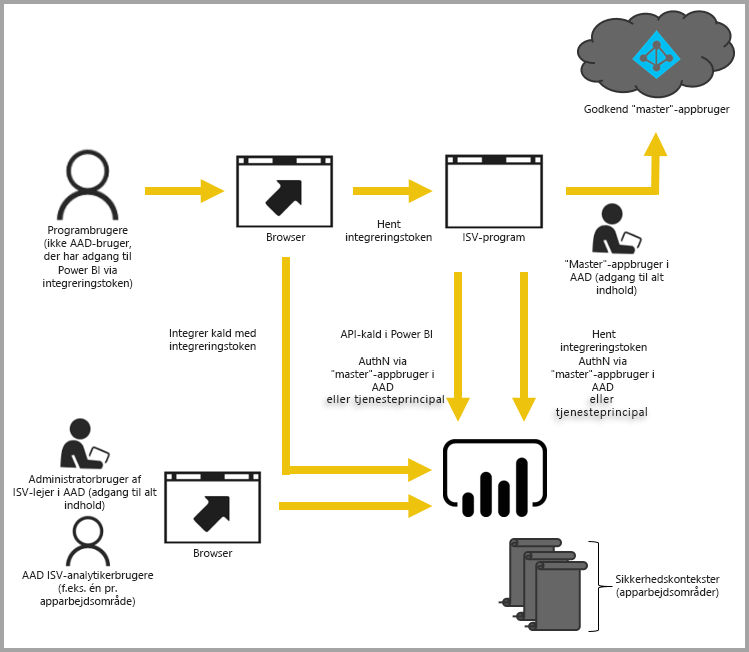

# Integrering med Power BI

Power BI-tjenesten (SaaS) og tjenesten Power BI Embedded i Azure (PaaS) har API'er, du kan bruge til at integrere dine dashboards og rapporter. Denne funktion betyder, at du har en række funktioner og adgang til de nyeste funktioner i Power BI, f.eks. dashboards, gateways og apparbejdsområder, når du integrerer indhold.

Du kan gennemgå [værktøjet til konfiguration af integrering](https://aka.ms/embedsetup) for hurtigt at komme i gang og downloade en eksempelapp.

Vælg den løsning, der er den rette for dig:

* Med [Embedding for your organization](embedding.md#embedding-for-your-organization) kan du udvide Power BI-tjenesten. Kør løsningen [Embed for your organization](https://aka.ms/embedsetup/UserOwnsData).
* Med [Embedding for your customers](embedding.md#embedding-for-your-customers) kan du integrere dashboards og rapporter for de brugere, der ikke har en konto til Power BI. Kør løsningen [Embed for your customers](https://aka.ms/embedsetup/AppOwnsData).

## Brug af API'er

Der er to hovedscenarier, når du integrerer Power BI-indhold.  Integrering for brugere i din organisation (der har licenser til Power BI) og integrering for dine brugere og kunder, uden at det er et krav, at de har Power BI-licenser. Power BI REST-API'en gør begge scenarier mulige.

For kunder og brugere uden Power BI-licenser kan du integrere dashboards og rapporter i dit brugerdefinerede program ved hjælp af den samme API for enten at betjene din organisation eller dine kunder. Dine kunder ser de data, der administreres af programmet. Power BI-brugere i din organisation får de yderligere indstillinger til at få vist *deres data* direkte i Power BI eller i konteksten af det program, der er integreret. Du kan fuldt ud benytte JavaScript- og REST-API'erne til dine integreringsbehov.

Du kan få vist et eksempel på, hvordan integrering fungerer under [Eksempel på integrering af JavaScript](https://microsoft.github.io/PowerBI-JavaScript/demo/).

## Integrer for din organisation

Med **Embedding for your organization** kan du udvide Power BI-tjenesten. Hvis du bruger integrering for din organisationen kræver det, at brugerne af dit program logger på Power BI-tjenesten, når de vil have vist deres indhold. Når en person i din organisation logger på, har vedkommende kun adgang til dashboards og rapporter, der er delt med ham eller hende i Power BI-tjenesten.

*Eksempler på integrering i forbindelse med din organisation omfatter interne programmer, f.eks. [SharePoint Online](https://powerbi.microsoft.com/blog/integrate-power-bi-reports-in-sharepoint-online/), [Integrering med Microsoft Teams (du skal have administratorrettigheder)](https://powerbi.microsoft.com/blog/power-bi-teams-up-with-microsoft-teams/) og [Microsoft Dynamics](https://docs.microsoft.com/dynamics365/customer-engagement/basics/add-edit-power-bi-visualizations-dashboard).*

Se følgende for integrering i forbindelse med din organisation:

* [Integrer en rapport i en app](embed-sample-for-your-organization.md)

Funktionaliteten i selvbetjeningsportalen, f.eks. rediger, gem og meget mere, er tilgængelig via [JavaScript-API'en](https://github.com/Microsoft/PowerBI-JavaScript) ved integrering i forbindelse med Power BI-brugere.

Du kan gennemgå [værktøjet til konfiguration af integrering](https://aka.ms/embedsetup/UserOwnsData) for at integrere, så din organisation hurtigt kan komme i gang, og hente en eksempelapp, hvor du kan se, hvordan du integrerer en rapport for din organisation.

## Integrer for dine kunder

Med **Embedding for your customers** kan du integrere dashboards og rapporter for de brugere, der ikke har en konto til Power BI. Integrering for dine kunder kaldes også **Power BI Embedded**.

[Power BI Embedded](azure-pbie-what-is-power-bi-embedded.md) er en **Microsoft Azure**-tjeneste, der gør det muligt for uafhængige softwareleverandører (ISV'er) og udviklere hurtigt at integrere visuelle elementer, rapporter og dashboards i et program via en kapacitetsbaseret model, der afregnes på timebasis.

Power BI Embedded giver fordele til ISV'er, udviklere og kunder. En ISV kan f.eks. begynde at oprette visuelle elementer gratis vha. Power BI Desktop. ISV'er kan opnå hurtigere lancering ved at minimere det analytiske udviklingsarbejde med visuelle elementer, hvilket betyder, at du kan skille dig ud fra konkurrenterne ved at give differentierede dataoplevelser. ISV'er kan også vælge at opkræve et premiumgebyr for den ekstra værdi, der tilføres vha. den integrerede analyse.

Med Power BI Embedded behøver dine kunder ikke at have kendskab til Power BI. Du behøver kun at have én Power BI Pro-konto for at oprette et integreret program. Power BI Pro-kontoen fungerer som en masterkonto for dit program (du kan opfatte den som en proxykonto). Power BI Pro-kontoen giver dig også mulighed for at generere integreringstokens, der giver adgang til dashboards og rapporter i Power BI-tjenesten, som ejes/administreres af dit program.

Udviklere, der bruger Power BI Embedded, kan fokusere på opbygningen af kernekompetencen i deres program i stedet for at bruge tid på at udvikle visuelle elementer og analyse. Udviklere kan hurtigt imødekomme kundebehov for rapporter og dashboards, og de kan nemt integrere med fuldt dokumenterede API'er og SDK'er. ISV'er kan give kunder mulighed for at træffe hurtige databaserede beslutninger i kontekst fra enhver enhed ved at muliggøre intuitiv udforskning af data i deres apps.

> [!IMPORTANT]
> Integrering er afhængig af Power BI-tjenesten, men dine kunder er ikke afhængige af Power Bi. De behøver ikke at tilmelde sig Power BI for at få vist det integrerede indhold i din app.

Når du er klar til at overgå til produktion, skal apparbejdsområdet tildeles en dedikeret kapacitet. Power BI Embedded i Microsoft Azure tilbyder [dedikeret kapacitet](azure-pbie-create-capacity.md), som du kan bruge til dine apps.

Du kan finde oplysninger om, hvordan du integrerer under [Sådan integrerer du Power BI-dashboards, -rapporter og -felter](embed-sample-for-customers.md).

## Næste trin

Nu kan du prøve at integrere Power BI-indhold i en app, eller du kan prøve at integrere Power BI-indhold for dine kunder.

> [!div class="nextstepaction"]
> [Integrer til din organisation](embed-sample-for-your-organization.md)

> [!div class="nextstepaction"]
> [Hvad er Power BI Embedded?](azure-pbie-what-is-power-bi-embedded.md)

> [!div class="nextstepaction"]
>[Integrer indhold for dine kunder](embed-sample-for-customers.md)

Har du flere spørgsmål? [Prøv at spørge Power BI-community'et](http://community.powerbi.com/)