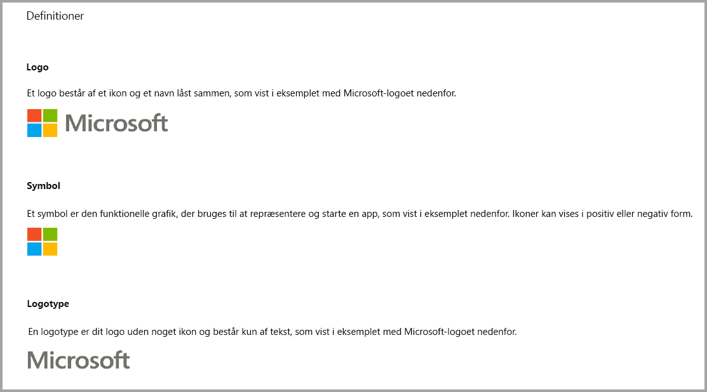
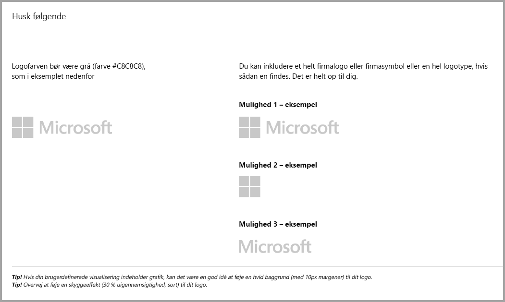
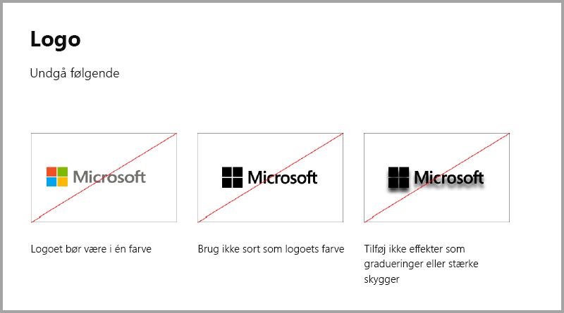
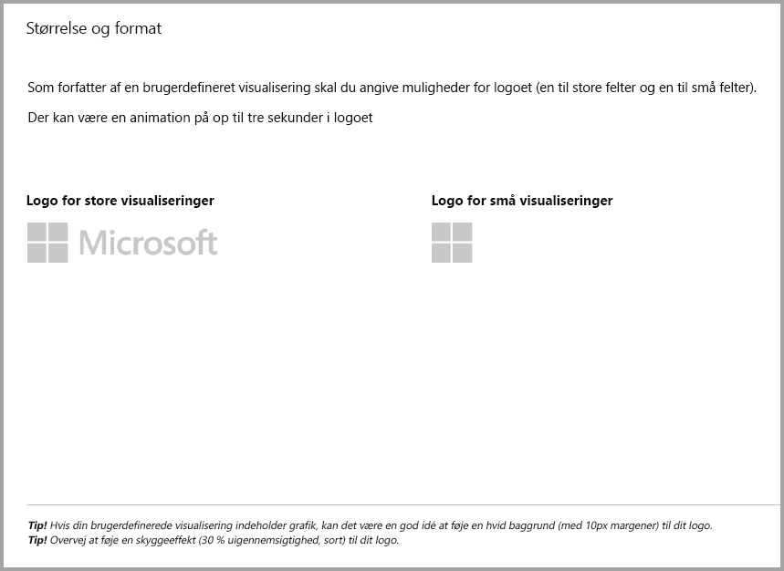
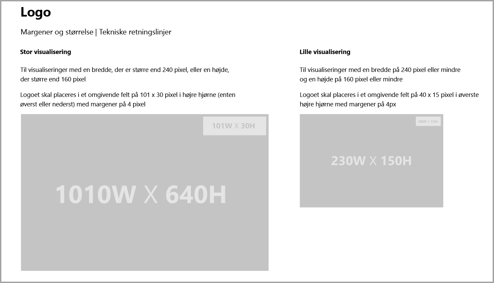
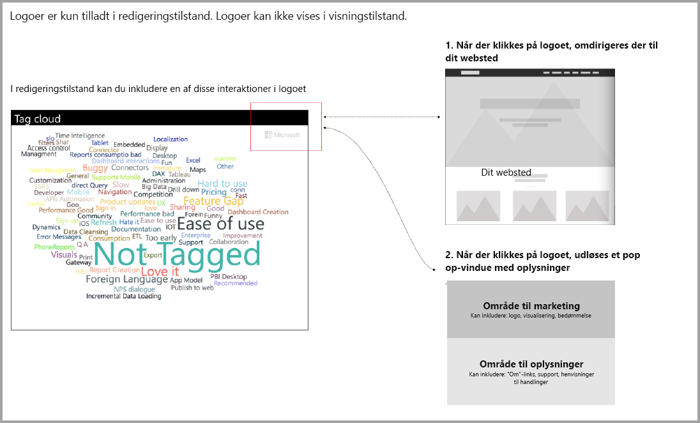

# Retningslinjer for Power BI-visualiseringer

## Retningslinjer for Power BI-visualiseringer med ekstra køb

Indtil for nylig accepterede Marketplace (AppSource) kun gratis Power BI-visualiseringer. Denne politik er blevet ændret (december 2018), så du nu også kan indsende visualiseringer til AppSource, som har prismærket "Yderligere køb kan være påkrævet". 

Visualiseringer med "Yderligere køb kan være påkrævet" er ligesom tilføjelsesprogrammer med apptilkøb i Office Store. Udviklere kan også indsende disse visualiseringer til certificering, efter AppSource-teamet har godkendt dem, og de har kontrolleret, at de overholder certificeringskravene. Du kan finde flere oplysninger om kravene i [Certificerede brugerdefinerede visualiseringer](../power-bi-custom-visuals-certified.md).

> [!NOTE]
> En visualisering kan kun certificeres, hvis den ikke har adgang til eksterne tjenester eller ressourcer.

>[!IMPORTANT]  
> Hvis du opdaterer din visualisering fra gratis til "Yderligere køb kan være påkrævet", skal brugerne modtage det samme niveau af gratis funktionalitet som før opdateringen. Du kan tilføje valgfrie avancerede betalte funktioner udover de eksisterende gratis funktioner. Vi anbefaler, at du indsender visualiseringer med apptilkøb sammen med de avancerede funktioner som nye visualiseringer i stedet for at opdatere de eksisterende gratis.

## Hvad er blevet ændret i indsendelsesprocessen?

Udviklere uploader deres IAP-visualiseringer til AppSource via Seller Dashboard, på samme måde som de har gjort det med gratis visualiseringer. Udviklere bør skrive følgende i noterne på Seller Dashboard for at angive, at den indsendte visualisering har funktioner med apptilkøb: "Visualisering med apptilkøb". Udviklere skal også levere en licensnøgle eller token, så valideringsteamet kan validere IAP-funktionerne. Efter visualiseringen er blevet valideret og godkendt, angives "Yderligere køb kan være påkrævet" under prismulighederne for visualiseringen med apptilkøb i AppSource.

## Hvad er en Power BI-visualisering med IAP-funktioner?

En visualisering med apptilkøb er en **gratis** visualisering, der tilbyder **gratis funktioner**. Den indeholder også nogle avancerede funktioner, som man muligvis skal betale for, før de kan anvendes. I beskrivelsen af visualiseringen skal udviklerne give brugerne besked om, hvilke funktioner der kræver yderligere køb, før de kan anvendes. I øjeblikket leverer Microsoft ikke oprindelige API'er til understøttelse af apptilkøb og tilføjelsesprogrammer.

Udviklere kan bruge et hvilket som helst betalingssystem fra tredjepart til disse køb. Du kan finde flere oplysninger i [vores politik for Store](https://docs.microsoft.com/office/dev/store/validation-policies#2-apps-or-add-ins-can-display-certain-ads).

> [!NOTE]
> Vandmærker er ikke tilladt i de gratis funktioner eller gratis visualiseringer. Vandmærker må kun bruges på de betalte funktioner, der bruges uden en gyldig licens. Vi anbefaler at vise et pop op-vindue med alle de licensrelaterede oplysninger, hvis de avancerede betalte funktioner bruges uden en gyldig licens.  

## Retningslinjer for logo

I dette afsnit beskrives specifikationerne for tilføjelse af logoer og logotyper i visualiseringer.

> [!IMPORTANT]
> Logoer er kun tilladt i **redigeringstilstand**. Logoer **må ikke** vises i visningstilstand.

## Bedste praksis

### Landingsside for visualisering

Brug landingssiden til at tydeliggøre over for brugerne, hvordan de kan bruge din visualisering, og hvor de kan købe licensen. Undlad at inkludere videoer, der udløses automatisk. Tilføj kun materiale, der hjælper med at forbedre brugeroplevelsen, f.eks. oplysninger eller links til oplysninger om licenskøb, og hvordan funktioner for apptilkøb bruges.

### Licensnøgle og -token

Af hensyn til brugerne skal du tilføje en licensnøgle eller tokenrelaterede felter øverst i formateringsruden.

## Ofte stillede spørgsmål

Du kan finde flere oplysninger om visualiseringer under [Ofte stillede spørgsmål om visualiseringer med yderligere køb](https://docs.microsoft.com/power-bi/power-bi-custom-visuals-faq#visuals-with-additional-purchases).

## Næste trin

Du kan få mere at vide om, hvordan du kan publicere din brugerdefinerede visualisering i [AppSource](office-store.md), så andre kan finde og bruge den.
