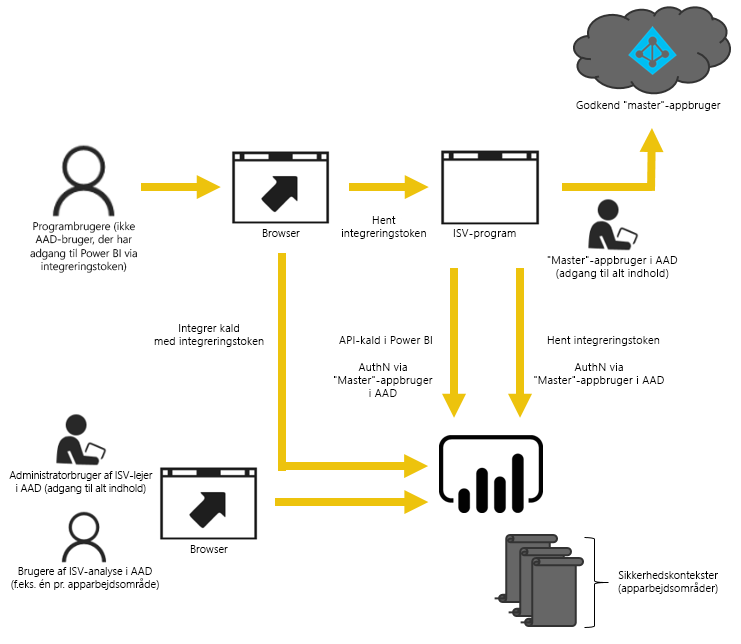

# Sådan overfører du indhold fra arbejdsområdesamlinger i Power BI Embedded til Power BI
Se, hvordan du overfører fra Power BI Embedded til Power BI-tjenesten og udnytter fordelene ved at integrere i apps.

Microsoft [annoncerede for nyligt Power BI Premium](https://powerbi.microsoft.com/blog/microsoft-accelerates-modern-bi-adoption-with-power-bi-premium/), en ny kapacitetsbaseret licensmodel, der giver øget fleksibilitet i forhold til den måde, brugerne får adgang til, deler og distribuerer indhold. Den nye model giver også øget skalerbarhed og ydeevne til Power BI-tjenesten.

Med introduktionen af Power BI Premium forandrer Power BI Embedded og Power BI-tjenesten de måder, som Power BI-indhold kan integreres i apps. Det betyder, at du har én API-grænseflade, en ensartet række funktioner og adgang til de nyeste funktioner i Power BI, f.eks. dashboards, gateways og apparbejdsområder, når du integrerer indhold. Fremadrettet kan du starte med Power BI Desktop og flytte din implementering til Power BI Premium, som vil blive gjort offentligt tilgængelig i andet kvartal i 2017.

Den nuværende Power BI Embedded-tjeneste vil fortsat være tilgængelig i et begrænset tidsrum efter, at det nye tilbud bliver offentligt tilgængeligt. De kunder, der har en Enterprise-aftale, vil have adgang indtil deres eksisterende aftaler udløber. De kunder, der har købt Power BI Embedded direkte eller via CSP-kanaler, vil få adgang Power BI Premium i et år efter, at det bliver offentligt tilgængeligt.  I denne artikel får du hjælp til at skifte fra Azure-tjenesten til Power BI-tjenesten, og du kan læse om, hvilke ændringer du kan forvente i appen.

> [!IMPORTANT]
> Overførslen vil være afhængig af Power BI-tjenesten, men brugerne af dit program behøver ikke at have Power BI, hvis du bruger et **integreringstoken**. De behøver ikke at tilmelde sig Power BI for at få vist det integrerede indhold i din app. Når du bruger integrering, kan brugere uden Power BI også bruge dine apps.
> 
> 

## Forbered overførslen
Der et par ting, du skal klargøre for at overføre fra Power BI Embedded Azure-tjenesten til Power BI-tjenesten. Du skal have adgang til en lejer og til en bruger med en Power BI Pro-licens.

1. Du skal også have adgang til en Azure Active Directory-lejer (Azure AD).
   
    Du skal beslutte, hvilken lejeropsætning der skal bruges.
   
   * Vil du bruge virksomhedens eksisterende Power BI-lejer?
   * Skal du bruge en separat lejer til din app?
   * Skal du bruge en separat lejer for hver kunde?
     
     Hvis du beslutter at oprette en ny lejer til din app eller for hver kunde, skal du se [Opret en Azure Active Directory-lejer](create-an-azure-active-directory-tenant.md) eller [Sådan får du en Azure Active Directory-lejer](https://docs.microsoft.com/azure/active-directory/develop/active-directory-howto-tenant).
2. Opret en bruger under den nye lejer. Brugeren skal fungere som masterkonto i din app. Masterkontoen skal tilmeldes Power BI, og den skal også være tildelt en Power BI Pro-licens.

## Konti i Azure AD
Der skal findes følgende konti i din lejer.

> [!NOTE]
> Disse konti skal have Power BI Pro-licenser for at kunne bruge apparbejdsområder.
> 
> 

1. En lejeradministratorbruger.
   
    Det anbefales, at brugeren er medlem af alle de apparbejdsområder, der oprettes med henblik på integrering.
2. Konti for analytikere, der opretter indhold.
   
    Disse brugere skal tildeles til apparbejdsområder efter behov.
3. En *master*brugerkonto eller en tjenestekonto til appen.
   
    Appens backend gemmer legitimationsoplysninger for denne konto og bruger den til at få et Azure AD-token til brug med Power BI REST API'erne. Denne konto bruges til at generere integreringstokenet til appen. Kontoen skal også være administrator for de apparbejdsområder, der blev oprettet til integrering.
   
   > [!NOTE]
   > Dette er blot en almindelig brugerkonto i organisationen, der bruges til integrering.
   > 
   > 

## Appregistrering og tilladelser
Du skal registrere en app i Azure AD og tildele den visse tilladelser.

### Registrer en app
Du skal registrere din app i Azure AD, før du kan foretage REST API-kald. Dette omfatter at få til Azure-portalen for at anvende yderligere konfiguration ud over Power BI-appregistreringssiden. Du kan finde flere oplysninger under [Registrer en Azure AD-app for at integrere Power BI-indhold](register-app.md).

Du bør registrere appen med appens **master**konto.

## Opret apparbejdsområder (påkrævet)
Du kan bruge apparbejdsområder til at sikre en bedre isolation, hvis din app bruges af flere kunder. Dashboards og rapporter bør være isoleret mellem dine kunder. Du kan bruge en Power BI-konto pr. apparbejdsområde for yderligere at isolere appoplevelserne mellem kunderne.

> [!IMPORTANT]
> Du kan ikke bruge et personligt arbejdsområde til integrering til de brugere, der ikke har Power BI.
> 
> 

Når du vil oprette et apparbejdsområde i Power BI, skal du bruge en bruger med en Pro-licens. Den Power BI-bruger, der opretter apparbejdsområdet, skal være standardadministratoren for arbejdsområdet.

> [!NOTE]
> Appens *master*konto skal være administrator for arbejdsområdet.
> 
> 

## Overførsel af indhold
Du kan overføre indhold fra dine arbejdsområdesamlinger til Power BI-tjenesten samtidig med din aktuelle løsning, og det medfører ikke nogen nedetid.

Der findes et **overførselsværktøj**, som du kan bruge til at kopiere indhold fra Power BI Embedded til Power BI-tjenesten. Dette er især praktisk, hvis du har meget indhold. Du kan finde flere oplysninger under [Overførselsværktøjet i Power BI Embedded](migrate-tool.md).

Overførsel af indhold er baseret primært på to-API'er.

1. Download PBIX – dette API kan downloade de PBIX-filer, som blev uploadet til Power BI efter oktober 2016.
2. Import PBIX – dette API uploader PBIX til Power BI.

For nogle relaterede kodestykker skal du se [Kodestykker til overførsel af indhold fra Power BI Embedded](migrate-code-snippets.md).

### Rapporttyper
Der findes flere typer rapporter, som kræver hver deres overførselsproces.

#### Cachelagret datasæt og rapport
Cachelagrede datasæt, der refererer til PBIX-filer, og som havde importerede data i modsætning til en dynamisk forbindelse eller en DirectQuery-forbindelse.

**Proces**

1. Udfør et kald til API'et Download PBIX fra PaaS-arbejdsområdet.
2. Gem PBIX.
3. Udfør et kald til Import PBIX til SaaS-arbejdsområdet.

#### DirectQuery-datasæt og -rapport
**Proces**

1. Udfør et kald til GET https://api.powerbi.com/v1.0/collections/{collection_id}/workspaces/{wid}/datasets/{dataset_id}/Default.GetBoundGatewayDataSources, og gem den forbindelsesstreng, du modtager.
2. Udfør et kald til API'et Download PBIX fra PaaS-arbejdsområdet.
3. Gem PBIX.
4. Udfør et kald til Import PBIX til SaaS-arbejdsområdet.
5. Opdater forbindelsesstrengen med et kald til POST https://api.powerbi.com/v1.0/myorg/datasets/{dataset_id}/Default.SetAllConnections
6. Få et GW-id og et datakilde-id med et kald til GET https://api.powerbi.com/v1.0/myorg/datasets/{dataset_id}/Default.GetBoundGatewayDataSources
7. Opdater brugerens legitimationsoplysninger med et kald til PATCH https://api.powerbi.com/v1.0/myorg/gateways/{gateway_id}/datasources/{datasource_id}

#### Gamle datasæt og rapporter
Dette er de datasæt/rapporter, der er oprettet før oktober 2016. Download PBIX understøtter ikke de PBIX'er, som blev uploadet før oktober 2016

**Proces**

1. Hent PBIX fra dit udviklingsmiljø (din interne versionsstyring).
2. Udfør et kald til Import PBIX til SaaS-arbejdsområdet.

#### Push datasæt og rapport
Download PBIX understøtter ikke *Push API*-datasæt. Data fra Push API-datasæt kan ikke overføres fra PaaS til SaaS.

**Proces**

1. Udfør et kald til API'et "Create dataset" med datasæt-Json for at oprette datasæt i SaaS-arbejdsområdet.
2. Byg rapporten igen for det oprettede datasæt*.

Du kan prøve følgende for at overføre Push API-rapporten fra PaaS til SaaS.

1. Overførsel af test-PBIX til PaaS-arbejdsområde.
2. Klon Push API-rapporten, og bind den til test-PBIX'en fra trin 1.
3. Download Push API-rapporten med test-PBIX'en.
4. Overfør test-PBIX'en til dit SaaS-arbejdsområde.
5. Opret et push-datasæt i dit SaaS-arbejdsområde.
6. Bind rapporten til Push API-datasættet.

## Opret og upload nye rapporter
Ud over det indhold, du overførte fra Power BI Embedded Azure-tjenesten, kan du oprette dine rapporter og datasæt ved hjælp af Power BI Desktop og derefter publicere rapporterne til et apparbejdsområde. Den slutbruger, der publicerer rapporterne, skal have en Power BI Pro-licens for at kunne publicere til et apparbejdsområde.

## Byg din app igen
1. Du skal ændre din app til at bruge Power BI REST API'er og rapportplaceringen på powerbi.com.
2. Byg din AuthN/AuthZ-godkendelse igen ved hjælp af *master*kontoen til din app. Du kan med fordel bruge et [integreringstoken](https://msdn.microsoft.com/library/mt784614.aspx) for at give brugeren tilladelse til at agere på vegne af andre brugere.
3. Integrer dine rapporter fra powerbi.com i din app.

## Knyt dine brugere til en Power BI-bruger
I din app kan du knytte de brugere, du administrerer i appen, til en *master*bruger med Power BI-legitimationsoplysninger til brug i appen. Legitimationsoplysningerne til denne Power BI-*master*konto gemmes i din app og bruges til at oprette integreringstokens.

## Når du er klar til produktionsmiljøet
Når du er klar til at skifte til produktionsmiljøet, skal du bruge følgende.

* Hvis du bruger en separat lejer til udvikling, skal du sikre, at dine apparbejdsområder med dashboards og rapporter er tilgængelige i dit produktionsmiljø. Du skal også sikre, at du har oprettet appen i Azure AD for din produktionslejer, og at du har tildelt de nødvendige apptilladelser som angivet på trin 1.
* Køb den kapacitet, der passer med dit behov. Du kan se [Hvidbog med kapacitetsplanlægning](https://aka.ms/pbiewhitepaper), hvis du vil vide mere om, hvad du skal bruge. Når du er klar til at købe, kan du gøre det i [Office 365 Administration](https://portal.office.com/adminportal/home#/catalog).
  
  > [AZURE.INFORMATION] Hvis du vil vide, hvordan du køber Power BI Premium, skal du se [Sådan køber du Power BI Premium](../service-admin-premium-purchase.md).
  > 
  > 
* Rediger apparbejdsområdet, og tildel det til en Premium-kapacitet under avanceret.
  
    
* Implementer din opdaterede app i produktionen, og begynd at integrere rapporter fra Power BI-tjenesten.

## Efter overførslen
Du bør rydde op i Azure.

* Fjern alle arbejdsområder fra den implementerede løsning i Azure-tjenesten for Power BI Embedded.
* Slet alle de arbejdsområdesamlinger, der findes i Azure.

## Næste trin
[Integration med Power BI](embedding.md)  
[Overførselsværktøj i Power BI Embedded](migrate-tool.md)  
[Kodestykker til overførsel af indhold fra Power BI Embedded](migrate-code-snippets.md)  
[Sådan integrerer du Power BI-dashboards, -rapporter og -felter](embedding-content.md)  
[Power BI Premium – hvad er det?](../service-premium.md)  
[Git-lager til JavaScript-API](https://github.com/Microsoft/PowerBI-JavaScript)  
[Git-lager til Power BI C#](https://github.com/Microsoft/PowerBI-CSharp)  
[Eksempel på JavaScript-integrering](https://microsoft.github.io/PowerBI-JavaScript/demo/)  
[Hvidbog for kapacitetsplanlægning af integreret analyse](https://aka.ms/pbiewhitepaper)  
[Hvidbog til Power BI Premium](https://aka.ms/pbipremiumwhitepaper)  

Har du flere spørgsmål? [Prøv at spørge Power BI-community'et](http://community.powerbi.com/)

