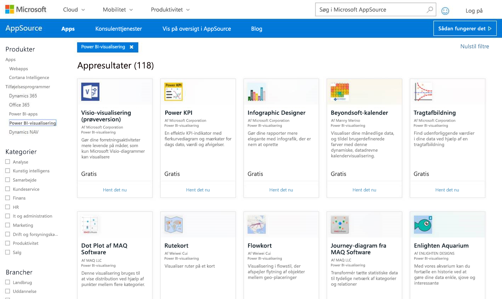

# Publicer brugerdefinerede visuals i AppSource

Få mere at vide om, hvordan du kan udgive din brugerdefinerede visual i AppSource, så andre kan finde og bruge den.

Når du har oprettet en brugerdefineret visual, kan du udgive den i AppSource, så andre kan finde og bruge den. Det kræver nogle forberedelser, før du kan gøre det. Du kan finde flere oplysninger om, hvordan du opretter en brugerdefineret visualisering, under [Udvikling af en brugerdefineret visualisering i Power BI](custom-visual-develop-tutorial.md).

   

## Hvad er AppSource?

**AppSource** er det sted, hvor du finder SaaS-apps og -tilføjelsesprogrammer til dine Microsoft-produkter og -tjenester. [AppSource](https://appsource.microsoft.com/marketplace/apps?product=power-bi-visuals) forbinder millioner af brugere af Office 365, Dynamics 365, Cortana Intelligence og andre med løsninger, der kan hjælpe dem med at arbejde mere effektivt, med større indsigt eller smukkere end før.

## Forberedelser, inden du indsender en brugerdefineret visualisering

Når du er færdig med at kode og teste den brugerdefinerede visualisering, og du har føjet den til en pbiviz-fil, skal du sørge for at have følgende klar, når du vil indsende den.

| Element | Påkrævet | Beskrivelse |
| --- | --- | --- |
| Pbiviz-pakken indeholder alle de påkrævede metadata |Ja |Navn på visualisering Vist navn GUID Version Beskrivelse Forfatternavn og mailadresse |
| .pbix-eksempelrapportfil |Ja |Når du fremviser din visualisering, bør du vise brugerne, hvad den kan bruges til. Du bør lægge vægt på den værdi, som visualiseringen kan tilføre brugerne, og du bør give eksempler på, hvordan de kan bruge den, formateringsmuligheder osv. Du kan også tilføj en side med *"gode råd"* i slutningen, f.eks. tip og tricks og ting, de bør undgå. .pbix-eksempelrapportfil skal fungere offline uden nogen ekstern forbindelse |
| Ikon |Ja |Du bør medtage logoet for den brugerdefinerede visualisering, som vil blive vist i appbutikken. Formatet kan være .png, .jpg, .jpeg eller .gif. Den skal være nøjagtigt 300 pixel (bredde) x 300 pixel (højde). **Vigtigt!** Gennemse den [korte guide](https://docs.microsoft.com/office/dev/store/craft-effective-appsource-store-images) omhyggeligt, inden du sender ikonet. |
| Skærmbilleder |Ja |Du skal tilføje mindst ét skærmbillede. Formatet kan være .png, .jpg, .jpeg eller .gif. Den skal være nøjagtigt 1366 pixel (bredde) x 768 pixel (højde). Filstørrelsen må ikke overstige 1024 KB. *Effekten vil blive større, hvis du tilføjer tekstbobler for at fremhæve fordelene ved de vigtigste funktioner, som vises på hvert skærmbillede.* |
| Supportlink |Ja |Angiv URL-adressen for at hjælpe de kunder, der har problemer med visualiseringen. Dette link er angivet som del af din sælgerdashboardliste og er synlig for brugerne, når de får adgang til listen over dine visualiseringer på AppSource. URL-adressen skal indeholde https:// eller http://. |
| Link til dokument om beskyttelse af personlige oplysninger |Ja |Angiv et link til politikken om beskyttelse af personlige oplysninger for de kunder, der bruger din visualisering. Dette link er angivet som del af din sælgerdashboardliste og er synlig for brugerne, når de får adgang til listen over dine visualiseringer på AppSource. URL-adressen skal indeholde https:// eller http://. |
| Slutbrugerlicensaftale (EULA) |Ja |Du skal overføre en fil med slutbrugerlicensaftalen. Det kan enten være din egen slutbrugerlicensaftale, eller du kan bruge den standardslutbrugerlicensaftale, der findes i Office Store for brugerdefinerede Power BI-visualiseringer. Hvis du vil bruge standardslutbrugerlicensaftalen, skal du indsætte følgende URL-adresse i dialogboksen "Slutbrugerlicensaftale" til filupload i sælgerdashboardet: [https://visuals.azureedge.net/app-store/Power BI - Default Custom Visual EULA.pdf](https://visuals.azureedge.net/app-store/Power%20BI%20-%20Default%20Custom%20Visual%20EULA.pdf). Filen er evt. på engelsk. |
| Videolink |Nej |Det vil være en god idé at angive et link til en video om visualiseringen, da det kan øge brugernes interesse for den. URL-adressen skal indeholde https:// eller http://. |
| GitHub-lager |Nej |Det foretrækkes, at du har et gyldigt og offentligt link til et [GitHub](https://www.github.com)-lager med kilderne til visualiseringen og eksempeldata, så andre udviklere kan give feedback og foreslå forbedringer til din kode. |

## Indsend til Power BI

Du skal som det første sende en mail til det Power BI-team, der tager sig af brugerdefinerede visualiseringer. Du kan sende en mail til [pbivizsubmit@microsoft.com](mailto:pbivizsubmit@microsoft.com).

> [!IMPORTANT]
> Du skal udfylde følgende felter i filen pbiviz.json: "beskrivelse", "support-URL-adresse", "forfatter", "navn" og "mail", før du opretter pakken .pbiviz.

Vedhæft **.pbiviz-filen** og **.pbix-eksempelrapportfilen** i din mail. Power BI-teamet sender instruktioner og en XML-fil til app-pakken, som du skal overføre. Du skal bruge denne XML-app-pakke for at kunne indsende visualiseringen via Office Developer Center.

> [!NOTE]
> Det vil tage yderligere to uger, før en opdatering til eksisterende visuals når produktionsmiljøet, efter at den er blevet godkendt i butikken. Det forbedrer kvaliteten og sikrer, at eksisterende rapporter ikke ødelægges.

## Indsend til AppSource

Når du har fået XML-app-pakken fra Power BI-teamet, skal du navigere til [Developer Center](https://sellerdashboard.microsoft.com/Application/Summary) for at indsende din visual til AppSource.

> [!NOTE]
> Du skal have en gyldig Office-udviklerkonto for at logge på [Office Developer Center](https://dev.office.com/). En Office-udviklerkonto skal være en Microsoft-konto (Live ID, f.eks. hotmail.com eller outlook.com).

> [!IMPORTANT]
> Inden du sender din visual til AppSource, skal du sende en mail med .pbiviz- og .pbix-filen til Power BI-teamet. Power BI-teamet overfører så filerne til den offentlige shareserver. Ellers vil filerne ikke kunne hentes i butikken. Du skal sende filerne, hver gang du indsender en ny visual, opdaterer en eksisterende visual og retter afviste indsendelser.

### Sådan indsender du visualiseringer

Følg nedenstående trin for at indsende din visualisering.

1. Vælg **Tilføj en ny app**.

    

2. Vælg **Brugerdefineret illustration for Power BI**, og vælg derefter **Næste**.

3. Vælg **+** under **App-pakke**, og vælg den XML-app-pakkefil, du har modtaget fra Power BI-teamet, i dialogboksen Åbn fil.

    

4. Du bør modtage en meddelelse om, at dette er en gyldig Power BI-app-pakke.

    

5. Udfyld oplysningerne under **Generelle oplysninger**.

   * *Titel på indsendelse:* Navnet på din indsendelse i Developer Center
   * *Version:* Versionsnummeret udfyldes automatisk fra app-pakken til tilføjelsesprogrammet.
   * *Udgivelsesdato (UTC):* Vælg den dato, din app skal udgives i Store. Hvis du vælger en dato i fremtiden, vil appen ikke være tilgængelig før den dato.
   * *Kategori:* Den første kategori udfyldes automatisk som "Datavisualisering + BI". Sådan tagges alle brugerdefinerede Power BI-visualiseringer. Du kan angive op til to ekstra kategorier for at gøre det nemmere for brugerne at søge efter din visualisering
   * *Testnoter:* Dette felt er valgfrit og kan bruges, hvis du vil angive nogle instruktioner til testerne hos Microsoft.
   * *Min app kalder, understøtter, indeholder eller bruger kryptografi eller kryptering:* Undlad at markere dette afkrydsningsfelt.
   * *Gør dette tilføjelsesprogram tilgængeligt i kataloget med Office-tilføjelsesprogrammer på iPad:* Undlad at markere dette afkrydsningsfelt.
6. Overfør logoet for din visualisering ved at markere **+** under **App-logo**. Vælg derefter ikonfilen i dialogboksen Åbn fil. Filen skal være i .png, .jpg, .jpeg eller .gif. Den skal være nøjagtigt 300 pixel (bredde) x 300 pixel (højde) og må højst fylde 512 KB.

    

7. Udfyld oplysningerne under **Understøttende dokumenter**.

   * Link til supportdokument
   * Link til dokument om beskyttelse af personlige oplysninger
   * Videolink
   * Slutbrugerlicensaftale (EULA)

       Du skal overføre en fil med slutbrugerlicensaftalen. Det kan enten være din egen slutbrugerlicensaftale, eller du kan bruge den standardslutbrugerlicensaftale, der findes i Office Store for brugerdefinerede Power BI-visualiseringer. Hvis du vil bruge standardslutbrugerlicensaftalen, skal du indsætte følgende URL-adresse i dialogboksen "Slutbrugerlicensaftale" til filupload i sælgerdashboardet: [https://visuals.azureedge.net/app-store/Power BI - Default Custom Visual EULA.pdf](https://visuals.azureedge.net/app-store/Power%20BI%20-%20Default%20Custom%20Visual%20EULA.pdf). Filen er evt. på engelsk.

8. Vælg **Næste** for at fortsætte til siden **Oplysninger**.

9. Vælg **Sprog** , og vælg et sprog på listen.

    

10. Udfyld "Beskrivelse".

    * *App-navn (for dette sprog):* Angiv navnet på din app, som det skal vises i butikken.
    * *Kort beskrivelse:* Angiv en kort beskrivelse af appen på højst 100 tegn, som den skal vises i butikken. Beskrivelsen vises øverst sammen med logoet. Du kan bruge beskrivelsen fra pbiviz-pakken.
    * *Lang beskrivelse:* Angiv en mere detaljeret beskrivelse af din app, som kunderne får vist på siden med oplysninger om appen. Hvis du vil have, at andre skal kunne forbedre din visualisering ved at publicere den som åben kildekode, skal du angive linket til det offentlige lager, f.eks. GitHub, her.

11. Overfør mindst ét skærmbillede. Formatet kan være .png, .jpg, .jpeg eller .gif. Den skal være nøjagtigt 1366 pixel (bredde) x 768 pixel (højde). Filstørrelsen må ikke overstige 1024 KB. *Effekten vil blive større, hvis du tilføjer tekstbobler for at fremhæve fordelene ved de vigtigste funktioner, som vises på hvert skærmbillede.*

12. Hvis du vil tilføje flere sprog, skal du vælge **Tilføj et sprog** og gentage trin 10 og 11. Når du tilføjer flere sprog, kan brugerne få vist oplysningerne om den brugerdefinerede visualisering på deres eget sprog. De sprog, der ikke angives, vil få vist oplysningerne på det sprog, der blev valgt først.

13. Når du er færdig med at tilføje sprog, skal du vælge **Næste** for at fortsætte til siden **Bloker adgang**.

14. Hvis du vil forhindre, at kunder i bestemte lande eller områder bruger eller køber din app, skal du markere afkrydsningsfeltet og vælge på listen.

15. Vælg **Næste** for at fortsætte til siden **Prissætning**.

16. I øjeblikket er det kun *gratis* visualiseringer, der understøttes, og ekstra køb i visualiseringen (køb i app) er ikke tilladt. Vælg **Appen er gratis**.

    > [!NOTE]
    > Hvis du vælger en anden indstilling end gratis, eller køb i app er muligt i den indsendte visualisering, vil den blive afvist.

17. Du kan nu vælge **Gem som kladde** og indsende den senere, eller du kan vælge **Send til godkendelse** for at indsende visualiseringen til Office Store med det samme.

## Se statussen for indsendelsen og brugsdata

Du kan gennemse [valideringspolitikkerne](https://dev.office.com/officestore/docs/validation-policies#13-power-bi-custom-visuals).

Når du har indsendt visualiseringen, vil du kunne se statussen for den i [appdashboardet](https://sellerdashboard.microsoft.com/Application/Summary/).

## Certificer din visualisering

Når du har oprettet din visualisering, kan du vælge at få den certificeret. Det betyder, at den kan køre i Power BI-tjenesten, og at den kan bruges sammen med andre funktioner som f.eks. eksport til PowerPoint. Du kan finde flere oplysninger under [Sådan får du en brugerdefineret visualisering *certificeret*](../power-bi-custom-visuals-certified.md).

## Næste trin

[Udvikling af en brugerdefineret visualisering i Power BI](custom-visual-develop-tutorial.md)  
[Visualiseringer i Power BI](../visuals/power-bi-report-visualizations.md)  
[Brugerdefinerede visualiseringer i Power BI](../power-bi-custom-visuals.md)  
[Sådan får du en brugerdefineret visualisering *certificeret*](../power-bi-custom-visuals-certified.md)

Har du flere spørgsmål? [Prøv at spørge Power BI-community'et](http://community.powerbi.com/)
