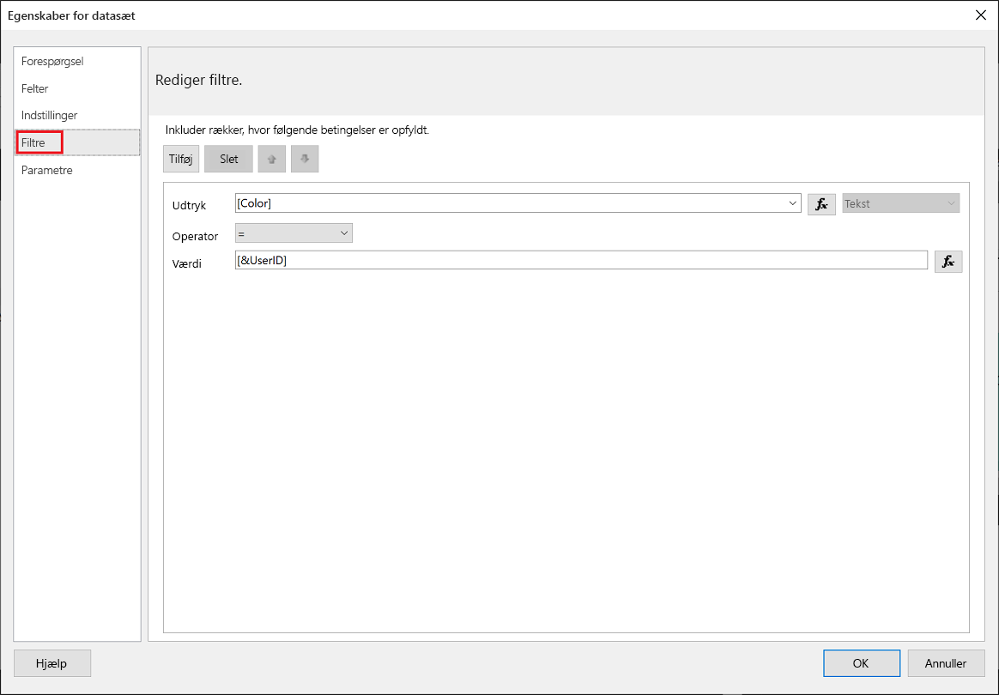
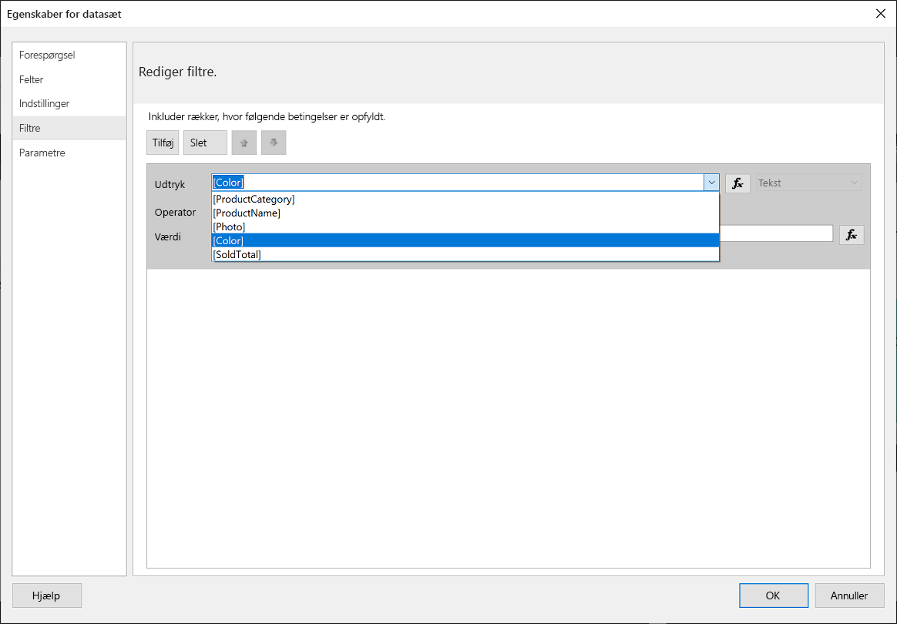
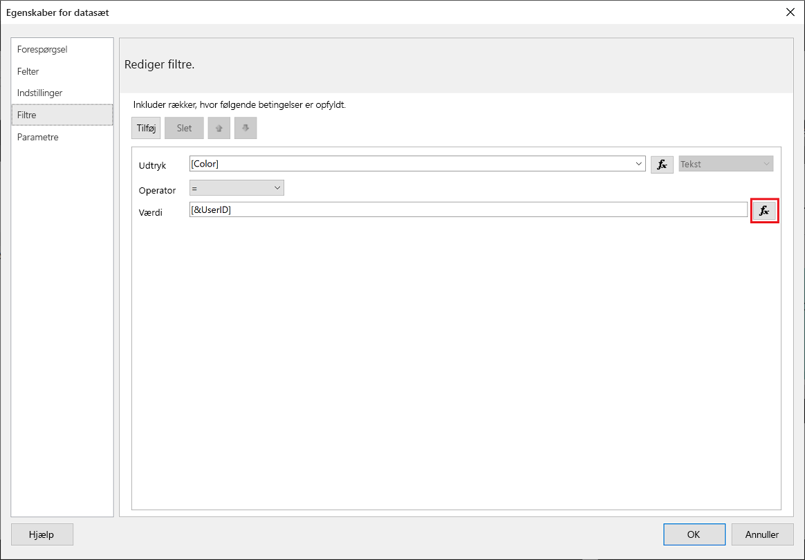
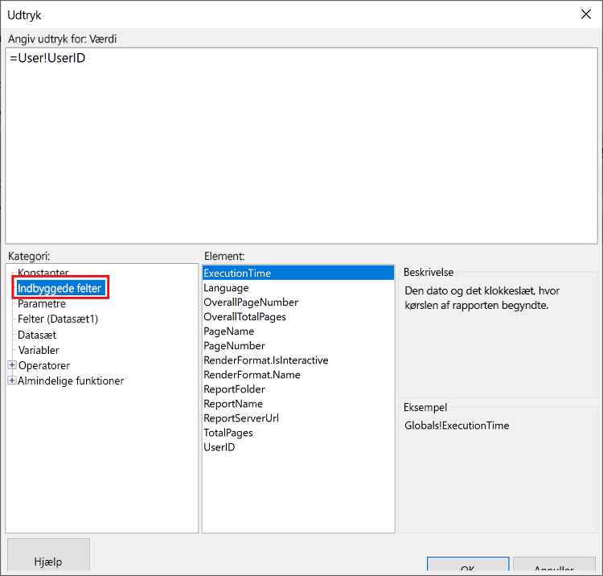
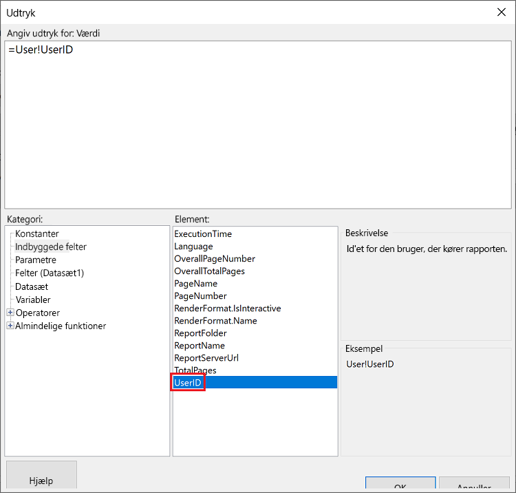
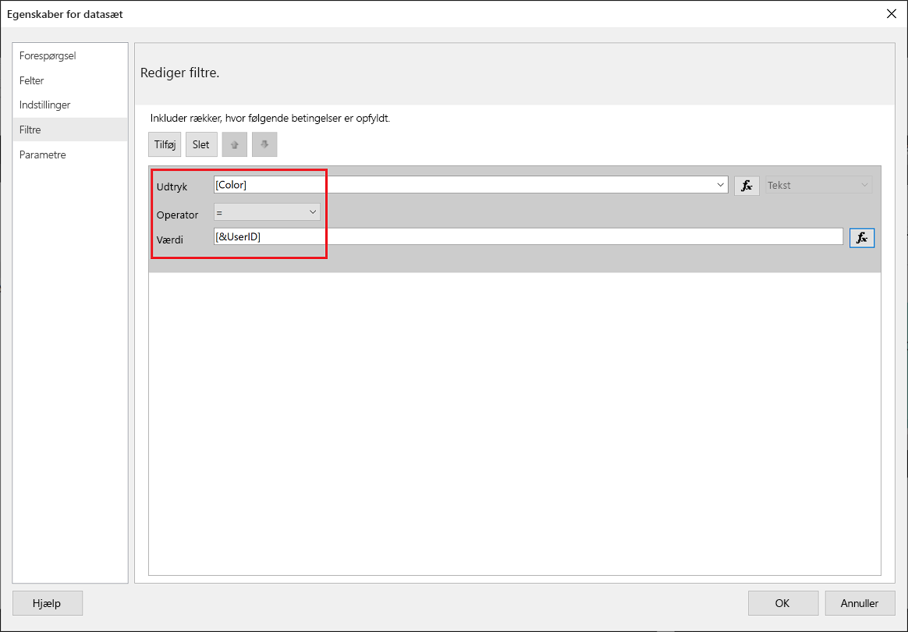
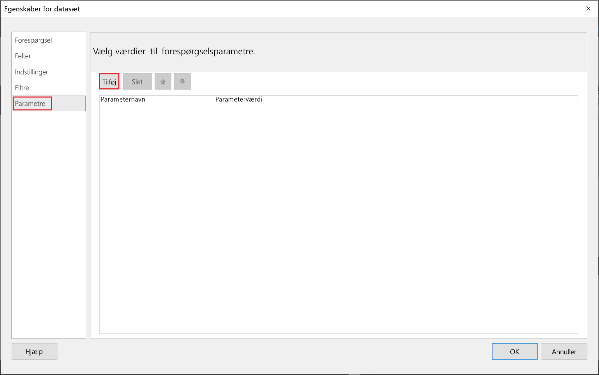
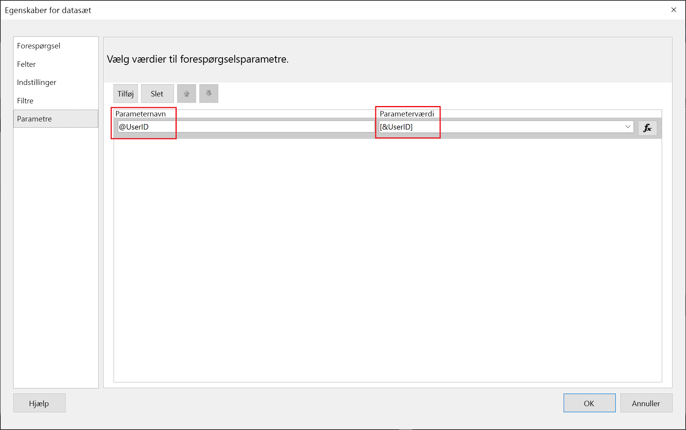
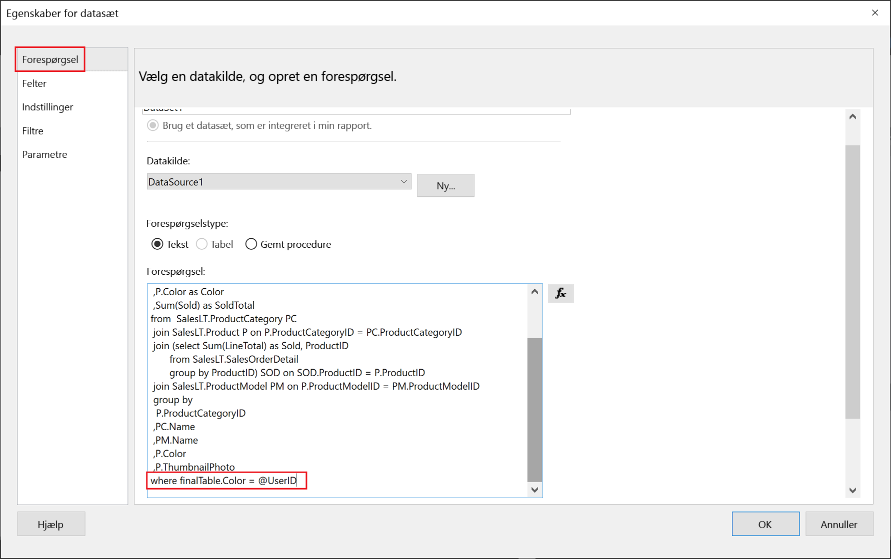

# <a name="implementing-row-level-security-in-embedded-paginated-reports-preview"></a>Implementering af sikkerhed på rækkeniveau i integrerede sideinddelte rapporter (prøveversion)

Når du integrerer en sideinddelt rapport, kan du styre, hvilke data der skal vises. Det gør det muligt at skræddersy de viste oplysninger pr. bruger. Hvis du f. eks. har en sideinddelt Power BI-rapport, der omfatter globale salgsresultater, kan du integrere den, så kun salgsresultater fra en bestemt region er tilgængelige.

Denne funktion er en sikker måde at få vist et undersæt af dataene på, så det ikke kompromitterer de øvrige data. Den ligner funktionen [Sikkerhed på rækkeniveau](embedded-row-level-security.md), som er en sikker måde at få vist data på i Power BI-rapporter (der ikke er sideinddelt), dashboards, felter og datasæt.  

> [!Note]
> Denne funktion kan bruges sammen med integration af sideinddelte rapporter for kunder.

## <a name="configuring-a-parameter-to-filter-the-dataset"></a>Konfiguration af en parameter til filtrering af datasættet

Når du anvender sikkerhed på rækkeniveau på en sideinddelt Power BI-rapport, skal du tildele en [parameter](../report-builder-parameters.md) til attributten **UserID**. Denne parameter begrænser de data, der trækkes fra datasættet, før rapporten integreres.

Når du har tildelt parameteren til **UserID**, skal du bruge [Reports GenerateTokenForCreateInGroup](https://docs.microsoft.com/rest/api/power-bi/embedtoken/reports_generatetokenforcreateingroup)-API'en til at hente integreringstokenet.

## <a name="use-uderid-as-a-filter-at-report-or-query-level"></a>Brug UserID som et filter på rapport-eller forespørgselsniveau

Du kan bruge **UserId** som et *filter* eller i en *forespørgsel* til datakilden i [Sideinddelt Report Builder i Power BI](../report-builder-power-bi.md).

### <a name="using-the-filter"></a>Brug af filteret

1. I vinduet **Egenskaber for datasæt** skal du vælge **Filter** i ruden til venstre.

    

2. Vælg den parameter, du vil bruge til filtrering af dataene, i rullemenuen **Udtryk**.

     

3. Klik på funktionsknappen **Værdi**. 

    

4. I vinduet **Udtryk** skal du vælge **Indbyggede felter** på listen **Kategori**.

    

5. På listen **Element** skal du vælge **UserID** og klikke på **OK**.

    

6. I vinduet **Egenskaber for datasæt** skal du kontrollere, at udtrykket er *din valgte parameter = UserID*, og klikke på **OK**.

    

### <a name="using-a-query"></a>Brug af en forespørgsel

1. I vinduet **Egenskaber for datasæt** skal du vælge **Parametre** i ruden til venstre og klikke på **Tilføj**.

    

2. I **Parameternavn** skal du angive **@UserID** , og i **Parameterværdi** skal du tilføje **[&UserID]** .

     

3. I ruden til venstre skal du vælge **Forespørgsel** tilføje parameteren **UserID** i Forespørgsel som en del af din forespørgsel og klikke på **OK**.
    > [!NOTE]
    > I skærmbilledet nedenfor bruges farveparameteren som et eksempel (whereFinalTable. Color = @UserID). Hvis det er nødvendigt, er det muligt at oprette en mere kompleks forespørgsel.

    

## <a name="passing-the-configured-parameter-using-the-embed-token"></a>Overførsel af den konfigurerede parameter ved hjælp af integreringtokenet

Når du integrerer en sideinddelt rapport til dine kunder, bruges [Reports GenerateTokenForCreateInGroup](https://docs.microsoft.com/rest/api/power-bi/embedtoken/reports_generatetokenforcreateingroup)-API'en til at hente integreringtokenet. Dette token kan også bruges til at filtrere nogle af de data, der trækkes ud af de sideinddelte rapporter.

Hvis du kun vil vise nogle af dataene, skal du tildele feltet `username` med de oplysninger, du vil have vist. Hvis du f. eks. angiver *grøn* i feltet `username` i en sideinddelt rapport, der har en farveparameter, begrænser det integrerede token for eksempel de integrerede data til kun at vise de data, der har værdien *grøn* i farvekolonnen.

```JSON
{
    "accessLevel": "View",
    "reportId": "cfafbeb1-8037-4d0c-896e-a46fb27ff229",
    "identities": [
            {
                    // Replace the 'username' with a paginated report parameter
                    "username":     "...",
                    "reports: [
                        "cfafbeb1-8037-4d0c-896e-a46fb27ff229"
                    ]
            }
    ]
}
```
