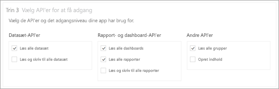
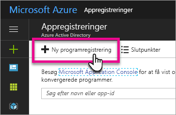
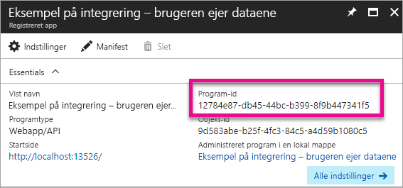
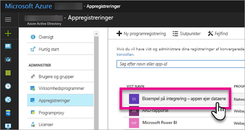
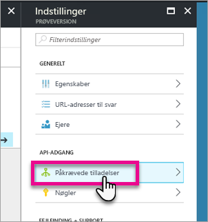
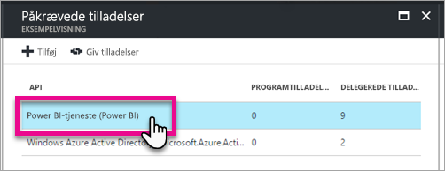
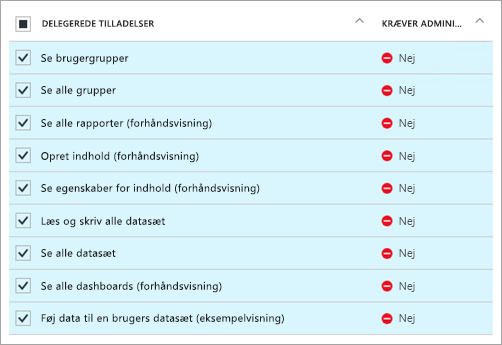
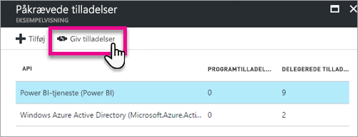

# <a name="register-an-azure-ad-app-to-embed-power-bi-content"></a>Registrer en Azure AD-app for at integrere Power BI-indhold
Få mere at vide om, hvordan du registrerer et program i Azure Active Directory (Azure AD), som skal bruges til at integrere Power BI-indhold.

Du kan registrere dit program i Azure AD, så dit program får adgang til Power BI REST-API'er. Det giver dig mulighed for at oprette et id for dit program og angive tilladelser til Power BI REST-ressourcer.

> [!IMPORTANT]
> Før du kan registrere et Power BI-app, skal du have en [Azure Active Directory-lejer og en organisationsbruger](create-an-azure-active-directory-tenant.md). Hvis du ikke har tilmeldt dig Power BI med en bruger i din lejer, fuldføres registreringen af appen ikke.
> 
> 

Der er to måder at registrere din app på. Den første er med brug af [værktøjet Power BI App Registration](https://dev.powerbi.com/apps/) , men du kan også vælge at gøre det direkte fra Azure-portalen. Værktøjet Power BI App Registration er den nemmeste løsning, fordi der ikke er mange felter, der skal udfyldes. Brug Azure-portalen, hvis du vil foretage ændringer i din app.

## <a name="register-with-the-power-bi-app-registration-tool"></a>Registrer med brug af værktøjet Power BI App Registration
Du skal registrere dit program i **Azure Active Directory** for at kunne oprette et id til dit program og specificere tilladelser til Power BI REST-ressourcer. Når du registrerer et program, f.eks en app på konsollen eller på et websted, modtager du et id, som bruges af programmet til identifikation over for de brugere, der anmodes om tilladelser fra.

Sådan registrerer du dit program ved hjælp af værktøjet Power BI App Registration:

1. Gå til [dev.powerbi.com/apps](https://dev.powerbi.com/apps).
2. Vælg **Log på med din eksisterende konto**.
3. Angiv et **appnavn**.
4. Valget af apptype afhænger af den type app, du bruger.
   
   * Brug **Native app** (Oprindelig app) for apps, der kører på klientenheder. Du skal vælge **Native app**, hvis du integrerer indhold til dine kunder, uanset hvad den faktiske app er. Lige for webapps.
   * Brug **Server-side Web app** (Serverbaseret webapp) for webapps eller web-API'er.

5. Angiv en værdi for **URL-adresse for omdirigering** og **URL-adresse til startsiden**. **URL-adresse for omdirigering** fungerer med enhver gyldig URL-adresse.
   
    **URL-adresse til startsiden** er kun tilgængelig, hvis du vælger **Server-side Web app** for programtypen.
   
    For eksemplerne på *integrering for kunderne* og *integrate-dashboard-web-app* vil URL-adressen til omdirigering være `http://localhost:13526/redirect`. For eksemplet på rapporten og feltet vil URL-adressen til omdirigering være `http://localhost:13526/`.
6. Vælg API'erne til den app, der har adgang. Du kan få flere oplysninger om adgangstilladelser til Power BI i [Power BI-tilladelser](power-bi-permissions.md).
   
    
7. Vælg **Register App** (Registrer app).
   
    Du bliver tildelt et **Klient-id**, og hvis du vælger **Server-side Web app**, modtager du en **Kundehemmelighed**. **Klient-id** kan hentes fra Azure-portalen på et senere tidspunkt, hvis det er nødvendigt. Hvis du mister den pågældende **Kundehemmelighed**, skal du oprette en ny på Azure-portalen.

8. Du skal gå til Azure for at vælge **Giv tilladelser**.
> [!Note]
    > Du skal være global administrator af Azure-lejeren for at fuldføre dette
>

* Gå til Azure.
* Søg efter og vælg **Appregistreringer**.
* Vælg din app.
* Vælg **Indstillinger**.
* Vælg **Krævede tilladelser**.
* Vælg **Power BI-tjeneste** for at bekræfte de tilladelser, du har valgt på webstedet til registrering af appen.
* Vælg **Giv tilladelser**.

Du kan nu bruge det registrerede program som del af dit tilpassede program til at kommunikere med Power BI-tjenesten.

> [!IMPORTANT]
> Hvis du integrerer indhold til dine kunder, skal du konfigurere yderligere tilladelser på Azure-portalen. Du kan finde flere oplysninger i [Anvend tilladelser til dit program](#apply-permissions-to-your-application).
> 

## <a name="register-with-the-azure-portal"></a>Registrer via Azure-portalen
Din anden mulighed for at registrere dit program er at gør det direkte på Azure-portalen. Følg nedenstående trin, når du vil registrere dit program.

1. Acceptér [vilkårene for Microsoft Power BI API](https://powerbi.microsoft.com/api-terms).
2. Log på [Azure-portalen](https://portal.azure.com).
3. Vælg din Azure AD-lejer ved at vælge din konto i sidens øverste højre hjørne.
4. Vælg **More Services** (Flere tjenester) i navigationsruden til venstre, vælg **App Registrations** (Appregistreringer) under **Security + Identity** (Sikkerhed og identitet), og vælg **New application registration** (Registrering af nyt program).
   
    
5. Følg prompterne, og opret et nyt program.
   
   * Angiv URL-adressen til logon for webapps, hvilket vil sige basis-URL-adressen for din app, hvor brugere kan logge på, f.eks. http://localhost:13526.
   * Til oprindelige programmer skal du angive en omdirigerings-URI , som Azure AD bruger til at returnere token-svar. Angiv en værdi, der er specifik for dit program, f.eks. http://myapplication/redirect

Du kan finde flere oplysninger om, hvordan du registrerer programmer i Azure Active Directory i [Integrating applications with Azure Active Directory](https://docs.microsoft.com/azure/active-directory/develop/active-directory-integrating-applications) (Integrering af programmer med Azure Active Directory)

## <a name="how-to-get-the-client-id"></a>Sådan henter du klient-id'et
Når du registrerer et program, modtager du et **Klient-id**.  **Klient-id** anmoder om tilladelse fra brugerne af appen for at de kan identificere sig selv.

Sådan henter du et klient-id:

1. Log på [Azure-portalen](https://portal.azure.com).
2. Vælg din Azure AD-lejer ved at vælge din konto i sidens øverste højre hjørne.
3. Vælg **More Services** (Flere tjenester) i navigationsruden til venstre, og vælg **App Registrations** (Appregistreringer).
4. Vælg det program, du vil hente klient-id'et for.
5. Du vil se **program-id'et** angivet som et GUID. Dette er klient-id'et for programmet.
   
    

## <a name="apply-permissions-to-your-application-within-azure-ad"></a>Anvend tilladelser til dit program i Azure AD
> [!IMPORTANT]
> Dette afsnit gælder kun for programmer, der **integrerer indhold for din organisation**.
> 

Du skal aktivere yderligere tilladelser til din app ud over det, der er angivet på siden til appregistrering. Du kan opnå dette via Azure AD-portalen eller fra et program.

Du skal være logget på enten via *hovedkontoen*, der er anvendt til integrering, eller en global administratorkonto.

### <a name="using-the-azure-ad-portal"></a>Brug af Azure AD-portalen
1. Gå til [App registrations](https://portal.azure.com/#blade/Microsoft_AAD_IAM/ApplicationsListBlade) (Appregistreringer) på Azure-portalen, og vælg den app, du bruger til at integrere.
   
    
2. Vælg **Required permissions** (Krævede tilladelser) under **API Access** (API-adgang).
   
    

3. I **Required permissions** skal du vælge **Power BI Service (Power BI)**.
   
    
   
   > [!NOTE]
   > Hvis du har oprettet appen direkte på Azure AD-portalen, er **Power BI Service (Power BI)** muligvis ikke at finde. Er den ikke det, kan du vælge **+ Add**  (+ Tilføj) og derefter **1 Select and API** (Vælg 1 og API). Vælg **Power BI-tjeneste** på listen API og derefter **Select** (Vælg).  Hvis **Power BI Service (Power BI)** ikke er tilgængelig i **+ Add**, kan du tilmelde dig Power BI med mindst én bruger.
   > 
   > 
4. Vælg alle tilladelser under **Delegated Permission** (Delegerede tilladelser). Du skal vælge dem én for én for at kunne gemme dine valg. Vælg **Gem**, når du er færdig.
   
    
5. I **Required permissions** (Krævede tilladelser), skal du vælge **Grant Permissions** (Tildel tilladelser).
   
    Handlingen **Grant Permissions** (Tildel tilladelser) skal bruges til *hovedkontoen* for at undgå at blive bedt af Azure AD om at angive dit samtykke. Hvis kontoen, der udfører denne handling, er en Global administrator, giver du tilladelser til alle brugere i organisationen til appen. Hvis kontoen, der udfører denne handling, er *hovedkontoen* og ikke en global administrator, giver du kun tilladelser til *hovedkontoen*  til appen.
   
    

### <a name="applying-permissions-programmatically"></a>Anvendelse af tilladelser fra et program
1. Du skal hente de eksisterende tjenesteprincipaler (brugere) inden for din lejer. Du kan finde oplysninger om, hvordan du gør det, i [Get servicePrincipal](https://developer.microsoft.com/en-us/graph/docs/api-reference/beta/api/serviceprincipal_get).
   
    Du kan kalde API'en *Get servicePrincipal* uden {id}, så får du alle tjenesteprincipalerne i lejeren.
2. Brug dit app-klient-id som **appId**-egenskab for at se, om der er en tjenesteprincipal.
3. Opret en ny serviceaftale, hvis der mangler en til din app.
   
    ```
    Post https://graph.microsoft.com/beta/servicePrincipals
    Authorization: Bearer ey..qw
    Content-Type: application/json
    {
    "accountEnabled" : true,
    "appId" : "{App_Client_ID}",
    "displayName" : "{App_DisplayName}"
    }
    ```
4. Tildel apptilladelse til PowerBI API
   
   Hvis du bruger en eksisterende lejer, og du ikke er interesseret i at tildele tilladelser på vegne af alle brugere, der er lejere, kan du give tilladelser til en bestemt bruger ved at erstatte værdien af **contentType** til **Principal**.

   Værdien for **consentType** kan være enten **AllPrincipals** eller **Principal**.

   * **AllPrincipals** kan kun bruges af en lejeradministrator til at give tilladelser på vegne af alle brugere i lejeren.
   * **Principal** bruges til at give tilladelser på vegne af en bestemt bruger. I dette tilfælde skal endnu en egenskab føjes til anmodningens brødtekst – *principalId = {User_ObjectId}*.
    
    Handlingen *Grant Permissions* skal bruges til hovedkontoen for at undgå, at Azure AD beder om dit samtykke. Dette er ikke muligt, når der logges på aktivt.
   
    ```
    Post https://graph.microsoft.com/beta/OAuth2PermissionGrants
    Authorization: Bearer ey..qw
    Content-Type: application/json
    { 
    "clientId":"{Service_Plan_ID}",
    "consentType":"AllPrincipals",
    "resourceId":"c78b2585-1df6-41de-95f7-dc5aeb7dc98e",
    "scope":"Dataset.ReadWrite.All Dashboard.Read.All Report.Read.All Group.Read Group.Read.All Content.Create Metadata.View_Any Dataset.Read.All Data.Alter_Any",
    "expiryTime":"2018-03-29T14:35:32.4943409+03:00",
    "startTime":"2017-03-29T14:35:32.4933413+03:00"
    }
    ```

5.  Tildel apptilladelser til Azure Active Directory (AAD)
   
    Værdien for **consentType** kan være enten **AllPrincipals** eller **Principal**.

    * **AllPrincipals** kan kun bruges af en lejeradministrator til at give tilladelser på vegne af alle brugere i lejeren.
    * **Principal** bruges til at give tilladelser på vegne af en bestemt bruger. I dette tilfælde skal endnu en egenskab føjes til anmodningens brødtekst – *principalId = {User_ObjectId}*.
    
    Handlingen *Grant Permissions* skal bruges til hovedkontoen for at undgå, at Azure AD beder om dit samtykke. Dette er ikke muligt, når der logges på aktivt.

 ```
    Post https://graph.microsoft.com/beta/OAuth2PermissionGrants
    Authorization: Bearer ey..qw
    Content-Type: application/json
    { 
    "clientId":"{Service_Plan_ID}",
    "consentType":"AllPrincipals",
    "resourceId":"61e57743-d5cf-41ba-bd1a-2b381390a3f1",
    "scope":"User.Read Directory.AccessAsUser.All",
    "expiryTime":"2018-03-29T14:35:32.4943409+03:00",
    "startTime":"2017-03-29T14:35:32.4933413+03:00"
    }
 ```

## <a name="next-steps"></a>Næste trin
Nu, hvor du har registreret din app i Azure AD, skal du godkende brugere i din app. Du kan finde flere oplysninger under [Godkend brugere, og få et Azure AD-adgangstoken til din Power BI-app](get-azuread-access-token.md).

Har du flere spørgsmål? [Prøv at spørge Power BI-community'et](http://community.powerbi.com/)