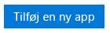
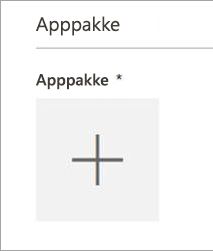
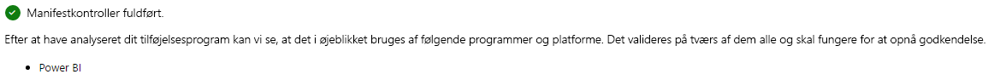
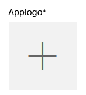
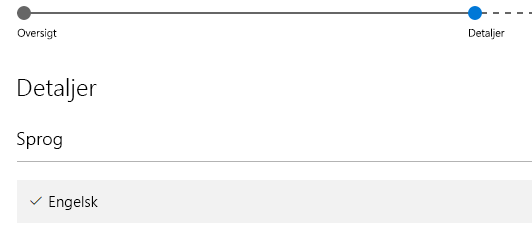

# Indsend en Power BI-visualisering til AppSource ved hjælp af Sælgerdashboard

Du skal sende en mail med **pbiviz**-filen og **pbix**-filen til Power BI-teamet, før du indsender til AppSource. Power BI-teamet overfører så filerne til den offentlige shareserver. Ellers vil filerne ikke kunne hentes i butikken. Du skal sende filerne med nye indsendelser af Power BI-visualiseringer, opdateringer til eksisterende Power BI-visualiseringer og rettelser til afviste indsendelser.

>[!NOTE]
>[Sælgerdashboard](https://docs.microsoft.com/office/dev/store/use-the-seller-dashboard-to-submit-to-the-office-store) er ved at blive udfaset. Det erstattes af [Partnercenter](https://docs.microsoft.com/partner-center/). Brug kun Sælgerdashboard, hvis du er i gang med at indsende en Power BI-visualisering. Hvis du indsender en ny Power BI-visualisering til AppSource, skal du bruge [Partnercenter-metoden](office-store.md#submitting-to-appsource).

### Indsendelsesproces via Sælgerdashboard

Du skal have en gyldig Office-udviklerkonto for at logge på [Office Developer Center](https://dev.office.com/). En Office-udviklerkonto skal være et Live ID til en Microsoft-konto, f.eks. hotmail.com eller outlook.com.

1. Naviger til [Developer Center](https://sellerdashboard.microsoft.com/Application/Summary).

2. Vælg **Tilføj en ny app**.

    

3. Vælg **Brugerdefineret illustration for Power BI**, og vælg derefter **Næste**.

4. Vælg **+** under **App-pakke**, og vælg den XML-app-pakkefil, du har modtaget fra Power BI-teamet, i dialogboksen Åbn fil.

    

5. Du bør modtage en meddelelse om, at dette er en gyldig Power BI-app-pakke.

    

6. Udfyld oplysningerne under **Generelle oplysninger**.

   * *Titel på indsendelse:* Den måde, din indsendelse navngives på i Developer Center.
   * *Version:* Versionsnummeret udfyldes automatisk fra app-pakken til tilføjelsesprogrammet.
   * *Udgivelsesdato (UTC):* Vælg den dato, din app skal udgives i Store. Hvis du vælger en dato i fremtiden, vil appen ikke være tilgængelig før den dato.
   * *Kategori:* Den første kategori udfyldes automatisk som "Datavisualisering + BI". Sådan mærkes alle Power BI-visualiseringer. Du kan hjælpe brugerne med nemt at søge efter din visualisering ved at angive op til to yderligere kategorier.
   * *Testnoter:* Dette felt er valgfrit og kan bruges, hvis du vil angive nogle instruktioner til testerne hos Microsoft.
   * *Min app kalder, understøtter, indeholder eller bruger kryptografi eller kryptering:* Undlad at markere dette afkrydsningsfelt.
   * *Gør dette tilføjelsesprogram tilgængeligt i kataloget med Office-tilføjelsesprogrammer på iPad:* Undlad at markere dette afkrydsningsfelt.
7. Overfør logoet for din visualisering ved at markere **+** under **App-logo**. Vælg derefter ikonfilen i dialogboksen Åbn fil. Filen skal være i .png, .jpg, .jpeg eller .gif. Den skal være nøjagtigt 300 pixel (bredde) x 300 pixel (højde) og må højst fylde 512 KB.

    

8. Udfyld oplysningerne under **Understøttende dokumenter**.

   * Link til supportdokument
   * Link til dokument om beskyttelse af personlige oplysninger
   * Videolink
   * Slutbrugerlicensaftale (EULA)

       Du skal overføre en fil med slutbrugerlicensaftalen. Det kan enten være din egen slutbrugerlicensaftale, eller du kan bruge den standardslutbrugerlicensaftale, der findes i Office Store, til Power BI-visualiseringer. Hvis du vil bruge standardslutbrugerlicensaftalen, skal du indsætte følgende URL-adresse i dialogboksen "Slutbrugerlicensaftale" til filupload i sælgerdashboardet: [https://visuals.azureedge.net/app-store/Power BI - Default Custom Visual EULA.pdf](https://visuals.azureedge.net/app-store/Power%20BI%20-%20Default%20Custom%20Visual%20EULA.pdf). Filen er evt. på engelsk.

9. Vælg **Næste** for at fortsætte til siden **Oplysninger**.

10. Vælg **Sprog** , og vælg et sprog på listen.

    

11. Udfyld "Beskrivelse".

    * *App-navn (for dette sprog):* Angiv navnet på din app, som det skal vises i butikken.
    * *Kort beskrivelse:* Angiv en kort beskrivelse af appen på højst 100 tegn, som den skal vises i butikken. Beskrivelsen vises øverst sammen med logoet. Du kan bruge beskrivelsen fra pbiviz-pakken.
    * *Lang beskrivelse:* Angiv en mere detaljeret beskrivelse af din app, som kunderne får vist på siden med oplysninger om appen. Hvis du vil have, at andre skal kunne forbedre din visualisering ved at publicere den som åben kildekode, skal du angive linket til det offentlige lager, f.eks. GitHub, her.

12. Overfør mindst ét skærmbillede. Formatet kan være .png, .jpg, .jpeg eller .gif. Den skal være nøjagtigt 1366 pixel (bredde) x 768 pixel (højde). Filstørrelsen må ikke overstige 1024 KB. *Effekten vil blive større, hvis du tilføjer tekstbobler for at fremhæve fordelene ved de vigtigste funktioner, som vises på hvert skærmbillede.*

12. Hvis du vil tilføje flere sprog, skal du vælge **Tilføj et sprog** og gentage trin 10 og 11. Når du tilføjer flere sprog, kan brugerne få vist oplysningerne om den brugerdefinerede visualisering på deres eget sprog. De sprog, der ikke angives, vil få vist oplysningerne på det sprog, der blev valgt først.

13. Når du er færdig med at tilføje sprog, skal du vælge **Næste** for at fortsætte til siden **Bloker adgang**.

14. Hvis du vil forhindre, at kunder i bestemte lande eller områder bruger eller køber din app, skal du markere afkrydsningsfeltet og vælge på listen.

15. Vælg **Næste** for at fortsætte til siden **Prissætning**.

16. I øjeblikket er det kun *gratis* visualiseringer, der understøttes, og ekstra køb i visualiseringen (køb i app) er ikke tilladt. Vælg **Appen er gratis**.

    > [!NOTE]
    > Hvis du vælger en anden indstilling end gratis, eller køb i app er muligt i den indsendte visualisering, vil den blive afvist.

17. Du kan nu vælge **Gem som kladde** og indsende den senere, eller du kan vælge **Send til godkendelse** for at indsende visualiseringen til Office Store med det samme.

## Indsendelsesproces for certificering via Sælgerdashboard

Følg vejledningen i dette afsnit for at indsende en Power BI-visualisering til certificering via Sælgerdashboard. Brug denne metode, hvis du tidligere har indsendt en Power BI-visualisering til AppSource ved hjælp af Sælgerdashboard.

1. Send en mail til supportteamet for Power BI-visualiseringer (pbicvsupport@microsoft.com). Du skal inkludere følgende oplysninger i mailen:
    * Titel: Anmodning om certificering af visualisering
    * Link til GitHub-lageret, der hoster kildekoden, som kan læse af mennesker
    * [Overhold kravene](power-bi-custom-visuals-certified.md#certification-requirements)
    * Bestå kodegennemgangen

2. Teamet for Microsoft Power BI-visualiseringer giver dig besked, når din Power BI-visualisering er certificeret og føjet til [listen over certificerede Power BI-visualiseringer](power-bi-custom-visuals-certified.md#certified-power-bi-visuals), eller hvis den afvises – med en rapport over de problemer, der skal løses. Det er udviklerens ansvar at have en åben kommunikation med Microsoft og opdatere deres certificerede visualiseringer efter behov.

## Se statussen for indsendelsen og brugsdata

Du kan gennemse [valideringspolitikkerne](https://dev.office.com/officestore/docs/validation-policies#13-power-bi-custom-visuals).

Når du har indsendt visualiseringen, vil du kunne se statussen for den i [appdashboardet](https://sellerdashboard.microsoft.com/Application/Summary/).

## Certificer din visualisering

Når du har oprettet din visualisering, kan du vælge at få den [certificeret](../developer/power-bi-custom-visuals-certified.md), hvis du vil.

## Næste trin

[Udvikling af en brugerdefineret visualisering i Power BI](visuals/custom-visual-develop-tutorial.md)  
[Visualiseringer i Power BI](../visuals/power-bi-report-visualizations.md)  
[Brugerdefinerede visualiseringer i Power BI](../developer/power-bi-custom-visuals.md)  
[Sådan får du en Power BI-visualisering certificeret](../developer/power-bi-custom-visuals-certified.md)

Har du flere spørgsmål? [Prøv at spørge Power BI-community'et](https://community.powerbi.com/)
