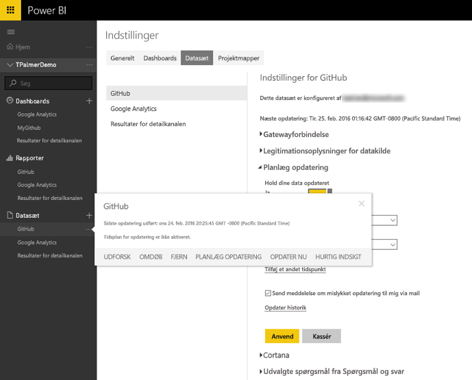
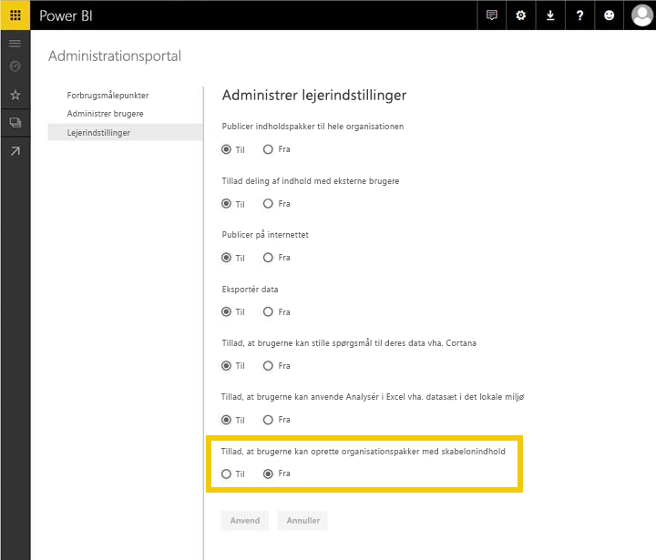
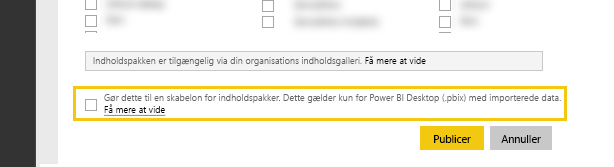

# Test af indholdspakkeskabelon til Power BI
Der er flere måder at teste din indholdspakke på, før du udgiver den.  

> [!NOTE]
> Hvis der i din indholdspakke bruges en brugerdefineret [dataconnector](https://aka.ms/DataConnectors), som du har udviklet, kan du ikke teste dataopdateringen eller indholdspakkeskabelonen, som beskrevet nedenfor. Hvis det er tilfældet, skal du gå til "[indsend](#submission) din indholdspakke", så arbejder Power BI-teamet sammen med dig om at teste din indholdspakke.
> 
> 

## Test af planlagt dataopdatering
I indholdspakkeskabeloner udnyttes Opdater i PowerBI.com til at instantiere en indholdspakke med kundens data, når der oprettes forbindelse. Før indholdspakken bliver offentligt tilgængelig, kan du teste dette flow med den Desktop-fil, du har oprettet.

Når du har uploadet filen, skal du vælge "..." ud for datasættet og vælge Planlæg opdatering. Konfigurer legitimationsoplysninger for kilden. Sørg for, at dit datasæt opdateres. Prøv både "Opdater nu" og "Planlagt opdatering". Hvis der opstår fejl under opdateringen, skal du se fejlmeddelelsen og validere dine forespørgsler og dit slutsystem.

### Tips til yderligere opdatering
* Der bør kun registreres én datakilde, når du forsøger at planlægge en opdatering.  
* Testforbindelsen bør indikere, at din bruger kan indlæse indholdspakken. Hvis det ikke er tilfældet, skal du sikre, at dine forespørgsler håndterer de yderligere fejl.  
* Opdateringen bør blive udført inden for et rimeligt tidsrum – ca. 5 min. er foreslået.  

## Test af skabeloner
En indholdspakkeskabelon ligner eksisterende løsninger, bortset fra at den ikke indeholder de faktiske data i datasættet. Når en bruger forbruger eller instantierer en skabelon, bliver brugeren i stedet bedt om at angive parametre og legitimationsoplysninger for at oprette forbindelse. Når brugeren har oprettet forbindelse, får vedkommende vist sine egne data på dashboardet, i rapporten og i datasættet. 

Når en bruger instantierer indholdspakken, har brugeren adgang til indstillingerne for datasættet, herunder planlagt opdatering. Eventuelle RLS-indstillinger for datasættet udgives **ikke** med indholdspakken.  

> [!NOTE]
> Indholdspakkeskabeloner kan kun omfatte ét dashboard, ét rapport og ét datasæt. Se listen over begrænsninger på [oprettelsessiden](template-content-pack-authoring.md#restrictions). 
> 
> 

Hvis du vil aktivere oprettelse af skabelon for din lejer, skal du arbejde sammen med din Power BI-administrator for at aktivere funktionskontakten nedenfor. 

Når indstillingen er aktiveret, kan du se et afkrydsningsfelt i bunden af ["Opret indholdspakke"](https://app.powerbi.com/groups/me/publish-content/), hvilket giver dig mulighed for at udgive en indholdspakkeskabelon i din organisation. 

### Navngivning
Det anbefales, at navngive dit dashboard, din rapport og dit datasæt ensartet på tværs af indholdspakken. Disse navne er "hardcoded" og er ens for alle brugere, så det bliver nemmere for kunderne at finde, hvis navnet på dit produkt/scenarie bruges.

### Yderligere tips til skabeloner
* Kontrollér, at de parametre, du angav i forespørgslerne, er relevante for dine slutbrugere
* Overvej, hvor længe dine slutbrugere vil vente på, at en planlagt opdatering fuldføres

## Indsendelse
Indsendelsesprocessen via [Microsoft AppSource](https://appsource.microsoft.com/en-us/partners/list-an-app) giver dig mulighed for at udgive indholdpakkeskabelonen i servicepakkegalleriet i PowerBI.com og angive indholdspakken i [Microsoft AppSource ](http://appsource.microsoft.com).

### Før indsendelse
* Gennemse tips til oprettelse for hver af artefakterne i indholdspakken
* Test og opret forbindelse til forskellige konti og databetingelser. Spring dette trin over, hvis du har udviklet din egen brugerdefinerede [dataconnector](https://aka.ms/DataConnectors)
* Gennemse alle visualiseringer – se nøje efter stavefejl
* Kontrollér, at indholdspakken reagerer korrekt på spørgsmål og svar. Det kan være en god idé at teste mindst 30 forskellige spørgsmål på tværs af datamodellen. Spring dette trin over, hvis du har udviklet din egen brugerdefinerede [dataconnector](https://aka.ms/DataConnectors)

### Indsendelse
Når du er klar til at indsende, skal du gå til [siden Indsendelse af apps](https://appsource.microsoft.com/en-us/partners/list-an-app) på AppSource og indsende dine oplysninger. Sørg for at vælge Power BI på listen over tilgængelige produkter

Power BI-teamet gennemser din indsendelse og kontakter dig for at sikre, at alle artefakter opfylder indsendelseskravene. Ud over fuldførelse valideres kvaliteten af de leverede dashboards og rapporter også for at sikre, at de overholder det erhvervsscenario, der er beskrevet i applikationen.

### Opdateringer
Opdatering af din indholdspakke følger et flow, der ligner den oprindelige indsendelse. 

