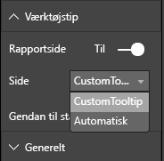

# <a name="tooltips-in-power-bi-visuals"></a>Værktøjstip i visualiseringer i Power BI

Visualiseringer kan nu anvende understøttelse af Power BI-værktøjstip. Power BI-værktøjstip håndterer følgende interaktioner:

* Vis et værktøjstip.
* Skjul et værktøjstip.
* Flyt et værktøjstip.

Værktøjstip kan vise et tekstelement med en titel, en værdi i en given farve og uigennemsigtighed med et angivet sæt koordinater. Dataene leveres til API, og Power BI-værten gengiver dem derefter på samme måde som værktøjstip til oprindelige visualiseringer.

Følgende billede viser et værktøjstip i et eksempel på et søjlediagram:


Billedet af værktøjstippet ovenfor angiver kategori og værdi for en enkelt søjle i diagrammet. Du kan udvide et enkelt værktøjstip for at få vist flere værdier.

## <a name="manage-tooltips"></a>Administrer værktøjstip

Den grænseflade, du skal bruge til at administrere værktøjstip, er "ITooltipService". Den bruges til at underrette værten om, at et værktøjstip skal vises, fjernes eller flyttes.

```typescript
    interface ITooltipService {
        enabled(): boolean;
        show(options: TooltipShowOptions): void;
        move(options: TooltipMoveOptions): void;
        hide(options: TooltipHideOptions): void;
    }
```

Din visualisering skal lytte efter musehændelser i din visualisering og kalde de delegerede for `show()`, `move()` og `hide()` efter behov med det relevante indhold udfyldt i `Tooltip****Options`-objekterne.
`TooltipShowOptions` og `TooltipHideOptions` definerer, hvad der skal vises, og hvordan der skal reageres, når disse hændelser indtræffer.

Da kaldet af disse metoder kræver brugerhændelser, f.eks. bevægelse og berøring med musen, er det en god idé at oprette lyttefunktioner til disse hændelser, som derefter kalder `TooltipService`-medlemmerne.
Vores eksempel samles i en klasse, der kaldes `TooltipServiceWrapper`.

### <a name="the-tooltipservicewrapper-class"></a>Klassen TooltipServiceWrapper

Det grundlæggende princip bag denne klasse er, at den indeholder forekomsten af `TooltipService`, lytter efter D3-musehændelser over relevante elementer og derefter foretager kald af `show()` og `hide()` til elementerne, når det er nødvendigt.

Klassen indeholder og administrerer enhver relevant tilstand og logik for disse hændelser, som hovedsageligt er beregnet til at fungere sammen med den underliggende D3-kode. D3-grænsefladen og -konverteringen er ikke beskrevet i denne artikel.

Du kan finde hele eksempelkoden i [lageret med SampleBarChart-visualiseringen](https://github.com/Microsoft/PowerBI-visuals-sampleBarChart/commit/981b021612d7b333adffe9f723ab27783c76fb14).

### <a name="create-tooltipservicewrapper"></a>Opret TooltipServiceWrapper

BarChart-konstruktøren har nu et `TooltipServiceWrapper`-medlem, som er instantieret i konstruktøren med værtens `tooltipService`-forekomst.

```typescript
        private tooltipServiceWrapper: ITooltipServiceWrapper;

        this.tooltipServiceWrapper = createTooltipServiceWrapper(this.host.tooltipService, options.element);
```

Klassen `TooltipServiceWrapper` indeholder instansen `tooltipService` – også som rod-D3-element for visualiserings- og berøringsparametrene.

```typescript
    class TooltipServiceWrapper implements ITooltipServiceWrapper {
        private handleTouchTimeoutId: number;
        private visualHostTooltipService: ITooltipService;
        private rootElement: Element;
        private handleTouchDelay: number;

        constructor(tooltipService: ITooltipService, rootElement: Element, handleTouchDelay: number) {
            this.visualHostTooltipService = tooltipService;
            this.handleTouchDelay = handleTouchDelay;
            this.rootElement = rootElement;
        }
        .
        .
        .
    }
```

Det eneste indgangspunkt for denne klasse angående registrering af lyttefunktioner for hændelser er metoden `addTooltip`.

### <a name="the-addtooltip-method"></a>Metoden addTooltip

```typescript
        public addTooltip<T>(
            selection: d3.Selection<Element>,
            getTooltipInfoDelegate: (args: TooltipEventArgs<T>) => VisualTooltipDataItem[],
            getDataPointIdentity: (args: TooltipEventArgs<T>) => ISelectionId,
            reloadTooltipDataOnMouseMove?: boolean): void {

            if (!selection || !this.visualHostTooltipService.enabled()) {
                return;
            }
        ...
        ...
        }
```

* **selection: d3.Selection<Element>** : De D3-elementer, over hvilke der håndteres værktøjstip.

* **getTooltipInfoDelegate: (args: TooltipEventArgs<T>) => VisualTooltipDataItem[]** : Delegeret til udfyldelse af indholdet af værktøjstippet (hvad skal vises) pr. kontekst.

* **getDataPointIdentity: (args: TooltipEventArgs<T>) => ISelectionId**: Delegeret til hentning af datapunkt-id (bruges ikke i dette eksempel). 

* **reloadTooltipDataOnMouseMove? boolean**: En boolesk værdi, der angiver, om værktøjstippet skal opdateres under en MouseMove-hændelse (bruges ikke i dette eksempel).

Som du kan se, afsluttes `addTooltip` uden handling, hvis `tooltipService` er deaktiveret, eller der ikke er noget reelt valg.

### <a name="call-the-show-method-to-display-a-tooltip"></a>Kald af visningsmetoden for at få vist et værktøjstip

`addTooltip`-metoden lytter derefter til D3 `mouseover`-event som vist i følgende kode:

```typescript
        ...
        ...
        selection.on("mouseover.tooltip", () => {
            // Ignore mouseover while handling touch events
            if (!this.canDisplayTooltip(d3.event))
                return;

            let tooltipEventArgs = this.makeTooltipEventArgs<T>(rootNode, true, false);
            if (!tooltipEventArgs)
                return;

            let tooltipInfo = getTooltipInfoDelegate(tooltipEventArgs);
            if (tooltipInfo == null)
                return;

            let selectionId = getDataPointIdentity(tooltipEventArgs);

            this.visualHostTooltipService.show({
                coordinates: tooltipEventArgs.coordinates,
                isTouchEvent: false,
                dataItems: tooltipInfo,
                identities: selectionId ? [selectionId] : [],
            });
        });
```

* **makeTooltipEventArgs**: Udtrækker konteksten fra de valgte D3-elementer til tooltipEventArgs. Desuden beregner den koordinaterne.

* **getTooltipInfoDelegate**: Den bygger derefter indholdet af værktøjstippet ud fra tooltipEventArgs. Der sker et tilbagekald til BarChart-klassen, fordi det er visualiseringens logik. Det er det faktiske tekstindhold, der vises i værktøjstippet.

* **getDataPointIdentity**: Bruges ikke i dette eksempel.

* **this.visualHostTooltipService.show**: Kaldet til at vise værktøjstippet.  

Du kan finde andre håndteringer i eksemplet til `mouseout`- og `mousemove`-hændelser.

Du kan finde flere oplysninger i [lageret med SampleBarChart-visualiseringen](https://github.com/Microsoft/PowerBI-visuals-sampleBarChart/commit/981b021612d7b333adffe9f723ab27783c76fb14).

### <a name="populate-the-tooltip-content-by-the-gettooltipdata-method"></a>Udfyld værktøjstippets indhold med metoden getTooltipData

Klassen BarChart blev tilføjet med et `getTooltipData`-medlem, der blot udtrækker datapunktets `category`, `value` og `color` til elementet VisualTooltipDataItem[].

```typescript
        private static getTooltipData(value: any): VisualTooltipDataItem[] {
            return [{
                displayName: value.category,
                value: value.value.toString(),
                color: value.color,
                header: 'ToolTip Title'
            }];
        }
```

I ovenstående implementering er `header`-medlemmet konstant, men du kan bruge den til mere komplekse implementeringer, som kræver dynamiske værdier. Du kan udfylde `VisualTooltipDataItem[]` med mere end ét element, hvilket betyder, at der tilføjes flere linjer i værktøjstippet. Dette kan være nyttigt i visualiseringer som f.eks. stablede liggende søjlediagrammer, hvor værktøjstippet kan vise data fra mere end et enkelt datapoint.

### <a name="call-the-addtooltip-method"></a>Kald metoden addTooltip

Det sidste trin er at kalde metoden `addTooltip`, når de faktiske data kan ændre sig. Dette kald sker i metoden `BarChart.update()`. Der foretages et kald for at overvåge valg af alle 'bar'-elementerne, der kun sender `BarChart.getTooltipData()`, som det er beskrevet ovenfor.

```typescript
        this.tooltipServiceWrapper.addTooltip(this.barContainer.selectAll('.bar'),
            (tooltipEvent: TooltipEventArgs<number>) => BarChart.getTooltipData(tooltipEvent.data),
            (tooltipEvent: TooltipEventArgs<number>) => null);
```

## <a name="add-report-page-tooltips"></a>Tilføj værktøjstip for rapportside

Hvis du vil tilføje understøttelse af værktøjstip til rapportsider, kan du finde de fleste ændringer i filen *capabilities.json*.

Følgende er et eksempel på et skema

```json
{
    "tooltips": {
        "supportedTypes": {
            "default": true,
            "canvas": true
        },
        "roles": [
            "tooltips"
        ]
    }
}
```

Du kan definere værktøjstip til rapportsider i ruden **Format.**



* `supportedTypes`: Den konfiguration af værktøjstip, der understøttes af visualiseringen og afspejles på feltoversigten. 
   * `default`: Angiver, om binding af "automatiske" værktøjstip via datafelter understøttes. 
   * `canvas`: Angiver, om værktøjstip på rapportsider understøttes.

* `roles`: (Valgfrit) Når den er defineret, får du besked om, hvilke dataroller der bindes til den valgte indstilling for værktøjstip i feltoversigten.

Du kan finde flere oplysninger under [Retningslinjer for brug af værktøjstip på rapportsider](https://powerbi.microsoft.com/blog/power-bi-desktop-march-2018-feature-summary/#tooltips).

For at vise værktøjstip til rapportsiden, efter at Power BI-værten har kaldt `ITooltipService.Show(options: TooltipShowOptions)` eller `ITooltipService.Move(options: TooltipMoveOptions)`, bruger den selectionId (egenskaben `identities` for det foregående `options`-argument). For at blive hentet af værktøjstippet skal selectionId repræsentere de valgte data (kategori, serie osv.) for det element, du holdt markøren over.

Et eksempel på, hvordan selectionId sendes ved kald om visning af værktøjstip, vises i den følgende kode:

```typescript
    this.tooltipServiceWrapper.addTooltip(this.barContainer.selectAll('.bar'),
        (tooltipEvent: TooltipEventArgs<number>) => BarChart.getTooltipData(tooltipEvent.data),
        (tooltipEvent: TooltipEventArgs<number>) => tooltipEvent.data.selectionID);
```
