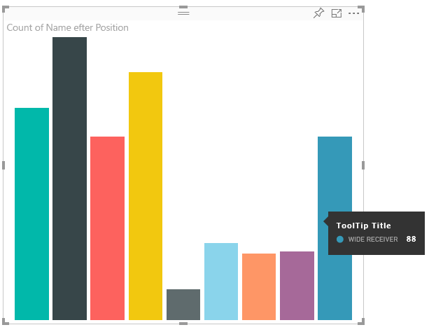
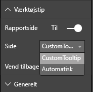

# <a name="power-bi-visuals-tooltips"></a>Værktøjstip i Power BI Visuals

Visuals kan nu anvende understøttelse af Power BI-værktøjstip. Power BI-værktøjstip håndterer følgende interaktioner:

Vis et værktøjstip.
Skjul et værktøjstip.
Flyt et værktøjstip.

Værktøjstip kan vise et tekstelement med en titel, en værdi i en given farve og uigennemsigtighed med et angivet sæt koordinater. Disse data leveres til API'en. Power BI-værten gengiver dem derefter på samme måde som værktøjstip til oprindelige visualiseringer.

Eksempelvis værktøjstip i eksemplet BarChart.



Værktøjstippet ovenfor angiver kategori og værdi for en enkelt søjle i diagrammet. Det kan udvides til at vise flere værdier i et enkelt værktøjstip.

## <a name="handling-tooltips"></a>Håndtering af værktøjstip

Den grænseflade, du skal bruge til at administrere værktøjstip, er ITooltipService. Denne grænseflade bruges til at underrette værten om, at et værktøjstip skal vises, fjernes eller flyttes.

```typescript
    interface ITooltipService {
        enabled(): boolean;
        show(options: TooltipShowOptions): void;
        move(options: TooltipMoveOptions): void;
        hide(options: TooltipHideOptions): void;
    }
```

Din visualisering skal lytte efter musehændelser i din visualisering og kalde de delegerede for `show()`, `move()` og `hide()` efter behov med det relevante indhold udfyldt i `Tooltip****Options`-objekterne.
`TooltipShowOptions` og `TooltipHideOptions` definerer, hvad der skal vises, og hvordan der skal reageres, når disse hændelser indtræffer.
Da kaldet af disse metoder kræver brugerhændelser, f.eks. bevægelse eller berøring med musen, er det en god idé at oprette lyttefunktioner til disse hændelser, som derefter kalder `TooltipService`-medlemmerne.
Vores eksempel samles i en klasse, der kaldes `TooltipServiceWrapper`.

### <a name="tooltipservicewrapper-class"></a>Klassen TooltipServiceWrapper

Det grundlæggende princip bag denne klasse er, at den indeholder forekomsten af `TooltipService`, lytter efter D3-musehændelser over relevante elementer og derefter foretager kald af `show()` og `hide()`, når det er nødvendigt.
Klassen indeholder og administrerer enhver relevant tilstand og logik for disse hændelser, og den er hovedsageligt beregnet til at fungere sammen med den underliggende D3-kode. D3-grænsefladen og -konverteringen er ikke beskrevet i dette dokument.

Du kan finde hele eksempelkoden i [lageret med SampleBarChart-visualiseringen](https://github.com/Microsoft/PowerBI-visuals-sampleBarChart/commit/981b021612d7b333adffe9f723ab27783c76fb14)

### <a name="creating-tooltipservicewrapper"></a>Oprettelse af TooltipServiceWrapper

BarChart-konstruktøren har nu et `tooltipServiceWrapper`-medlem, som er instantieret i konstruktøren med værtens `tooltipService`-forekomst.

```typescript
        private tooltipServiceWrapper: ITooltipServiceWrapper;

        this.tooltipServiceWrapper = createTooltipServiceWrapper(this.host.tooltipService, options.element);
```

Klassen `TooltipServiceWrapper` indeholder instansen `tooltipService` – også som rod-D3-element for visualiserings- og berøringsparametrene.

```typescript
    class TooltipServiceWrapper implements ITooltipServiceWrapper {
        private handleTouchTimeoutId: number;
        private visualHostTooltipService: ITooltipService;
        private rootElement: Element;
        private handleTouchDelay: number;

        constructor(tooltipService: ITooltipService, rootElement: Element, handleTouchDelay: number) {
            this.visualHostTooltipService = tooltipService;
            this.handleTouchDelay = handleTouchDelay;
            this.rootElement = rootElement;
        }
        .
        .
        .
    }
```

Det eneste indgangspunkt for denne klasse angående registrering af lyttefunktioner for hændelser er metoden `addTooltip`.

### <a name="addtooltip-method"></a>Metoden addTooltip

```typescript
        public addTooltip<T>(
            selection: d3.Selection<Element>,
            getTooltipInfoDelegate: (args: TooltipEventArgs<T>) => VisualTooltipDataItem[],
            getDataPointIdentity: (args: TooltipEventArgs<T>) => ISelectionId,
            reloadTooltipDataOnMouseMove?: boolean): void {

            if (!selection || !this.visualHostTooltipService.enabled()) {
                return;
            }
        ...
        ...
        }
```

* **selection: d3.Selection<Element>**
* De D3-elementer, over hvilke der håndteres værktøjstip
* **getTooltipInfoDelegate: (args: TooltipEventArgs<T>) => VisualTooltipDataItem[]**
* Delegeret til udfyldelse af indholdet af værktøjstippet (hvad skal vises) pr. kontekst
* **getDataPointIdentity: (args: TooltipEventArgs<T>) => ISelectionId**
* Delegeret til hentning af datapunkt-id – bruges ikke i dette eksempel 
* **reloadTooltipDataOnMouseMove?: boolean**
* Boolesk værdi, der angiver, om værktøjstippet skal opdateres under en mouseMove-hændelse – bruges ikke i dette eksempel

Som du kan se, afsluttes `addTooltip` uden handling, hvis `tooltipService` er deaktiveret, eller der ikke er noget reelt valg.

### <a name="call-of-show-method-to-display-a-tooltip"></a>Kald af visningsmetoden for at få vist et værktøjstip

Dernæst lytter `addTooltip` efter D3-hændelsen `mouseover`.

```typescript
        ...
        ...
        selection.on("mouseover.tooltip", () => {
            // Ignore mouseover while handling touch events
            if (!this.canDisplayTooltip(d3.event))
                return;

            let tooltipEventArgs = this.makeTooltipEventArgs<T>(rootNode, true, false);
            if (!tooltipEventArgs)
                return;

            let tooltipInfo = getTooltipInfoDelegate(tooltipEventArgs);
            if (tooltipInfo == null)
                return;

            let selectionId = getDataPointIdentity(tooltipEventArgs);

            this.visualHostTooltipService.show({
                coordinates: tooltipEventArgs.coordinates,
                isTouchEvent: false,
                dataItems: tooltipInfo,
                identities: selectionId ? [selectionId] : [],
            });
        });
```

* **makeTooltipEventArgs**
* Udtrækker konteksten fra de valgte D3-elementer til tooltipEventArgs. Desuden beregnes koordinaterne.
* **getTooltipInfoDelegate**
* Bygger derefter indholdet af værktøjstippet ud fra tooltipEventArgs. Der sker et tilbagekald til BarChart-klassen, da det er visualiseringens logik. Det er det faktiske tekstindhold, der vises i værktøjstippet.
* **getDataPointIdentity**
* Bruges ikke i dette eksempel
* **this.visualHostTooltipService.show**
* Kaldet til at vise værktøjstippet  

Du kan finde andre håndteringer i eksemplet til `mouseout`- og `mousemove`-hændelser.

Du kan finde flere oplysninger i [lageret med SampleBarChart-visualiseringen](https://github.com/Microsoft/PowerBI-visuals-sampleBarChart/commit/981b021612d7b333adffe9f723ab27783c76fb14).

### <a name="populating-the-tooltip-content-by-gettooltipdata-method"></a>Udfyldelse af værktøjstippets indhold med metoden getTooltipData

`BarChart` blev tilføjet med medlemmet `getTooltipData`, der blot udtrækker datapunktets kategori, værdi og farve til elementet VisualTooltipDataItem[].

```typescript
        private static getTooltipData(value: any): VisualTooltipDataItem[] {
            return [{
                displayName: value.category,
                value: value.value.toString(),
                color: value.color,
                header: 'ToolTip Title'
            }];
        }
```

I ovenstående implementering er `header`-medlemmet konstant, men det kan bruges til mere komplekse implementeringer, som kræver dynamiske værdier. Du kan udfylde `VisualTooltipDataItem[]` med mere end ét element, hvilket betyder, at der tilføjes flere linjer i værktøjstippet. Dette kan være nyttigt i visualiseringer som f.eks. stablede liggende søjlediagrammer, hvor værktøjstippet kan vise data fra mere end et enkelt datapoint.

### <a name="calling-addtooltip-method"></a>Kald af metoden addTooltip

Det sidste trin er at kalde `addTooltip`, når de faktiske data kan ændre sig. Dette kald sker i metoden `BarChart.update()`. Der foretages et kald for at overvåge valg af alle 'bar'-elementerne, der kun sender `BarChart.getTooltipData()`, som det er beskrevet ovenfor.

```typescript
        this.tooltipServiceWrapper.addTooltip(this.barContainer.selectAll('.bar'),
            (tooltipEvent: TooltipEventArgs<number>) => BarChart.getTooltipData(tooltipEvent.data),
            (tooltipEvent: TooltipEventArgs<number>) => null);
```

## <a name="adding-report-page-tooltips"></a>Tilføjelse af værktøjstip på rapportsider

Hvis du vil tilføje understøttelse af værktøjstip til rapportsider, er de fleste ændringer placeret i capabilities.json.

Følgende er et eksempel på et skema

```json
{
    "tooltips": {
        "supportedTypes": {
            "default": true,
            "canvas": true
        },
        "roles": [
            "tooltips"
        ]
    }
}
```

Definitionen af værktøjstip til rapportsider kan angives i ruden Format.



`supportedTypes` er den konfiguration af værktøjstip, der understøttes af visualiseringen og afspejles på feltoversigten. `default` angiver, om binding af "automatiske" værktøjstip via datafelter understøttes. canvas angiver, om værktøjstip på rapportsider understøttes.

`roles` er valgfri. Når den er defineret, får du besked om, hvilke dataroller der bindes til den valgte indstilling for værktøjstip i feltoversigten.

Du kan finde flere oplysninger i retningslinjer for brug af værktøjstip på rapportsider under [Værktøjstip til rapportsider](https://powerbi.microsoft.com/blog/power-bi-desktop-march-2018-feature-summary/#tooltips)

Hvis der skal vises værktøjstip til rapportsider ved kald af `ITooltipService.Show(options: TooltipShowOptions)` eller `ITooltipService.Move(options: TooltipMoveOptions)`, anvender Power BI-værten selectionId (egenskaben `identities` for argumentet `options` ovenfor). SelectionId skal repræsentere de valgte data (kategori, serie osv.) for det element, du holdt markøren over, og som skal hentes af værktøjstippet.

Eksempel på, hvordan selectionId sendes ved kald om visning af værktøjstip:

```typescript
    this.tooltipServiceWrapper.addTooltip(this.barContainer.selectAll('.bar'),
        (tooltipEvent: TooltipEventArgs<number>) => BarChart.getTooltipData(tooltipEvent.data),
        (tooltipEvent: TooltipEventArgs<number>) => tooltipEvent.data.selectionID);
```
