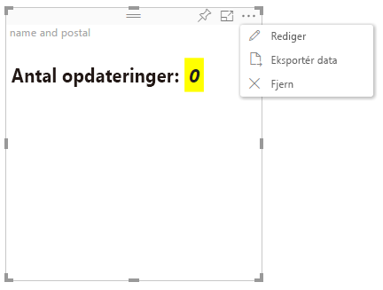

# Avanceret redigeringstilstand

Visualiseringer, der kræver avancerede kontrolelementer i brugergrænsefladen, kan deklarere understøttelse af Avanceret redigeringstilstand.
Hvis den understøttes, vises knappen `Edit` i visualiseringens menu i redigeringstilstand for rapporten.
Når der klikkes på knappen `Edit`, angives EditMode til `Advanced`.
Visualiseringen kan bruge EditMode-flaget til at bestemme, hvilke kontrolelementer i brugergrænsefladen der skal vises.

Som standard understøtter visualiseringen ikke Avanceret redigeringstilstand.
Hvis der kræves en anden funktionsmåde, skal den angives eksplicit i visualiseringens `capabilities.json`-fil ved at angive egenskaben `advancedEditModeSupport`.

De mulige værdier er:

- 0 – NotSupported

- 1 – SupportedNoAction

- 2 – SupportedInFocus

## Åbning af Avanceret redigeringstilstand

Knappen `Edit` er synlig, hvis:

 1 – egenskaben `advancedEditModeSupport` under capabilities.json er angivet til enten `SupportedNoAction` eller `SupportedInFocus`.

 2 – visualiseringen vises i redigeringstilstand for rapporten.

Hvis egenskaben `advancedEditModeSupport` mangler under capabilities.json eller er angivet til `NotSupported`, forsvinder knappen "Rediger".

Når brugeren klikker på `Edit`, modtager visualiseringen kaldet update(), hvor EditMode er angivet til `Advanced`.
I henhold til værdierne, der er angivet under egenskaberne, sker følgende handlinger:

* `SupportedNoAction` – Der kræves ingen yderligere handling af værten.
* `SupportedInFocus` – Værten fremviser visualiseringen i fokustilstand.

## Afslutning af Avanceret redigeringstilstand

Knappen `Back to report` er synlig, hvis:

1 – egenskaben `advancedEditModeSupport` under capabilities.json er angivet til `SupportedInFocus`.
