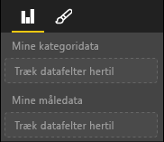

# <a name="capabilities-and-properties-of-power-bi-visuals"></a>Funktioner og egenskaber for visualiseringer i Power BI 

Du bruger egenskaber til at give værten oplysninger om din visualisering. Alle egenskaber i modellen Egenskaber er `optional`.

Rodobjekterne for visualiseringernes egenskaber er `dataRoles`, `dataViewMappings` osv.

```json
{
    "dataRoles": [ ... ],
    "dataViewMappings": [ ... ],
    "objects":  { ... },
    "supportsHighlight": true|false,
    "advancedEditModeSupport": 0|1|2,
    "sorting": { ... }
}

```

## <a name="define-the-data-fields-that-your-visual-expects-dataroles"></a>Definer de datafelter, som din visualisering forventer: dataRoles

Hvis du vil definere felter, der kan bindes til data, skal du bruge `dataRoles`. `dataRoles` tager en matrix af `DataViewRole` objekter, der definerer alle de påkrævede egenskaber.

### <a name="properties"></a>Egenskaber

* **name**: Det interne navn på dette datafelt (skal være entydigt).
* **kind**: Feltets type:
    * `Grouping`: Adskilte værdier, der anvendes til at gruppere målingsfelter.
    * `Measure`: Numeriske dataværdier.
    * `GroupingOrMeasure`: Værdier, der kan bruges som enten en gruppering eller en måling.
* **displayName**: Det navn, der vises for brugeren i ruden **Egenskaber**.
* **description**: En kort beskrivelse af feltet (valgfrit).
* **requiredTypes**: Den påkrævede datatype for denne datarolle. Værdier, der ikke stemmer overens, er angivet som NULL (valgfrit).
* **preferredTypes**: Den foretrukne datatype for denne datarolle (valgfrit).

### <a name="valid-data-types-in-requiredtypes-and-preferredtypes"></a>Gyldige datatyper i requiredTypes og preferredTypes

* **bool**: En boolesk værdi
* **integer**: En heltalsværdi (heltal)
* **numeric**: En numerisk værdi
* **text**: En tekstværdi
* **geography**: Geografiske data

### <a name="example"></a>Eksempel

```json
"dataRoles": [
    {
        "displayName": "My Category Data",
        "name": "myCategory",
        "kind": "Grouping",
        "requiredTypes": [
            {
                "text": true
            },
            {
                "numeric": true
            },
            {
                "integer": true
            }
        ],
        "preferredTypes": [
            {
                "text": true
            }
        ]
    },
    {
        "displayName": "My Measure Data",
        "name": "myMeasure",
        "kind": "Measure",
        "requiredTypes": [
            {
                "integer": true
            },
            {
                "numeric": true
            }
        ],
        "preferredTypes": [
            {
                "integer": true
            }
        ]
    },
    {
        "displayNameKey": "Visual_Location",
        "name": "Locations",
        "kind": "Measure",
        "displayName": "Locations",
        "requiredTypes": [
            {
                "geography": {
                    "address": true
                }
            },
            {
                "geography": {
                    "city": true
                }
            },
            {
                "geography": {
                    "continent": true
                }
            },
            {
                "geography": {
                    "country": true
                }
            },
            {
                "geography": {
                    "county": true
                }
            },
            {
                "geography": {
                    "place": true
                }
            },
            {
                "geography": {
                    "postalCode": true
                }
            },
            {
                "geography": {
                    "region": true
                }
            },
            {
                "geography": {
                    "stateOrProvince": true
                }
            }
        ]
    }
]
```

De foregående dataroller opretter de felter, der vises i følgende billede:



## <a name="define-how-you-want-the-data-mapped-dataviewmappings"></a>Definer, hvordan dataene skal tilknyttes: dataViewMappings

Egenskaben DataViewMapping beskriver, hvordan datarollerne er relateret til hinanden, og giver dig mulighed for at angive betingede krav til dem.

De fleste visualiseringer rummer en enkelt tilknytning, men du kan angive flere dataViewMappings. Hver af de gyldige tilknytninger resulterer i en datavisning. 

```json
"dataViewMappings": [
    {
        "conditions": [ ... ],
        "categorical": { ... },
        "table": { ... },
        "single": { ... },
        "matrix": { ... }
    }
]
```

Du kan finde flere oplysninger under [Forstå tilknytning af datavisning i Power BI-visualiseringer](dataview-mappings.md).

## <a name="define-property-pane-options-objects"></a>Definer indstillinger for egenskabsrude: objekter

Objekter beskriver de egenskaber, der kan tilpasses, og som er knyttet til den pågældende visualisering. Hvert objekt kan have flere egenskaber, og hver egenskab har en type tilknyttet. Typerne refererer til det, som egenskaben vil blive. 

```json
"objects": {
    "myCustomObject": {
        "displayName": "My Object Name",
        "properties": { ... }
    }
}
```

Du kan finde flere oplysninger i [Objekter og egenskaber for Power BI-visualiseringer](objects-properties.md).

## <a name="handle-partial-highlighting-supportshighlight"></a>Håndter delvis fremhævning: supportsHighlight

Som standard er denne værdi angivet til `false`, hvilket betyder, at værdierne automatisk filtreres, når der vælges noget på siden. Denne automatiske filtrering opdaterer din visualisering, så den kun viser den valgte værdi. Hvis du vil have vist alle dataene, men kun fremhæve de valgte elementer, skal du angive `supportsHighlight` til `true` i filen *capabilities.json*.

Du kan finde flere oplysninger under [Fremhæv datapunkter i Power BI-visualiseringer](highlight.md).

## <a name="handle-advanced-edit-mode-advancededitmodesupport"></a>Håndter avanceret redigeringstilstand: advancedEditModeSupport

En visualisering kan erklære sin understøttelse af avanceret redigeringstilstand. En visualisering understøtter ikke som standard avanceret redigeringstilstand, medmindre andet er angivet i filen *capabilities.json*.

Du kan finde flere oplysninger i [Avanceret redigeringstilstand i Power BI-visualiseringer](advanced-edit-mode.md).

## <a name="data-sorting-options-for-visual-sorting"></a>Indstillinger for datasortering for visualisering: sortering

Sorteringsfunktionsmåden for en visualisering kan defineres via visualiseringens egenskaber. En visualisering understøtter ikke som standard ændring af sorteringsrækkefølgen, medmindre andet er angivet i filen *capabilities.json*.

Du kan finde flere oplysninger under [Sorteringsmuligheder til Power BI-visualiseringer](sort-options.md).
