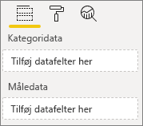
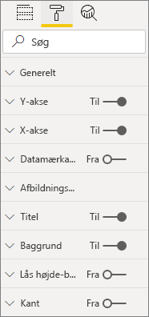
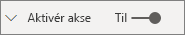
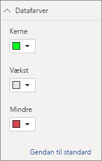

# <a name="build-a-bar-chart"></a>Opret et liggende søjlediagram

Denne artikel er en trinvis vejledning i at opbygge et enkelt liggende søjlediagram i Power BI med kode. Du kan få hele kodeeksemplet på [https://github.com/Microsoft/PowerBI-visuals-sampleBarChart](https://github.com/Microsoft/PowerBI-visuals-sampleBarChart).

## <a name="view-model"></a>Vis model
Det er vigtigt, at du først definerer modellen til visning af det liggende søjlediagram og gentager det, der vises i visualiseringen, når du opretter den.

```typescript
/**
 * Interface for BarCharts viewmodel.
 *
 * @interface
 * @property {BarChartDataPoint[]} dataPoints - Set of data points the visual will render.
 * @property {number} dataMax                 - Maximum data value in the set of data points.
 */
interface BarChartViewModel {
    dataPoints: BarChartDataPoint[];
    dataMax: number;
};

/**
 * Interface for BarChart data points.
 *
 * @interface
 * @property {number} value    - Data value for the point.
 * @property {string} category - Corresponding category of the data value.
 */
interface BarChartDataPoint {
    value: number;
    category: string;
};
```

### <a name="use-static-data"></a>Brug af statiske data

Brug af statiske data er en fantastisk måde at teste visualiseringen på uden databinding. Din visningsmodel ændres ikke, også selvom du tilføjer databinding i et senere trin.

```typescript
let testData: BarChartDataPoint[] = [
    {
        value: 10,
        category: 'a'
    },
    {
        value: 20,
        category: 'b'
    },
    {
        value: 1,
        category: 'c'
    },
    {
        value: 100,
        category: 'd'
    },
    {
        value: 500,
        category: 'e'
    }];

let viewModel: BarChartViewModel = {
    dataPoints: testData,
    dataMax: d3.max(testData.map((dataPoint) => dataPoint.value))
};
```

## <a name="data-binding"></a>Databinding 
Du tilføjer databinding ved at definere de visuelle egenskaber i *capabilities.json*. Kodeeksemplet rummer allerede et skema, som du kan bruge.

Databinding fungerer på en **feltbrønd** i Power BI.



### <a name="add-data-roles"></a>Tilføj dataroller
Kodeeksemplet har allerede dataroller, men du kan tilpasse dem.

- `displayName` er det navn, der vises i **feltbrønden**.
- `name` er det interne navn, der bruges til at referere til datarollen.
- `kind` er felttypen. Felter af typen *Gruppering* (0) har diskrete værdier. Felter af typen *Målepunkt* (1) har numeriske dataværdier.

```json
"dataRoles": [
    {
        "displayName": "Category Data",
        "name": "category",
        "kind": 0
    },
    {
        "displayName": "Measure Data",
        "name": "measure",
        "kind": 1
    }
],
```

Se [Dataroller](./capabilities.md#define-the-data-fields-that-your-visual-expects-dataroles) for at få flere oplysninger.

### <a name="add-conditions-to-dataviewmapping"></a>Føj betingelser til DataViewMapping
Definer betingelser inden for `dataViewMappings` for at angive, hvor mange felter hver feltbrønd kan bindes til. Brug datarollens interne `name` til at referere til hvert felt.

```json
    "dataViewMappings": [
        {
            "conditions": [
                {
                    "category": {
                        "max": 1
                    },
                    "measure": {
                        "max": 1
                    }
                }
            ],
        }
    ]
```

Se [Tilknytning af datavisning](./dataview-mappings.md) for at få flere oplysninger.

### <a name="define-and-use-visualtransform"></a>Definer og brug visualTransform
`DataView` er den struktur, som Power BI giver din visualisering, og som indeholder de data, der forespørges om, og som skal visualiseres. `DataView` kan dog levere data i forskellige formater, f.eks. kategori- og tabelformat. Hvis du vil oprette en kategorivisualisering som f.eks. et liggende søjlediagram, skal du kun bruge kategoriegenskaben på `DataView`. Hvis du definerer `visualTransform`, kan du konvertere `DataView` til en visningsmodel, som visualiseringen bruger.

Hvis du vil tildele farver og vælge dem, når du definerer individuelle datapunkter, skal du bruge `IVisualHost`. 

```typescript
/**
 * Function that converts queried data into a view model that will be used by the visual
 *
 * @function
 * @param {VisualUpdateOptions} options - Contains references to the size of the container
 *                                        and the dataView which contains all the data
 *                                        the visual had queried.
 * @param {IVisualHost} host            - Contains references to the host which contains services
 */
function visualTransform(options: VisualUpdateOptions, host: IVisualHost): BarChartViewModel {
    /*Convert dataView to your viewModel*/
}

```

## <a name="color"></a>Farve 
Farven vises som en af de tjenester, der er tilgængelige for `IVisualHost`.

### <a name="add-color-to-data-points"></a>Føj farve til datapunkter
Hvert datapunkt repræsenteres af en forskellig farve. Du kan føje farve til `BarChartDataPoint`-grænsefladen.

```typescript
/**
 * Interface for BarChart data points.
 *
 * @interface
 * @property {number} value    - Data value for the point.
 * @property {string} category - Corresponding category of the data value.
 * @property {string} color    - Color corresponding to the data point.
 */
interface BarChartDataPoint {
    value: number;
    category: string;
    color: string;
};
```

### <a name="the-colorpalette-service"></a>Tjenesten colorPalette
Tjenesten `colorPalette` administrerer de farver, der bruges i visualiseringen. Dens forekomst er tilgængelig på `IVisualHost`.

### <a name="assign-color-to-data-points"></a>Tildel farve til datapunkter
Du har defineret `visualTransform` som en konstruktion, der skal konvertere `dataView` til en visningsmodel, som et liggende søjlediagram kan bruge. Da du navigerer gennem datapunkterne i `visualTransform`, er det også det ideelle sted at tildele farver.

```typescript
let colorPalette: IColorPalette = host.colorPalette; // host: IVisualHost
for (let i = 0, len = Math.max(category.values.length, dataValue.values.length); i < len; i++) {
    barChartDataPoints.push({
        category: category.values[i],
        value: dataValue.values[i],
        color: colorPalette.getColor(category.values[i]).value,
    });
}
```

## <a name="selection-and-interactions"></a>Markering og interaktioner
Markering gør det muligt for brugeren at interagere både med din visualisering og andre visualiseringer. 

### <a name="add-selection-to-each-data-point"></a>Føj markering til hvert datapunkt
Eftersom hvert datapunkt er entydigt, skal du føje markering til hvert datapunkt. Du tilføjer egenskaben Selection på grænsefladen `BarChartDataPoint`.

```typescript
/**
 * Interface for BarChart data points.
 *
 * @interface
 * @property {number} value             - Data value for the point.
 * @property {string} category          - Corresponding category of data value.
 * @property {string} color             - Color corresponding to data point.
 * @property {ISelectionId} selectionId - Id assigned to data point for cross filtering
 *                                        and visual interaction.
 */
interface BarChartDataPoint {
    value: number;
    category: string;
    color: string;
    selectionId: ISelectionId;
};
```

### <a name="assign-selection-ids-to-each-data-point"></a>Føj markerings-id'er til hvert datapunkt
Eftersom du navigerer gennem datapunkterne i `visualTransform`, er det også det ideelle sted at oprette markerings-id'er. Værtsvariablen er en `IVisualHost`, som indeholder tjenester, som visualiseringen muligvis benytter, f.eks. Color og Selection Builder. 

Brug factory-metoden `createSelectionIdBuilder` på `IVisualHost` til at oprette et nyt markerings-id. Opret en ny selection builder for hvert datapunkt.

Da du kun foretager markeringer baseret på kategorien, behøver du kun at definere markeringerne `withCategory`.

```typescript
for (let i = 0, len = Math.max(category.values.length, dataValue.values.length); i < len; i++) {
    barChartDataPoints.push({
        category: category.values[i],
        value: dataValue.values[i],
        color: colorPalette.getColor(category.values[i]).value,
        selectionId: host.createSelectionIdBuilder()
            .withCategory(category, i)
            .createSelectionId()
    });
}
```

Du kan få flere oplysninger i [Opret en forekomst af Selection Builder](./selection-api.md#create-an-instance-of-the-selection-builder).

### <a name="interact-with-data-points"></a>Interager med datapunkter
Du kan interagere med hver søjle i søjlediagrammet, når der er tildelt et markerings-ID til datapunktet. Søjlediagrammet lytter til `click`-hændelser.

Brug factory-metoden `selectionManager` på `IVisualHost` til at oprette en selection manager til tværgående filtrering og fjernelse af markeringer.

```typescript
let selectionManager = this.selectionManager;

//This must be an anonymous function instead of a lambda because
//d3 uses 'this' as the reference to the element that was clicked.
bars.on('click', function(d) {
    selectionManager.select(d.selectionId).then((ids: ISelectionId[]) => {
        bars.attr({
            'fill-opacity': ids.length > 0 ? BarChart.Config.transparentOpacity : BarChart.Config.solidOpacity
        });

        d3.select(this).attr({
            'fill-opacity': BarChart.Config.solidOpacity
        });
    });

    (<Event>d3.event).stopPropagation();
});
```

Du kan få flere oplysninger i [Sådan bruger du SelectionManager](./selection-api.md#how-to-use-selectionmanager-to-select-data-points).

## <a name="static-objects"></a>Statiske objekter

Du kan føje objekter til ruden **Egenskab** for yderligere at tilpasse visualiseringen. Disse tilpasninger kan være ændringer i brugergrænsefladen eller ændringer, der er relateret til de data, der blev forespurgt efter. I eksemplet bruges statiske objekter til at gengive X-aksen for søjlediagrammet.

Du kan slå objekter til eller fra i ruden **Egenskab**.



### <a name="define-objects-in-capabilities"></a>Definer objekter i egenskaber
Definer en `objects`-egenskab i din *capabilities.json*-fil for de objekter, der skal vises i ruden **Egenskab**.
- `enableAxis` er det interne navn, som `dataView` refererer til. 
- `displayName` er det navn, der vises i ruden **Egenskab**.
- `bool` er en primitiv værdi, der typisk bruges til statiske objekter, f.eks. tekstfelter eller parametre.
- `show` er en særlig egenskab i `properties`, der aktiverer parameteren `show` for objektet. Eftersom `show` er en parameter, skrives den som en `bool`.



```typescript
"objects": {
    "enableAxis": {
        "displayName": "Enable Axis",
        "properties": {
            "show": {
                "displayName": "Enable Axis",
                "type": { "bool": true }
            }
        }
    }
}
```

Se [Objekter](./objects-properties.md) for at få flere oplysninger.

### <a name="define-property-settings"></a>Definer egenskabsindstillinger

I de følgende afsnit beskrives de grundlæggende principper bag definitionen af egenskabsindstillinger. Du kan også bruge de funktionsklasser, der er defineret i `powerbi-visuals-utils-dataviewutils`-pakken, til at definere egenskabsindstillinger. Du kan finde flere oplysninger i dokumentationen og eksempler til [DataViewObjectsParser](https://github.com/Microsoft/powerbi-visuals-utils-dataviewutils/blob/master/docs/api/data-view-objects-parser.md)-klassen.


Selvom det er valgfrit, er det bedst at lokalisere de fleste indstillinger på et enkelt objekt, så du nemt kan referere til dem.

```typescript
/**
 * Interface for BarCharts viewmodel.
 *
 * @interface
 * @property {BarChartDataPoint[]} dataPoints - Set of data points the visual will render.
 * @property {number} dataMax                 - Maximum data value in the set of data points.
 * @property {BarChartSettings} settings      - Object property settings
 */
interface BarChartViewModel {
    dataPoints: BarChartDataPoint[];
    dataMax: number;
    settings: BarChartSettings;
};

/**
 * Interface for BarChart settings.
 *
 * @interface
 * @property "show" enableAxis - Object property that allows axis to be enabled.
 */
interface BarChartSettings {
    enableAxis: {
        show: boolean;
    };
}
```

### <a name="define-and-use-objectenumerationutility"></a>Definer og brug ObjectEnumerationUtility
Objektegenskabsværdier er tilgængelige som metadata på `dataView`, men der er ingen tjeneste, der kan hjælpe med at hente disse egenskaber. `ObjectEnumerationUtility` er et sæt statiske funktioner, du kan bruge til at hente objektværdier fra `dataView` og til andre visuelle projekter. `ObjectEnumerationUtility` er valgfri, men er udmærket til at navigere gennem `dataView` for at hente objektegenskaber.

```typescript
/**
 * Gets property value for a particular object.
 *
 * @function
 * @param {DataViewObjects} objects - Map of defined objects.
 * @param {string} objectName       - Name of desired object.
 * @param {string} propertyName     - Name of desired property.
 * @param {T} defaultValue          - Default value of desired property.
 */
export function getValue<T>(objects: DataViewObjects, objectName: string, propertyName: string, defaultValue: T ): T {
    if(objects) {
        let object = objects[objectName];
        if(object) {
            let property: T = object[propertyName];
            if(property !== undefined) {
                return property;
            }
        }
    }
    return defaultValue;
}
```

Du kan se kildekoden i [objectEnumerationUtility.ts](https://github.com/Microsoft/PowerBI-visuals-sampleBarChart/blob/master/src/objectEnumerationUtility.ts).

### <a name="retrieve-property-values-from-dataview"></a>Hent egenskabsværdier fra dataView
`visualTransform` er det ideelle sted til at redigere visualiseringens visningsmodel. Hvis du vil fortsætte dette mønster, skal du hente objektegenskaberne fra `dataView`.

Definer standardtilstanden for egenskaben, og brug `getValue` til at hente egenskaben fra `dataView`.

```typescript
let defaultSettings: BarChartSettings = {
    enableAxis: {
        show: false,
    }
};

let barChartSettings: BarChartSettings = {
    enableAxis: {
        show: getValue<boolean>(objects, 'enableAxis', 'show', defaultSettings.enableAxis.show),
    }
}
```

### <a name="populate-property-pane-with-enumerateobjectinstances"></a>Udfyld ruden Egenskab med enumerateObjectInstances
Den valgfri metode `enumerateObjectInstances` til `IVisual` tæller alle objekter og placerer dem i ruden **Egenskab**. Hvert objekt kaldes med `enumerateObjectInstances`. Objektets navn er tilgængeligt på `EnumerateVisualObjectInstancesOptions`.

For hvert objekt skal du definere egenskaben med dens aktuelle tilstand.

```typescript
/**
 * Enumerates through the objects defined in the capabilities and adds the properties to the format pane
 *
 * @function
 * @param {EnumerateVisualObjectInstancesOptions} options - Map of defined objects
 */
public enumerateObjectInstances(options: EnumerateVisualObjectInstancesOptions): VisualObjectInstanceEnumeration {
    let objectName = options.objectName;
    let objectEnumeration: VisualObjectInstance[] = [];

    switch(objectName) {
        case 'enableAxis':
            objectEnumeration.push({
                objectName: objectName,
                properties: {
                    show: this.barChartSettings.enableAxis.show,
                },
                selector: null
            });
    };

    return objectEnumeration;
}
```

### <a name="control-property-update-logic"></a>Kontrollér opdateringslogik for egenskab
Når et objekt føjes til ruden **Egenskab**, udløser hver til/fra-handling en opdatering. Tilføj specifik objektlogik i `if`-blokke:

```typescript
if(settings.enableAxis.show) {
    let margins = BarChart.Config.margins;
    height -= margins.bottom;
}
```

## <a name="databound-objects"></a>Databundne objekter
Databundne objekter svarer til statiske objekter, men omhandler typisk datamarkeringer. Du kan f.eks. ændre den farve, der er knyttet til datapunktet.



### <a name="define-object-in-capabilities"></a>Definer objekt i egenskaber
På samme måde som med statiske objekter skal du definere et andet objekt i *capabilities.json*. 
- `colorSelector` er det interne navn, som `dataView` refererer til.
- `displayName` er det navn, der vises i ruden **Egenskab**.
- `fill` er en strukturel objektværdi, der ikke er knyttet til en primitiv type.

```typescript
"colorSelector": {
    "displayName": "Data Colors",
    "properties": {
        "fill": {
            "displayName": "Color",
            "type": {
                "fill": {
                    "solid": {
                        "color": true
                    }
                }
            }
        }
    }
}
```

Se [Objekter](./objects-properties.md) for at få flere oplysninger.

### <a name="use-objectenumerationutility"></a>Brug ObjectEnumerationUtility
På samme måde som med statiske objekter skal du hente objektoplysninger fra `dataView`. Men i stedet for at objektværdierne er indeholdt i metadata, er objektværdierne knyttet til hver kategori.

```typescript
/**
 * Gets property value for a particular object in a category.
 *
 * @function
 * @param {DataViewCategoryColumn} category - List of category objects.
 * @param {number} index                    - Index of category object.
 * @param {string} objectName               - Name of desired object.
 * @param {string} propertyName             - Name of desired property.
 * @param {T} defaultValue                  - Default value of desired property.
 */
export function getCategoricalObjectValue<T>(category: DataViewCategoryColumn, index: number, objectName: string, propertyName: string, defaultValue: T): T {
    let categoryObjects = category.objects;

    if(categoryObjects) {
        let categoryObject: DataViewObject = categoryObjects[index];
        if(categoryObject) {
            let object = categoryObject[objectName];
            if(object) {
                let property: T = object[propertyName];
                if(property !== undefined) {
                    return property;
                }
            }
        }
    }
    return defaultValue;
}
```

Du kan se kildekoden i [objectEnumerationUtility.ts](https://github.com/Microsoft/PowerBI-visuals-sampleBarChart/blob/master/src/objectEnumerationUtility.ts).

### <a name="define-default-color-and-retrieve-categorical-object-from-dataview"></a>Definer standardfarve, og hent kategoriobjekt fra dataView
Hver farve er nu knyttet til hver kategori i `dataView`. Du kan angive hvert datapunkt til den tilsvarende farve.

```typescript
for (let i = 0, len = Math.max(category.values.length, dataValue.values.length); i < len; i++) {
    let defaultColor: Fill = {
        solid: {
            color: colorPalette.getColor(category.values[i]).value
        }
    }

    barChartDataPoints.push({
        category: category.values[i],
        value: dataValue.values[i],
        color: getCategoricalObjectValue<Fill>(category, i, 'colorSelector', 'fill', defaultColor).solid.color,
        selectionId: host.createSelectionIdBuilder()
            .withCategory(category, i)
            .createSelectionId()
    });
}
```

### <a name="populate-property-pane-with-enumerateobjectinstances"></a>Udfyld ruden Egenskab med enumerateObjectInstances
Brug `enumerateObjectInstances` til at udfylde ruden **Egenskab** med objekter. 

I forbindelse med denne forekomst skal du tilføje en farvevælger for at gengive hver kategori i ruden **Egenskab**. Det kan du gøre ved at føje endnu en sag til `switch`-sætningen for `colorSelector` og gentage den tilknyttede farve for hvert datapunkt. 

Et valg er påkrævet for at knytte farven til datapunktet.

```typescript
/**
 * Enumerates through the objects defined in the capabilities and adds the properties to the format pane
 *
 * @function
 * @param {EnumerateVisualObjectInstancesOptions} options - Map of defined objects
 */
public enumerateObjectInstances(options: EnumerateVisualObjectInstancesOptions): VisualObjectInstanceEnumeration {
    let objectName = options.objectName;
    let objectEnumeration: VisualObjectInstance[] = [];

    switch(objectName) {
        case 'enableAxis':
            objectEnumeration.push({
                objectName: objectName,
                properties: {
                    show: this.barChartSettings.enableAxis.show,
                },
                selector: null
            });
            break;
        case 'colorSelector':
            for(let barDataPoint of this.barDataPoints) {
                objectEnumeration.push({
                    objectName: objectName,
                    displayName: barDataPoint.category,
                    properties: {
                        fill: {
                            solid: {
                                color: barDataPoint.color
                            }
                        }
                    },
                    selector: barDataPoint.selectionId.getSelector()
                });
            }
            break;
    };

    return objectEnumeration;
}
```

Når du har angivet en vælger til hver enkelt egenskab, får du følgende `dataView`-objektmatrix:


Hvert element i matrixen `dataViews[0].categorical.categories[0].objects` svarer til datasættets konkrete kategori.

Funktionen `getCategoricalObjectValue` gør det nemt at få adgang til egenskaber ved hjælp af deres kategoriindeks. Du skal angive et `objectName` og `propertyName`, der stemmer overens med objektet og egenskaben i *capabilities.json*.

## <a name="other-features"></a>Andre funktioner 
Du kan føje et skyderkontrolelement eller værktøjstip til søjlediagrammet. Hvis du vil tilføje en kode, skal du gå til bekræftelserne i [Tilføj en skyder i egenskabsruden til at styre uigennemsigtighed](https://github.com/Microsoft/PowerBI-visuals-sampleBarChart/commit/e2e0bc5888d9a3ca305a7a7af5046068645c8b30) og [Tilføj understøttelse af værktøjstip](https://github.com/Microsoft/PowerBI-visuals-sampleBarChart/commit/981b021612d7b333adffe9f723ab27783c76fb14). Du kan finde flere oplysninger om værktøjstip i [Værktøjstip til visualiseringer i Power BI](./add-tooltips.md).

## <a name="packaging"></a>Emballage

Før du kan indlæse din visualisering i [Power BI Desktop](https://powerbi.microsoft.com/desktop/) eller dele den med community'et i [Power BI-galleriet med visualiseringer](https://visuals.powerbi.com/), skal du komprimere den. Gå til rodmappen for dit visualiseringsprojekt, der indeholder filen *pbiviz.json*, og brug følgende kommando til at generere en *PBIVIZ-fil*:

```bash
pbiviz package
```
Denne kommando opretter en *PBIVIZ*-fil i mappen *dist/* for dit visualiseringsprojekt og overskriver *PBIVIZ*-filen fra tidligere komprimeringshandlinger.

## <a name="next-steps"></a>Næste trin
Du kan føje følgende muligheder til din visualisering:
* [Føj en genvejsmenu til en visualisering](./context-menu.md)
* [Landingside](./landing-page.md)
* [Start-URL-adresse](./launch-url.md)
* [Understøttelse af landestandard](./localization.md)