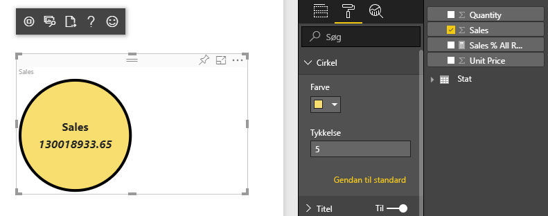
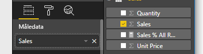

# <a name="tutorial-create-a-react-based-visual"></a>Selvstudium: Opret en React-baseret visualisering

I dette selvstudium kan du se, hvordan du opretter en visualisering i Power BI ved hjælp af [React](https://reactjs.org/). Visualiseringen viser en værdi i en cirkel. Det er muligt at tilpasse størrelsen og indstillingerne for visualiseringen. Du kan oprette dine egne Power BI-visualiseringer med React ved hjælp af oplysningerne i denne artikel.



I dette selvstudium lærer du, hvordan du kan:

> [!div class="checklist"]
>
> * Konfigurer dit udviklingsmiljø
> * Opret en React-visualisering
> * Konfigurer egenskaber for visualiseringen
> * Gengiv data fra Power BI
> * Tilpas størrelsen på visualiseringen
> * Sørg for, at visualiseringen kan tilpasses

## <a name="prerequisites"></a>Forudsætninger

* En **Power BI Pro-konto**. [Tilmeld dig en gratis prøveversion](https://powerbi.microsoft.com/pricing/), før du går i gang.
* [Visual Studio Code](https://www.visualstudio.com/).
* Windows-brugere skal have [Windows PowerShell](https://docs.microsoft.com/powershell/scripting/install/installing-windows-powershell?view=powershell-6) version 4 eller nyere, og OSX-brugere skal have [Terminal](https://macpaw.com/how-to/use-terminal-on-mac).
* Et miljø som beskrevet i [Konfiguration af udviklingsmiljøet](custom-visual-develop-tutorial.md#setting-up-the-developer-environment).

## <a name="getting-started"></a>Introduktion

Start med at oprette en lille Power BI-visualisering ved hjælp af `pbiviz`. Du kan finde flere oplysninger om projekter og projektstruktur under [Struktur af visuelle projekter i Power BI](visual-project-structure.md). Hvis du vil have den fulde kildekode til denne visualisering, skal du se [React-visualiseringen Circle Card](https://github.com/Microsoft/powerbi-visuals-circlecard-react).

Du kan klone eller downloade hele kildekoden til visualiseringen fra [GitHub](https://github.com/Microsoft/powerbi-visuals-circlecard-react).

1. Åbn PowerShell, og kør følgende kommando:

   ```powershell
   pbiviz new ReactCircleCard
   ```

   Kommandoen opretter en mappe med navnet *ReactCircleCard*.

1. Skift mappe til denne mappe, og åbn Visual Studio Code.

   ```powershell
   cd ./ReactCircleCard
   code .
   ```

1. Start udviklingsserveren for visualiseringen.

   ```powershell
   pbiviz start
   ```

   

Denne grundlæggende visualisering repræsenterer antallet af opdateringer. Lad os omdanne den til et cirkelkort i det næste trin.

## <a name="change-the-visual-to-a-circle-card"></a>Rediger visualiseringen til et cirkelkort

Denne grundlæggende visualisering repræsenterer antallet af opdateringer. Nu skal du omdanne den til et cirkelkort, som repræsenterer en måling og den tilhørende titel.

1. Kør følgende kommando for at installere de påkrævede afhængigheder:

   ```powershell
   npm i react react-dom
   ```

1. Kør følgende kommando for at installere React 16 og tilsvarende versioner af `react-dom` og indtastninger:

   ```powershell
   npm i @types/react @types/react-dom
   ```

1. Opret en React-komponentklasse. I Visual Studio Code skal du vælge **Fil** > **Ny fil**. Kopiér følgende kode til filen.

    ```typescript
    import * as React from "react";

    export class ReactCircleCard extends React.Component<{}>{
        render(){
            return (
                <div className="circleCard">
                    Hello, React!
                </div>
            )
        }
    }

    export default ReactCircleCard;
    ```

1. Vælg **Gem som**. Gå til mappen *src*. Indtast navnet *component*. Vælg **TypeScriptSave React** for **Gem som type**.

1. Åbn *src/visual.ts*. Erstat den nuværende kode med følgende kode:

    ```typescript
    "use strict";
    import powerbi from "powerbi-visuals-api";

    import DataView = powerbi.DataView;
    import VisualConstructorOptions = powerbi.extensibility.visual.VisualConstructorOptions;
    import VisualUpdateOptions = powerbi.extensibility.visual.VisualUpdateOptions;
    import IVisual = powerbi.extensibility.visual.IVisual;

    import "./../style/visual.less";

    export class Visual implements IVisual {

        constructor(options: VisualConstructorOptions) {

        }

        public update(options: VisualUpdateOptions) {

        }
    }
    ```

1. Importér React-afhængigheder og den komponent, du lige har tilføjet.

    ```typescript
    import * as React from "react";
    import * as ReactDOM from "react-dom";
    ...
    import ReactCircleCard from "./component";
    ```

   React *TSX*-filer accepteres ikke i standardindstillingerne for Power BI TypeScript. Visual Studio Code markerer `component` som en fejl.

1. Åbn filen *tsconfig.json*, og føj to linjer til starten af elementet `compilerOptions`.

    ```json
    {
      "compilerOptions": {
        "jsx": "react",
        "types": ["react", "react-dom"],
        //...
      }
    }
    ```

   Fejlen på `component` bør være forsvundet.

   Tilføj destinations-HTML-elementet for at gengive komponenten. Dette element er `HTMLElement` i `VisualConstructorOptions`, som overføres til konstruktøren.

1. Rediger klassen `Visual` som i følgende kode:

    ```typescript
      private target: HTMLElement;
      private reactRoot: React.ComponentElement<any, any>;

      constructor(options: VisualConstructorOptions) {
          this.reactRoot = React.createElement(ReactCircleCard, {});
          this.target = options.element;

          ReactDOM.render(this.reactRoot, this.target);
      }
    ```

1. Gem ændringerne, og kør den eksisterende kode ved hjælp af denne kommando:

    ```bash
    pbiviz start
    ```

   > [!NOTE]
   > Hvis du tidligere har kørt `pbiviz`, skal du genstarte den for at anvende ændringerne i *tsconfig.json*.

  

## <a name="configure-capabilities"></a>Konfigurer egenskaber

Du kan konfigurere egenskaberne for visualiseringen.

1. Åbn `capabilities.json`. Fjern objektet `Category Data` fra `dataRoles`. `ReactCircleCard` viser en enkelt værdi, så vi har kun brug for `Measure Data`. Nøglen `dataRoles` ser nu sådan ud:

    ```json
    "dataRoles": [
        {
            "displayName": "Measure Data",
            "name": "measure",
            "kind": "Measure"
        }
    ],
    ```

1. Fjern alt indholdet af nøglen `objects`. Du udfylder den senere.

    ```json
        "objects": {},
    ```

1. Kopiér følgende kode til egenskaben `dataViewMappings`. Værdien på `max: 1` betyder, at kun én målingskolonne kan sendes.

    ```json
        "dataViewMappings": [
            {
                "conditions": [
                    {
                        "measure": {
                            "max": 1
                        }
                    }
                ],
                "single": {
                    "role": "measure"
                }
            }
        ]
    ```

Nu kan du hente data fra ruden `Fields` til indstillingerne for visualiseringen.



## <a name="receive-properties-from-power-bi"></a>Modtag egenskaber fra Power BI

Du kan gengive data ved hjælp af React. Komponenten kan vise data fra sin egen fase.

1. Rediger *src/component.tsx*.

    ```javascript
    export interface State {
        textLabel: string,
        textValue: string
    }

    export const initialState: State = {
        textLabel: "",
        textValue: ""
    }

    export class ReactCircleCard extends React.Component<{}, State>{
        constructor(props: any){
            super(props);
            this.state = initialState;
        }

        render(){
            const { textLabel, textValue } = this.state;

            return (
                <div className="circleCard">
                    <p>
                        {textLabel}
                        <br/>
                        <em>{textValue}</em>
                    </p>
                </div>
            )
        }
    }
    ```

1. Tilføj typografier til nye markeringer ved at redigere *styles/visual.less*.

    ```css
    .circleCard {
        position: relative;
        box-sizing: border-box;
        border: 1px solid #000;
        border-radius: 50%;
        width: 200px;
        height: 200px;
    }

    p {
        text-align: center;
        line-height: 30px;
        font-size: 20px;
        font-weight: bold;

        position: relative;
        top: -30px;
        margin: 50% 0 0 0;
    }
    ```

1. Visualiseringer modtager aktuelle data som et argument i metoden `update`. Åbn *src/visual.ts*, og føj kode til `ReactCircleCard.update`.

    ```typescript
    //...
    import { ReactCircleCard, initialState } from "./component";
    //...

    export class Visual implements IVisual {
        //...
        public update(options: VisualUpdateOptions) {

            if(options.dataViews && options.dataViews[0]){
                const dataView: DataView = options.dataViews[0];

                ReactCircleCard.update({
                    textLabel: dataView.metadata.columns[0].displayName,
                    textValue: dataView.single.value.toString()
                });
            }
            } else {
                this.clear();
            }
        }

        private clear() {
            ReactCircleCard.update(initialState);
        }
    }
    ```

    Koden vælger `textLabel` og `textValue` fra `DataView` og, hvis dataene findes, opdaterer komponentens fase.

1. Hvis du vil sende opdateringer til komponentforekomsten, skal du indsætte følgende kode i klassen `ReactCircleCard`:

    ```typescript
        private static updateCallback: (data: object) => void = null;

        public static update(newState: State) {
            if(typeof ReactCircleCard.updateCallback === 'function'){
                ReactCircleCard.updateCallback(newState);
            }
        }

        public state: State = initialState;

        public componentWillMount() {
            ReactCircleCard.updateCallback = (newState: State): void => { this.setState(newState); };
        }

        public componentWillUnmount() {
            ReactCircleCard.updateCallback = null;
        }
    ```

1. Test visualiseringen. Sørg for, at `pbiviz start` er blevet kørt, og gem alle filer. Opdater visualiseringen.

   

## <a name="make-component-resizable"></a>Gør det muligt at tilpasse størrelsen på komponenten

I dette afsnit gør du det muligt at tilpasse størrelsen på komponenten. Komponenten har i øjeblikket fast bredde og højde.

Hent den aktuelle størrelse for visualiseringen fra objektet `options`.

1. Åbn *src/visual.ts*. Importér grænsefladen `IViewport`, og føj egenskaben `viewport` til klassen `visual`.

    ```typescript
    import IViewport = powerbi.IViewport;

    //...

    export class Visual implements IVisual {
        private viewport: IViewport;
        //...
    }
    ```

1. Føj følgende kode til `update`-metoden for `visual`.

    ```typescript
      if (options.dataViews && options.dataViews[0]) {
          const dataView: DataView = options.dataViews[0];

          this.viewport = options.viewport;
          const { width, height } = this.viewport;
          const size = Math.min(width, height);

          ReactCircleCard.update({
              size,
              //...
          });
      }
    ```

1. Føj egenskaber til grænsefladen `State` i *src/component.tsx*.

    ```typescript
    export interface State {
        //...
        size: number
    }

    const initialState: State = {
        //...
        size: 200
    }
    ```

1. Foretag følgende ændringer i metoden `render` i *src/component.tsx*:

    ```typescript
        render() {
            const { textLabel, textValue, size } = this.state;

            const style: React.CSSProperties = { width: size, height: size };

            return (
                <div className="circleCard" style={style}>
                    {/* ... */}
                </div>
            )
        }
    ```

1. Erstat reglerne `width` og `height` i *style/visual.less* med `min-width` og `min-height`.

    ```css
        min-width: 200px;
        min-height: 200px;
    ```

Du kan nu tilpasse størrelsen på billedet. Cirkelens diameter svarer til den mindste størrelse for bredde eller højde.

## <a name="make-your-power-bi-visual-customizable"></a>Gør det muligt at tilpasse Power BI-visualiseringen

I dette afsnit gør du det muligt at tilpasse størrelsen på visualiseringen.

1. Åbn *capabilities.json*. Føj følgende indstillinger til egenskaben `objects`.

    ```json
    //...
        "objects": {
            "circle": {
                "displayName": "Circle",
                "properties": {
                    "circleColor": {
                        "displayName": "Color",
                        "description": "The fill color of the circle.",
                        "type": {
                            "fill": {
                                "solid": {
                                    "color": true
                                }
                            }
                        }
                    },
                    "circleThickness": {
                        "displayName": "Thickness",
                        "description": "The circle thickness.",
                        "type": {
                            "numeric": true
                        }
                    }
                }
            }
        },
    //...
    ```

1. Erstat eksisterende kode i *src/settings.ts* med denne kode:

    ```typescript
    "use strict";

    import { dataViewObjectsParser } from "powerbi-visuals-utils-dataviewutils";
    import DataViewObjectsParser = dataViewObjectsParser.DataViewObjectsParser;

    export class CircleSettings {
        public circleColor: string = "white";
        public circleThickness: number = 2;
    }

    export class VisualSettings extends DataViewObjectsParser {
        public circle: CircleSettings = new CircleSettings();
    }
    ```

1. Tilføj disse `import`-sætninger øverst i *src/visualisering.ts*:

    ```typescript
    import VisualObjectInstance = powerbi.VisualObjectInstance;
    import EnumerateVisualObjectInstancesOptions = powerbi.EnumerateVisualObjectInstancesOptions;
    import VisualObjectInstanceEnumerationObject = powerbi.VisualObjectInstanceEnumerationObject;

    import { VisualSettings } from "./settings";

    ```

1. Føj metoden `enumerateObjectInstances` til *src/visual.ts*. Denne metode bruges til at anvende indstillinger for visualiseringer.

    ```typescript
    export class Visual implements IVisual {
        private settings: VisualSettings;

        //...

        public enumerateObjectInstances(
            options: EnumerateVisualObjectInstancesOptions
        ): VisualObjectInstance[] | VisualObjectInstanceEnumerationObject {

            return VisualSettings.enumerateObjectInstances(this.settings || VisualSettings.getDefault(), options);
        }
    }
    ```

1. Tilføj kode, så objektet `dataView` nu kan modtage indstillinger.

    ```typescript
        public update(options: VisualUpdateOptions) {

            if(options.dataViews && options.dataViews[0]){
                //...
                this.settings = VisualSettings.parse(dataView) as VisualSettings;
                const object = this.settings.circle;

                ReactCircleCard.update({
                    borderWidth: object && object.circleThickness ? object.circleThickness : undefined,
                    background: object && object.circleColor ? object.circleColor : undefined,
                    //...
                });
            }
        }
    }
    ```

1. Anvend de tilsvarende ændringer for *src/komponent.tsx* ved først at føje disse værdier til `State`:

    ```typescript
    export interface State {
        //...
        background?: string,
        borderWidth?: number
    }
    ```

1. Føj derefter følgende kode til metoden `render`:

    ```typescript
        const { /*...*/ background, borderWidth } = this.state;

        const style: React.CSSProperties = { /*...*/ background, borderWidth };
    ```

    

## <a name="next-steps"></a>Næste trin

Hvis du vil have mere at vide om Power BI-udvikling, kan du se [Retningslinjer for visualiseringer i Power BI](guidelines-powerbi-visuals.md) og [Visualiseringer i Power BI](power-bi-visuals-concept.md).