# <a name="tutorial-developing-a-power-bi-visual"></a>Selvstudium: Udvikling af en Power BI-visualisering

Vi gør det nemt for udviklere at tilføje Power BI-visualiseringer i Power BI, som kan bruges i dashboards og rapporter. For at hjælpe dig med at komme i gang har vi publiceret koden til alle vores visualiseringer i GitHub.

Ud over visualiseringssystemet stiller vi vores testpakke og -værktøjer til rådighed, så vores community kan udarbejde Power BI-visualiseringer i høj kvalitet til Power BI.

I dette selvstudium vises, hvordan du udvikler en brugerdefineret Power BI-visual, der kaldes Circle Card, for at få vist en formateret målingsværdi i en cirkel. Visualen Circle Card understøtter tilpasning af fyldfarve og konturens tykkelse.

I Power BI Desktop-rapporten er kortene ændret for at blive til visuals af typen Circle Card.

  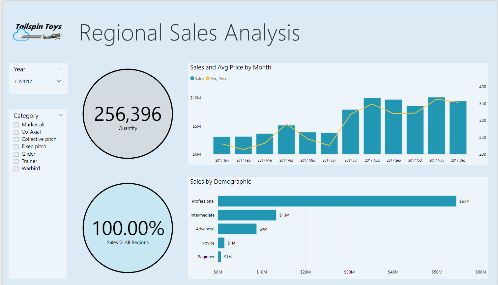

I dette selvstudium lærer du, hvordan du kan:
> [!div class="checklist"]
> * Opret en brugerdefineret visual i Power BI.
> * Udvikl den brugerdefinerede visual med visuelle D3-elementer.
> * Konfigurer databinding med visuelle elementer.
> * Formatér dataværdier.

## <a name="prerequisites"></a>Forudsætninger

* Hvis du ikke er tilmeldt **Power BI Pro**, kan du [tilmelde dig en gratis prøveversion](https://powerbi.microsoft.com/pricing/), før du begynder.
* Du skal have [Visual Studio Code](https://www.visualstudio.com/) installeret.
* Windows-brugere skal have [Windows PowerShell](https://docs.microsoft.com/powershell/scripting/install/installing-windows-powershell?view=powershell-6) version 4 eller nyere, og OSX-brugere skal have [Terminal](https://macpaw.com/how-to/use-terminal-on-mac).

## <a name="setting-up-the-developer-environment"></a>Konfiguration af udviklermiljø

Ud over forudsætningerne er der nogle flere værktøjer, du har brug for at installere.

### <a name="installing-nodejs"></a>Installation af node.js

1. Hvis du vil installere Node.js, skal du gå til [Node.js](https://nodejs.org) i en webbrowser.

2. Download MSI-installationsprogrammet med de nyeste funktioner.

3. Kør installationsprogrammet, og udfør derefter installationstrinnene. Acceptér vilkårene i licensaftalen og alle standarder.

   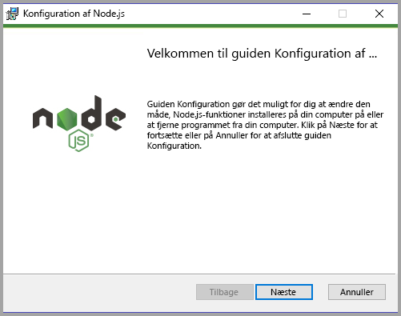

4. Genstart computeren.

### <a name="installing-packages"></a>Installation af pakker

Nu skal du installere pakken **pbiviz**.

1. Åbn Windows PowerShell, når computeren er genstartet.

2. Angiv følgende kommando for at installere pbiviz.

    ```powershell
    npm i -g powerbi-visuals-tools
    ```

### <a name="creating-and-installing-a-certificate"></a>Oprettelse og installation af et certifikat

#### <a name="windows"></a>Windows

1. Du skal køre følgende kommando for at oprette og installere et certifikat.

    ```powershell
    pbiviz --install-cert
    ```

    Den returnerer et resultat, der opretter et *adgangsudtryk*. I dette tilfælde er *adgangsudtrykket* **_15105661266553327_** . Guiden til import af certifikatet startes også.

    

2. I guiden til import af certifikatet skal du bekræfte, at lagerplaceringen er angivet til den aktuelle bruger. Vælg derefter *Næste*.

      

3. I trinnet **Fil, der skal importeres** skal du vælge *Næste*.

4. I trinnet **Beskyttelse af privat nøgle** skal du indsætte det adgangsudtryk, du modtog, da du oprettede certifikatet, i feltet Adgangskode.  Igen i dette tilfælde er det **_15105661266553327_** .

      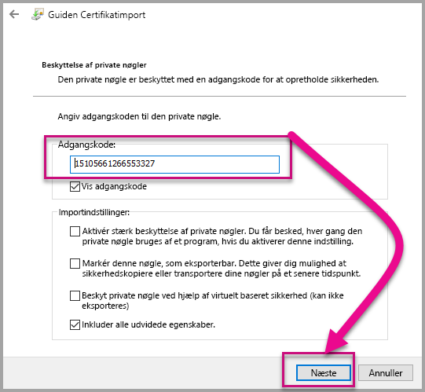

5. I trinnet **Certifikatlager** skal du vælge indstillingen **Placer alle certifikater i følgende lager**. Vælg derefter *Gennemse*.

      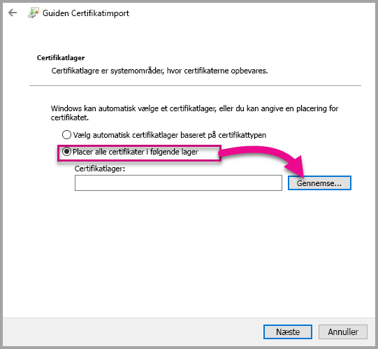

6. Vælg **Nøglecentre, der er tillid til** i vinduet **Vælg certifikatlager**, og vælg derefter *OK*. Vælg derefter *Næste* på skærmen **Certifikatlager**.

      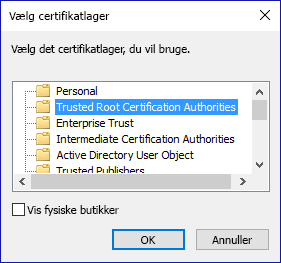

7. Fuldfør importen ved at vælge **Udfør**.

8. Hvis du modtager en sikkerhedsadvarsel, skal du vælge **Ja**.

    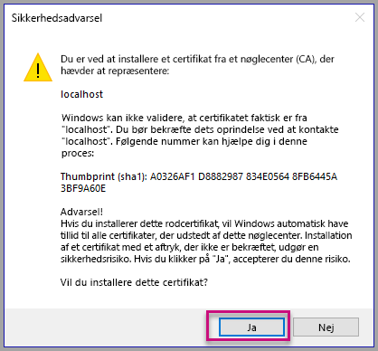

9. Når du får besked om, at importen er fuldført, skal du vælge **OK**.

    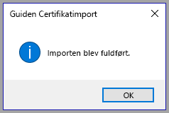

> [!Important]
> Luk ikke Windows PowerShell-sessionen.

#### <a name="osx"></a>OSX

1. Hvis låsen øverst til venstre er låst, så skal du vælge den for at låse den op. Find *localhost*, og dobbeltklik på certifikatet.

    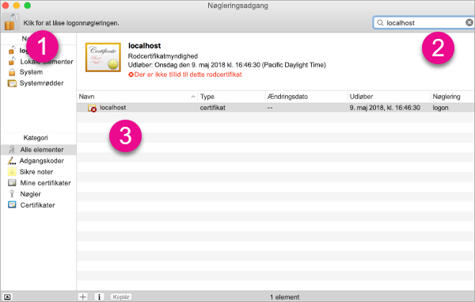

2. Vælg **Hav altid tillid til**, og luk vinduet.

    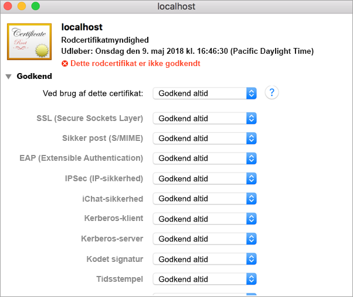

3. Indtast dit brugernavn og din adgangskode. Vælg **Opdater indstillinger**.

    

4. Luk alle åbne browsere.

> [!NOTE]
> Hvis certifikatet ikke genkendes, skal du muligvis genstarte computeren. Nogle browsere, f.eks. Firefox, kræver, at du har tillid til det selvsignerede certifikat. Det kan du gøre ved at gå til webpakkens serverside (https://localhost:8080/webpack-dev-server) ) og acceptere risikoen.

## <a name="creating-a-custom-visual"></a>Opret en brugerdefineret visual

Nu, hvor du har konfigureret miljøet, er tiden inde til at oprette din brugerdefinerede visual.

Du kan [downloade](https://github.com/Microsoft/PowerBI-visuals-circlecard) hele kildekoden til dette selvstudium.

1. Kontroller, at pakken Power BI Visual Tools er installeret.

    ```powershell
    pbiviz
    ```
    Du bør se hjælp-outputtet.

    <pre><code>
        +syyso+/
    oms/+osyhdhyso/
    ym/       /+oshddhys+/
    ym/              /+oyhddhyo+/
    ym/                     /osyhdho
    ym/                           sm+
    ym/               yddy        om+
    ym/         shho /mmmm/       om+
        /    oys/ +mmmm /mmmm/       om+
    oso  ommmh +mmmm /mmmm/       om+
    ymmmy smmmh +mmmm /mmmm/       om+
    ymmmy smmmh +mmmm /mmmm/       om+
    ymmmy smmmh +mmmm /mmmm/       om+
    +dmd+ smmmh +mmmm /mmmm/       om+
            /hmdo +mmmm /mmmm/ /so+//ym/
                /dmmh /mmmm/ /osyhhy/
                    //   dmmd
                        ++

        PowerBI Custom Visual Tool

    Usage: pbiviz [options] [command]

    Commands:

    new [name]        Create a new visual
    info              Display info about the current visual
    start             Start the current visual
    package           Package the current visual into a pbiviz file
    update [version]  Updates the api definitions and schemas in the current visual. Changes the version if specified
    help [cmd]        display help for [cmd]

    Options:

    -h, --help      output usage information
    -V, --version   output the version number
    --install-cert  Install localhost certificate
    </code></pre>

    <a name="ssl-setup"></a>

2. Gennemse outputtet, herunder listen over understøttede kommandoer.

    

3. Du kan oprette et projekt med brugerdefinerede visuals ved at indtaste følgende kommando. **CircleCard** er navnet på projektet.

    ```PowerShell
    pbiviz new CircleCard
    ```
    

    > [!Note]
    > Du kan oprette det nye projekt på den aktuelle placering i prompten.

4. Gå til projektmappen.

    ```powershell
    cd CircleCard
    ```
5. Slet brugerdefineret visual. Din CircleCard-visual kører nu, mens den hostes på din computer.

    ```powershell
    pbiviz start
    ```

    

> [!Important]
> Luk ikke Windows PowerShell-sessionen.

### <a name="testing-the-custom-visual"></a>Test den brugerdefinerede visual

I dette afsnit tester vi den brugerdefinerede visual CircleCard ved at overføre en Power BI Desktop-rapport og derefter redigere rapporten, så den viser den brugerdefinerede visual.

1. Log på [PowerBI.com](https://powerbi.microsoft.com/) > gå til **tandhjulsikonet** > vælg derefter **Indstillinger**.

      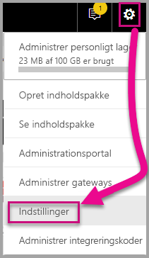

2. Vælg **Udvikler**, og markér derefter afkrydsningsfeltet **Aktivér udviklervisualisering til test**.

    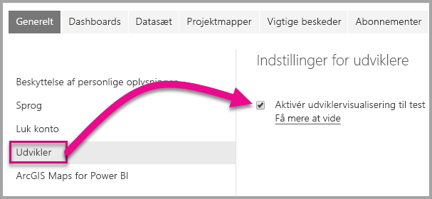

3. Overfør en Power BI Desktop-rapport.  

    Hent data > Filer > Lokal fil.

    Du kan [downloade](https://microsoft.github.io/PowerBI-visuals/docs/step-by-step-lab/images/US_Sales_Analysis.pbix) et eksempel på en Power BI Desktop-rapport, hvis du ikke har oprettet én allerede.

    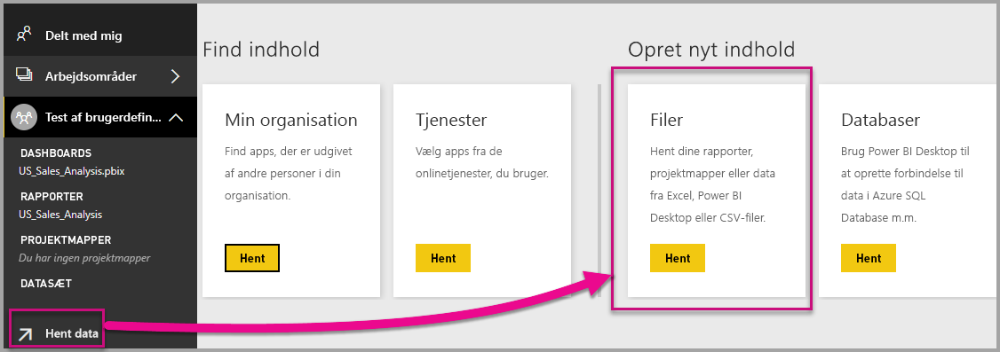 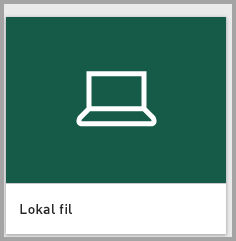

    Hvis du vil have vist rapporten, skal du nu vælge **US_Sales_Analysis** i sektionen **Rapport** i navigationsruden til venstre.

    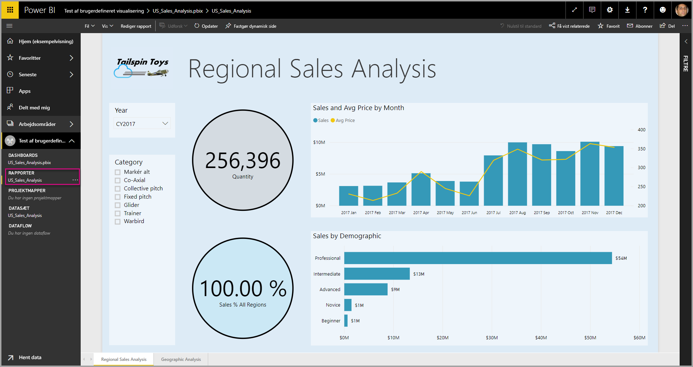

4. Nu skal du redigere rapporten i Power BI-tjenesten.

    Gå til **Rediger rapport**.

    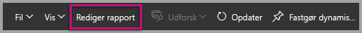

5. Vælg **Udviklervisual** i ruden **Visualisering**.

    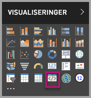

    > [!Note]
    > Denne visualisering repræsenterer den brugerdefinerede visual, som du har startet på din computer. Den er kun tilgængelig, når udviklerindstillingerne er blevet aktiveret.

6. Bemærk, at en visualisering er føjet til rapportcanvasset.

    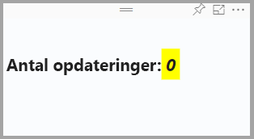

    > [!Note]
    > Dette er en meget simpel visual, der viser det antal gange, opdateringsmetoden er blevet kaldt. I denne fase henter visualen ingen data.

7. Når du vælger den nye visual i rapporten, skal du gå til ruden Felter > udvide Salg > vælge Antal.

    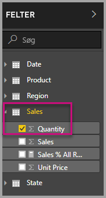

8. Derefter kan du teste den nye visual ved at tilpasse størrelsen på visualen, og læg mærke til intervallerne for opdateringsværdierne.

    

Hvis den brugerdefinerede visual ikke længere skal køre i PowerShell, skal du trykke på Ctrl + C. Når du bliver bedt om at afslutte batchjobbet, skal du trykke på Y og derefter trykke på Enter.

## <a name="adding-visual-elements"></a>Tilføj visuelle elementer

Nu skal du installere **JavaScript-biblioteket D3**. D3 er et JavaScript-bibliotek til oprettelse af dynamiske, interaktive datavisualiseringer i webbrowsere. Det bruger SVG HTML5 og CSS-standarder, der er implementeret i vid udstrækning.

Nu kan du udvikle den brugerdefinerede visual til at vise en cirkel med tekst.

> [!Note]
> Mange tekstposter i dette selvstudium kan kopieres [herfra](https://github.com/Microsoft/powerbi-visuals-circlecard).

1. Hvis du vil installere **D3-biblioteket** i PowerShell, skal du angive kommandoen nedenfor.

    ```powershell
    npm i d3@^5.0.0 --save
    ```

    ```powershell
    PS C:\circlecard>npm i d3@^5.0.0 --save
    + d3@5.11.0
    added 179 packages from 169 contributors and audited 306 packages in 33.25s
    found 0 vulnerabilities

    PS C:\circlecard>
    ```

2. Hvis du vil installere typedefinitioner for **D3-biblioteket**, skal du angive kommandoen nedenfor.

    ```powershell
    npm i @types/d3@^5.0.0 --save
    ```

    ```powershell
    PS C:\circlecard>npm i @types/d3@^5.0.0 --save
    + @types/d3@5.7.2
    updated 1 package and audited 306 packages in 2.217s
    found 0 vulnerabilities

    PS C:\circlecard>
    ```

    Denne kommando installerer TypeScript-definitioner, der er baseret på JavaScript-filer, så du kan udvikle den brugerdefinerede visual i TypeScript (som indeholder JavaScript). Visual Studio Code er en ideel IDE til udvikling af TypeScript-programmer.

3. Hvis du vil installere **core-js** i PowerShell, skal du angive kommandoen nedenfor.

    ```powershell
    npm i core-js@3.2.1 --save
    ```

    ```powershell
    PS C:\circlecard> npm i core-js@3.2.1 --save

    > core-js@3.2.1 postinstall F:\circlecard\node_modules\core-js
    > node scripts/postinstall || echo "ignore"

    Thank you for using core-js ( https://github.com/zloirock/core-js ) for polyfilling JavaScript standard library!

    The project needs your help! Please consider supporting of core-js on Open Collective or Patreon:
    > https://opencollective.com/core-js
    > https://www.patreon.com/zloirock

    + core-js@3.2.1
    updated 1 package and audited 306 packages in 6.051s
    found 0 vulnerabilities

    PS C:\circlecard>
    ```

    Denne kommando installerer et modulært standardbibliotek til JavaScript. Den omfatter polyfills for ECMAScript op til 2019. Læs mere om [`core-js`](https://www.npmjs.com/package/core-js)

4. Du installerer **powerbi-visual-api** i PowerShell ved at angive kommandoen nedenfor.

    ```powershell
    npm i powerbi-visuals-api --save-dev
    ```

    ```powershell
    PS C:\circlecard>npm i powerbi-visuals-api --save-dev

    + powerbi-visuals-api@2.6.1
    updated 1 package and audited 306 packages in 2.139s
    found 0 vulnerabilities

    PS C:\circlecard>
    ```

    Denne kommando installerer API-definitioner for visuelle elementer i Power BI.

5. Start [Visual Studio Code](https://code.visualstudio.com/).

    Du kan starte **Visual Studio Code** fra PowerShell ved hjælp af følgende kommando.

    ```powershell
    code .
    ```

6. I **ruden Stifinder** skal du udvide mappen **node_modules** for at kontrollere, at **D3-biblioteket** blev installeret.

    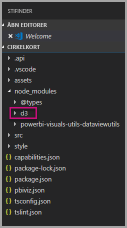

7. Kontrollér, at filen **index.d.ts** blev tilføjet ved at udvide node_modules > @types > d3 i **ruden i Stifinder**.

    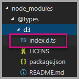

### <a name="developing-the-visual-elements"></a>Udvikling af visuelle elementer

Nu kan vi undersøge, hvordan du kan udvikle den brugerdefinerede visual for at få vist en cirkel og eksempeltekst.

1. I **ruden Stifinder** skal du udvide mappen **src** og derefter vælge **visual.ts**.

    > [!Note]
    > Læg mærke til kommentarerne øverst i filen **visual.ts**. Tilladelsen til at bruge de brugerdefinerede visualpakker i Power BI er gratis i henhold til betingelserne i MIT-licensen. Som en del af aftalen skal du lade kommentarerne øverst i filen stå.

2. Fjern følgende standardlogik for den brugerdefinerede visual fra klassen Visual.
    * De fire erklæringer om private variabler på klasseniveau.
    * Alle kodelinjer fra konstruktøren.
    * Alle kodelinjer fra opdateringsmetoden.
    * Alle øvrige linjer i modulet, herunder metoderne parseSettings og enumerateObjectInstances.

    Kontrollér, at modulkoden ser ud som følgende.

    ```typescript
    "use strict";
    import "core-js/stable";
    import "../style/visual.less";
    import powerbi from "powerbi-visuals-api";
    import IVisual = powerbi.extensibility.IVisual;
    import VisualConstructorOptions = powerbi.extensibility.visual.VisualConstructorOptions;
    import VisualUpdateOptions = powerbi.extensibility.visual.VisualUpdateOptions;
    import EnumerateVisualObjectInstancesOptions = powerbi.EnumerateVisualObjectInstancesOptions;
    import VisualObjectInstanceEnumeration = powerbi.VisualObjectInstanceEnumeration;
    import IVisualHost = powerbi.extensibility.visual.IVisualHost;

    import * as d3 from "d3";
    type Selection<T extends d3.BaseType> = d3.Selection<T, any,any, any>;

    export class Visual implements IVisual {

        constructor(options: VisualConstructorOptions) {

        }

        public update(options: VisualUpdateOptions) {

        }
    }
    ```

3. Under erklæringen for klassen *Visual* skal du indsætte følgende egenskaber på klasseniveau.

    ```typescript
    export class Visual implements IVisual {
        // ...
        private host: IVisualHost;
        private svg: Selection<SVGElement>;
        private container: Selection<SVGElement>;
        private circle: Selection<SVGElement>;
        private textValue: Selection<SVGElement>;
        private textLabel: Selection<SVGElement>;
        // ...
    }
    ```

    

4. Føj følgende kode til *konstruktøren*.

    ```typescript
    this.svg = d3.select(options.element)
        .append('svg')
        .classed('circleCard', true);
    this.container = this.svg.append("g")
        .classed('container', true);
    this.circle = this.container.append("circle")
        .classed('circle', true);
    this.textValue = this.container.append("text")
        .classed("textValue", true);
    this.textLabel = this.container.append("text")
        .classed("textLabel", true);
    ```

    Denne kode tilføjer en SVG-gruppe i visualen og tilføjer derefter tre figurer: en cirkel og to tekstelementer.

    Hvis du vil formatere koden i dokumentet, skal du højreklikke et vilkårligt sted i **Visual Studio Code-dokumentet** og derefter vælge **Formatér dokument**.

      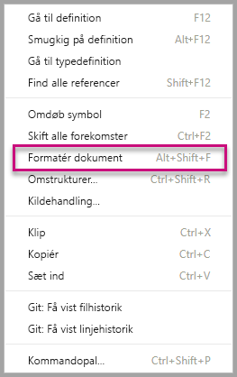

    For at forbedre læsbarheden anbefales det, at du formaterer dokumentet, hver gang du indsætter kodestykker.

5. Føj følgende kode til *opdaterings*metoden.

    ```typescript
    let width: number = options.viewport.width;
    let height: number = options.viewport.height;
    this.svg.attr("width", width);
    this.svg.attr("height", height);
    let radius: number = Math.min(width, height) / 2.2;
    this.circle
        .style("fill", "white")
        .style("fill-opacity", 0.5)
        .style("stroke", "black")
        .style("stroke-width", 2)
        .attr("r", radius)
        .attr("cx", width / 2)
        .attr("cy", height / 2);
    let fontSizeValue: number = Math.min(width, height) / 5;
    this.textValue
        .text("Value")
        .attr("x", "50%")
        .attr("y", "50%")
        .attr("dy", "0.35em")
        .attr("text-anchor", "middle")
        .style("font-size", fontSizeValue + "px");
    let fontSizeLabel: number = fontSizeValue / 4;
    this.textLabel
        .text("Label")
        .attr("x", "50%")
        .attr("y", height / 2)
        .attr("dy", fontSizeValue / 1.2)
        .attr("text-anchor", "middle")
        .style("font-size", fontSizeLabel + "px");
    ```

    *Denne kode angiver bredden og højden af visualen og initialiserer derefter attributterne og typografierne for de visuelle elementer.*

6. Gem filen **visual.ts**.

7. Vælg filen **capabilities.json**.

    På linje 14 skal du fjerne hele objektelementet (linje 14-60).

8. Gem filen **capabilities.json**.

9. I PowerShell skal du starte den brugerdefinerede visual.

    ```powershell
    pbiviz start
    ```

### <a name="toggle-auto-reload"></a>Slå automatisk genindlæsning til/fra

1. Gå tilbage til Power BI-rapporten.
2. På værktøjslinjen, der flyder over udviklervisualen, skal du vælge **Slå automatisk genindlæsning til/fra**.

    

    Denne indstilling sikrer, at visualen automatisk genindlæses, hver gang du gemmer projektændringer.

3. Fra **ruden Felter** skal du trække feltet **Antal** til udviklervisualen.

4. Kontrollér, at visualen ser ud som følgende.

    

5. Tilpas størrelsen på visualen.

    Bemærk, at cirklen og tekstværdien skaleres, så det passer til den tilgængelige dimension af visualen.

    Opdateringsmetoden kaldes løbende i forbindelse med ændring af størrelsen på visualen, og det resulterer i glidende tilpasning af visuelle elementer.

    Nu har du udviklet visuelle elementer.

6. Fortsæt med at køre visualen.

## <a name="process-data-in-the-visual-code"></a>Behandl data i koden for det visuelle element

Definer datarollerne og tilknytningerne af datavisninger, og rediger derefter logikken for den brugerdefinerede visual for at få vist værdien og det viste navn for en måling.

### <a name="configuring-the-capabilities"></a>Konfiguration af funktionerne

Rediger filen **capabilities.json** for at definere datarollen og tilknytningerne af datavisninger.

1. I Visual Studio Code skal du finde filen **capabilities.json**, gå til matrixen **dataRoles** og fjerne alt indhold (linje 3-12).

2. I matrixen **dataRoles** skal du indsætte følgende kode.

    ```json
    {
        "displayName": "Measure",
        "name": "measure",
        "kind": "Measure"
    }
    ```

    Matrixen **dataRoles** definerer nu en enkelt datarolle af typen **måling**, som hedder **måling** og vises som **Måling**. Denne datarolle gør det muligt at overføre enten et målingsfelt eller et felt, der er opsummeret.

3. Fra matrixen **dataViewMappings** skal du fjerne alt indhold (linje 10-31).

4. I matrixen **dataViewMappings** skal du indsætte følgende indhold.

    ```json
    {
        "conditions": [
            { "measure": { "max": 1 } }
        ],
        "single": {
            "role": "measure"
        }
    }
    ```

    I matrixen **dataViewMappings** defineres nu ét felt, der kan overføres til datarollen med navnet **måling**.

5. Gem filen **capabilities.json**.

6. Bemærk, at visualen nu kan konfigureres med **måling** i Power BI.

    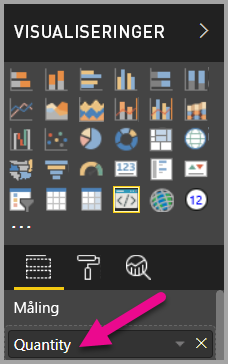

    > [!Note]
    > Projektet med visuals indeholder endnu ikke logik, der binder data.

### <a name="exploring-the-dataview"></a>Udforskning af datavisningen

1. På værktøjslinjen, der flyder over visualen, skal du vælge **Vis datavisning**.

    

2. Udvid ned til **enkelt**, og læg mærke til værdien.

    

3. Udvid ned til **metadata** og derefter til matrixen **columns**, og læg især mærke til værdierne for **format** og **displayName**.

    

4. Hvis du vil skifte tilbage til visualen, skal du vælge **Vis datavisning** på værktøjslinjen, der flyder over visualen.

    

### <a name="consume-data-in-the-visual-code"></a>Forbrug data i koden for det visuelle element

1. I **Visual Studio Code** i filen **visual.ts**

    skal du importere grænsefladen `DataView` fra modulet `powerbi`

    ```typescript
    import DataView = powerbi.DataView;
    ```

    og tilføje følgende sætning som den første sætning for opdateringsmetoden.

    ```typescript
    let dataView: DataView = options.dataViews[0];
    ```

    

    Denne sætning tildeler *dataView* til en variabel for at give nem adgang og erklærer, at variablen skal referere til objektet *dataView*.

2. I **opdaterings**metoden skal du erstatte **.text("Value")** med følgende.

    ```typescript
    .text(<string>dataView.single.value)
    ```

    

3. I **opdaterings**metoden skal du erstatte **.text("Label")** med følgende.

    ```typescript
    .text(dataView.metadata.columns[0].displayName)
    ```

    

4. Gem filen **visual.ts**.

5. I **Power BI** skal du gennemse visualen, som nu viser værdien og det viste navn.

Du har nu konfigureret datarollerne og bundet visualen til datavisningen.

I det næste selvstudium lærer du, hvordan du føjer formateringsindstillinger til den brugerdefinerede visual.

## <a name="debugging"></a>Fejlfinding

Se [fejlfindingsvejledningen](./visuals-how-to-debug.md#how-to-debug-power-bi-visuals) for tips til fejlfinding af et brugerdefineret visual.

## <a name="next-steps"></a>Næste trin

> [!div class="nextstepaction"]
> [Tilføjelse af formateringsindstillinger](custom-visual-develop-tutorial-format-options.md)
