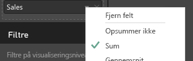
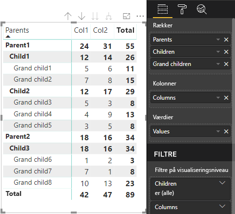

# <a name="data-view-mappings-in-power-bi-visuals"></a>Tilknytning af datavisning i Power BI Visuals

En `dataViewMappings` beskriver, hvordan datarollerne er relateret til hinanden og giver dig mulighed for at angive betingede krav til dem.
Der er et afsnit til hver af `dataMappings`.

Hver gyldig tilknytning opretter en `DataView`, men vi understøtter i øjeblikket kun, at der udføres én forespørgsel pr. visual, så du i de fleste situationer kun får én `DataView`. Du kan dog angive flere datatilknytninger med forskellige betingelser, hvilket muliggør

```json
"dataViewMappings": [
    {
        "conditions": [ ... ],
        "categorical": { ... },
        "single": { ... },
        "table": { ... },
        "matrix": { ... }
    }
]
```

> [!NOTE]
> Det er vigtigt at bemærke, at Power BI opretter en tilknytning til en DataView, hvis og kun hvis den gyldige tilknytning er udfyldt i `dataViewMappings`.

Med andre ord, hvis `categorical` er defineret i `dataViewMappings`, men andre tilknytninger såsom `table`, `single` osv. ikke er det som i følgende eksempel:
```json
"dataViewMappings": [
    {
        "categorical": { ... }
    }
]
```

opretter Power BI en `DataView` med en enkelt `categorical` tilknytning (`table` og andre tilknytninger vil være `undefined`):
```javascript
{
    "categorical": {
        "categories": [ ... ],
        "values": [ ... ]
    },
    "metadata": { ... }
}
```

## <a name="conditions"></a>Betingelser

Beskriver betingelser for en bestemt datatilknytning. Du kan angive flere sæt af betingelser, og hvis dataene svarer til et af de sæt betingelser, der er beskrevet, accepterer visualen dataene som gyldige.

I øjeblikket kan du angive en minimum- og maksimumværdi for hvert felt. Det angiver antallet af felter, der kan bindes til den pågældende datarolle. 

> [!NOTE]
> Hvis en datarolle udelades i betingelsen, kan den have et vilkårligt antal felter.

### <a name="example-1"></a>Eksempel 1

Du kan trække flere felter til hver datarolle. I dette eksempel begrænser vi kategorien til ét datafelt og måler til to datafelter.

```json
"conditions": [
    { "category": { "max": 1 }, "y": { "max": 2 } },
]
```

### <a name="example-2"></a>Eksempel 2

I dette eksempel kræves der en af to betingelser. Enten præcis ét kategoridatafelt og præcis to målinger eller præcis to kategorier og præcis én måling.

```json
"conditions": [
    { "category": { "min": 1, "max": 1 }, "measure": { "min": 2, "max": 2 } },
    { "category": { "min": 2, "max": 2 }, "measure": { "min": 1, "max": 1 } }
]
```

## <a name="single-data-mapping"></a>Tilknytning af enkeltdata

Tilknytning af enkeltdata er den enkleste form for datatilknytning. Den accepterer et felt med en enkelt måling og giver dig totalen. Hvis feltet er numerisk, får du summen. Ellers vil det give dig et antal entydige værdier.

Hvis du vil bruge enkel datatilknytning, skal du definere navnet på den datarolle, som du vil tilknytte. Denne tilknytning fungerer kun med et felt med en enkelt måling. Hvis der er tildelt et andet felt, genereres der ingen datavisning. så det er også god praksis at inkludere en betingelse, der begrænser dataene til et enkelt felt.

> [!NOTE]
> Denne datatilknytning kan ikke bruges sammen med andre datatilknytninger. Det skal reducere data til en enkelt numerisk værdi.

### <a name="example-3"></a>Eksempel 3

```json
"dataViewMappings": {
    "conditions": [
        { "Y": { "max": 1 } }
    ],
    "single": {
        "role": "Y"
    }
}  
```

Den resulterende datavisning indeholder stadig de andre typer (tabel, kategori osv.), men hver tilknytning indeholder kun den enkelte værdi. Den bedste fremgangsmåde er kun at have adgang til værdien i enkelt.

```JSON
{
    "dataView": [
        {
            "metadata": null,
            "categorical": null,
            "matrix": null,
            "table": null,
            "tree": null,
            "single": {
                "value": 94163140.3560001
            }
        }
    ]
}
```

## <a name="categorical-data-mapping"></a>Datatilknytning efter kategori

Datatilknytning efter kategori anvendes til at skabe en eller to uafhængige datagrupper.

### <a name="example-4"></a>Eksempel 4

Her er definitionen fra vores forrige eksempel på DataRoles.

```json
"dataRole":[
    {
        "displayName": "Category",
        "name": "category",
        "kind": "Grouping"
    },
    {
        "displayName": "Y Axis",
        "name": "measure",
        "kind": "Measure"
    }
]
```

Nu til tilknytningen:

```json
"dataViewMappings": {
    "categorical": {
        "categories": {
            "for": { "in": "category" }
        },
        "values": {
            "select": [
                { "bind": { "to": "measure" } }
            ]
        }
    }
}
```

Det er et enkelt eksempel, som lyder "Tilknyt min `category` DataRole, så for hvert felt, jeg trækker til `category`, tilknyttes dets data til `categorical.categories`. Tilknyt også min `measure` DataRole til `categorical.values`."

* **for...i** – for alle elementerne i denne datarolle skal du medtage dem i dataforespørgslen.
* **bind...til** – giver det samme resultat som for...in, men forventer, at datarollen har en betingelse, som begrænser den til et enkelt felt.

### <a name="example-5"></a>Eksempel 5

I dette eksempel bruger vi de første to DataRoles fra det foregående eksempel, som vi yderligere definerer som `grouping` og `measure2`.

```json
"dataRole":[
    {
        "displayName": "Category",
        "name": "category",
        "kind": "Grouping"
    },
    {
        "displayName": "Y Axis",
        "name": "measure",
        "kind": "Measure"
    },
    {
        "displayName": "Grouping with",
        "name": "grouping",
        "kind": "Grouping"
    },
    {
        "displayName": "X Axis",
        "name": "measure2",
        "kind": "Grouping"
    }
]
```

Nu til tilknytningen:

```json
"dataViewMappings":{
    "categorical": {
        "categories": {
            "for": { "in": "category" }
        },
        "values": {
            "group": {
                "by": "grouping",
                "select":[
                    { "bind": { "to": "measure" } },
                    { "bind": { "to": "measure2" } }
                ]
            }
        }
    }
}
```

Her er forskellen, hvordan vi knytter kategoriværdier. Vi siger "Tilknyt mine dataroller `measure` og `measure2`, så de grupperes efter datarollen `grouping`."

### <a name="example-6"></a>Eksempel 6

Her er dataRoles.

```json
"dataRoles": [
    {
        "displayName": "Categories",
        "name": "category",
        "kind": "Grouping"
    },
    {
        "displayName": "Measures",
        "name": "measure",
        "kind": "Measure"
    },
    {
        "displayName": "Series",
        "name": "series",
        "kind": "Measure"
    }
]
```

Her er dataViewMapping.

```json
"dataViewMappings": [
    {
        "categorical": {
            "categories": {
                "for": {
                    "in": "category"
                }
            },
            "values": {
                "group": {
                    "by": "series",
                    "select": [{
                            "for": {
                                "in": "measure"
                            }
                        }
                    ]
                }
            }
        }
    }
]
```

Kategorien `dataview` kan visualiseres på følgende måde.

| Efter kategori |  |  | | | |
|-----|-----|------|------|------|------|
| | År | 2013 | 2014 | 2015 | 2016 |
| Land | | |
| USA | | x | x | 125 | 100 |
| Canada | | x | 50 | 200 | x |
| Mexico | | 300 | x | x | x |
| Storbritannien | | x | x | 75 | x |

Power BI producerer den som kategoridatavisning. Det er sættet af kategorier.

```JSON
{
    "categorical": {
        "categories": [
            {
                "source": {...},
                "values": [
                    "Canada",
                    "Mexico",
                    "UK",
                    "USA"
                ],
                "identity": [...],
                "identityFields": [...],
            }
        ]
    }
}
```

Hver kategori knyttes også et sæt af værdier. Hver af disse værdier grupperes efter serie, som er år.

For eksempel er salg i Canada i 2013 null, mens salg i Canada i 2014 er 50.

```JSON
{
    "values": [
        {
            "source": {...},
            "values": [
                null,
                300,
                null,
                null
            ],
            "identity": [...],
        },
        {
            "source": {...},
            "values": [
                50,
                null,
                150,
                null
            ],
            "identity": [...],
        },
        {
            "source": {...},
            "values": [
                200,
                null,
                null,
                125
            ],
            "identity": [...],
        },
        {
            "source": {...},
            "values": [
                null,
                null,
                null,
                100
            ],
            "identity": [...],
        }
    ]
}
```

## <a name="table-data-mapping"></a>Tilknytning af tabeldata

Tabeldatavisningen er en simpel datatilknytning. Det er i bund og grund en liste over datapunkter, hvor de numeriske datapunkter kan sammenlægges.

### <a name="example-7"></a>Eksempel 7

Med de angivne egenskaber:

```json
"dataRoles": [
    {
        "displayName": "Values",
        "name": "values",
        "kind": "Measure"
    }
]
```

```json
"dataViewMappings": [
    {
        "table": {
            "rows": {
                "for": {
                    "in": "values"
                }
            }
        }
    }
]
```

Tabellen `dataview` kan visualiseres som dette.  

| Land| År | Salg |
|-----|-----|------|
| USA | 2016 | 100 |
| USA | 2015 | 50 |
| Canada | 2015 | 200 |
| Canada | 2015 | 50 |
| Mexico | 2013 | 300 |
| Storbritannien | 2014 | 150 |
| USA | 2015 | 75 |

Power BI producerer den som tabeldatavisning. Du kan ikke antage, at der er en rækkefølge.

```JSON
{
    "table" : {
        "columns": [...],
        "rows": [
            [
                "Canada",
                2014,
                50
            ],
            [
                "Canada",
                2015,
                200
            ],
            [
                "Mexico",
                2013,
                300
            ],
            [
                "UK",
                2014,
                150
            ],
            [
                "USA",
                2015,
                100
            ],
            [
                "USA",
                2015,
                75
            ],
            [
                "USA",
                2016,
                100
            ]
        ]
    }
}
```

Dataene kan samles ved at markere det ønskede felt og klikke på sum.  



## <a name="matrix-data-mapping"></a>Matrixdatatilknytning

Matrixdatatilknytning ligner tabeldatatilknytning, men rækkerne præsenteres hierarkisk. Og en af `dataRole`-værdierne kan bruges som en kolonneoverskriftsværdi.

```json
{
    "dataRoles": [
        {
            "name": "Category",
            "displayName": "Category",
            "displayNameKey": "Visual_Category",
            "kind": "Grouping"
        },
        {
            "name": "Column",
            "displayName": "Column",
            "displayNameKey": "Visual_Column",
            "kind": "Grouping"
        },
        {
            "name": "Measure",
            "displayName": "Measure",
            "displayNameKey": "Visual_Values",
            "kind": "Measure"
        }
    ],
    "dataViewMappings": [
        {
            "matrix": {
                "rows": {
                    "for": {
                        "in": "Category"
                    }
                },
                "columns": {
                    "for": {
                        "in": "Column"
                    }
                },
                "values": {
                    "select": [
                        {
                            "for": {
                                "in": "Measure"
                            }
                        }
                    ]
                }
            }
        }
    ]
}
```

Power BI skaber hierarkisk datastruktur. Roden af træet inkluderer dataene fra den første kolonne af datarollen `Category` med underordnede fra den anden kolonne med datarollen.

Datasæt:

| Overordnede elementer | Underordnede elementer | Underordnede med underordnet | Kolonner | Værdier |
|-----|-----|------|-------|-------|
| Overordnet1 | Underordnet1 | Underordnet med underordnet1 | Kol1 | 5 |
| Overordnet1 | Underordnet1 | Underordnet med underordnet1 | Kol2 | 6 |
| Overordnet1 | Underordnet1 | Underordnet med underordnet2 | Kol1 | 7 |
| Overordnet1 | Underordnet1 | Underordnet med underordnet2 | Kol2 | 8 |
| Overordnet1 | Underordnet2 | Underordnet med underordnet3 | Kol1 | 5 |
| Overordnet1 | Underordnet2 | Underordnet med underordnet3 | Kol2 | 3 |
| Overordnet1 | Underordnet2 | Underordnet med underordnet4 | Kol1 | 4 |
| Overordnet1 | Underordnet2 | Underordnet med underordnet4 | Kol2 | 9 |
| Overordnet1 | Underordnet2 | Underordnet med underordnet5 | Kol1 | 3 |
| Overordnet1 | Underordnet2 | Underordnet med underordnet5 | Kol2 | 5 |
| Overordnet2 | Underordnet3 | Underordnet med underordnet6 | Kol1 | 1 |
| Overordnet2 | Underordnet3 | Underordnet med underordnet6 | Kol2 | 2 |
| Overordnet2 | Underordnet3 | Underordnet med underordnet7 | Kol1 | 7 |
| Overordnet2 | Underordnet3 | Underordnet med underordnet7 | Kol2 | 1 |
| Overordnet2 | Underordnet3 | Underordnet med underordnet8 | Kol1 | 10 |
| Overordnet2 | Underordnet3 | Underordnet med underordnet8 | Kol2 | 13 |

Den primære matrix-visual af Power BI gengiver den som en tabel.



Visualen henter datastrukturen som beskrevet nedenfor (kun de første to rækker er præsenteret):

```json
{
    "metadata": {...},
    "matrix": {
        "rows": {
            "levels": [...],
            "root": {
                "childIdentityFields": [...],
                "children": [
                    {
                        "level": 0,
                        "levelValues": [...],
                        "value": "Parent1",
                        "identity": {...},
                        "childIdentityFields": [...],
                        "children": [
                            {
                                "level": 1,
                                "levelValues": [...],
                                "value": "Child1",
                                "identity": {...},
                                "childIdentityFields": [...],
                                "children": [
                                    {
                                        "level": 2,
                                        "levelValues": [...],
                                        "value": "Grand child1",
                                        "identity": {...},
                                        "values": {
                                            "0": {
                                                "value": 5 // value for Col1
                                            },
                                            "1": {
                                                "value": 6 // value for Col2
                                            }
                                        }
                                    },
                                    ...
                                ]
                            },
                            ...
                        ]
                    },
                    ...
                ]
            }
        },
        "columns": {
            "levels": [...],
            "root": {
                "childIdentityFields": [...],
                "children": [
                    {
                        "level": 0,
                        "levelValues": [...],
                        "value": "Col1",
                        "identity": {...}
                    },
                    {
                        "level": 0,
                        "levelValues": [...],
                        "value": "Col2",
                        "identity": {...}
                    },
                    ...
                ]
            }
        },
        "valueSources": [...]
    }
}
```

## <a name="data-reduction-algorithm"></a>Algoritmer til datareduktion

Der kan anvendes en `DataReductionAlgorithm`, hvis du vil kontrollere mængden af data, der modtages i datavisningen.

Alle brugerdefinerede visuals anvender som standard den øverste DataReductionAlgorithm med "antal" angivet til 1000 dataPoints. Det svarer til at angive følgende egenskaber i capabilities.json:

```json
"dataReductionAlgorithm": {
    "top": {
        "count": 1000
    }
}
```

Du kan ændre 'antal'-værdien til en vilkårligt heltalsværdi på op til 30000. R-baserede brugerdefinerede visuals kan understøtte op til 150000 rækker.

## <a name="data-reduction-algorithm-types"></a>Typer af algoritmer til datareduktion

Der findes fire typer `DataReductionAlgorithm`-indstillinger:

* `top` – hvis du vil begrænse dataene til værdier, der er hentet fra toppen af datasættet. De første "antal"-værdier i toppen hentes fra datasættet.
* `bottom` – hvis du vil begrænse dataene til værdier, der er hentet fra bunden af datasættet. De sidste "antal"-værdier hentes fra datasættet.
* `sample` – reducer datasættet med en simpel algoritme for stikprøvetagning, der er begrænset til "antal" elementer. Det betyder, at de første og sidste elementer er inkluderet, og at et "antal" elementer har det samme indbyrdes interval.
Hvis du f.eks. har fået et datasæt [0, 1, 2, ... 100] og en `count: 9`, få du derefter følgende værdier [0, 10, 20... 100]
* `window` – indlæser ét 'vindue' af datapunkter ad gangen, som indeholder "antal" elementer. `top` og `window` er i øjeblikket lige. Der arbejdes aktuelt på fuld understøttelse af en vinduesfunktion.

## <a name="data-reduction-algorithm-usage"></a>Brug af algoritmer til datareduktion

`DataReductionAlgorithm` kan bruges til tilknytning af kategori, tabel eller matrix `dataview`.

Dette kan indstilles i `categories` og/eller gruppesektionen af `values` til tilknytning af kategoridata.

### <a name="example-8"></a>Eksempel 8

```json
"dataViewMappings": {
    "categorical": {
        "categories": {
            "for": { "in": "category" },
            "dataReductionAlgorithm": {
                "window": {
                    "count": 300
                }
            }  
        },
        "values": {
            "group": {
                "by": "series",
                "select": [{
                        "for": {
                            "in": "measure"
                        }
                    }
                ],
                "dataReductionAlgorithm": {
                    "top": {
                        "count": 100
                    }
                }  
            }
        }
    }
}
```

Algoritmen til datareduktion kan anvendes i afsnittet `rows` af tabellen `dataview`-tilknytning.

### <a name="example-9"></a>Eksempel 9

```json
"dataViewMappings": [
    {
        "table": {
            "rows": {
                "for": {
                    "in": "values"
                },
                "dataReductionAlgorithm": {
                    "top": {
                        "count": 2000
                    }
                } 
            }
        }
    }
]
```

Algoritmen til datareduktion kan anvendes på afsnittet `rows` og/eller `columns` af `matrix` `dataview` tilknytning.
