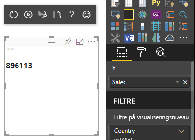
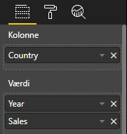
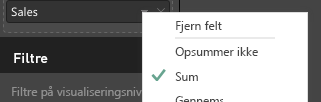

# <a name="understand-data-view-mapping-in-power-bi-visuals"></a>Forstå tilknytning af datavisning i Power BI-visualiseringer

I denne artikel gennemgår tilknytning af datavisning og beskriver, hvordan dataroller er relateret til hinanden, og giver dig mulighed for at angive betingede krav til dem. Artiklen beskriver også hver `dataMappings`-type.

Hver af de gyldige tilknytninger resulterer i en datavisning, men vi understøtter i øjeblikket kun én forespørgsel pr. visualisering. Du får normalt kun én datavisning. Du kan dog angive flere datatilknytninger under visse betingelser, hvilket muliggør:

```json
"dataViewMappings": [
    {
        "conditions": [ ... ],
        "categorical": { ... },
        "single": { ... },
        "table": { ... },
        "matrix": { ... }
    }
]
```

Power BI opretter en tilknytning til en datavisning, hvis og kun hvis den gyldige tilknytning er udfyldt i `dataViewMappings`.

Med andre ord kan `categorical` være defineret i `dataViewMappings`, mens andre tilknytninger såsom `table` eller `single` ikke er det. Eksempel:

```json
"dataViewMappings": [
    {
        "categorical": { ... }
    }
]
```

Power BI opretter en datavisning med en enkelt `categorical`-tilknytning, mens `table` og andre tilknytninger ikke defineres:

```javascript
{
    "categorical": {
        "categories": [ ... ],
        "values": [ ... ]
    },
    "metadata": { ... }
}
```

## <a name="conditions"></a>Betingelser

I dette afsnit beskrives betingelserne for en bestemt datatilknytning. Du kan angive flere sæt af betingelser, og hvis dataene svarer til et af de sæt betingelser, der er beskrevet, accepterer visualiseringen dataene som gyldige.

I øjeblikket kan du angive en minimum- og maksimumværdi for hvert felt. Værdien angiver antallet af felter, der kan bindes til den pågældende datarolle. 

> [!NOTE]
> Hvis en datarolle udelades i betingelsen, kan den have et vilkårligt antal felter.

### <a name="example-1"></a>Eksempel 1

Du kan trække flere felter til hver datarolle. I dette eksempel begrænser du kategorien til ét datafelt og målingen til to datafelter.

```json
"conditions": [
    { "category": { "max": 1 }, "y": { "max": 2 } },
]
```

### <a name="example-2"></a>Eksempel 2

I dette eksempel kræves der én af to betingelser:
* Præcis ét kategoridatafelt og præcis to målinger
* Præcis to kategorier og præcis én måling.

```json
"conditions": [
    { "category": { "min": 1, "max": 1 }, "measure": { "min": 2, "max": 2 } },
    { "category": { "min": 2, "max": 2 }, "measure": { "min": 1, "max": 1 } }
]
```

## <a name="single-data-mapping"></a>Tilknytning af enkeltdata

Tilknytning af enkeltdata er den enkleste form for datatilknytning. Den accepterer et felt med en enkelt måling og giver dig totalen. Hvis feltet er numerisk, får du summen. Ellers giver det dig et antal entydige værdier.

Hvis du vil bruge enkel datatilknytning, skal du definere navnet på den datarolle, som du vil tilknytte. Denne tilknytning fungerer kun med et felt med en enkelt måling. Hvis der er tildelt et andet felt, genereres der ingen datavisning, så det er også en god praksis at inkludere en betingelse, der begrænser dataene til et enkelt felt.

> [!NOTE]
> Denne datatilknytning kan ikke bruges sammen med andre datatilknytninger. Det skal reducere data til en enkelt numerisk værdi.

### <a name="example-3"></a>Eksempel 3

```json
{
    "dataRoles": [
        {
            "displayName": "Y",
            "name": "Y",
            "kind": "Measure"
        }
    ],
    "dataViewMappings": [
        {
            "conditions": [
                {
                    "Y": {
                        "max": 1
                    }
                }
            ],
            "single": {
                "role": "Y"
            }
        }
    ]
}
```

Den resulterende datavisning indeholder stadig de andre typer (tabel, kategori osv.), men hver tilknytning indeholder kun den enkelte værdi. Den bedste fremgangsmåde er kun at have adgang til værdien i enkelt.

```JSON
{
    "dataView": [
        {
            "metadata": null,
            "categorical": null,
            "matrix": null,
            "table": null,
            "tree": null,
            "single": {
                "value": 94163140.3560001
            }
        }
    ]
}
```

Kodeeksempel til behandling af enkel tilknytning af datavisninger

```typescript
"use strict";
import powerbi from "powerbi-visuals-api";
import DataView = powerbi.DataView;
import DataViewSingle = powerbi.DataViewSingle;
// standart imports
// ...

export class Visual implements IVisual {
    private target: HTMLElement;
    private host: IVisualHost;
    private valueText: HTMLParagraphElement;

    constructor(options: VisualConstructorOptions) {
        // constructor body
        this.target = options.element;
        this.host = options.host;
        this.valueText = document.createElement("p");
        this.target.appendChild(this.valueText);
        // ...
    }

    public update(options: VisualUpdateOptions) {
        const dataView: DataView = options.dataViews[0];
        const singleDataView: DataViewSingle = dataView.single;

        if (!singleDataView ||
            !singleDataView.value ) {
            return
        }

        this.valueText.innerText = singleDataView.value.toString();
    }
}
```

Som et resultat heraf viser visual'et en enkelt værdi fra Power BI:



## <a name="categorical-data-mapping"></a>Datatilknytning efter kategori

Datatilknytning efter kategori anvendes til at skabe en eller to uafhængige datagrupper.

### <a name="example-4"></a>Eksempel 4

Her er definitionen fra det forrige eksempel på dataroller:

```json
"dataRole":[
    {
        "displayName": "Category",
        "name": "category",
        "kind": "Grouping"
    },
    {
        "displayName": "Y Axis",
        "name": "measure",
        "kind": "Measure"
    }
]
```

Her er tilknytningen:

```json
"dataViewMappings": {
    "categorical": {
        "categories": {
            "for": { "in": "category" }
        },
        "values": {
            "select": [
                { "bind": { "to": "measure" } }
            ]
        }
    }
}
```

Det er et enkelt eksempel. Det lyder "Tilknyt min `category` DataRole, så for hvert felt, jeg trækker til `category`, tilknyttes dets data til `categorical.categories`. Tilknyt også min `measure` DataRole til `categorical.values`."

* **for...in**: For alle elementerne i denne datarolle skal du medtage dem i dataforespørgslen.
* **bind...to**: Giver det samme resultat som *for...in*, men forventer, at datarollen har en betingelse, som begrænser den til et enkelt felt.

### <a name="example-5"></a>Eksempel 5

I dette eksempel bruger vi de første to dataroller fra det foregående eksempel, som vi yderligere definerer som `grouping` og `measure2`.

```json
"dataRole":[
    {
        "displayName": "Category",
        "name": "category",
        "kind": "Grouping"
    },
    {
        "displayName": "Y Axis",
        "name": "measure",
        "kind": "Measure"
    },
    {
        "displayName": "Grouping with",
        "name": "grouping",
        "kind": "Grouping"
    },
    {
        "displayName": "X Axis",
        "name": "measure2",
        "kind": "Grouping"
    }
]
```

Her er tilknytningen:

```json
"dataViewMappings":{
    "categorical": {
        "categories": {
            "for": { "in": "category" }
        },
        "values": {
            "group": {
                "by": "grouping",
                "select":[
                    { "bind": { "to": "measure" } },
                    { "bind": { "to": "measure2" } }
                ]
            }
        }
    }
}
```

Her er forskellen, hvordan vi knytter kategoriværdier. Vi siger, at "Tilknyt mine dataroller `measure` og `measure2`, så de grupperes efter datarollen `grouping`."

### <a name="example-6"></a>Eksempel 6

Her er datarollerne:

```json
"dataRoles": [
    {
        "displayName": "Categories",
        "name": "category",
        "kind": "Grouping"
    },
    {
        "displayName": "Measures",
        "name": "measure",
        "kind": "Measure"
    },
    {
        "displayName": "Series",
        "name": "series",
        "kind": "Measure"
    }
]
```

Her er tilknytningen mellem datavisninger:

```json
"dataViewMappings": [
    {
        "categorical": {
            "categories": {
                "for": {
                    "in": "category"
                }
            },
            "values": {
                "group": {
                    "by": "series",
                    "select": [{
                            "for": {
                                "in": "measure"
                            }
                        }
                    ]
                }
            }
        }
    }
]
```

Datavisning i kategorier kan visualiseres på følgende måde:

| Efter kategori |  |  | | | |
|-----|-----|------|------|------|------|
| | År | 2013 | 2014 | 2015 | 2016 |
| Land | | |
| USA | | x | x | 650 | 350 |
| Canada | | x | 630 | 490 | x |
| Mexico | | 645 | x | x | x |
| Storbritannien | | x | x | 831 | x |

Power BI fremstiller det som den kategoriske datavisning. Det er sættet af kategorier.

```JSON
{
    "categorical": {
        "categories": [
            {
                "source": {...},
                "values": [
                    "Canada",
                    "USA",
                    "UK",
                    "Mexico"
                ],
                "identity": [...],
                "identityFields": [...],
            }
        ]
    }
}
```

Hver kategori knyttes også et sæt af værdier. Hver af disse værdier er grupperet efter serie, der udtrykkes som år.

Hver `values`-matrix repræsenterer f.eks. data for hvert år.
Hver `values`-matrix har desuden 4 værdier, for henholdsvis Canada, USA, Storbritannien og Mexico:

```JSON
{
    "values": [
        // Values for 2013 year
        {
            "source": {...},
            "values": [
                null, // Value for `Canada` category
                null, // Value for `USA` category
                null, // Value for `UK` category
                645 // Value for `Mexico` category
            ],
            "identity": [...],
        },
        // Values for 2014 year
        {
            "source": {...},
            "values": [
                630, // Value for `Canada` category
                null, // Value for `USA` category
                null, // Value for `UK` category
                null // Value for `Mexico` category
            ],
            "identity": [...],
        },
        // Values for 2015 year
        {
            "source": {...},
            "values": [
                490, // Value for `Canada` category
                650, // Value for `USA` category
                831, // Value for `UK` category
                null // Value for `Mexico` category
            ],
            "identity": [...],
        },
        // Values for 2016 year
        {
            "source": {...},
            "values": [
                null, // Value for `Canada` category
                350, // Value for `USA` category
                null, // Value for `UK` category
                null // Value for `Mexico` category
            ],
            "identity": [...],
        }
    ]
}
```

Kodeeksempel for behandling af tilknytning af kategorisk datavisninger. I eksemplet oprettes den hierarkiske struktur `Country => Year => Value`

```typescript
"use strict";
import powerbi from "powerbi-visuals-api";
import DataView = powerbi.DataView;
import DataViewDataViewCategoricalSingle = powerbi.DataViewCategorical;
import DataViewValueColumnGroup = powerbi.DataViewValueColumnGroup;
import PrimitiveValue = powerbi.PrimitiveValue;
// standart imports
// ...

export class Visual implements IVisual {
    private target: HTMLElement;
    private host: IVisualHost;
    private categories: HTMLElement;

    constructor(options: VisualConstructorOptions) {
        // constructor body
        this.target = options.element;
        this.host = options.host;
        this.categories = document.createElement("pre");
        this.target.appendChild(this.categories);
        // ...
    }

    public update(options: VisualUpdateOptions) {
        const dataView: DataView = options.dataViews[0];
        const categoricalDataView: DataViewCategorical = dataView.categorical;

        if (!categoricalDataView ||
            !categoricalDataView.categories ||
            !categoricalDataView.categories[0] ||
            !categoricalDataView.values) {
            return;
        }

        // Categories have only one column in data buckets
        // If you want to support several columns of categories data bucket, you should iterate categoricalDataView.categories array.
        const categoryFieldIndex = 0;
        // Measure has only one column in data buckets.
        // If you want to support several columns on data bucket, you should iterate years.values array in map function
        const measureFieldIndex = 0;
        let categories: PrimitiveValue[] = categoricalDataView.categories[categoryFieldIndex].values;
        let values: DataViewValueColumnGroup[] = categoricalDataView.values.grouped();

        let data = {};
        // iterate categories/countries
        categories.map((category: PrimitiveValue, categoryIndex: number) => {
            data[category.toString()] = {};
            // iterate series/years
            values.map((years: DataViewValueColumnGroup) => {
                if (!data[category.toString()][years.name] && years.values[measureFieldIndex].values[categoryIndex]) {
                    data[category.toString()][years.name] = []
                }
                if (years.values[0].values[categoryIndex]) {
                    data[category.toString()][years.name].push(years.values[measureFieldIndex].values[categoryIndex]);
                }
            });
        });

        this.categories.innerText = JSON.stringify(data, null, 6);
        console.log(data);
    }
}
```

Resultatet af visual'et:


## <a name="table-data-mapping"></a>Tilknytning af tabeldata

Tabeldatavisningen er en simpel datatilknytning. Det er i bund og grund en liste over datapunkter, hvor de numeriske datapunkter kan sammenlægges.

### <a name="example-7"></a>Eksempel 7

Med de angivne egenskaber:

```json
"dataRoles": [
    {
        "displayName": "Column",
        "name": "column",
        "kind": "Grouping"
    },
    {
        "displayName": "Value",
        "name": "value",
        "kind": "Measure"
    }
]
```

```json
"dataViewMappings": [
    {
        "table": {
            "rows": {
                "select": [
                    {
                        "for": {
                            "in": "column"
                        }
                    },
                    {
                        "for": {
                            "in": "value"
                        }
                    }
                ]
            }
        }
    }
]
```

Tabeldatavisningen kan visualiseres på følgende måde:  

Dataeksempel:

| Land| År | Salg |
|-----|-----|------|
| USA | 2016 | 100 |
| USA | 2015 | 50 |
| Canada | 2015 | 200 |
| Canada | 2015 | 50 |
| Mexico | 2013 | 300 |
| Storbritannien | 2014 | 150 |
| USA | 2015 | 75 |

Databinding:



Power BI viser dine data som tabeldatavisningen. Du bør ikke antage, at dataene står i rækkefølge.

```JSON
{
    "table" : {
        "columns": [...],
        "rows": [
            [
                "Canada",
                2014,
                630
            ],
            [
                "Canada",
                2015,
                490
            ],
            [
                "Mexico",
                2013,
                645
            ],
            [
                "UK",
                2014,
                831
            ],
            [
                "USA",
                2015,
                650
            ],
            [
                "USA",
                2016,
                350
            ]
        ]
    }
}
```

Du kan sammenlægge dataene ved at markere det ønskede felt og derefter vælge sum.  



Kodeeksempel for behandling af tilknytning af tabeldatavisninger.

```typescript
"use strict";
import "./../style/visual.less";
import powerbi from "powerbi-visuals-api";
// ...
import DataViewMetadataColumn = powerbi.DataViewMetadataColumn;
import DataViewTable = powerbi.DataViewTable;
import DataViewTableRow = powerbi.DataViewTableRow;
import PrimitiveValue = powerbi.PrimitiveValue;
// other imports
// ...

export class Visual implements IVisual {
    private target: HTMLElement;
    private host: IVisualHost;
    private table: HTMLParagraphElement;

    constructor(options: VisualConstructorOptions) {
        // constructor body
        this.target = options.element;
        this.host = options.host;
        this.table = document.createElement("table");
        this.target.appendChild(this.table);
        // ...
    }

    public update(options: VisualUpdateOptions) {
        const dataView: DataView = options.dataViews[0];
        const tableDataView: DataViewTable = dataView.table;

        if (!tableDataView) {
            return
        }
        while(this.table.firstChild) {
            this.table.removeChild(this.table.firstChild);
        }

        //draw header
        const tableHeader = document.createElement("th");
        tableDataView.columns.forEach((column: DataViewMetadataColumn) => {
            const tableHeaderColumn = document.createElement("td");
            tableHeaderColumn.innerText = column.displayName
            tableHeader.appendChild(tableHeaderColumn);
        });
        this.table.appendChild(tableHeader);

        //draw rows
        tableDataView.rows.forEach((row: DataViewTableRow) => {
            const tableRow = document.createElement("tr");
            row.forEach((columnValue: PrimitiveValue) => {
                const cell = document.createElement("td");
                cell.innerText = columnValue.toString();
                tableRow.appendChild(cell);
            })
            this.table.appendChild(tableRow);
        });
    }
}
```

Filen med de visualtypografier `style/visual.less` indeholder layout til tabellen:

```less
table {
    display: flex;
    flex-direction: column;
}

tr, th {
    display: flex;
    flex: 1;
}

td {
    flex: 1;
    border: 1px solid black;
}
```


## <a name="matrix-data-mapping"></a>Matrixdatatilknytning

Matrixdatatilknytning ligner tabeldatatilknytning, men rækkerne præsenteres hierarkisk. Alle datarolleværdierne kan bruges som en kolonneoverskriftsværdi.

```json
{
    "dataRoles": [
        {
            "name": "Category",
            "displayName": "Category",
            "displayNameKey": "Visual_Category",
            "kind": "Grouping"
        },
        {
            "name": "Column",
            "displayName": "Column",
            "displayNameKey": "Visual_Column",
            "kind": "Grouping"
        },
        {
            "name": "Measure",
            "displayName": "Measure",
            "displayNameKey": "Visual_Values",
            "kind": "Measure"
        }
    ],
    "dataViewMappings": [
        {
            "matrix": {
                "rows": {
                    "for": {
                        "in": "Category"
                    }
                },
                "columns": {
                    "for": {
                        "in": "Column"
                    }
                },
                "values": {
                    "select": [
                        {
                            "for": {
                                "in": "Measure"
                            }
                        }
                    ]
                }
            }
        }
    ]
}
```

Power BI skaber en hierarkisk datastruktur. Roden af træhierarkiet inkluderer dataene fra kolonnen **Overordnede** i datarollen `Category` med underordnede fra kolonnen **Underordnede** i datarolletabellen.

Datasæt:

| Overordnede elementer | Underordnede elementer | På andet niveau | Kolonner | Værdier |
|-----|-----|------|-------|-------|
| Overordnet1 | Underordnet1 | Underordnet med underordnet1 | Kol1 | 5 |
| Overordnet1 | Underordnet1 | Underordnet med underordnet1 | Kol2 | 6 |
| Overordnet1 | Underordnet1 | Underordnet med underordnet2 | Kol1 | 7 |
| Overordnet1 | Underordnet1 | Underordnet med underordnet2 | Kol2 | 8 |
| Overordnet1 | Underordnet2 | Underordnet med underordnet3 | Kol1 | 5 |
| Overordnet1 | Underordnet2 | Underordnet med underordnet3 | Kol2 | 3 |
| Overordnet1 | Underordnet2 | Underordnet med underordnet4 | Kol1 | 4 |
| Overordnet1 | Underordnet2 | Underordnet med underordnet4 | Kol2 | 9 |
| Overordnet1 | Underordnet2 | Underordnet med underordnet5 | Kol1 | 3 |
| Overordnet1 | Underordnet2 | Underordnet med underordnet5 | Kol2 | 5 |
| Overordnet2 | Underordnet3 | Underordnet med underordnet6 | Kol1 | 1 |
| Overordnet2 | Underordnet3 | Underordnet med underordnet6 | Kol2 | 2 |
| Overordnet2 | Underordnet3 | Underordnet med underordnet7 | Kol1 | 7 |
| Overordnet2 | Underordnet3 | Underordnet med underordnet7 | Kol2 | 1 |
| Overordnet2 | Underordnet3 | Underordnet med underordnet8 | Kol1 | 10 |
| Overordnet2 | Underordnet3 | Underordnet med underordnet8 | Kol2 | 13 |

Den primære matrix-visualisering af Power BI gengiver dataene som en tabel.


Visualiseringen henter sin datastruktur som beskrevet i følgende kode (kun de første to tabelrækker vises her):

```json
{
    "metadata": {...},
    "matrix": {
        "rows": {
            "levels": [...],
            "root": {
                "childIdentityFields": [...],
                "children": [
                    {
                        "level": 0,
                        "levelValues": [...],
                        "value": "Parent1",
                        "identity": {...},
                        "childIdentityFields": [...],
                        "children": [
                            {
                                "level": 1,
                                "levelValues": [...],
                                "value": "Child1",
                                "identity": {...},
                                "childIdentityFields": [...],
                                "children": [
                                    {
                                        "level": 2,
                                        "levelValues": [...],
                                        "value": "Grand child1",
                                        "identity": {...},
                                        "values": {
                                            "0": {
                                                "value": 5 // value for Col1
                                            },
                                            "1": {
                                                "value": 6 // value for Col2
                                            }
                                        }
                                    },
                                    ...
                                ]
                            },
                            ...
                        ]
                    },
                    ...
                ]
            }
        },
        "columns": {
            "levels": [...],
            "root": {
                "childIdentityFields": [...],
                "children": [
                    {
                        "level": 0,
                        "levelValues": [...],
                        "value": "Col1",
                        "identity": {...}
                    },
                    {
                        "level": 0,
                        "levelValues": [...],
                        "value": "Col2",
                        "identity": {...}
                    },
                    ...
                ]
            }
        },
        "valueSources": [...]
    }
}
```

## <a name="data-reduction-algorithm"></a>Algoritme til datareduktion

Hvis du vil kontrollere den datamængde, der skal modtages i datavisningen, kan du anvende en algoritme til datareduktion.

Alle Power BI-visualiseringer anvender som standard den øverste datareduktionsalgoritme med *antal* angivet til 1.000 datapunker. Det svarer til at angive følgende egenskaber i filen *capabilities.json*:

```json
"dataReductionAlgorithm": {
    "top": {
        "count": 1000
    }
}
```

Du kan ændre værdien *antal* til en vilkårligt heltalsværdi på op til 30000. R-baserede Power BI-visualiseringer kan understøtte op til 150.000 rækker.

## <a name="data-reduction-algorithm-types"></a>Typer af algoritmer til datareduktion

Der findes fire typer indstillinger for datareduktionsalgoritmer:

* `top`: Hvis du vil begrænse dataene til værdier, der er hentet fra toppen af datasættet. De første *antal*-værdier i toppen hentes fra datasættet.
* `bottom`: Hvis du vil begrænse dataene til værdier, der er hentet fra bunden af datasættet. De sidste "antal"-værdier hentes fra datasættet.
* `sample`: Reducer datasættet med en simpel algoritme for stikprøvetagning, der er begrænset til *antal* elementer. Det betyder, at de første og sidste elementer er inkluderet, og at et *antal* elementer har det samme indbyrdes interval.
Hvis du f.eks. har et datasæt [0, 1, 2, ... 100] og et *antal* på 9, modtager du værdierne [0, 10, 20... 100].
* `window`: Indlæser ét *vindue* af datapunkter ad gangen, som indeholder *antal* elementer. `top` og `window` er i øjeblikket lige. Vi arbejder mod fuldt ud at understøtte en vinduesindstilling.

## <a name="data-reduction-algorithm-usage"></a>Brug af algoritmer til datareduktion

Algoritmen til datareduktion kan bruges i tilknytning af kategori-, tabel-eller matrix-datavisning.

Du kan indstille algoritmen i `categories` og/eller gruppesektionen af `values` til tilknytning af kategoridata.

### <a name="example-8"></a>Eksempel 8

```json
"dataViewMappings": {
    "categorical": {
        "categories": {
            "for": { "in": "category" },
            "dataReductionAlgorithm": {
                "window": {
                    "count": 300
                }
            }  
        },
        "values": {
            "group": {
                "by": "series",
                "select": [{
                        "for": {
                            "in": "measure"
                        }
                    }
                ],
                "dataReductionAlgorithm": {
                    "top": {
                        "count": 100
                    }
                }  
            }
        }
    }
}
```

Du kan anvende algoritmen datareduktion til sektionen `rows` i tilknytningstabellen Datavisning.

### <a name="example-9"></a>Eksempel 9

```json
"dataViewMappings": [
    {
        "table": {
            "rows": {
                "for": {
                    "in": "values"
                },
                "dataReductionAlgorithm": {
                    "top": {
                        "count": 2000
                    }
                }
            }
        }
    }
]
```

Du kan anvende algoritmen datareduktion til sektionerne `rows` og `columns` i tilknytningsmatrixen Datavisning.

## <a name="next-steps"></a>Næste trin

Læs, hvordan du [tilføjer understøttelse af detailudledning for tilknytning af datavisninger i Power BI-visuals](drill-down-support.md).
