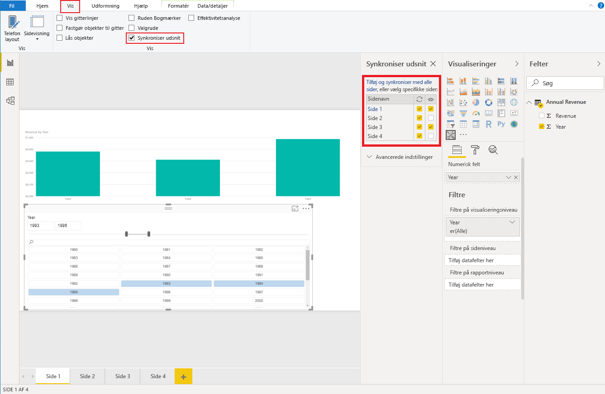

# <a name="sync-slicers-in-power-bi-visuals"></a>Synkroniser udsnitsværktøjer i visualiseringer i Power BI

For at understøtte funktionen [Synkroniser udsnitsværktøjer](https://docs.microsoft.com/power-bi/desktop-slicers) skal dit brugerdefinerede visuelle udsnit bruge API-version 1.13 eller nyere.

Derudover skal du aktivere indstillingen i filen *capabilities.json* som vist i følgende kode:

```json
{
    ...
    "supportsHighlight": true,
    "suppressDefaultTitle": true,
    "supportsSynchronizingFilterState": true,
    "sorting": {
        "default": {}
    }
}
```

Når du har opdateret filen *capabilities.json*, kan du få vist ruden med indstillinger for **Synkroniser udsnitsværktøjer**, når du vælger det brugerdefinerede visuelle udsnit.

> [!NOTE]
> Funktionen Synkroniser udsnitsværktøjer understøtter ikke mere end ét felt. Hvis udsnittet har mere end ét felt (**kategori** eller **måling**), er funktionen deaktiveret.



I ruden **Synkroniser udsnit** kan du se, at synligheden af og filtreringen med dit udsnit muligvis er anvendt på flere rapportsider.
