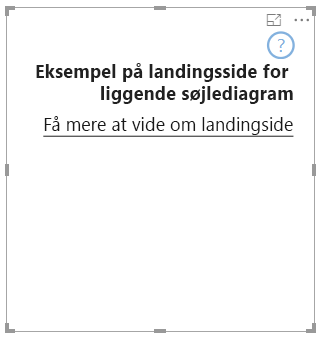

# <a name="add-a-landing-page-to-your-power-bi-visuals"></a>Føj en startside til dine Power BI-visualiseringer

Med API 2.3.0 kan du føje en startside til dine Power BI-visualiseringer. Det gør du ved at føje `supportsLandingPage` til egenskaberne og angive det til true. Denne handling initialiserer og opdaterer din visualisering, før du føjer data til den. Da visualiseringen ikke længere indeholder et vandmærke, kan du designe din egen startside, så den vises i visualiseringen, så længe den ikke indeholder data.

```typescript
export class BarChart implements IVisual {
    //...
    private element: HTMLElement;
    private isLandingPageOn: boolean;
    private LandingPageRemoved: boolean;
    private LandingPage: d3.Selection<any>;

    constructor(options: VisualConstructorOptions) {
            //...
            this.element = options.element;
            //...
    }

    public update(options: VisualUpdateOptions) {
    //...
        this.HandleLandingPage(options);
    }

    private HandleLandingPage(options: VisualUpdateOptions) {
        if(!options.dataViews || !options.dataViews.length) {
            if(!this.isLandingPageOn) {
                this.isLandingPageOn = true;
                const SampleLandingPage: Element = this.createSampleLandingPage(); //create a landing page
                this.element.appendChild(SampleLandingPage);
                this.LandingPage = d3.select(SampleLandingPage);
            }

        } else {
                if(this.isLandingPageOn && !this.LandingPageRemoved){
                    this.LandingPageRemoved = true;
                    this.LandingPage.remove();
                }
        }
    }
```

Følgende billede viser et eksempel på en startside:


