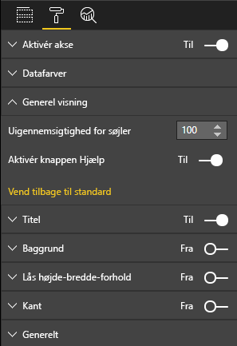

# <a name="create-a-launch-url"></a>Opret en start-URL-adresse

Ved at oprette start-URL-adresser kan du åbne en ny browserfane (eller et vindue) ved at delegere det reelle arbejde til Power BI.

> [!IMPORTANT]
> `host.launchUrl()` blev introduceret i API 1.9.0 til visuals.

## <a name="sample"></a>Eksempel

Importér `IVisualHost`-grænsefladen, og gem linket til `host`-objektet i visualkonstruktøren.

```typescript
import powerbi from "powerbi-visuals-api";
import IVisualHost = powerbi.extensibility.visual.IVisualHost;

export class Visual implements IVisual {
    private host: IVisualHost;
    // ...
    constructor(options: VisualConstructorOptions) {
        // ...
        this.host = options.host;
        // ...
    }

    // ...
}
```

## <a name="usage"></a>Forbrug

Brug API-kaldet `host.launchUrl()`, hvilket videregiver din destinations-URL-adresse som et strengargument:

```typescript
this.host.launchUrl('https://some.link.net');
```

## <a name="restrictions"></a>Begrænsninger

* Brug kun absolutte stier og ikke relative stier. Du kan f.eks. bruge en absolut sti såsom `https://some.link.net/subfolder/page.html`. Den relative sti, `/page.html`, åbnes ikke.

* I øjeblikket understøttes kun protokollerne *HTTP* og *HTTPS*. Undgå *FTP*, *MAILTO* osv.

## <a name="best-practices"></a>Bedste praksis

* Normalt er det bedst kun at åbne et link som et svar på en brugers eksplicitte handling. Gør det nemt for brugeren at forstå, at der åbnes en ny fane, når der klikkes på linket eller knappen. Det kan være forvirrende eller frustrerende for brugeren, hvis der udløses et `launchUrl()`-kald, uden at brugeren har foretaget en handling.

* Hvis linket ikke er essentielt for en korrekt fungerende visualisering, anbefaler vi, at du giver forfatteren af rapporten mulighed for at deaktivere og gemme linket. Denne anbefaling er især relevant for særlige Power BI-brugssager, f.eks. integrering af en rapport i et tredjepartsprogram eller publicering af den på internettet.

* Undgå at udløse et `launchUrl()`-kald fra en løkke, visualiseringens `update`-funktion eller andre ofte tilbagevendende koder.

## <a name="a-step-by-step-example"></a>Et trinvist eksempel

### <a name="add-a-link-launching-element"></a>Tilføj et element til start af et link

Følgende linjer blev føjet til visualiseringens `constructor`-funktion:

```typescript
    this.helpLinkElement = this.createHelpLinkElement();
    options.element.appendChild(this.helpLinkElement);
```

Der blev tilføjet en privat funktion, som opretter og tilknytter ankerelementet:

```typescript
private createHelpLinkElement(): Element {
    let linkElement = document.createElement("a");
    linkElement.textContent = "?";
    linkElement.setAttribute("title", "Open documentation");
    linkElement.setAttribute("class", "helpLink");
    linkElement.addEventListener("click", () => {
        this.host.launchUrl("https://docs.microsoft.com/power-bi/developer/visuals/custom-visual-develop-tutorial");
    });
    return linkElement;
};
```

Til sidst definerer en post i filen *visual.less* typografien for linkelementet:

```less
.helpLink {
    position: absolute;
    top: 0px;
    right: 12px;
    display: block;
    width: 20px;
    height: 20px;
    border: 2px solid #80B0E0;
    border-radius: 20px;
    color: #80B0E0;
    text-align: center;
    font-size: 16px;
    line-height: 20px;
    background-color: #FFFFFF;
    transition: all 900ms ease;

    &:hover {
        background-color: #DDEEFF;
        color: #5080B0;
        border-color: #5080B0;
        transition: all 250ms ease;
    }

    &.hidden {
        display: none;
    }
}
```

### <a name="add-a-toggling-mechanism"></a>Tilføj en til/fra-mekanisme

Hvis du vil tilføje en til/fra-mekanisme, skal du tilføje et statisk objekt, så rapportens forfatter kan skifte synligheden af link-elementet. (Standardindstillingen er angivet til *skjult*). Du kan finde flere oplysninger i [selvstudiet om statiske objekter](https://microsoft.github.io/PowerBI-visuals/docs/concepts/objects-and-properties).

Der blev føjet et `showHelpLink` boolesk statisk objekt til objektelementet i filen *capabilities.json* som vist i følgende kode:

```typescript
"objects": {
    "generalView": {
            "displayName": "General View",
            "properties":
                "showHelpLink": {
                    "displayName": "Show Help Button",
                    "type": {
                        "bool": true
                    }
                }
            }
        }
    }
```



Og i visualiseringens `update`-funktion blev følgende linjer tilføjet:

```typescript
if (settings.generalView.showHelpLink) {
    this.helpLinkElement.classList.remove("hidden");
} else {
    this.helpLinkElement.classList.add("hidden");
}
```

Den *skjulte* klasse er defineret i filen *visual.less* for at styre visningen af elementet.