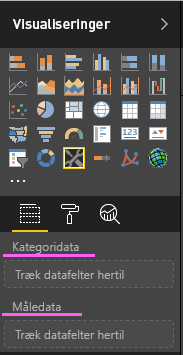
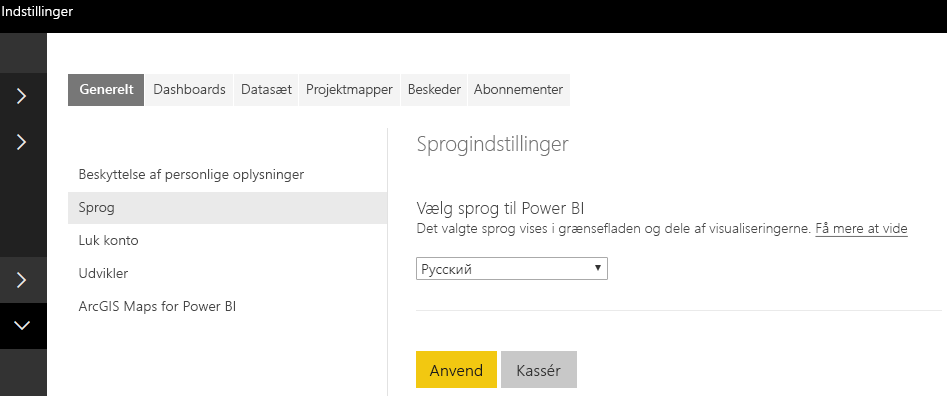

# <a name="add-the-locale-in-power-bi-for-power-bi-visuals"></a>Tilføj landestandarden i Power BI for Power BI-visuals

I visuals kan Power BI-landestandarden hentes, så indholdet kan lokaliseres til det relevante sprog.

Læs mere om [Understøttede sprog og lande/områder til Power BI](./../../supported-languages-countries-regions.md)

Det kan f. eks. være hentning af landestandarden i visual'et Eksempelsøjlediagram.


Hvert af disse liggende søjlediagrammer er oprettet under en anden landestandard (engelsk, baskisk og hindi), og det vises i værktøjstippet.

> [!NOTE]
> Lokaliseringsstyringen i visual'ets kode understøttes fra API 1.10.0 og nyere.

## <a name="get-the-locale"></a>Hent landestandarden

`locale` overføres som en streng under initialiseringen af visual'et. Hvis en landestandard ændres i Power BI, genereres visual'et igen med den nye landestandard. Du kan finde hele eksempelkoden i SampleBarChart med landestandard

BarChart-konstruktøren har nu et landestandardmedlem, som er instantieret i konstruktøren med værtens landestandardforekomst.

```typescript
private locale: string;
...
this.locale = options.host.locale;
```

Understøttede landestandarder:

Landestandardstreng | Sprog
--------------|----------------------
ar-SA | العربية (arabisk)
bg-BG | български (bulgarsk)
ca-ES | català (catalansk)
cs-CZ | čeština (tjekkisk)
da-DK | dansk
de-DE | deutsche (tysk)
el-GR | ελληνικά (græsk)
en-US | English (engelsk)
es-ES | español service (spansk)
et-EE | eesti (estisk)
eU-ES | Euskal (baskisk)
fi-FI | suomi (finsk)
fr-FR | français (fransk)
gl-ES | galego (galisisk)
he-IL | עברית (hebraisk)
hi-IN | हिन्दी (hindi)
hr-HR | hrvatski (kroatisk)
hu-HU | magyar (ungarsk)
id-ID | Bahasa Indonesia (indonesisk)
it-IT | italiano (italiensk)
ja-JP | 日本の (japansk)
kk-KZ | Қазақ (kasakhisk)
ko-KR | 한국의 (koreansk)
lt-LT | Lietuvos (litauisk)
lv-LV | Latvijas (lettisk)
ms-MY | Bahasa Melayu (malaysisk)
nb-NO | norsk
nl-NL | Nederlands (hollandsk)
pl-PL | polski (polsk)
pt-BR | português (portugisisk)
pt-PT | português (portugisisk)
ro-RO | românesc (rumænsk)
ru-RU | русский (russisk)
sk-SK | slovenský (slovakisk)
sl-SI | slovenski (slovensk)
sr-Cyrl-RS | српски (serbisk)
sr-Latn-RS | srpski (serbisk)
sv-SE | svenska (svensk)
th-TH | ไทย (thai)
tr-TR | Türk (tyrkisk)
uk-UA | український (ukrainsk)
vi-VN | tiếng Việt (vietnamesisk)
zh-CN | 中国 (kinesisk forenklet)
zh-TW | 中國 (kinesisk traditionelt)

> [!NOTE]
> I PowerBI Desktop indeholder egenskaben for landestandard sproget i den PowerBI Desktop, der er installeret.

## <a name="localizing-the-property-pane-for-power-bi-visuals"></a>Lokalisering af egenskabsruden for Power BI-visuals

Felter i egenskabsruden kan lokaliseres for at give en mere integreret og sammenhængende oplevelse. Det får det brugerdefinerede visual til at fungere som alle andre kernevisuals i Power BI.

Et ikke-lokaliseret brugerdefineret visual, der er oprettet ved hjælp af kommandoen `pbiviz new`, viser f. eks. følgende felter i egenskabsruden:



både kategoridataene og målingsdataene er defineret i filen capabilitiess.json som `displayName`.

## <a name="how-to-localize-capabilities"></a>Sådan lokaliserer du funktioner

Føj først en nøgle for et vist navn til alle de viste navne, du vil lokalisere i dine funktioner. I dette eksempel:

```json
{
    "dataRoles": [
        {
            "displayName": "Category Data",
            "displayNameKey": "VisualCategoryDataNameKey1",
            "name": "category",
            "kind": "Grouping"
        },
        {
            "displayName": "Measure Data",
            "displayNameKey": "VisualMeasureDataNameKey2",
            "name": "measure",
            "kind": "Measure"
        }
    ]
}
```

Tilføj derefter en mappe med navnet stringResources. Mappen indeholder alle dine forskellige strengressourcefiler på basis af de landestandarder, dit visual skal understøtte. Under denne mappe skal du tilføje en JSON-fil for hver landestandard, du vil understøtte. Disse filer indeholder landestandardoplysningerne og de lokaliserede strengværdier for hver displayNameKey, du vil erstatte.

I vores eksempel kan vi sige, at vi vil understøtte arabisk og hebraisk. Vi skal tilføje to JSON-filer på følgende måde:


Alle JSON-filer definerer en enkelt landestandard (denne fil skal være en af landestandarderne fra den understøttede liste ovenfor) med strengværdierne for de ønskede nøgler for viste navne. I vores eksempel ser den hebraiske strengressourcefil ud på følgende måde:

```json
{
    "locale": "he-IL",
    "values": {
        "VisualCategoryDataNameKey1": "קטגוריה",
        "VisualMeasureDataNameKey2": "יחידות מידה"
    }
}
```

Alle de trin, der kræves for at bruge lokaliserings styring, er beskrevet nedenfor.

> [!NOTE]
> I øjeblikket understøttes lokalisering ikke for fejlfinding af udviklingsvisual'et

## <a name="setup-environment"></a>Installationsmiljø

### <a name="desktop"></a>Desktop

Hent den lokaliserede version af Power BI Desktop fra https://powerbi.microsoft.com til brug på computeren.

### <a name="web-service"></a>Webtjeneste

Hvis du bruger webklienten (browseren) i tjenesten, skal du ændre dit sprog i indstillingerne:



## <a name="resource-file"></a>Ressourcefil

Føj en ressource.resjson-fil til en mappe, der er navngivet som den landestandard, du vil bruge i mappen stringResources. Det er en-US og ru-RU i vores eksempel.


Derefter skal du tilføje alle de lokaliseringsstrenge, du vil bruge, i den resources.resjson-fil, du tilføjede i det forrige trin.

```json
{
    ...
    "Role_Legend": "Обозначения",
    "Role_task": "Задача",
    "Role_StartDate": "Дата начала",
    "Role_Duration": "Длительность"
    ...
}
```

Dette eksempel er en-US-versionen af resources.resjson-filen:

```json
{
    ...
    "Role_Legend": "Legend",
    "Role_task": "Task",
    "Role_StartDate": "Start date",
    "Role_Duration": "Duration"
    ...
}
```

Den nye localizationManager-forekomst opretter en forekomst af localizationManager i dit visuals kode på følgende måde

```typescript
private localizationManager: ILocalizationManager;

constructor(options: VisualConstructorOptions) {
    this.localizationManager = options.host.createLocalizationManager();
}
```

## <a name="localizationmanager-usage-sample"></a>eksempel på brug af localizationManager

Du kan nu kalde funktionen getDisplayName i lokaliseringsstyringen med det strengnøgleargument, du definerede i resources.resjson, for at hente den påkrævede streng hvor som helst i din kode:

```typescript
let legend: string = this.localization.getDisplayName("Role_Legend");
```

Den returnerer "Legend" for en-US og "Обозначения" for ru-RU

## <a name="next-steps"></a>Næste trin

* [Læs om, hvordan du bruger formateringshjælpeprogrammer til at levere oversatte formater](utils-formatting.md)
